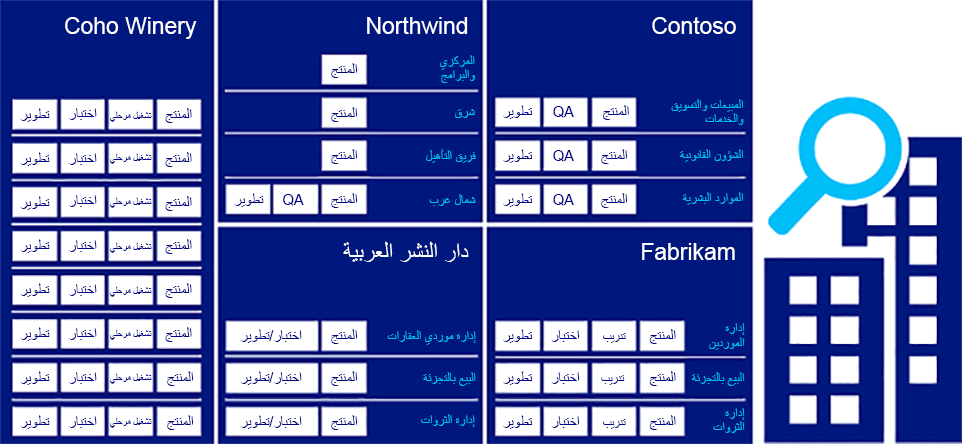
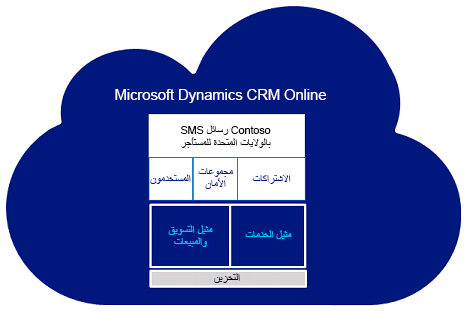
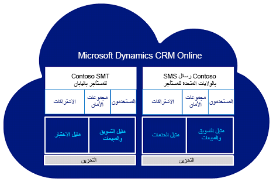

تمنحك تطبيقات مشاركة العميل في Dynamics 365 خيارات لفصل بياناتك ووصول المستخدم. بالنسبة لمعظم الشركات، توفر إضافة واستخدام مثيلات متعددة في اشتراكك المجموعة الصحيحة من الوظائف وسهولة الإدارة. قد تفكر المؤسسات ذات المواقع الجغرافية المنفصلة في استخدام عدة مستأجرين في سبيل فصل التراخيص. ويُمكن للمثيلات المتعددة مشاركة المستخدمين بين المثيلات; في حين لا يُمكن للمستأجرين المتعددين إجراء ذلك.

### المصطلحات

  |**المصطلح**               |   **التعريف**|
  |-------------------------|---------------------------------------------------------------------------------------------------------------------------------------------------------------------------------------------------------------|
|  المستأجر                 | بالنسبة لتطبيقات Dynamics 365 Customer Engagement، المستأجر هو الحساب الذي تنشئه في بيئة خدمات Microsoft عبر الإنترنت عند التسجيل في اشتراك. ويحتوي المُستأجر على مجالات مُحددة بشكل فريد، وكذلك مستخدمين، ومجموعات أمان، واشتراكات، ويمكن أن يحتوي على مثيلات متعددة. المستأجر الذي تم إنشاؤه لك يكون له اسم المجال .onmicrosoft.com< الحساب >. على سبيل المثال contoso.onmicrosoft.com.  |
|  ال‏‏مثيل               | عند الاشتراك في نسخة تجريبية أو شراء اشتراك، يتم إنشاء مثيل إنتاج. يقوم كل مثيل إنتاج أو غير إنتاج (بيئة الاختبار المعزولة) تضيفه بإنشاء مؤسسة منفصلة ومعزولة على نفس المستأجر. يكون المثيل بتنسيق URL: `https://< URL name >.crm.dynamics.com`. على سبيل المثال `https://contososales.crm.dynamics.com`
|  مثيل متعدد المناطق |  مثيل موجود في منطقة مختلفة عن التي يقيم فيها المستأجر. يُمكن للمثيلات المحلية توفير وصول أسرع للبيانات للمستخدمين في تلك المنطقة. مزيد من المعلومات: [إضافة مثيلات متعددة المناطق وتحريرها](/dynamics365/customer-engagement/admin/add-edit-multiregional-instances)|
|  الاشتراك           |  يتكون الاشتراك من تراخيص وإضافات مُضمنة في الإصدار التجريبي أو الخدمة المدفوعة التي قمت بالتسجيل فيها بحسابك. ويمكن أن تختلف الاشتراكات في نوع الترخيص والسعر وتاريخ الانتهاء.|
|  الهوية               | حساب المستخدم الذي يُستخدَم لتسجيل الدخول. يمكنك أيضاً استخدام هذه الهوية للوصول إلى خدمات Microsoft Online الأخرى، مثل Microsoft 365 أو SharePoint Online. يُمكن للمسؤولين تحديد ما إذا كانوا يريدون توحيد إدارة هوية المستخدم بين تطبيقات Dynamics 365 Customer Engagement ودليل Active Directory المحلي.|
|  حساب المستخدم           | حساب مستخدم تُخصصه مؤسسة (عمل أو مدرسة أو منظمة غير ربحية) لأحد أعضائها (موظف أو طالب أو عميل)، حيث يُوفر إمكانية الوصول لتسجيل الدخول إلى واحد أو أكثر من اشتراكات خدمة Microsoft Cloud Service السحابية للمؤسسة، مثل Exchange Online أو تطبيقات Dynamics 365 Customer Engagement. ويتم التحكم في الوصول إلى خدمة عبر الإنترنت بواسطة الترخيص الذي تم تعيينه لحساب المستخدم. يتم تخزين حسابات المستخدمين في دليل السحابة بالمؤسسة ضمن Azure Active Directory، ويتم حذفها عادة عندما يُغادر المستخدم المؤسسة. وتختلف حسابات المؤسسات عن حسابات Microsoft، من حيث أنها يتم إنشاؤها وإدارتها من قبل المسؤولين في المؤسسة، وليس من قبل المستخدم نفسه.|
|  مجموعة الأمان         | إذا كان لدى شركتك مثيلات متعددة، فيُمكنك استخدام مجموعات أمان المثيل للتحكم في المستخدمين المرخص لهم الذين يُمكنهم الوصول إلى مثيل معين. مزيد من المعلومات: [التحكم في وصول المستخدم إلى المثيلات: مجموعات الأمان والتراخيص](/dynamics365/customer-engagement/admin/add-instance-subscription#BKMK_man_sec_group)|

### متى تستخدم أسلوب "متعدد" لنشر تطبيقات Dynamics 365

تُشبه المثيلات من حيث المفهوم مُجمّع أعمال شاهق تُنظّم طوابقه وفقاً لوظائف الأعمال. وبذلك يُمكن النظر إلى كل طابق داخل المبنى باعتباره تطبيق (المبيعات/الخدمة/التسويق، وإدارة البائعين، وإدارة الثروة) والنظر إلى كل وحدة داخل الطابق كمثيل لغرض مُحدد مثل الإنتاج والتدريب والاختبار والتطوير.

تبرز الحاجة إلى مثيلات متعددة عندما يكون الفصل مطلوبا للمكونات الإضافية أو مهام سير العمل أو موارد الإدارة التي لا يمكن عزلها بسهولة باستخدام وحدات الأعمال.

### نشر مثيلات متعددة

تتضمن عملية النشر النموذجية مستأجراً واحداً فقط.
ويُمكن أن يتضمن المستأجر مثيلاً واحداً أو أكثر، ومع ذلك، يتم دائماً إقران المثيل بمستأجر واحد.

يستخدم هذا المثال مثيلين لثلاثة فرق: المبيعات والتسويق والخدمات.  إذ تتشارك Sales وMarketing في مثيل بحيث يمكن الوصول إلى معلومات العميل المتوقع بسهولة من قبل كلا الفريقين. أما الخدمات، فلها مثيل خاص بها، لذلك يُمكن إدارة التذاكر والضمانات بشكل منفصل عن الحملات وغيرها من الأحداث المتعلقة بالمبيعات.

ويُمكنك توفير إمكانية الوصول إلى مثيل واحد أو كلا المثيلين بسهولة ويُسر. ويُمكن أن يقتصر مستخدمو Sales وMarketing على مثيلهم، بينما يُمكن لمستخدمي الخدمة الذين لديهم وصول موسع تحديث سجلات تصعيد الدعم المتعلقة بالحسابات في كلا المثيلين. نبذة عن مستأجر الواحد مع مثيلات متعددة:

- يُمكن للمستأجر تضمين ما يصل إلى 50 مثيل إنتاج وما يصل إلى 75 مثيلاً بخلاف الإنتاج (بيئة الاختبار المعزولة).
- ويتلقى كل مثيل داخل المستأجر قاعدة بيانات SQL خاصة به.
- ولا تتم مشاركة البيانات بين المثيلات.
- وتتم مشاركة سعة التخزين بين المثيل الأساسي وأية مثيلات إضافية.
- وسيتم إعداد جميع المثيلات لكل مستأجر فردي لعميل في المنطقة الجغرافية التي قام بتسجيل حسابه فيها في البداية. ويتم حساب إجمالي استهلاك سعة التخزين وتتبعها عبر جميع المثيلات المرفقة بمستأجر عميل.
- ويُمكنك إعداد مجموعات أمان منفصلة لكافة المثيلات.
- يُمكن للمستخدم المرخص الوصول إلى كافة المثيلات المقترنة بالمستأجر. ويتم التحكم في الوصول بواسطة عضوية مجموعة أمان المثيل.
- ويُمكنك شراء مثيلات إضافية من خلال المكون الإضافي "مثيل إضافي". علماً بأن إضافة مثيلات إضافية تقتصر على الاشتراكات "المدفوعة" - وليس الإصدارات التجريبية أو حقوق الاستخدام الداخلي (IUR)، وإذا اشتريت اشتراكك من خلال الترخيص المُجمّع، فيجب عليك المرور عبر مزودي الحسابات الكبرى (LAR) لشراء المثيل الإضافي. مزيد من المعلومات: [دعم الفوترة والاشتراكات](/dynamics365/customer-engagement/admin/billing-support)
- لا يمكنك دمج الإصدارات التجريبية أو الاشتراكات الموجودة في مثيل إضافي؛ وبدلاً من ذلك، ستحتاج إلى نقل البيانات والتخصيصات.

### حالات الاستخدام الشائعة لعمليات نشر مثيلات متعددة

ضع في اعتبارك هذه الأمثلة عندما تقرر نوع النشر الذي يناسب متطلبات شركتك.

#### إدارة البيانات الرئيسية

في هذا السيناريو، تتوفر مجموعة بيانات "رئيسية" لإدارة التغيير عبر مصدر بيانات رئيسي مركزي. ويتطلب هذا الأسلوب مزامنة البيانات الرئيسية المركزية لكافة المثيلات بحيث يكون لكل مثيل حق الوصول إلى أحدث إصدار من المعلومات الأساسية.
ويُمكن إجراء التغييرات المطلوبة على المعلومات مباشرة داخل النظام الرئيسي. وكحل بديل، يُمكن للمستخدمين الوصول بجلاء إلى النظام الرئيسي أو التقاط التغييرات في المثيل المحلي، مع تمرير هذه التغييرات لاحقاً إلى المثيل الرئيسي.

يُمكن أن يؤدي اشتراط إجراء تلك التغييرات مركزياً إلى التحكم المركزي في التغيير. على سبيل المثال، يُمكن إجراء فحوصات لمكافحة الاحتيال لضمان إجراء التغييرات من قبل فريق مركزي فقط وليس من قبل الفرق المحلية التي قد تستفيد من أحد التغييرات، مثل التغيير في حدود الائتمان. ومن شأن ذلك أن يوفر مستوى إضافياً من الإذن بالتغيير والتحقق منه، يتفادى قدرة شخص واحد أو مجموعة من الأشخاص الذين يعملون معاً بشكل وثيق على التعاون للتأثير على عملية احتيال.
ويُمكن أن يُسهم دفع الطلب إلى فريق مستقل مُختلف في الحماية من أي احتيال محتمل.

#### الأمان والخصوصية

يُمكن أن تؤدي الاختلافات في التشريعات الإقليمية، مثل الاتحاد الأوروبي، أو التشريعات الوطنية، إلى اختلافات في متطلبات تأمين البيانات أو الحفاظ على خصوصية البيانات عبر مختلف المناطق أو البلدان في عملية نشر. وفي بعض الحالات، تجعل القيود التشريعية/التنظيمية من غير القانوني استضافة البيانات خارج حدود بلد أو منطقة ما، ويُعدّ التصدي لهذا التحدي أمراً بالغ الأهمية في قطاعات أعمال محددة.

على سبيل المثال، ضَع في اعتبارك القيود التي تفرضها قطاعات الرعاية الصحية على مشاركة معلومات المرضى. تتطلب بعض لوائح الاتحاد الأوروبي الاحتفاظ بأي معلومات صحية يتم جمعها عن الأشخاص المقيمين في دول الاتحاد الأوروبي ومشاركتها فقط داخل حدود الاتحاد الأوروبي، في حين يتم الاحتفاظ ببيانات مماثلة تم جمعها عن الأشخاص في الولايات المتحدة (الولايات المتحدة) داخل حدود الولايات المتحدة. ضع في اعتبارك أيضاً القيود المفروضة على القطاع المصرفي على صعيد مشاركة معلومات العملاء. ففي سويسرا، على سبيل المثال، تجعل اللوائح من غير القانوني مشاركة معلومات العملاء خارج حدودهم الوطنية.

#### قابلية التوسع

في حين أن مثيلاً واحداً من تطبيقات Dynamics 365 Customer Engagement يمكن أن يتدرج ويخرج لدعم نمو نشاط العميل، بأحجام بيانات أو مستويات تعقيد عالية جداً، فهناك اعتبارات إضافية. على سبيل المثال، في البيئات ذات وحدات التخزين القصوى و/أو الاستخدام المكثف لجدولة الخدمة، قد يتطلب توسيع خادم SQL Server بنية أساسية مُعقدة باهظة التكلفة أو تصعب إدارتها للغاية.

هناك العديد من السيناريوهات التي يوجد فيها انقسام وظيفي طبيعي في متطلبات الإمكانات. وفي مثل هذه الحالات، يمكن أن يوفر تفويض أعباء العمل عن طريق إنشاء سيناريوهات واسعة النطاق تستند إلى هذه الانقسامات الوظيفية أحجاما أكبر باستخدام البنية الأساسية للسلع.

### نشر مستأجرين متعددين

يُمكن للشركات العالمية ذات النماذج الإقليمية أو القُطرية المختلفة استخدام المستأجرين لمراعاة الاختلافات في النهج أو حجم السوق أو الامتثال للقيود القانونية والتنظيمية.

يتضمن هذا المثال مستأجر ثانٍ لـ Contoso Japan.

لا يُمكن مشاركة حسابات المستخدمين والهويات ومجموعات الأمان والاشتراكات والتراخيص وسعة التخزين بين المستأجرين. يُمكن أن يكون لدى جميع المستأجرين مثيلات متعددة مقترنة بكل مستأجر محدد. ولا تتم مشاركة البيانات بين المثيلات أو المستأجرين.

نبذة حول عدة مستأجرين:

- في سيناريو متعدد المستأجرين، يُمكن للمستخدم المرخص المقترن بمستأجر الوصول إلى مثيل واحد أو أكثر تم تعيينه إلى المستأجر نفسه. وللوصول إلى مستأجر آخر، سيحتاج المستخدم إلى ترخيص منفصل ومجموعة فريدة من بيانات اعتماد تسجيل الدخول لهذا المستأجر.

    - على سبيل المثال، إذا كان لدى المستخدم "أ" حساب للوصول إلى المستأجر "أ"، فإن ترخيصه يسمح له بالوصول إلى أي مثيل وجميع المثيلات التي تم إنشاؤها داخل المستأجر "أ" إذا سمح بها المسؤول. وإذا كان المستخدم "أ" يحتاج إلى الوصول إلى مثيلات داخل المستأجر "ب"، فسيحتاج إلى ترخيص إضافي.

- سيحتاج كل مستأجر إلى مسؤولين مستأجرين ذوي بيانات اعتماد تسجيل دخول فريدة، وسيقوم كل تابع للمستأجر بإدارة المستأجر بشكل منفصل في وحدة تحكم المسؤول.

- تكون المثيلات المتعددة داخل مستأجر مرئية من الواجهة إذا كان المسؤول لديه حق الوصول.

- ولا يمكنك إعادة تعيين التراخيص بين عمليات تسجيل المستأجرين. ويُمكن للتابع المُسجّل استخدام تخفيض عدد التراخيص ضمن تسجيل واحد، وإضافة تراخيص إلى تسجيل آخر لتسهيل ذلك.

- لا يمكن تأسيس اتحاد Active Directory محلي مع أكثر من مستأجر واحد إلا إذا كان لديك نطاقات مستوى أعلى وتحتاج إلى توحيدها مع مستأجرين مختلفين (على سبيل المثال Contoso.com وأيضاً Fabrikam.com).

### حالات الاستخدام الشائعة لعمليات توزيع مستأجرين متعددين

ينشأ هذا السيناريو عادةً في المؤسسات ذات الاحتياجات الوظيفية المتداخلة ولكنها منفصلة. وتشمل بعض الأمثلة الشائعة ما يلي:

- المؤسسات ذات أقسام الأعمال المختلفة، ولكل منها سوق أو نموذج تشغيل مختلف.
- يُمكن للشركات العالمية ذات النماذج الإقليمية أو القُطرية المختلفة لمراعاة الاختلافات في النهج أو حجم السوق أو الامتثال للقيود القانونية والتنظيمية.
- في هذه الأنواع من بيئات الأعمال، غالبا ما يكون لدى المؤسسة مجموعات مشتركة من الوظائف التي تسمح لمناطق أو بلدان أو مناطق أعمال محددة بدرجة من الترجمة.
- التقاط المعلومات. على سبيل المثال، يرتبط التقاط الرمز البريدي في الولايات المتحدة بالتقاط الرمز البريدي في المملكة المتحدة.

#### النشر المادي

بالنسبة لحلول الأعمال التي يجب أن تدعم المستخدمين الذين يتم توزيعهم فعليا عبر مسافات كبيرة، خاصة بالنسبة إلى عمليات النشر العمومية، قد لا يكون استخدام مثيل واحد مناسباً بسبب الآثار (مثل زمن وصول WAN) المقترنة بالبنية الأساسية التي يتصل بها المستخدمون، والتي يمكن أن تؤثر بشكل كبير على تجربة المستخدم.
يُمكن أن يؤدي توزيع المثيلات لتزويد المستخدمين بمزيد من الوصول المحلي إلى تقليل المشكلات المتعلقة بشبكة WAN أو التغلب عليها، حيث يتم الوصول عبر اتصالات شبكة الاتصال الأقصَر.

### مساوئ عمليات النشر متعددة المستأجرين

تقدم عمليات النشر متعددة المستأجرين مجموعة متنوعة من القيود التي تحتاج إلى أن تكون على دراية بها:

- لا يُمكن مشاركة حسابات المستخدمين والهويات ومجموعات الأمان والاشتراكات والتراخيص وسعة التخزين بين المستأجرين.
- يمكن فقط أن يتحد نطاق واحد مع مستأجر واحد.
- يجب أن يكون لكل مستأجر مساحة الاسم الخاصة به; لا يمكن مشاركة مساحات أسماء UPN أو SMTP عبر العديد من المستأجرين.
- إذا كانت هناك مؤسسة Exchange محلية، فلا يمكنك تقسيم هذه المؤسسة عبر عدة مستأجرين.
- لن تتوفر قائمة عناوين عمومية موحدة، إلا إذا تمت إدارتها بشكل صريح من عملية التزامن.
- سيقتصر التعاون بين المستأجرين على ميزات اتحاد Lync واتحاد Exchange.
- قد لا يكون الوصول إلى SharePoint متاحاً عبر العديد من المستأجرين. في حين يمكن حل هذا الأمر عن طريق "حق وصول الشريك"، يتم تعطيل تجربة المستخدم، ويتم تطبيق جوانب الترخيص.
- لا يمكن أن تكون هناك حسابات مكررة عبر العديد من المستأجرين أو الأقسام في "Active Directory" المحلي.
