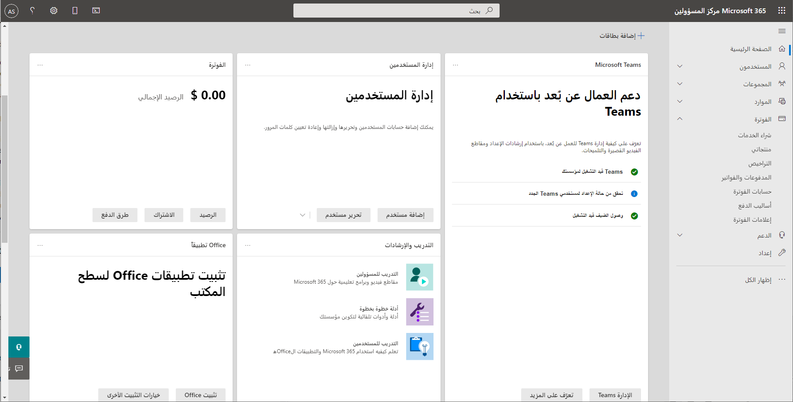

يدير مسؤول بيئة Microsoft Online Services اشتراك تطبيقات Dynamics 365 Customer Engagement، بما في ذلك الفوترة والمدفوعات وتراخيص المستخدم والحسابات والتسجيل. يمكنك القيام بهذه المهام في [مركز إدارة Microsoft 365](https://portal.microsoftonline.com/).

بصفتك مستشاراً وظيفياً، من المهم أن تعرف كيفية تحديد الاشتراكات المتاحة لك للعمل باستخدامها.

### تحديد اشتراكات الخدمة عبر الإنترنت الحالية

مركز إدارة Microsoft 365 هو موقع مدخل ثري بالميزات للمسؤول. تستفيد تطبيقات Dynamics 365 Customer Engagement من الميزات الموجودة في هذا الموقع لتبسيط وتوحيد عملية إدارة حسابات المستخدمين والفواتير والترخيص والمزيد.

لتحديد اشتراكاتك الحالية عبر الإنترنت، اتبع الخطوات الموضحة في هذا الفيديو القصير:

> [!VIDEO https://www.microsoft.com/videoplayer/embed/RWqJe4]

### إضافة اشتراكات جديدة

يمكن أيضاً استخدام صفحة الاشتراكات داخل مركز إدارة Microsoft 365 لتعديل التراخيص وعرض فاتورتك وإضافة شريك سجل وغير ذلك الكثير.

فيما يلي خطوات إضافة اشتراك جديد:

> [!VIDEO https://www.microsoft.com/videoplayer/embed/RWr1ss]

### حدد التطبيقات المتوفرة في Dynamics 365

يمكن نشر تطبيقات Dynamics 365 Customer Engagement مع تطبيق واحد أو أكثر جاهز للاستخدام.

لتحديد التطبيقات التي تم تثبيتها على مثيل ما، اتبع الخطوات التالية:

> [!VIDEO https://www.microsoft.com/videoplayer/embed/RWqWcR]
