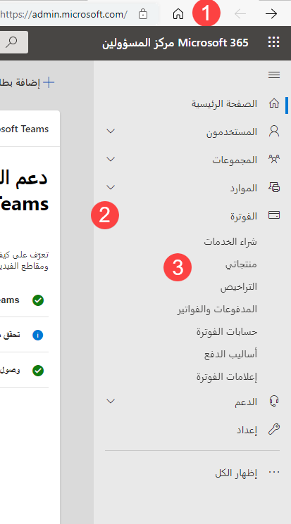
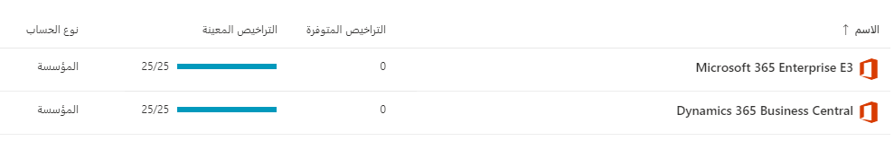
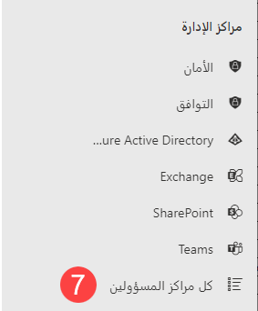
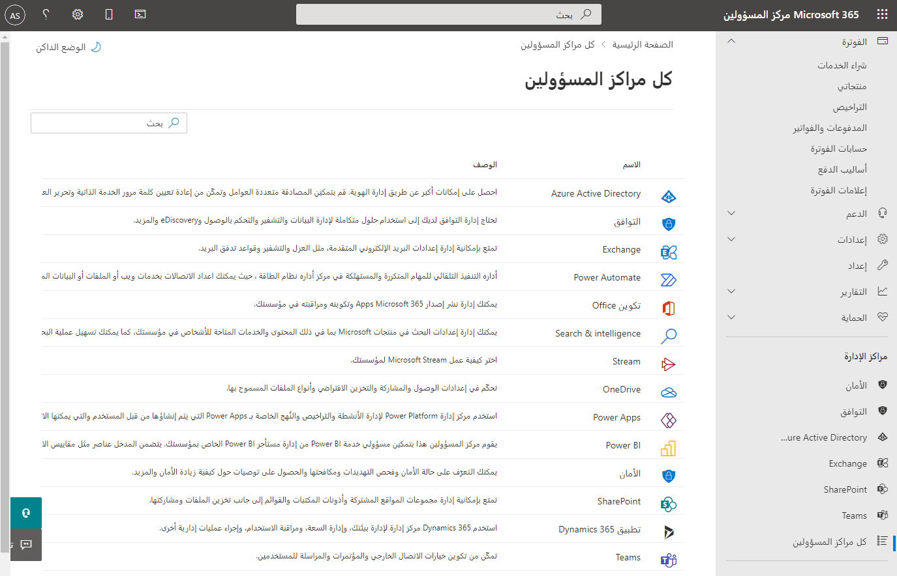
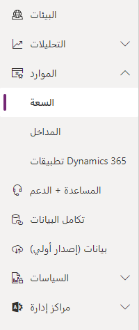
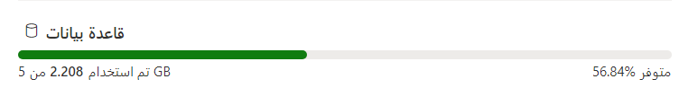

تحقق التمارين أفضل النتائج عند استخدام الإصدار 9.0 أو إصدار أحدث من البيئة التجريبية لتطبيقات Microsoft Dynamics 365 Customer Engagement.

**الأهداف التعليمية**

ستتمكن عند الانتهاء من هذه التمارين من أداء المهام التالية: تأكيد الاشتراكات، وتأكيد توافر المثيل، وتأكيد مساحة التخزين المتوفرة.

الوقت المقدر لإنهاء هذا التمرين العملي: 15 إلى 20 دقيقة

تعمل مستشاراً وظيفياً يبدأ العمل في تنفيذ Dynamics 365 CE لعميل جديد. صدرت التعليمات للعميل بإنشاء مستأجر جديد باستخدام تطبيقات Microsoft 365 وتطبيقات Dynamics 365 Customer Engagement باتباع هذه المتطلبات:

- 100 ترخيص Microsoft 365 E3
- 100 ترخيص خطة Dynamics 365 CE
- 3 مثيلات لـ Dynamics 365. مثيل إنتاج واحد ومثيلان آلية تحديد الوصول.
- مساحة تخزين إجمالية متوفرة لا تقل عن 50 غيغابايت

قبل أن تبدأ العمل على هذه البيئة، عليك تسجيل الدخول وتأكيد أن العميل قد أكمل المتطلبات الواردة بالتفصيل أعلاه.

**الخطوات عالية المستوى**

1. تحليل الاشتراكات في مركز إدارة Microsoft 365 لتأكيد متطلبات الترخيص
2. تحليل المثيلات المتوفرة في مركز إدارة 365 Microsoft Dynamics
3. تحليل مساحة التخزين المتوفرة في مركز إدارة 365 Microsoft Dynamics

### الخطوات التفصيلية

تعمل مستشاراً وظيفياً يبدأ العمل في تنفيذ Dynamics 365 CE لعميل جديد. قبل أن تبدأ العمل على هذه البيئة، عليك تسجيل الدخول وتأكيد أن العميل قد أكمل المتطلبات الفنية.

#### مراجعة الاشتراكات المتوفرة على المستأجر

1. انتقل إلى **admin.microsoft.com**.
2. في جزء التنقل الأيسر، عليك توسيع **الفوترة**.
3. انقر فوق **المنتجات والخدمات**.

4. لاحِظ عدد الاشتراكات النشطة ودوّن تفاصيل الترخيص. في هذه الحالة، يمكنك رؤية اشتراكين نشطين هما خطة تطبيقات Dynamics 365 Customer Engagement وMicrosoft 365 Enterprise E3 مع 25 ترخيصاً متوفراً.

5. دوّن الاشتراك الحالي وتفاصيل الترخيص.

#### مراجعة عدد المثيلات المتوفرة في المستأجر ونوعها

6. في جزء التنقل الأيسر، انقر فوق **إظهار الكل**، أدنى **تخصيص التنقل**.

7. حدّد **كل مراكز الإدارة**.

8. انقر فوق لوحة **Dynamics 365**.

9. دوّن توفر المثيل الحالي. تعقَّب نوع المثيل ومنطقته وحالته. يتوفر في هذا المثال مثيل إنتاج واحد فقط:

#### مراجعة إجمالي مساحة التخزين المتوفرة وإجمالي مساحة التخزين المستخدمة

10. انقر فوق علامة التبويب **سلامة الخدمة**.
11. دوّن إجمالي مساحة التخزين المتوفرة وإجمالي مساحة التخزين المستخدمة. في هذا المثال، إجمالي مساحة التخزين المتوفرة لدينا هو 5 غيغابايت، وإجمالي مساحة التخزين المستخدمة لدينا هو 2.2 غيغابايت وهذا يمثل استخدام التخزين بنسبة 44.16%.

فيما يلي النتائج من تحليلنا:

  |المتطلب                                          | متوفر‬                                           |  النتيجة  |
  |-----------------------------------------------------|-----------------------------------------------------| ---------|
  |الاشتراكات النشطة لـ Microsoft 365 وDynamics 365 CE  | الاشتراكات النشطة لـ Microsoft 365 وDynamics 365 CE |  **نجاح**|
  |100 ترخيص مستخدم لكل اشتراك                   | 25 ترخيص مستخدم لكل اشتراك                   |  فشل  |
  |مثيل إنتاج واحد + مثيلان آلية تحديد الوصول          | مثيل إنتاج واحد                               |  فشل  |
  |إجمالي مساحة تخزين متوفرة بمقدار 50 غيغابايت أو أكثر                       | إجمالي مساحة تخزين متوفرة بمقدار 5 غيغابايت                     |  فشل  |

نظراً لعدم توفُّر الحد الأدنى من المتطلبات في الوقت الحالي، من المفترض ألا تبدأ العمل على البيئة. أخطِر مهندس الحلول وأعضاء الفريق الآخرين المشاركين في المشروع حتى يتم استيفاء المتطلبات، ويمكن بدء العمل التنفيذي.
