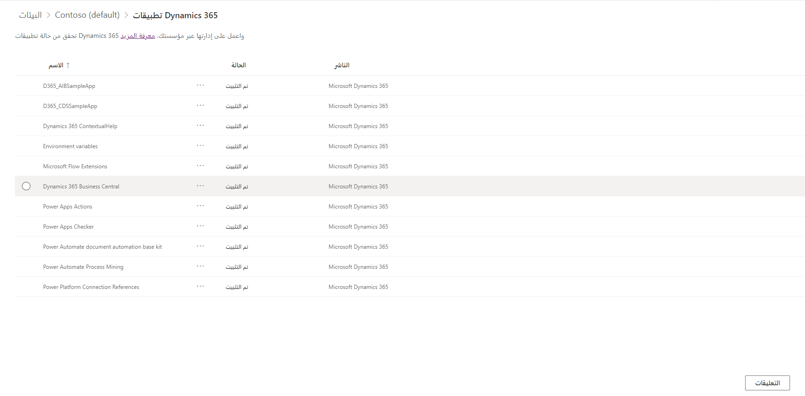

ستتمكن عند الانتهاء من هذه التمارين من أداء المهام التالية: تأكيد الاشتراكات، وتأكيد توافر المثيل، وتأكيد مساحة التخزين المتوفرة.

الوقت المقدر لإنهاء هذا التمرين العملي: 15 إلى 20 دقيقة

تعمل مستشاراً وظيفياً يبدأ العمل في تنفيذ Dynamics 365 Business Central لعميل جديد. صدرت التعليمات للعميل بإنشاء مستأجر جديد باستخدام Microsoft 365 وDynamics 365 Business Central باتباع هذه المتطلبات:

- 100 ترخيص Microsoft 365 E3
- 100 Dynamics 365 Business Central ترخيص
- 3 مثيلات لـ Dynamics 365. مثيل إنتاج واحد ومثيلان آلية تحديد الوصول.
- مساحة تخزين إجمالية متوفرة لا تقل عن 50 غيغابايت

قبل أن تبدأ العمل على هذه البيئة، عليك تسجيل الدخول وتأكيد أن العميل قد أكمل المتطلبات الواردة بالتفصيل أعلاه.

## ‏‫الخطوات عالية المستوى

1. تحليل الاشتراكات في مركز إدارة Microsoft 365 لتأكيد متطلبات الترخيص
1. تحليل المثيلات المتوفرة في مركز إدارة Power Platform
1. تحليل مساحة التخزين المتوفرة في مركز إدارة Power Platform

تعمل مستشاراً وظيفياً يبدأ العمل في تنفيذ Dynamics 365 Business Central لعميل جديد. قبل أن تبدأ العمل على هذه البيئة، عليك تسجيل الدخول وتأكيد أن العميل قد أكمل المتطلبات الفنية.

## مراجعة الاشتراكات المتوفرة على المستأجر

1. انتقل إلى [مركز إدارة Microsoft 365](https://admin.microsoft.com/Adminportal/Home).
1. في جزء التنقل الأيسر، عليك توسيع **الفوترة**.
1. انقر فوق **تراخيص**.

    

1. لاحظ عدد الاشتراكات النشطة ولاحظ تفاصيل الترخيص. في هذه الحالة، يمكنك رؤية اشتراكين نشطين هما خطة Dynamics 365 Business Central وMicrosoft 365 Enterprise E3 مع إجمالي 25 ترخيصاً.

    

1. دوّن الاشتراك الحالي وتفاصيل الترخيص.

## مراجعة عدد المثيلات المتوفرة في المستأجر ونوعها

1. في جزء التنقل الأيسر، انقر فوق **إظهار الكل**، أدنى **تخصيص التنقل**.

    

1. حدّد **كل مراكز الإدارة**.

    

1. انقر فوق **تطبيقات Dynamics 365**.

    

1. حدد **البيئات** على اليسار، وابحث عن البيئة التي تريد التحقق منها من أجل **Dynamics 365 Business Central**.

    > [!div class="mx-imgBorder"]
    > 

1. يمكنك الآن مشاهدة تفاصيل حول هذه البيئة. في أسفل اليمين، ضمن **الموارد**، إذا كانت تطبيقات Dynamics 365 خياراً، فقد تم توزيع تطبيق dynamics 365 واحد على الأقل. 

    > [!div class="mx-imgBorder"]
    > 

1. حدد **تطبيقات Dynamics 365** للاطلاع على مزيد من التفاصيل حول التطبيقات التي تم تثبيتها في البيئة لديك.

    > [!div class="mx-imgBorder"]
    > 

    كما يمكنك رؤيته، تم تثبيت Dynamics 365 Business Central في هذا المستأجر.

1. والآن، في الجانب الأيسر من الشاشة، قم بتوسيع **الموارد** وحدد **القدرة**.

    

1. دوّن إجمالي مساحة التخزين المتوفرة وإجمالي مساحة التخزين المستخدمة. في هذا المثال، إجمالي مساحة التخزين المتوفرة لدينا هو 5 غيغابايت، وإجمالي مساحة التخزين المستخدمة لدينا هو 2.2 غيغابايت وهذا يمثل استخدام التخزين بنسبة 44.16%.

فيما يلي النتائج من تحليلنا:

  |المتطلب                                          | متوفر‬                                           |  النتيجة  |
  |-----------------------------------------------------|-----------------------------------------------------| ---------|
  |الاشتراكات النشطة لتطبيق Microsoft 365 وDynamics 365 Business Central  | الاشتراكات النشطة لتطبيق Microsoft 365 وDynamics 365 Business Central |  **نجاح**|
  |100 ترخيص مستخدم لكل اشتراك                   | 25 ترخيص مستخدم لكل اشتراك                   |  فشل  |
  |مثيل إنتاج واحد + مثيلان آلية تحديد الوصول          | مثيل إنتاج واحد                               |  فشل  |
  |إجمالي مساحة تخزين متوفرة بمقدار 50 غيغابايت أو أكثر                       | إجمالي مساحة تخزين متوفرة بمقدار 5 غيغابايت                     |  فشل  |

نظراً لعدم توفُّر الحد الأدنى من المتطلبات في الوقت الحالي، من المفترض ألا تبدأ العمل على البيئة. أخطِر مهندس الحلول وأعضاء الفريق الآخرين المشاركين في المشروع حتى يتم استيفاء المتطلبات، ويمكن بدء العمل التنفيذي.
