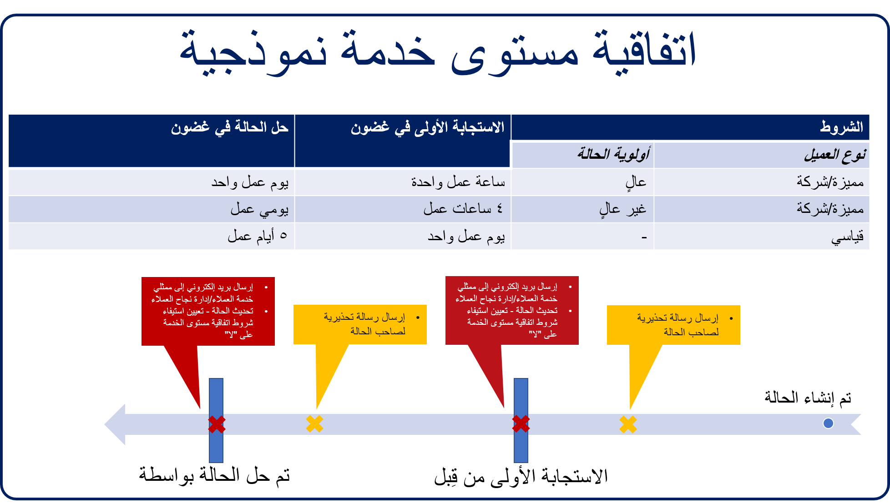

تقوم المؤسسات المستندة إلى خدمة العملاء بتعقب رضا العملاء والتميز عن مؤسسات الخدمات الأخرى بطرق منها تحديد مؤشرات الأداء الرئيسية (KPI) وتعقبها. مؤشر الأداء الرئيسي هو قيمة قابلة للقياس توضح فعالية الشركة في تحقيق أهداف الأعمال المهمة. وتستخدم مؤسسات مؤشرات الأداء الرئيسية (KPI) لتقييم مدى نجاحها في تحقيق أهدافها.

يمكن أن تختلف مؤشرات الأداء الرئيسية (KPI) المحددة التي تتبعها المؤسسات بدرجة كبيرة، ولكن هناك العديد من مؤشرات الأداء الرئيسية (KPI) الشائعة التي يمكن استخدامها لقياس النجاح وتحسين خدمة العملاء:

- **‏‫درجة مستوى رضا العميل (CSAT)‬:** هذا هو مؤشر الأداء الرئيسي الأكثر رواجاً ويتم استخدامه بشكلٍ عام عن طريق سؤال العملاء عن مدى رضاهم عن نشاطك التجاري أو منتجك أو خدمتك.
- **Net Promoter Score (NPS):** يعمل مؤشر الأداء الرئيسي هذا على قياس احتمالية أن يرشحك العملاء لأشخاص آخرين.
- **وقت الاستجابة الأولى:** يقوم مؤشر الأداء الرئيسي هذا بقياس سرعة الاستجابة الأولية للعميل عند ظهور مشكلة.
- **وقت حل المكالمة** يعمل مؤشر الأداء الرئيسي هذا على قياس مدى سرعة حل مشكلات العملاء.
- **معدل الاحتفاظ بالعملاء** مؤشر أداء رئيسي يقيس قدرتك على الاحتفاظ بعملائك الذين يدفعون خلال فترة محددة.
- **مشاركة الموظف:** مؤشر أداء رئيسي يقيس مدى تفاعل موظفيك.

رغم أن هذه القائمة ليست كاملة بأي حال من الأحوال، إلا أنها توضح لك تهتم به مؤسسات خدمة العملاء في العادة.

يمكنك Microsoft Dynamics 365 for Customer Service من تحديد SLAs لمساعدتك على تلبية مستويات الخدمة المرجوة عند تقديم الدعم للعملاء. تسمح لك SLAs الخاصة بتطبيق Dynamics 365 بتعقب مؤشرات الأداء الرئيسية (KPI) الشائعة مثل وقت الاستجابة الأولى ووقت حل المكالمة لكل حالة يتم إرسالها. يمكنك كذلك إنشاء مؤشرات الأداء الرئيسية (KPI) مخصصة لتعقب العناصر الخاصة بالأعمال المهمة لمؤسستك.

يمكن إعداد كل اتفاقية مستوى خدمة لنمذجة مؤشرات الأداء الرئيسية (KPI) مختلفة، استناداً إلى سمات حالة مختلفة. ستشتمل كل اتفاقية مستوى خدمة على بنود تفاصيل اتفاقية مستوى خدمة متعددة توفر معلومات حول مؤشر الأداء الرئيسي الذي يتم تعقبه والإجراءات المرتبطة به.

كل بند تفاصيل يحدد المعلومات الآتية:

- **SLA KPI:** مؤشر الأداء الرئيسي (KPI) الذي تقوم بقياسه.

   مثال: الاستجابة الأولى بواسطة أو الحل بواسطة

- **‏‫يُطبّق في حالة‬:** الشروط التي يجب أن تتحقق لهذا البند للتطبيق على الحالة.

   مثال: يتم تعيين حقل **مستوى الخدمة** الخاص بالحالة إلى "ذهبي"، ويتم تعيين حقل **أولوية الحالة** إلى "مرتفعة".

- **معايير النجاح:** كيف يبدو الحل الناجح لمؤشر الأداء الرئيسي.

   مثال: يتم تعيين حقل **إرسال الاستجابة الأولى** إلى "نعم".

- **إجراءات النجاح:** الإجراءات التي يجب اتخاذها في حالة استيفاء مؤشر الأداء الرئيسي.

   مثال: تحديث سجل الحالة للإشارة إلى أنه تم إرسال الاستجابة الأولى.

- **فشل صنف اتفاقية مستوى الخدمة (SLA):** مقدار وقت الانتظار حتى يتم اعتبار الصنف فاشلاً أو غير مستوفى.

   مثال: لا يتم إجراء أي اتصال استجابة أولى خلال ساعة واحدة من إنشاء الحالة.

- **إجراءات الفشل:** الإجراءات التي يجب اتخاذها في حالة استيفاء مؤشر الأداء الرئيسي.

   على سبيل المثال: تصعيد الحالة إلى صف التصعيد، وإعلام مدير الخدمة.

- **تحذير صنف SLA:** مقدار وقت الانتظار قبل إرسال تحذير بأن الصنف معرض لخطر عدم استيفائه.

   مثال: لا يتم إجراء أي اتصال استجابة أولى خلال 30 دقيقة من إنشاء الحالة.

- **إجراءات التحذير**: إجراءات التحذير التي يجب اتخاذها إذا كان مؤشر الأداء الرئيسي معرضاً لخطر عدم استيفائه.

   مثال: إرسال بريد إلكتروني للتذكير إلى المندوب المسؤول عن الحالة.

تعرض الصورة الآتية اتفاقية مستوى خدمة (SLA) نموذجية لأنواع مختلفة من العملاء، استناداً إلى مستوى الخدمة الذي وعدتهم به.

في هذا المثال، تم تحديد ثلاثة شروط لاتفاقية مستوى الخدمة (SLA):

- **نوع العميل** = متميز/شركة و **أولوية الحالة** = مرتفعة:

    - الاستجابة الأولى في غضون ساعة عمل واحدة
    - حل الحالة في غضون يوم عمل واحد

- **نوع العميل** = متميز/شركة و **أولوية الحالة** = غير مرتفعة:

    - الاستجابة الأولى في غضون أربع ساعات عمل
    - حل الحالة في غضون يومي عمل

- **نوع العميل** = قياسي و **أولوية الحالة** = أي:

    - الاستجابة الأولى في غضون يوم عمل واحد
    - حل الحالة في غضون خمسة أيام عمل

استناداً إلى نوع العميل الذي يقدم حالة وأولوية الحالة، تتخذ اتفاقية مستوى الخدمة أحد الإجراءات الآتية:

- **إرسال رسالة تحذير إلكترونية إلى مالك الحالة إذا كان معرضاً لخطر عدم تلبية مؤشر الأداء الرئيسي للاستجابة الأولى.**

    - إرسال بريد إلكتروني إلى ممثل خدمة العملاء ومدير خدمة العملاء إذا فشلوا في تلبية الاستجابة الأولى بواسطة مؤشر الأداء الرئيسي.
    - تحديث سجل الحالة عن طريق تعيين حقل **إرسال الاستجابة الأولى** لاتفاقية مستوى الخدمة إلى "لا".

- **إرسال رسالة تحذير إلكترونية إلى مالك الحالة إذا كان معرضاً لخطر عدم استيفاء مؤشر الأداء الرئيسي للحل.**

    - إرسال بريد إلكتروني إلى ممثل خدمة العملاء ومدير خدمة العملاء إذا فشلوا في عدم استيفاء الحل بواسطة مؤشر الأداء الرئيسي.
    - تحديث سجل الحالة عن طريق تعيين حقل **الحل** لاتفاقية مستوى الخدمة إلى "لا".

إضافة إلى ذلك، يمكن لSLAs Dynamics 365 مراعاة أمور مثل ساعات العمل وأوقات إغلاق الأعمال عندما تتحقق مما إذا كان قد تم استيفاء مؤشر الأداء الرئيسي.

على سبيل المثال، تكون مؤسستك مفتوحة من الساعة 8:00 صباحاً إلى 5:00 مساء، وقد وعدت أحد العملاء بوقت استجابة مدته أربع ساعات. قد تستند هذه الساعات الأربع فقط إلى الساعات التي تكون فيها مؤسستك مفتوحة. لذلك، تجب معاودة الاتصال بالعميل الذي يتصل في الساعة 3:00 مساء بحلول الساعة 10:00 صباحاً في يوم العمل التالي. ولكن تجب معاودة الاتصال بالعميل المرتبط باتفاقية مستوى الخدمة على مدار الساعة وطوال أيام الأسبوع بحلول الساعة 7:00 مساء في اليوم نفسه.

وكمؤسسة، من الضروري أن تفكر في جميع السيناريوهات المختلفة التي تدعمها، للتأكد من أنه يمكنك إعداد اتفاقية مستوى الخدمة المناسبة وتعيينها لكلٍ من أنواع المكالمات الواردة.

عامل آخر يمكنك أن تأخذه في اعتبارك وهو الوقت المستغرق في انتظار العملاء. إذا وعدت عميلاً بأنه سيتم حل الحالة في غضون ساعتين، فكل دقيقة مهمة. لذلك، إذا قضيت إحدى الساعتين في انتظار العميل للعودة إليك بكلمة مرور، فيجب أن تقرر ما إذا كانت هذه الساعة سيتم احتسابها من وقت الحل الذي وعدت به.

تدعم ميزة Dynamics 365 SLA كافة هذه السيناريوهات. خلال الجزء المتبقي من هذه الوحدة، سنوجهك خلال هذه السيناريوهات. سنشرح لك أيضاً عملية إعداد SLAs لتلبية احتياجات محددة.
