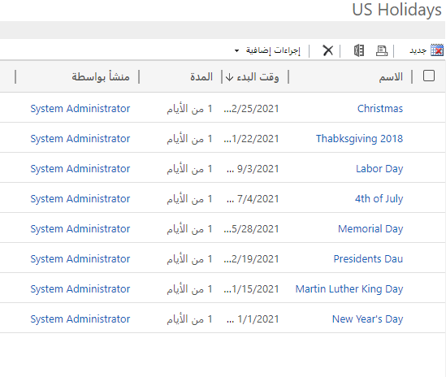
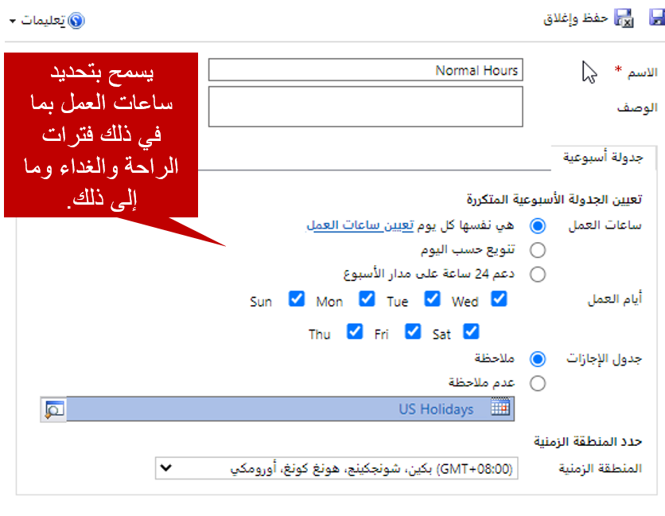

عندما تبدأ مؤسسة في تصميم SLAs لتلبية متطلبات مؤشرات الأداء الرئيسية (KPI)، تجب عليها مراعاة الساعات التي تقدم خلالها الدعم لعملائها.

على سبيل المثال، مؤسسة مفتوحة من الاثنين إلى الجمعة، من 8:00 صباحاً إلى 5:00 مساء. هذه الساعات هي الأوقات القياسية التي يمكن فيها لمعظم عملاء المؤسسة الاتصال لتلقي الدعم. لكن العميل الذي أبرم اتفاقية دعم قد يحق له الحصول على دعم على مدار الساعة طوال الأسبوع.

عند فتح حالة، من المهم تحديد الساعات التي يجب أن تكون الحالة مرتبطة خلالها، ولتطبيق اتفاقية مستوى الخدمة المناسبة. لذلك، يجب تحديد جداول العمل المختلفة التي تتطلبها مؤسستك. مراعاة عوامل مثل متطلبات المنطقة الزمنية وأوقات إغلاق الأعمال لقضاء العطلات.

## جداول الإجازات

*جداول الإجازات* تتيح للمؤسسات إمكانية تحديد العطلات التي تضعها في الحسبان، والتي تكون مغلقة خلالها في العادة. لإعداد جداول إجازات، انتقل إلى **إعدادات** \> **إدارة الخدمة**، ثم في قسم **شروط الخدمة**، حدد **جداول الإجازات**. عند إنشاء جدول إجازات للمرة الأولى، يجب تعيين اسم له، مثل *إجازات الولايات المتحدة*.

إذا كانت مؤسستك تدعم العملاء في بلدان أو مناطق متعددة، فستتم مراعاة الإجازات المختلفة في كل منها. لذلك، يجب التأكد من إعداد جداول الإجازات الضرورية لكل بلد أو منطقة تدعمها.

بعد إنشاء جدول الإجازات، يمكنك البدء في إضافة الإجازات إليه. في العادة، تتضمن الإجازة المعلومات الآتية:

- **الاسم:** اسم الإجازة.
- **تاريخ البدء:** تاريخ بدء الإجازة.
- **تاريخ الانتهاء:** تاريخ نهاية الإجازة.
- **المدة:** المدة الإجمالية للإجازة.

على سبيل المثال، إذا كانت مؤسستك ستغلق في عيد رأس السنة لعام 2019، فإليك كيفية إعداد الإجازة:

- **الاسم:** *عيد رأس السنة لعام 2019*
- **تاريخ البدء:** *1/1/2019*
- **تاريخ الانتهاء:** *1/1/2019*
- **المدة:** *يوم واحد*

يجب تحديد كل إجازة. لذلك، في عيد رأس السنة الجديدة، يمكنك إضافة عيد رأس السنة كإجازة في عام 2019 و2020 و2021 وما إلى ذلك.

رغم أنه يمكن إضافة أيام الإجازات بشكلٍ فردي، إلا أنه يمكن استيراد العديد منها (على سبيل المثال، من ملف Microsoft Excel) ومرتبطة بجدول الإجازات المناسب. تكون الإجازات في العادة أول ما سيتم إعداده.

للاطلاع على المزيد حول تحديد جداول الإجازات، راجع [إنشاء جداول الإجازات وإدارتها](/dynamics365/customer-engagement/customer-service/set-up-holiday-schedule)

## تقويمات خدمة العملاء

بعد ذلك، يجب إعداد *تقويمات خدمة العملاء* لتحديد ساعات العمل المختلفة التي قد تستخدمها SLAs. تقوم عادةً بتحديد تقويمات الخدمة بعد جداول الإجازات، لأنه يمكنك ربط تقويم بجدول الإجازات. لإعداد تقويمات الخدمة، انتقل إلى **إعدادات** \> **إدارة الخدمة**، ثم في قسم **شروط الخدمة**، حدد **تقويمات خدمة العملاء**.

عند إعداد تقويمات خدمة العملاء، يمكنك تحديد الخصائص الآتية:

- **ساعات العمل:** حدد ساعات العمل المحددة المرتبطة بتقويم الخدمة:

    - **هي نفسها كل يوم:** يمكن أن تكون ساعات العمل متماثلة كل يوم. بعد تحديد هذا الخيار، حدد **تعيين ساعات العمل** لتحديد ساعات العمل، بما في ذلك فترات الراحة.
    - **تختلف حسب اليوم:** سيتم عرض كل يوم من أيام الأسبوع. بعد تحديد هذا الخيار، حدد الأيام التي تكون فيها مؤسستك مفتوحة، ثم حدد **تعيين ساعات العمل** لتحديد ساعات العمل، بما في ذلك فترات الراحة، لكل يوم.
    - **دعم على مدار الساعة طوال الأسبوع** يتم تعيين ساعات العمل تلقائياً إلى 24 ساعة في اليوم وسبعة أيام في الأسبوع. لا يمكنك تغيير الساعات أو الأيام.

- **أيام العمل:** حدد أيام الأسبوع التي تكون مؤسستك مفتوحة فيها. يتوفر هذا الخيار فقط إذا قمت بتحديد **هي نفسها كل يوم** في مجموعة حقل **ساعات العمل**.
- **جدول الإجازات:** حدد ما إذا كان تقويم الخدمة يراعي أي أوقات إغلاق في الإجازات. إذا قمت بتحديد **مراعاة**، يمكنك تحديد جدول الإجازات لاستخدامه.
- **المنطقة الزمنية:** حدد المنطقة الزمنية لتقويم الخدمة.

من المحتمل أن يكون لدى مؤسستك عدة تقويمات خدمة العملاء محددة لها. في كثير من الأحيان، يكون لدى المؤسسات تقويمان للخدمة على الأقل:

- **المعيار:** تم تحديد ساعات العمل من الاثنين إلى الجمعة، من الساعة 8:00 صباحاً حتى 5:00 مساء. تتم مراعاة جدول إجازات الويات المتحدة.
- **على مدار الساعة طوال الأسبوع** تم تحديد ساعات العمل بأنها 24 ساعة في اليوم وسبعة أيام في الأسبوع. لم تتم مراعاة جدول إجازات الويات المتحدة.

يمكنك كذلك الحصول على تقويمات تمثل مختلف البلدان أو المناطق التي تقدم الدعم فيها. على سبيل المثال، في دبي، عادة ما يكون أسبوع العمل من الأحد إلى الخميس. لذلك، إذا كنت تقدم الدعم لعملاء في دبي، يجب عليك إعداد تقويم خدمة إضافي لمدينة دبي وتحديد أسبوع العمل من الأحد إلى الخميس.

> [!VIDEO https://www.microsoft.com/videoplayer/embed/RE2IGDJ]

للاطلاع على المزيد حول تحديد جداول الخدمة، راجع [إنشاء جدول خدمة العملاء وتحديد ساعات العمل](/dynamics365/customer-engagement/customer-service/create-customer-service-schedule-define-work-hours).

بعد إعداد كافة تقويمات الخدمة الضرورية للمؤسسة، يمكنك البدء في تحديد SLAs في التطبيق.
