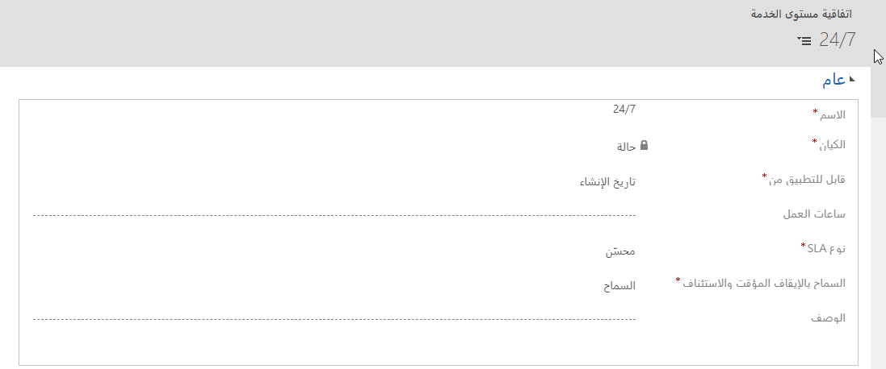

يمكن إنشاء SLAs لتتبع وقياس مؤشرات الأداء الأساسية (KPIs) المحددة، استناداً إلى العميل وتفاصيل الحالة. من المهم أن نتذكر أن SLAs ليست خاصة بالعميل ولكنها محددة للمؤسسة. يتم تطبيقها على حالة عميل إما عن طريق ربط الحالة يدوياً باتفاقية مستوى الخدمة (SLA)‬‬ محددة أو عن طريق إرفاق الحالة باستحقاق مرتبط باتفاقية مستوى الخدمة (SLA)‬‬ محددة. بالإضافة إلى ذلك، يمكن تعريف ‏‫اتفاقية مستوى الخدمة (SLA)‬‬ الافتراضية للمؤسسة. وبهذه الطريقة، إذا لم يتم تعريف أي من حالات اتفاقية مستوى الخدمة (SLA)، سيتم تطبيق اتفاقية مستوى الخدمة (SLA) الافتراضية تلقائياً.

لإنشاء SLAs، انتقل إلى **الإعدادات** \>**إدارة الخدمة**، ثم في قسم **شروط الخدمة**، حدد **SLAs**. عند تعريف SLAs، ضع في اعتبارك تقويم خدمة العملاء (إن وجد) الذي يجب استخدامه. وبهذه الطريقة، يمكنك المساعدة على ضمان حساب كافة مؤشرات الأداء الأساسية بشكل صحيح، استناداً إلى ساعات العمل والعطلات للمركز الذي يقوم بخدمة العميل. في كثير من الأحيان، يتم تعريف اتفاقية مستوى الخدمة (SLA) واحد على الأقل لكل تقويم خدمة موجود لمؤسسة.

وثمة بند رئيسي آخر ينبغي مراعاته عند تحديد اتفاقية مستوى الخدمة (SLA) هو متى يمكن تطبيق اتفاقية مستوى الخدمة (SLA) الخاصة من.  يمكن تعيين الحقل القابل للتطبيق من إلى أي حقل تاريخ مقترن بهذا الكيان مثل "تم الإنشاء في" أو "تم التعديل في".  يحدد هذا الوقت الذي يجب أن تبدأ فيه عمليات مؤشرات الأداء الأساسية (KPIs) الخاصة باتفاقية مستوى الخدمة (SLA) في الحساب.  
  
على سبيل المثال: لنفترض أنك تريد أن يكون لديك اتفاقية مستوى الخدمة (SLA) مع استجابة أولى لمدة 4 ساعات بواسطة مؤشر الأداء الأساسي المعرف:   

- إذا قمت بتعيين الحقل القابل للتطبيق إلى تم الإنشاء في، سيكون لدى المندوب الذي يتولى الحالة 4 ساعات من البيانات والوقت الذي تم فيه إنشاء الحالة لإجراء أول استجابة أولية مع العميل.  
- إذا قمت بتعيين الحقل القابل للتطبيق من إلى تعديل في، ثم في كل مرة يتم تحديث سجل الحالة، سيتم إعادة تشغيل جهاز ضبط الوقت الاستجابة الأولى بواسطة مؤشر الأداء الأساسي.
  
أثناء استخدام حقل التعديل في يمكن أن يكون مفيداً في بعض الحالات، فهو ليس مشغلاً مثالياً لتتبع مؤشر الأداء الأساسي للاستجابة الأولى.  تحتاج إلى إيلاء اهتمام وثيق لما تقوم بتعيينه للحقل القابل للتطبيق من إلى حيث يمكن أن يكون له تأثير كبير في كيفية حساب مؤشرات الأداء الأساسية (KPIs).  

تعرض الصورة التالية مثالاً على اتفاقية مستوى الخدمة (SLA) على مدار الساعة طوال الأسبوع.

بعد تحديد المعلومات المذكورة أعلاه، يمكنك حفظ اتفاقية مستوى الخدمة (SLA).  يوفر حفظ اتفاقية مستوى الخدمة (SLA) القدرة على البدء في إضافة عناصر سطر التفاصيل الخاصة باتفاقية مستوى الخدمة (SLA) إلى اتفاقية مستوى الخدمة (SLA).  

> [!VIDEO https://www.microsoft.com/videoplayer/embed/RE2IGDL]
