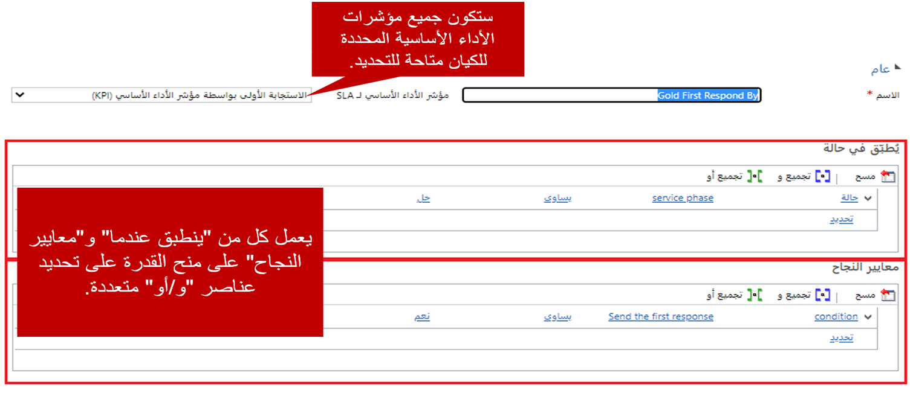
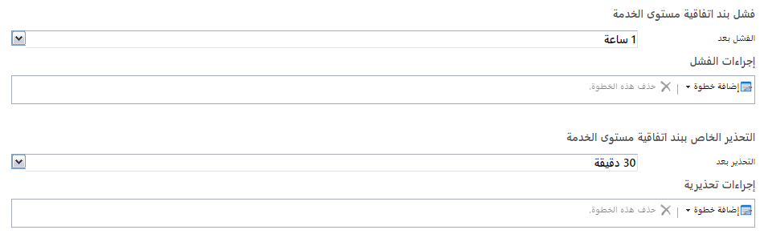
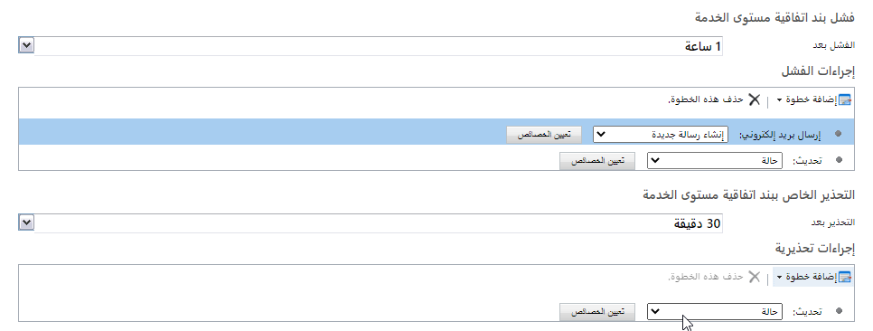
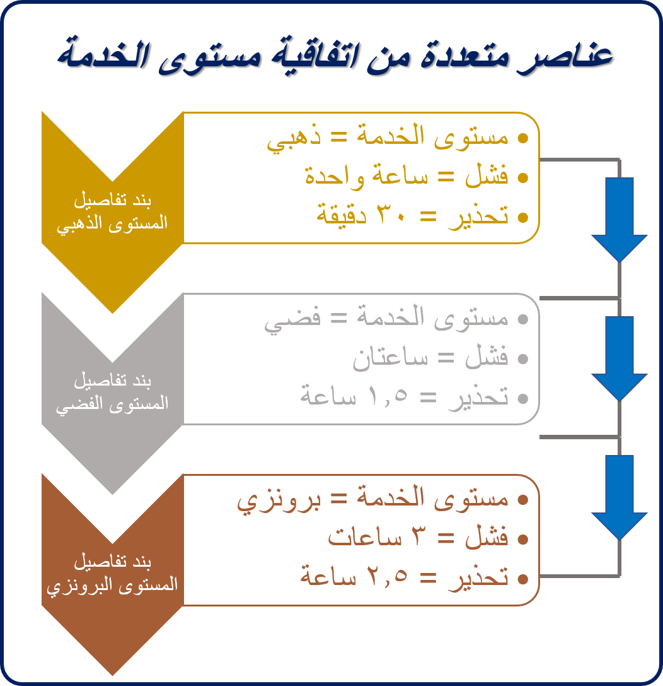

تُعرِّف تفاصيل اتفاقية مستوى الخدمة (SLA) مؤشرات الأداء الرئيسية (KPI) المحددة التي تريد قياسها. كما أنها تُحدد متى ينبغي تطبيق عنصر معين. وكما ذكرنا في وحدة النظرة العامة، فإن اتفاقية مستوى الخدمة سيكون لها عناصر تفاصيل متعددة محددة لها.

مثال، قد تحتوي اتفاقية مستوى خدمة العملاء لعقد الدعم على التفاصيل التالية:

- **العميل الذهبي – الاستجابة الأولى بواسطة** إذا كان **مستوى الخدمة** = حالة ذهبية: أول استجابة في غضون ساعة واحدة
- **العميل الذهبي – الحل بواسطة:** إذا كان **مستوى الخدمة** = *حالة ذهبية*: حل المشكلة في غضون أربع ساعات
- **العميل الفضي – الاستجابة الأولى بواسطة** إذا كان **مستوى الخدمة** = حالة فضية: أول استجابة في غضون ساعتين
- **العميل الفضي – الحل بواسطة:** إذا كان **مستوى الخدمة** حالة ذهبية: حل المشكلة في غضون يوم واحد
- **العميل البرونزي – الاستجابة الأولى بواسطة** إذا كان **مستوى الخدمة** = حالة برونزية: أول استجابة في غضون أربع ساعات
- **العميل البرونزي – الحل بواسطة:** إذا كان **مستوى الخدمة** حالة برونزية: حل المشكلة في غضون يومي عمل

تُضاف جميع مؤشرات الأداء الرئيسية (KPI)، التي تريدها لتتبع كل مرحلة من مراحل مستوى الخدمة، إلى اتفاقية مستوى الخدمة على أنها عنصر تفاصيل ضمن هذه الاتفاقية. لتعقب تقدم العملاء الذهبيين، يُمكنك تحديد عنصرين منفصلين من التفاصيل. فيما يخص المثال السابق أعلاه، تُحدد مجموعه مكونة من ستة عناصر تفصيلية لاتفاقية مستوى الخدمة بأكملها.

وفيما يخص كل عنصر تفاصيل تُضيفه إلى اتفاقية مستوى الخدمة، يجب توفير المعلومات التالية:

- **الاسم**: أدخل اسم عنصر اتفاقية مستوى الخدمة. هذا الحقل مطلوب،
- **SLA KPI:** حدد مؤشر الأداء الرئيسي (KPI) الذي تقيسه. افتراضياً، يُحرر اثنين من مؤشرات الأداء الرئيسية (KPI) مع كيان الحالة: **الاستجابة الأولى بواسطة مؤشر الأداء الرئيسي** و **حل بواسطة مؤشر الأداء الرئيسي**. يمكنك تحديد مؤشرات الأداء الرئيسية (KPI) إضافية لكيان الحالة حسب الحاجة.
- **قابل للتطبيق عند:** تحديد الشروط التي يجب أن تكون موجودة في السجل الذي تعمل اتفاقية مستوى الخدمة ضده أو سجل مرتبط لعنصر اتفاقية مستوى الخدمة المحدد ليتم تطبيقه على السجل (مثل حالة يتم تعيين مستوى الخدمة إلى المستوى الذهبي).
    - كن على علم باستخدام الحقل الذي يحتمل أن يتغير باستمرار عند تعريف قابل للتطبيق عند استيفاء الشروط.  قد تؤثر في أداء النظام.
    - تتوفر السجلات النشطة فقط لتحديدها على أنها وسيطات الشرط أو الإجراء.
- **معايير النجاح:** حدد كيف يبدو الحل الناجح لمؤشر الأداء الرئيسي المحدد. مثال، قد ينجح حل إذا تم تحديث حقل معين في السجل الحالي أو المرتبط.

## تحذيرات اتفاقية مستوى الخدمة وإخفاقاتها

بعد تحديد ما يبدو عليه الوفاء الناجح لعنصر تفاصيل اتفاقية مستوى الخدمة، يجب تحديد المدة التي يمكن أن تستغرقها معايير النجاح دون تلبيتها قبل تعيين تحذير من الفشل المحتمل. كما ينبغي تحديد المدة التي قد تستغرقها معايير النجاح غير الملباة قبل اعتبار أن العنصر قد فشل. لتعريف هذه السلوكيات، يمكنك إعداد فشل عنصر اتفاقية مستوى الخدمة وتحذيرات عناصر اتفاقية مستوى الخدمة. لكل عنصر وقت مرتبط به، وتتصرف الأوقات مستقلة عن بعضها البعض.

> [!IMPORTANT]
> يجب أن تدرك أنه قد تحدث تأخيرات المعالجة عند تعيين وقت الفشل أو التحذير إلى أقل من ساعة.  

## إجراءات اتفاقية مستوى الخدمة

تُستخدم إجراءات اتفاقية مستوى الخدمة للقيام بمهمة معينة، اعتماداً على ما إذا كانت المعايير قد استوفيت أم لا. قبل تحديد الإجراءات، يجب حفظ عنصر التفاصيل. رُغم دعم محرّك سير العمل للإجراءات، إلا أنه ليس لديك نفس الخيارات للإجراءات التي لديك لمهام سير العمل التقليدية. مثال، لا يمكنك بدء مهام سير العمل أو الإجراءات المخصصة. الخيارات المتوفرة هي "إرسال البريد الإلكتروني" و"إنشاء السجل" و"التحديث" و"التسجيل" و"تغيير الحالة".

يُمكن تعريف ثلاثة أنواع من الإجراءات:

- **إجراءات النجاح:** حدد الإجراءات التي يجب تشغيلها عند استيفاء معايير النجاح.

> [!IMPORTANT]
> تتوفر إجراءات النجاح فقط لاتفاقية مستوى الخدمة المحسنة.

- **إجراءات الفشل:** حدد الإجراءات التي يجب تشغيلها عند استيفاء معايير النجاح خلال فترة الفشل المحددة.
- **إجراءات التحذير**: حدد الإجراءات التي يجب تنفيذها إذا كانت معايير النجاح في خطر عدم الوفاء بها خلال وقت التحذير المحدد.

غالباً ما تُستخدم قيمة حقل معين، مثل حقل **مؤشر الاستجابة الأولى**، على أنها معيار نجاح لعنصر من عناصر اتفاقية مستوى الخدمة. افتراضياً، يتم تحديث قيم حقول مثل **"مؤشر الاستجابة الأولى"** تلقائياً. يُمكنك أتمتة تحديث هذه الحقول باستخدام سير عمل أو Power Automate. بالنسبة للحقل **"مؤشر الاستجابة الأولى"**، يجب تحديد ما يُعد استجابة أولى. مثال، تؤكد رسالة البريد الإلكتروني للاستجابة التلقائية أن إنشاء حالة يُعد استجابة أولى؟ (عادة ليس كذلك) هل يجب إنشاء رسالة البريد الإلكتروني يدويا من الفني المعيّن للحالة؟ هل يُمكن أن تكون مكالمة هاتفية، أم أنها شيء آخر؟ بعد تحديد هذه التفاصيل، يُمكنك إعداد عمليات التشغيل التلقائي لتحديث الحقول الضرورية.

> [!NOTE] 
> في كثير من الحالات، يُحدد حقل "مؤشر الاستجابة الأولى" المؤقت الذي يحسب الوقت المتبقي لمؤشر الأداء الرئيسي للاستجابة الأولى.  سيساعد تحديد ما إذا كان هذا الحقل يحتاج إلى تحديث يدوي أو تلقائي على ضمان إيقاف المؤقت في الوقت اللازم.  

لمعرفة المزيد عن إنشاء تفاصيل اتفاقية مستوى الخدمة، راجع [إنشاء اتفاقية مستوى خدمة محسنة](/dynamics365/customer-engagement/customer-service/define-service-level-agreements#create-an-enhanced-sla).

## العمل مع العديد من عناصر اتفاقية مستوى الخدمة

عند تعريف العديد من عناصر اتفاقية مستوى الخدمة لاتفاقية واحدة، يتم تقييم عناصر الاتفاقية بترتيب إدراجها في الشبكة الفرعية لتفاصيل الاتفاقية. إذا كان العديد من عناصر اتفاقية مستوى الخدمة يشير إلى الحقل ذاته في سجل معين، يتم تقييمها أيضاً بترتيب إدراجها فيها. يُطبق أول عنصر من عناصر الاتفاقية القابلة للتطبيق لكل حقل ذي صلة.

يُمكنك تغيير ترتيب تقييم عناصر الاتفاقية باستخدام أزرار الأسهم في الشبكة الفرعية لتفاصيل الاتفاقية. إذا كان بعض عناصر الاتفاقية لديها معايير أكثر تحديدا من غيرها، نوصي بوضع عناصر الاتفاقية الأكثر تحديدا أعلى القائمة.

> [!VIDEO https://www.microsoft.com/videoplayer/embed/RE2IJmz]
