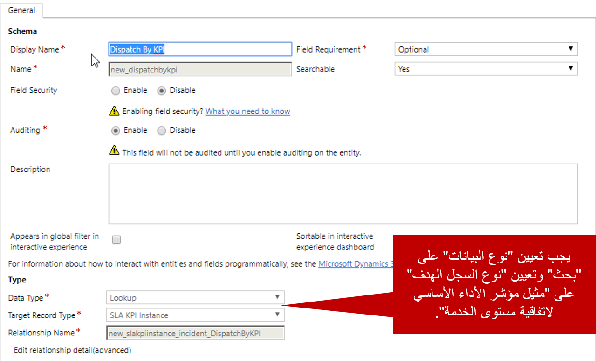
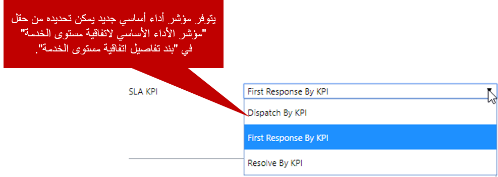

بشكل افتراضي، كيان الحالة هو الكيان الوحيد الذي تم إعداده للاستخدام مع اتفاقية مستوى الخدمة (اتفاقيات SLA). ولكن يتيح لك ‪Microsoft Dynamics 365‬ استخدام وظيفة SLA مع أي كيان. بالإضافة إلى ذلك، يمكنك تحديد مؤشرات الأداء الأساسية (مؤشرات KPI) لأي كيان تم إعداده للاستخدام مع اتفاقات SLA.

هناك العديد من السيناريوهات التي يمكنك فيها استخدام اتفاقيات SLA مع كيانات أخرى في Dynamics 365. إليك بعض الأمثلة:

- **العملاء المتوقعون:** تعقب مدى سرعة رد المديرين التنفيذيين للحساب على العملاء المتوقعين الجدد.
- **أوامر العمل:** تعقب مدى سرعة جدولة أوامر العمل وإرسالها.
- **الفرص:** تعقب مدى سرعة إقفال أنواع معيّنة من الفرص.

لإعداد كيان بحيث يمكن استخدامه مع اتفاقات SLA، انتقل إلى **الإعدادات** \> **تخصيصات** \> **تخصيص النظام**، وحدد الكيان. بعد ذلك، ضمن **الاتصال والتعاون**، حدد خانة الاختيار **‏‫تمكين لاتفاقية SLA‬**. بعد ذلك، احفظ التخصيصات وانشرها.

لمزيد من المعلومات عن الكيانات التي تدعم اتفاقيات SLA، اطّلع على [الكيانات (أنواع السجلات) التي تدعم اتفاقية SLA](/dynamics365/customer-engagement/customer-service/define-service-level-agreements#entities-record-types-that-support-sla).

لمزيد من المعلومات عن إعداد الكيانات بحيث يمكن استخدامها مع اتفاقيات SLA، اطّلع على [إضافة مؤقت في النماذج لتعقب الوقت في اتفاقيات SLA المحسنة](/dynamics365/customer-engagement/customer-service/add-timer-forms-track-time-against-enhanced-sla).

## إنشاء مؤشرات أداء أساسية (مؤشرات KPI) مخصصة

في الوحدة السابقة، ذكرنا أنه يتم إصدار مؤشرَين معرّفَين مسبقاً من مؤشرات الأداء الأساسية (KPI) مع كيان الحالة:

- الاستجابة الأولى حسب مؤشر الأداء الأساسي (KPI)
- ‏‏الحل حسب مؤشر الأداء الأساسي (KPI)

يمكنك أيضاً تعريف المزيد من مؤشرات الأداء الأساسية (KPI) لكيان الحالة وأي كيان آخر تم إعداده للاستخدام مع اتفاقيات SLA.

على سبيل المثال، إليك بعض مؤشرات الأداء الأساسية (مؤشرات KPI) المخصصة التي قد تقوم بإعدادها للسيناريوهات المذكورة سابقاً:

- **مؤشر الأداء الأساسي (KPI) للعميل المتوقع - الاتصال الأولي:** يقيس وقت إجراء المدير التنفيذي للحساب لعملية الاتصال الأولية بالعميل المتوقع.
- **مؤشر الأداء الأساسي (KPI) لأوامر العمل - تم الإرسال بواسطة:** يقيس وقت تحديد أمر العمل كمجدول.
- **مؤشر الأداء الأساسي (KPI) للفرصة - إقفال بواسطة:** يقيس وقت إقفال الفرصة.

يتم تعريف مؤشرات الأداء الأساسية (مؤشرات KPI) المخصصة عن طريق إنشاء حقل بحث في كيان مثيل SLA KPI. يمثل حقل البحث هذا علاقة واحد إلى متعدد (1:N) مع الكيان. لإنشاء حقل بحث لكيان معيّن، انتقل إلى **الإعدادات** \> **تخصيصات** \> **تخصيص النظام**، وحدد الكيان المطلوب تعريف مؤشر الأداء الأساسي (KPI) له، ثم حدد الحقول. بعد ذلك، قم بإنشاء حقل بحث جديد لهذا الكيان، ثم قم بتعيين حقل البحث لاستخدام كيان مثيل SLA KPI.

لمزيد من المعلومات عن إنشاء مؤشرات أداء أساسية (مؤشرات KPI) مخصصة، اطّلع على [إنشاء حقول لـ SLA KPI](/dynamics365/customer-engagement/customer-service/add-timer-forms-track-time-against-enhanced-sla#create-sla-kpi-fields).

لمزيد من المعلومات عن استخدام نماذج العرض السريع لكيان مثيل SLA KPI، اطّلع على [إنشاء نماذج العرض السريع لكيان مثيل SLA KPI](/dynamics365/customer-engagement/customer-service/add-timer-forms-track-time-against-enhanced-sla#create-quick-view-forms-for-the-sla-kpi-instance-entity).

بعد تعريف مؤشر الأداء الأساسي (KPI)، يمكنك استخدامه كمؤشر أداء أساسي (KPI) لأي بنود في اتفاقية SLA التي تنشئها لاتفاقيات SLA المقترنة بالكيان المحدد.

> [!VIDEO https://www.microsoft.com/videoplayer/embed/RE2IM1d]
