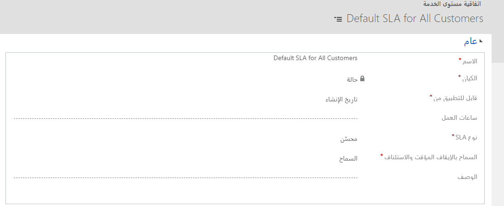
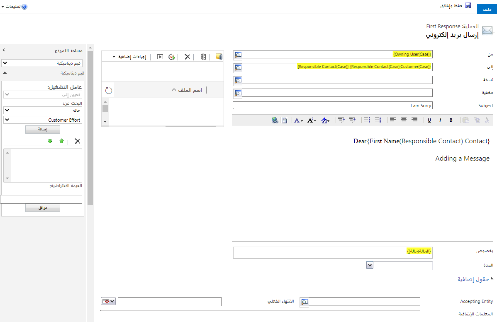
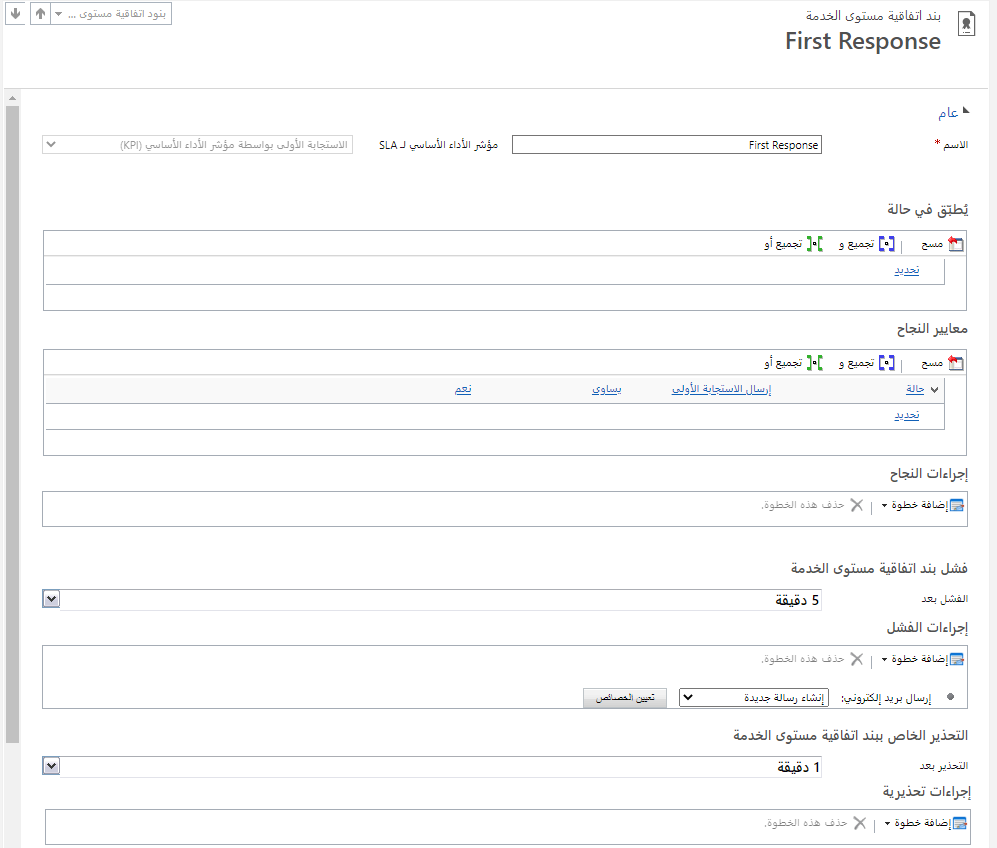
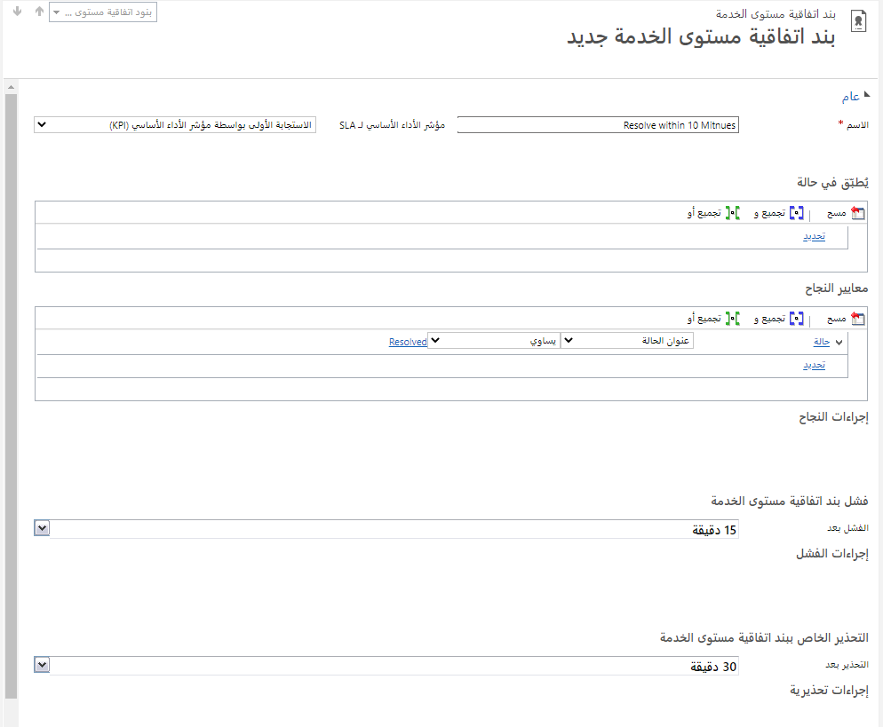

### قبل أن نبدأ

تعمل التمارين على نحو أفضل عندما يكون لديك بعض البيانات النموذجية للعمل بها. اعتماداً على البيئة التي تعمل بها، قد ترغب في تثبيت بعض البيانات النموذجية للمساعدة في التمارين. يوفر Dynamics 365 القدرة على إضافة بيانات نموذجية حسب الحاجة. إذا لم تتوفر لدى البيئة التي تعمل بها أية بيانات نموذجية مثبتة، فاتبع الخطوات التالية لتثبيت البيانات النموذجية في بيئتك.

### الخطوات عالية المستوى

### تمكين البيانات النموذجية -- الخطوات التفصيلية:

1. لإضافة عينة بيانات، افتح Dynamics 365 ثم انقر فوق **محدّد القائمة المنسدلة بجوار Dynamics 365** ثم انقر فوق **Dynamics 365 -- مخصص.**
2. **من شريط التنقل، انتقِل إلى إعدادات \> إدارة البيانات**
3. حدد **البيانات النموذجية**.
4. انقر فوق الزر **تثبيت عينة البيانات**.
5. أغلِق النافذة **عينة البيانات**.

### الأهداف التعليمية

في نهاية هذه التمارين، ستتمكن من تحقيق الأهداف التالية:

-   إنشاء SLA لـ Dynamics 365
-   تحديد تفاصيل SLA.
-   تنشيط SLA وتحديدها كإعداد افتراضي.

الوقت المقدَّر لإنهاء هذا التمرين: 15 إلى 20 دقيقة

### السيناريو

عليك إنشاء اتفاقية مستوى خدمة جديدة لعميل ما. يجب أن تتضمن SLA وقت فشل لمدة دقيقتين إذا لم تُرسَل استجابة على الفور، مع علامة تحذير عند منتصف الطريق. إذا فشلت الحالة، فإنه يتعين إنشاء بريد إلكتروني جديد وإرساله تلقائياً لإبلاغ جهة الاتصال المسؤولة بأن الحالة قد فشلت بالفعل. تحتاج أيضاً إلى إضافة وقت حل إلى SLA. ضمن تفاصيل الحل، هناك رغبة بأن تضع علامة على الحالة على أنها فاشلة إذا لم تُحَل في غضون 10 دقائق مع علامة تحذير عند منتصف الطريق مجدداً. بعد الاكتمال، عيِّن SLA هذه بوصفها الإعداد الافتراضي وتحقَّق من أنها تعمل من خلال إنشاء حالة جديدة.

### الخطوات عالية المستوى

-   إنشاء SLA.
-   إضافة تفاصيل SLA.
-   تنشيط SLA.
-   تعيين SLA بوصفها إعداداً افتراضياً.

### الخطوات التفصيلية

#### إنشاء SLA

1.  من الخيار **إعدادات**، حدِّد **إدارة الخدمة**.
2.  حدِّد **اتفاقيات مستوى الخدمة** ضمن القسم **شروط الخدمة**.
3.  من **شريط الأوامر**، انقر فوق الزر **جديد** لإنشاء SLA.
4.  في النافذة **إنشاء SLA**، اكتب **SLA الافتراضية لكل العملاء** في حقل **الاسم**.
5.  في النافذة **إنشاء SLA**، حدِّد **الحالة** في حقل الكيان.
6.  انقر فوق **موافق.**
7.  من **نموذج SLA**، املأ المعلومات لما يلي:
    -   **الاسم**: *SLA الافتراضية لكل العملاء
    -   **قابل للتطبيق من**: تاريخ الإنشاء
    -   **نوع SLA**: محسّن
    -   **السماح بالإيقاف المؤقت والاستئناف**: سماح
8.  انقر فوق **حفظ** بالأعلى في **شريط الأوامر**.

#### إضافة تفاصيل SLA

1.  داخل نموذج **الحالة** ضمن القسم **تفاصيل SLA**، انقر فوق **الزر \[+\]**.
2.  في نافذة **بند SLA جديد** ، أدخِل اسم بند لـ **الاستجابة الأولى**.
3.  ضمن القسم **معايير النجاح**، حدِّد الأمور التي تشكّل النجاح:
    -   انقر فوق تحديد، وحدّد كيان **الحالة**.
    -   انقر فوق تحديد واختر **إرسال الاستجابة الأولى**.
    -   انقر فوق تحديد واختر **يساوي**.
    -   انقر فوق "أدخِل قيمة" وحدِّد **نعم** كقيمة.

4.  ضمن القسم **فشل بند SLA**، عليك تغيير وقت **الفشل بعد** إلى **5 دقائق**.
5.  ضمن القسم **التحذير الخاص ببند SLA**، غيِّر وقت **التحذير بعد** إلى **دقيقة واحدة**.
6.  انقر فوق **حفظ**.
7.  مرة أخرى ضمن القسم **فشل بند SLA**، أشِر إلى **إجراءات الفشل** بالنقر فوق **إضافة خطوة**:
    -   اختر **إرسال بريد إلكتروني** واترك الخيار **إنشاء رسالة جديدة** كما هو.
    -   انقر فوق الزر **تعيين الخصائص**.
8.  من نافذة **إرسال بريد إلكتروني** و **الخصائص**، انقر فوق الحقل **من** واملأ بشكل ديناميكي مُرسِل البريد الإلكتروني عن طريق فعل ما يلي:
    -   داخل **مساعد النموذج**، انقر فوق **السهم الأول** ضمن **بحث عن**.
    -   حدِّد **الحالة**.
    -   انقر فوق **السهم الثاني** ضمن **بحث عن**.
    -   حدِّد **المستخدم المالك**.
    -   انقر فوق **إضافة** لإضافة مالك الحالة.
    -   انقر فوق **موافق** لحفظ الحقل **من**.

9.  من نافذة **إرسال بريد إلكتروني** و **الخصائص**، انقر فوق الحقل **إلى** واملأ بشكل ديناميكي مُرسِل البريد الإلكتروني عن طريق فعل ما يلي:
    -   داخل **مساعد النموذج**، انقر فوق **السهم الأول** ضمن **بحث عن**.
    -   حدِّد **الحالة**.
    -   انقر فوق **السهم الثاني** ضمن **بحث عن**.
    -   حدِّد **جهة الاتصال المسؤولة**.
    -   انقر فوق **إضافة** إلى جهة الاتصال المسؤولة عن الحالة.
    -   انقر فوق **السهم الثاني** ضمن **بحث عن** مجدداً.
    -   حدِّد **العميل**.
    -   انقر فوق **إضافة** لإضافة عميل الحالة إذا كانت حقل جهة الاتصال المسؤولة فارغاً.
    -   انقر فوق **موافق** لحفظ الحقل **إلى**.
10. انقر فوق **الموضوع** واكتب: أرجو المعذرة
11. املأ **نص** البريد الإلكتروني عن طريق فعل ما يلي:
    -   اكتب **تحية**: عزيزي
    -   داخل **مساعد النموذج**، انقر فوق **السهم الأول** ضمن **بحث عن**.
    -   حدِّد **جهة الاتصال المسؤولة (جهة الاتصال)**.
    -   انقر فوق **السهم الثاني** ضمن **بحث عن**.
    -   حدِّد **الاسم الأول**.
    -   انقر فوق **إضافة** إلى الاسم الأول من جهة الاتصال المسؤولة عن الحالة.
    -   انقر فوق **موافق** لحفظ حقل **\[الاسم\] المملوء بشكل ديناميكي** في النص.
    -   أكمِل **نص** البريد الإلكتروني: جارٍ إضافة رسالة...

12. انقر فوق **حفظ وإغلاق** لحفظ **خصائص البريد الإلكتروني**.

13. انقر فوق **حفظ وإغلاق** لحفظ **تفاصيل SLA**.

#### إنشاء SLA لحل

1.  في الشبكة الفرعية **تفاصيل SLA**، انقر فوق **علامة الجمع (+)**.
2.  في حقل **الاسم**، اكتب **الحل في خلال 15 دقيقة**.
3.  انقر فوق **حفظ**.
4.  في **معايير النجاح**، أدخِل المعلومات التالية:
    -   انقر فوق **تحديد** وحدّد كيان **الحالة**.
    -   انقر فوق **تحديد** واختر **الحالة**.
    -   انقر فوق **تحديد** واختر **يساوي**.
    -   انقر فوق **زر علامة الحذف** وحدِّد **تم الحل** كقيمة.
5.  في **فشل بند SLA** فشل بعد **15** دقيقة.

#### تنشيط SLA

1. من **شريط الأوامر**، انقر فوق الزر **تنشيط**.
2. انقر فوق **تنشيط** لتأكيد تنشيط SLA.
3. تعيين SLA بوصفها إعداداً افتراضياً. 
4. انقر فوق الزر **تعيين كافتراضي** في **شريط الأوامر**.

#### التحقق من صحة حالة مع SLA المحسّنة الافتراضية

أنت ممثل لخدمة العملاء ويجب أن تتحقق من أن SLA الافتراضية المحسّنة من التمرين العملي السابق قد طُبقت تلقائياً على حالة تم إنشاؤها حديثاً.

## الخطوات عالية المستوى

-   قُم بإنشاء حالة جديدة.
-   تحقَّق من أن SLA المحسّنة تُجري التعقب بالنسبة للحالة.
-   غيّر الحقل **الاستجابة الأولى بواسطة** إلى نعم.
-   عليك حل الحالة.
-   راجِع حالة قيم KPI لـ SLA المحسّنة.

### الخطوات التفصيلية

1. إذا لزم الأمر، انتقِل إلى مركز خدمة العملاء
2. باستخدام مخطط الموقع، حدِّد رمز مفتاح الربط لفتح الحالات
3. في شريط القوائم **الحالات**، انقر فوق **حالة جديدة**.
4. أدخِل المعلومات التالية:
    -   **عنوان الحالة**: مشكلة في Microsoft 365
    -   **العميل:** A. Datum Corporation (عينة)
5. انقر فوق **حفظ**.

تحقَّق من أن SLA المحسّنة تُجري التعقب بالنسبة للحالة.

6. في الحالة، مرِّر لأسفل إلى علامة التبويب **تفاصيل SLA المحسّنة** وقم بتوسعتها.

7. تحقَّق من وجود مؤقِّت لـ **الاستجابة الأولى في**.

غيِّر الحقل **إرسال الاستجابة الأولى** إلى نعم.
8. مرِّر لأسفل إلى علامة التبويب **التفاصيل الإضافية** وقم بتوسعتها.
9. غيِّر الحقل **إرسال الاستجابة الأولى** إلى **نعم**.
10. في الزاوية السفلية اليمنى، انقر فوق الرمز **حفظ**.

### حل الحالة

11. في **الشريط**، انقر فوق **حل الحالة**.
12. في الحقل **حل**، اكتب **تم حل المشكلة**.
13. انقر فوق **حل**.

راجِع حالة قيم KPI لـ SLA المحسّنة.

14. في نافذة المستعرض، انقر فوق **تحديث**.
15. مرِّر لأسفل إلى علامة التبويب **تفاصيل SLA المحسّنة** وقم بتوسعتها.
16. تحقَّق من أن حالة **‏‏الحل بواسطة KPI** مكتوب عليها **تم بنجاح**.
