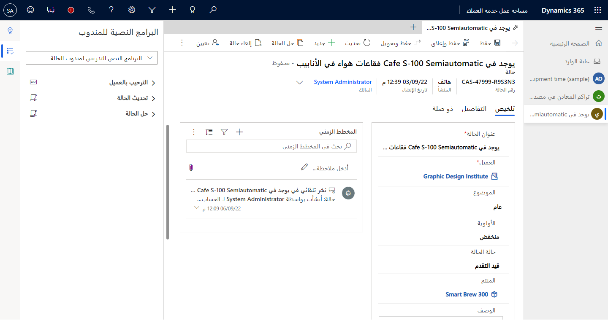

في كثير من المؤسسات، يحتاج المندوبون إلى العمل مع عدة عملاء في وقت واحد. يمكن أن يصبح هذا الجانب صعباً لأن المندوبين يحتاجون إلى التفاصيل الضرورية حول الفرد الذي يعملون معه في تلك اللحظة. بالإضافة إلى ذلك، يريد المندوبون القدرة على الانتقال إلى عميل آخر إذا لزم الأمر دون فقدان التفاصيل حول العميل الحالي.

باستخدام Microsoft Dynamics 365 Customer Service workspace، يمكنك التأكد من أن الوكلاء مزودون بإمكانيات خدمة العملاء الأساسية التي اعتادوا استخدامها مع تطبيق مركز خدمة العملاء. كما ستزودهم مساحة العمل بإمكانية فتح جلسات متعددة في وقت واحد وفي تجربة مساحة عمل واحدة.

> [!div class="mx-imgBorder"]
> 

ضمن جلسة فردية، يمكن للمندوبين فتح العديد من علامات التبويب التي تتضمن البيانات ذات الصلة. على سبيل المثال، في جلسة واحدة، قد يكون لديك علامة تبويب تعرض تفاصيل الحساب بينما تتضمن علامة تبويب أخرى تفاصيل الحالة. أثناء التبديل من جلسة إلى أخرى، ستظل جميع علامات التبويب في تلك الجلسة مفتوحة بحيث تظل متاحة عند التبديل مرة أخرى. بعد إغلاق جلسة العمل، سيتم أيضاً إغلاق جميع علامات التبويب في تلك الجلسة.

تفحص هذه الوحدة ميزات Customer Service workspace بمزيد من التفصيل.
