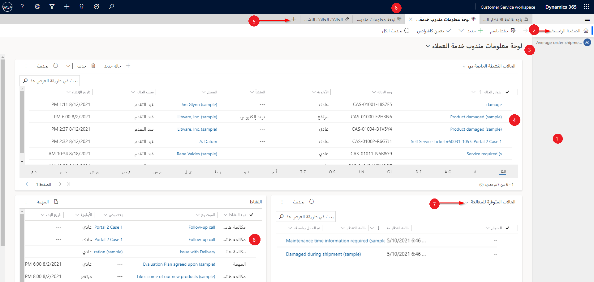
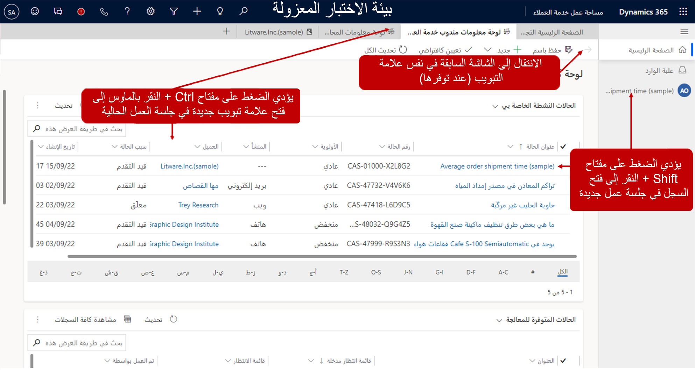

المؤسسات التي اشترت Microsoft Dynamics 365 Customer Service سيتوفر لها مركز خدمة العملاء‬ وCustomer Service workspace. تتمثل إحدى المزايا الرئيسية لـ Customer Service workspace في قدرة المندوبين على العمل في جلسات متعددة في نفس الوقت. كندوب، عند الانتقال إلى [https://www.office.com/apps](https://www.office.com/apps/?azure-portal=true)، تتوفر Customer Service workspace من شاشة **التطبيقات**.

بشكل افتراضي، سيتم فتح Customer Service workspace وعرض ‏‫لوحة معلومات مندوب خدمة العملاء‬. توفر لوحة المعلومات هذه للمندوب معلومات مهمة تتعلق بالحالات المتاحة لهم للعمل عليها. ستتضمن الحالات النشطة والحالات المتاحة لك للعمل بناءً على قوائم الانتظار التي أنت عضو فيها وأنشطتك المفتوحة. يمكنك فتح الحالات والأنشطة الموجودة، أو يمكنك البدء في العمل على حالات جديدة من قوائم الانتظار التي تم تعيينك لها وإنشاء الأنشطة.

تُظهر الصورة التالية العناصر المتاحة في Customer Service workspace.

> [!div class="mx-imgBorder"]
> 

يصف الجدول التالي العناصر الأساسية التي ستراها أثناء العمل مع تطبيق Customer Service workspace.

|     التسمية    |     الوصف‏‎                                                                                                                                                                                                                       |
|--------------|---------------------------------------------------------------------------------------------------------------------------------------------------------------------------------------------------------------------------------------|
|     1        |     يسرد جزء جلسة العمل جميع جلسات العمل التي تعمل عليها بنشاط. حدد علامات التبويب للتنقل بين جلسات العمل.                                                                                                           |
|     2        |     تعيدك جلسة العمل الرئيسية إلى طريقة عرض لوحة معلومات مندوب خدمة العملاء.                                                                                                                                                      |
|     3        |     لكل جلسة عمل علامة تبويب في لوحة جلسة العمل. حدد علامة تبويب للذهاب إلى جلسة العمل التي تريد العمل فيها.                                                                                                                       |
|     4        |     حدد حالة لفتح جلسة عمل جديدة. تحل نقرة واحدة على حالة محل عرضك بنموذج الحالة. حدد السهم الموجود في الزاوية العلوية اليسرى من النموذج للعودة إلى العرض السابق.                            |
|     5        |     حدد رمز علامة الجمع (**+**) لتوسيع القائمة لعرض قائمة بالنماذج وطرق العرض والأنشطة. حدد الخيار الذي تريد فتحه في علامة تبويب جديدة.                                                                                              |
|     6        |     حدد علامات التبويب للانتقال إلى الأنشطة والحالات والنماذج وطرق العرض المفتوحة.                                                                                                                                                    |
|     7        |     حدد محدد القائمة المنسدلة لتصفية الحالات في قوائم الانتظار التي يمكنك اختيار العمل عليها.                                                                                                                                              |
|     8        |     حدد **Shift + النقر بزر الماوس الأيسر** لفتح جلسة عمل جديدة لنشاط ما. تحل نقرة واحدة محل العرض الخاص بك بنموذج النشاط. حدد السهم الموجود في الزاوية العلوية اليسرى من النموذج للعودة إلى العرض السابق.    |

## التنقل وعرض السجلات

يمكن أن تحتوي الجلسة على العديد من علامات التبويب ذات الصلة، والتي تضمن أنه أثناء عمل المندوب، ستظل علامات التبويب الأخرى التي تحتوي على البيانات ذات الصلة مفتوحة أثناء فتح الجلسة، ويمكن للمندوب التبديل بينها حسب الحاجة. تؤثر طريقة تفاعلك مع المعلومات على كيفية عرضها في التطبيق. على سبيل المثال، إذا كنت تعمل في جلسة العمل الرئيسية، وقمت بتحديد حالة من قائمة الحالات النشطة، فسيتم فتح سجل الحالة في علامة التبويب الحالية واستبدال محتويات علامة التبويب لوحة معلومات مندوب خدمة العملاء. ولن تفتح مساحة العمل السجل في علامة تبويب جديدة أو جلسة عمل جديدة، الأمر الذي يتطلب مجموعة مختلفة من لوحة المفاتيح/الماوس عند التحديد.

مجموعات الماوس/لوحة المفاتيح المتوفرة هي:

- **تحديد سجل** - يستبدل محتويات علامة التبويب الحالية بالنموذج الخاص بالعنصر الذي حددته.

- **الضغط مع الاستمرار على مفتاح Shift أثناء تحديد أحد السجلات** - يفتح العنصر المحدد في جلسة عمل جديدة سيتم عرضها في لوحة جلسة العمل على يسار التطبيق.

- **الضغط مع الاستمرار على مفتاح Ctrl أثناء تحديد أحد السجلات** - يفتح العنصر المحدد في علامة تبويب جديدة داخل جلسة العمل الحالية.

سيؤدي تحديد السهم الموجود في الزاوية العلوية اليسرى من النموذج إلى إرجاعك إلى العرض السابق.

> [!div class="mx-imgBorder"]
> 

> [!NOTE]
> يمكن للمؤسسات تكوين الإعدادات التي تسمح بخيارات تنقل أبسط لا تتطلب مندوبين لاستخدام تحديدات لوحة المفاتيح.

## العمل مع علامات تبويب التطبيق

في كثير من الأحيان، أثناء العمل في جلسة عمل، قد تحتاج إلى الوصول إلى معلومات أخرى. كما هو الحال عند فتح السجلات في علامات تبويب جديدة في التطبيق، يمكنك فتح علامات تبويب تطبيق أخرى لتوفير وظائف الدعم. على سبيل المثال، أثناء العمل في إحدى الحالات، قد ترغب في البحث في قاعدة المعارف وتحديد ما إذا كانت المقالات المعرفية الحالية متاحة للمساعدة في حل المشكلة.

عندما تقوم بتحديد رمز علامة زائد (**+**) في جلسة العمل، سيتم عرض عنصر معرف مسبقاً يمكنك الانتقال إليه. عند تحديد صنف من القائمة، يتم فتح الصنف في علامة تبويب جديدة في جلسة العمل الحالية.

بشكل افتراضي، الأصناف المتوفرة هي:

- **لوحات المعلومات** - لفتح لوحة معلومات مندوب خدمة العملاء.

- **الحالات** - لفتح طريقة العرض **‏‫الحالات النشطة الخاصة بي‬**.

- **‏‫قوائم الانتظار‬** - لفتح طريقة العرض **قوائم الانتظار**.

- **الأنشطة** - لفتح طريقة العرض **‏‫الأنشطة المفتوحة الخاصة بي‬**.

- **جهات الاتصال** - لفتح طريقة العرض **جهات الاتصال النشطة**.

- **الحسابات** - لفتح طريقة العرض **الحسابات النشطة**.

- **المقالات المعرفية** - لفتح طريقة العرض **‏‫المقالات النشطة الخاصة بي‬**.
