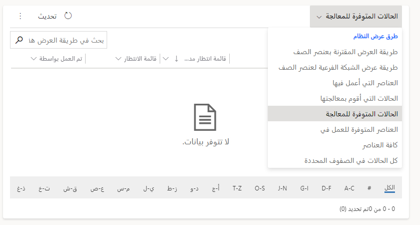

عندما يصل المندوب لأول مرة إلى Customer Service workspace، يتم تقديمه مع لوحة معلومات مندوب Customer Service. تحتوي لوحة المعلومات هذه على ثلاث شبكات فرعية: **حالاتي النشطة**، و **الحالات المتاحة للعمل عليها**، و **أنشطتي المفتوحة**. تساعد هذه الشبكات الفرعية في تسهيل الأمر على مندوبي خدمة العملاء لإدارة الحالات المعينة لهم حالياً وتحديد الحالات الأخرى التي تحتاج إلى المساعدة. بالإضافة إلى ذلك، يمكن للمندوبين إدارة أنشطتهم اليومية من مكان واحد. تتوفر خيارات إدارة مختلفة بناءً على القائمة التي تعمل بها وما حددته.

## حالاتي النشطة

تعرض الشبكة الفرعية **حالاتي النشطة** قائمة بجميع الحالات في النظام المخصصة لك حالياً. في هذه الشبكة الفرعية، يمكنك عرض التفاصيل الأساسية حول كل حالة مدرجة، بما في ذلك العميل الذي تتعلق به الحالة والحالة الحالية والأولوية والأصل لكل حالة. يمكن تحديد حالات فردية أو متعددة لتوفير خيارات إضافية لإدارة الحالة، مثل دمج حالات متعددة معاً، وتوجيه الحالات إلى قوائم الانتظار، وحذف الحالات، والمزيد.

> [!div class="mx-imgBorder"]
> 

|     التسمية    |     الوصف                                                                                                                                                                       |
|--------------|---------------------------------------------------------------------------------------------------------------------------------------------------------------------------------------|
|     1        |     حدد حالات متعددة للعمل معها. حدد علامة الاختيار العلوية لتحديد جميع الحالات، أو حدد خانات اختيار فردية بجوار كل حالة لتحديد مجموعة معينة من الحالات.    |
|     2        |     إقران الحالات التابعة بالحالات المحددة.                                                                                                                                      |
|     3        |     دمج الحالات المحددة معاً في سجل واحد.                                                                                                                         |
|     4        |     قم بتحرير سجل (سجلات) الحالات المحددة.                                                                                                                                               |
|     5        |     افتح القائمة لمزيد من الإجراءات، بما في ذلك إضفاء الطابع الشخصي، أو الحذف، أو الإضافة إلى قائمة الانتظار، أو تشغيل التقرير، أو إرسال ارتباط بالبريد الإلكتروني، أو المشاركة، أو المتابعة، أو إلغاء متابعة الحالات.                                      |

عند عدم تحديد أي حالات في طريقة العرض، يمكنك إضافة حالات جديدة من خلال تحديد الزر **حالة جديدة**. استناداً إلى مجموعة الماوس ولوحة المفاتيح التي تستخدمها، يمكن أن يؤدي تحديد الزر **حالة جديدة** إما إلى فتح السجل في ملف جديد جلسة، في علامة تبويب جديدة في الجلسة الحالية، أو في علامة التبويب الحالية.

## الحالات المتوفرة للعمل عليها

توفر الشبكة الفرعية **الحالات المتوفرة للعمل عليها** للمندوبين قائمة بالحالات المتوفرة لهم للعمل عليها. إذا تم توجيه إحدى الحالات إلى قائمة انتظار هم أعضاء فيها، فستظهر في هذه الشبكة الفرعية. يمكن للمندوبين تنفيذ إجراءات شائعة مثل تحرير السجلات أو تحديد حالة للعمل عليها أو توجيه السجل إلى قائمة انتظار أخرى.

> [!div class="mx-imgBorder"]
> 

|     التسمية    |     الوصف                                                                                                                                                                   |
|--------------|-----------------------------------------------------------------------------------------------------------------------------------------------------------------------------------|
|     1        |     تحديد عناصر قائمة انتظار متعددة.  حدد علامة الاختيار العلوية لتحديد جميع العناصر، أو حدد خانات اختيار فردية بجوار كل حالة لتحديد مجموعة معينة من العناصر.    |
|     2        |     قم بتبديل طريقة العرض التي يتم عرضها.                                                                                                                                    |
|     3        |     قم بتحرير سجل (سجلات) الحالات المحددة.                                                                                                                                           |
|     4        |     افتح القائمة لمزيد من الإجراءات.                                                                                                                                       |
|     5        |     حدد أحد إجراءات المندوب الشائعة التي يمكن تنفيذها على السجلات الموجودة في قائمة انتظار.                                                                                          |

## إجراءات عامة

هناك ثلاثة إجراءات شائعة يقوم بها المندوبون غالباً عند التعامل مع السجلات في قوائم الانتظار وهي:

- **انتقاء** - انتقاء عنصر من قائمة انتظار يعني أنك ستكون الشخص الذي سيعمل على العنصر. سيتم تحديث قيمة **تم العمل بواسطة** لتعكس الشخص الذي اختار العنصر من قائمة الانتظار.

- **إصدار** - إصدار عنصر يعني أن المندوب الذي كان يعمل عليه يريد إتاحة العنصر للآخرين للعمل عليه. سيكون حقل **تم العمل بواسطة** فارغاً.

- **إزالة** - إزالة عنصر قائمة الانتظار من قائمة الانتظار.

نظراً لأن المندوبون يختارون الحالات للعمل عليها، ويتم تحديث حقل **تم العمل بواسطة**، فلن يتم عرض هذه الحالات في طريقة عرض **الحالات المتوفرة للعمل عليها**.
باستخدام محدد طريقة العرض، يمكنك تغيير المعلومات التي يتم عرضها، مثل تغييرها لإظهار الحالات التي تعمل عليها أو لعرض كل العناصر.

> [!div class="mx-imgBorder"]
> 

## أنشطتي المفتوحة

توفر الشبكة الفرعية **أنشطتي المفتوحة** للمندوبين قائمة بأنشطتهم المفتوحة. تساعد هذه الشبكة الفرعية على تسهيل إدارة المندوبين لأنشطتهم الحالية وإنشاء أنشطة جديدة.

> [!div class="mx-imgBorder"]
> 

|     التسمية    |     الوصف                                                                                                                                                                                      |
|--------------|------------------------------------------------------------------------------------------------------------------------------------------------------------------------------------------------------|
|     1        |     تحديد أنشطة متعددة للعمل معها. حدد علامة الاختيار العلوية لتحديد جميع الأنشطة، أو حدد خانات اختيار فردية بجوار كل حالة لتحديد مجموعة معينة من الأنشطة.    |
|     2        |     قم بتحرير سجل (سجلات) الحالات المحددة.                                                                                                                                                       |
|     3        |     احذف سجل (سجلات) الحالات المحددة.                                                                                                                                                                    |
|     4        |     افتح القائمة لمزيد من الإجراءات.                                                                                                                                                          |
|     5        |     حدد أحد إجراءات المندوب الشائعة التي يمكن تنفيذها في سجلات النشاط، مثل وضع علامة مكتمل أو إلغاء نشاط.                                                          |

عند عدم تحديد أي سجلات، يمكنك إنشاء أنشطة مباشرة من الشبكة الفرعية وإقرانها بسجلات الحالة الفردية حسب الحاجة. يمكنك إنشاء أي نوع سجل نشاط متاح في التطبيق، مثل المهام ورسائل البريد الإلكتروني والمواعيد والمكالمات الهاتفية وأنشطة الخدمة.
