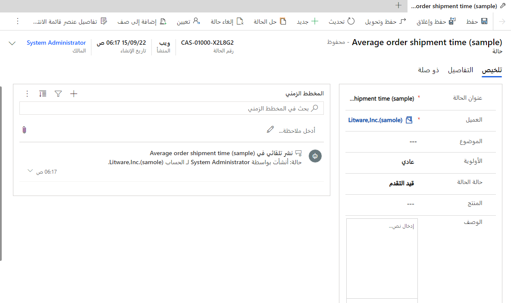

بعد أن ينشئ المندوب سجل حالة جديداً أو يفتح سجلاً موجوداً، سيتم عرض نموذج سجل الحالة. يوفر لك هذا النموذج معلومات مهمة تتعلق بالحالة، مثل عنوان الحالة والعميل وتفاصيل اتفاقية مستوى الخدمة ذات الصلة (SLA) والبيانات الأخرى ذات الصلة.

في Customer Service workspace، يحتوي نموذج الحالة على علامتي تبويب:

-   **الملخص** - توفير تفاصيل الحالة الرئيسية، مثل عنوان الحالة والأولوية وحالة الحالة.

-   **التفاصيل** - توفير المزيد من المعلومات المتعلقة بالتفاصيل حول الحالة، مثل معلومات اتفاقية مستوى الخدمة (SLA) ذات الصلة، والحالات التابعة، والمقالات المعرفية المرتبطة، والمزيد.

> [!div class="mx-imgBorder"]
> 

بالإضافة إلى علامات التبويب السابقة، سيتضمن نموذج الحالة أيضاً الأقسام التالية:

-   **الجدول الزمني** - عرض أنشطة الحالة ذات الصلة. اعتماداً على نموذج خدمة المؤسسة، تقوم العديد من المؤسسات بتتبع إجمالي الوقت الذي يقضيه المندوبون في الأنشطة المرتبطة بحالة ما لتحديد مقدار الوقت الذي يتم فيه إصدار فاتورة للعميل.

    على سبيل المثال، إذا أجرى أحد المندوبين ثلاث مكالمات هاتفية للعميل، مدة كل مكالمة هاتفية 15 دقيقة، فقد يقوم باحتساب إجمالي 45 دقيقة للعميل.

-   **ذات الصلة** - عرض المعلومات التي قد تكون مرتبطة بالحالة.

من شريط الأوامر أعلى السجل، سيكون لديك القدرة على تنفيذ الإجراءات الشائعة ذات الصلة بالحالة. تشمل الإجراءات الأكثر شيوعاً التي يمكنك تنفيذها ما يلي:

-   **حفظ وإغلاق** - حفظ سجل الحالة وإغلاق نموذج الحالة.

-   **حفظ وتحويل** - حفظ سجل الحالة وإغلاقه وتطبيق قواعد التحويل المكونة لتحويل الحالات إلى قوائم الانتظار والمستخدمين.

-   **جديد** - إنشاء سجل حالة جديد.

-   **حفظ** - حفظ سجل الحالة وتركه مفتوحاً.

-   **إنشاء حالة تابعة** - إنشاء حالة فرعية مقترنة بهذا السجل.

-   **حل حالة** - حل الحالة.

-   **إلغاء حالة** - إغلاق الحالة عند إلغائها.

-   **إضافة إلى قائمة الانتظار** - إضافة الحالة إلى قائمة انتظار محددة.

-   **تعيين** - تعيين السجل إلى مستخدم آخر.
