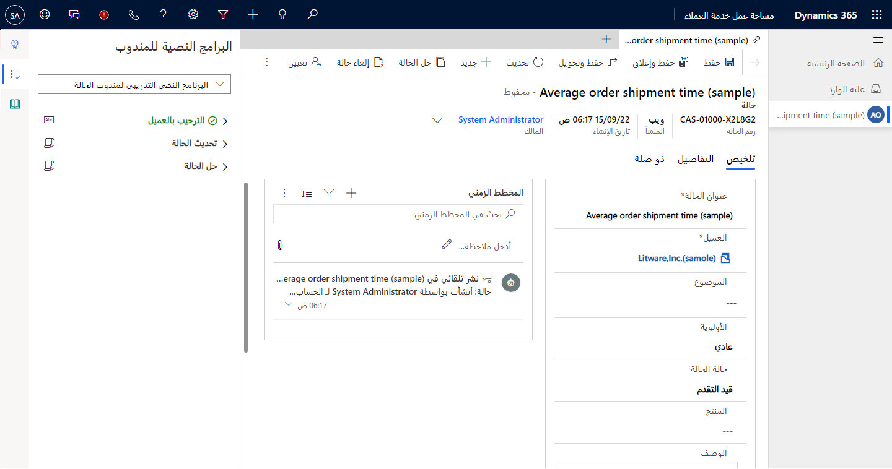
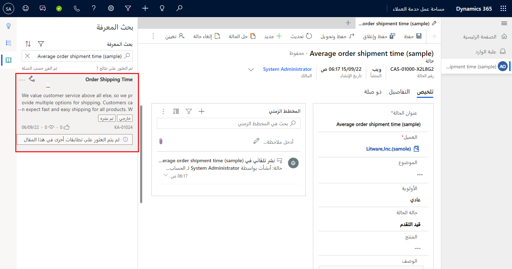

غالباً ما يُتوقع من المندوبين التعامل مع كميات كبيرة من مشكلات العملاء وحلها بشكل أسرع والحفاظ على مستوى عالٍ من رضا العملاء. يمكن أن يصبح هذا الجانب صعباً إذا كان المندوب غير متأكد من الإجراء أو غير قادر على الوصول بسهولة إلى البيانات التي يحتاجها.

تساعد أدوات الإنتاجية في Dynamics 365 المندوبين الذين يعملون في مساحة عمل خدمة العملاء أو القناة متعددة الاتجاهات لخدمة العملاء على مواجهة هذه التحديات. تساعد هذه الأدوات المستخدمين على أداء العمليات اليومية بشكل أسرع وأكثر كفاءة وبطريقة متوافقة مع العمليات. بصفتك مندوباً، يمكنك الوصول إلى أدوات الإنتاجية في جزء الإنتاجية.
عند التمكين والتكوين، يزود جزء الإنتاجية المندوبين بالإرشادات والاقتراحات والأدوات لمساعدتهم في حل المشكلات بسرعة أكبر.

> [!IMPORTANT]
> يتم تمكين جزء الإنتاجية والمساعدة الذكية والبحث عن المعرفة والبرامج النصية للمندوب في مساحة عمل خدمة العملاء افتراضياً ولا يمكن إيقاف تشغيلها. يمكن إنشاء ملفات تعريف مخصصة في مدير ملف تعريف التطبيق للحد من ميزات الإنتاجية الممكنة. لمزيد من المعلومات، راجع [إدارة ملف تعريف التطبيق‬](/dynamics365/app-profile-manager/overview/?azure-portal=true). 

## التعامل مع جزء الإنتاجية

عند إنشاء حالة جديدة أو فتح حالة موجودة، سيتم عرض جزء الإنتاجية على الجانب الأيمن من الشاشة. بشكل افتراضي، يتم توسيعها، ولكن يمكن للمستخدمين طيها وتوسيعها حسب الحاجة.

> [!div class="mx-imgBorder"]
> 

في Customer Service workspace، يتضمن جزء الإنتاجية العناصر التالية:

-   [**البرامج النصية للمندوبين**](/dynamics365/omnichannel/administrator/productivity-tools?azure-portal=true#agent-scripts) - تقديم إرشادات إلى المندوبين فيما يتعلق بمشكلات أو سيناريوهات محددة. تساعد البرامج النصية المؤسسات على أن تكون موحدة ودقيقة وفعالة، بالإضافة إلى كونها أسرع وأكثر كفاءة من حيث التعامل مع العملاء.

-   [**المساعدة الذكية**](/dynamics365/omnichannel/administrator/productivity-tools?azure-portal=true#smart-assist) - تقديم توصيات في الوقت الفعلي تستند إلى الذكاء الاصطناعي إلى المندوبين، مثل اقتراحات حالة مماثلة، ومساعدتهم على اتخاذ الإجراءات أثناء التفاعل مع العملاء. يتم تقديم المساعدة من خلال روبوت مخصص يتم توصيله ببيئة مؤسستك.

-   **بحث المعارف** - السماح للمندوبين بالبحث في قاعدة المعارف عن المقالات ذات الصلة التي يمكن أن تساعد في حل مشكلات العملاء.

> [!IMPORTANT]
> على الرغم من توفر البرامج النصية للمندوب في جزء الإنتاجية افتراضياً، إلا أنه لا يتم إنشاء برامج نصية للمندوب ونشرها في البداية.
تحتاج مؤسستك إلى إنشاء البرامج النصية التي تريد استخدامها وربطها بقوالب الجلسة لكي تكون البرامج النصية للمندوب مرئية في جزء الإنتاجية. لمزيد من المعلومات، راجع [إنشاء البرامج النصية للمندوبين](/dynamics365/app-profile-manager/agent-scripts/?azure-portal=true).

أثناء تفاعلك مع العميل والعمل على الحالة، يمكنك التبديل بين العناصر المختلفة في جزء الإنتاجية. على سبيل المثال، ضع في اعتبارك سيناريو تعمل فيه من خلال برنامج نصي مندوب يحتوي على الخطوات التالية:

1. تحديد العميل.

2. التقاط التفاصيل.

3. بحث قاعدة المعارف.

4. حل الحالة.

عندما تصل إلى الخطوة الثالثة، ستحتاج إلى التبديل إلى ميزة **بحث المعارف** لتحديد ما إذا كان هناك مقال موجود سيساعد عملية الحل.

> [!div class="mx-imgBorder"]
> 

بعد تحديد المقال، يمكنك ربطه بسجل الحالة والعودة إلى البرنامج النصي للمندوب في جزء الإنتاجية.
