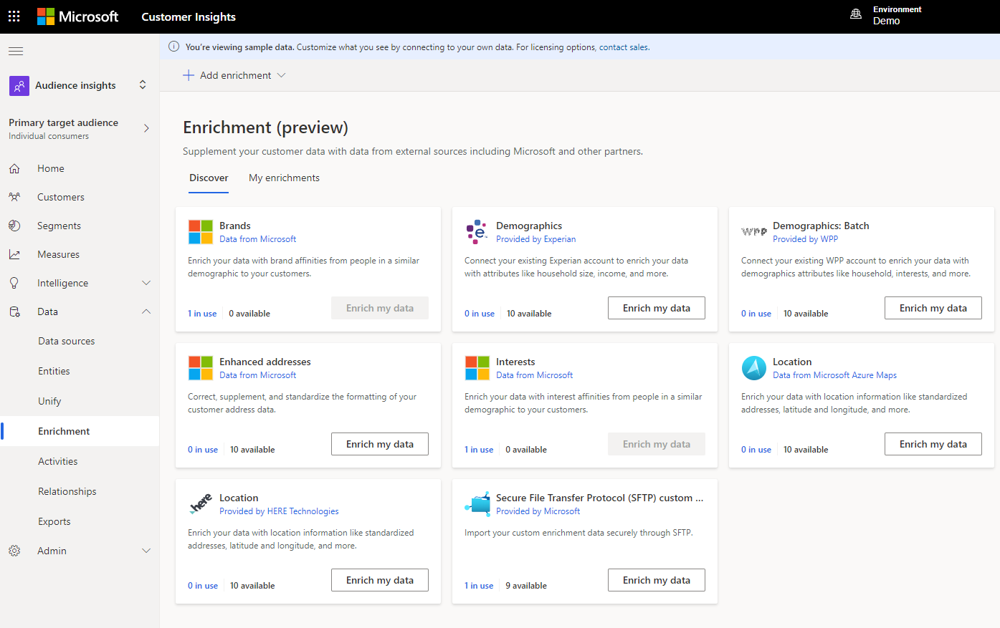

يمكن للمؤسسات الاستفادة من إثراء بيانات عملائها بطرق متعددة. يمكن للمؤسسات تحديد تقارب العملاء استناداً إلى الأشخاص الذين يشبهونهم ديموغرافياً (مثل العمر والجنس والموقع). على سبيل المثال، في البلدان أو المناطق التي تستقبل الثلوج، من المرجح أن تكون العلامات التجارية والاهتمامات المرتبطة بصيد الجليد والتزلج على الجليد والتزلج أكثر شيوعاً. ومع ذلك، قد يكون لدى العملاء الذين يعيشون بالقرب من المسطحات المائية الكبيرة تقاربات بشأن العلامات التجارية مع مصنعين محددين أو زوارق مائية شخصية أو رياضات مائية. من خلال إتاحة هذه المعلومات، يمكن للمؤسسات إنشاء عروض تسويقية أكثر فعالية ودفع أنشطة المبيعات استناداً إلى الاهتمامات.

يمثل المثال السابق نوعاً واحداً فقط من الإثراء الممكن في رؤى الجمهور. تشمل نظرة عامة على جميع عمليات الإثراء ما يلي:

- التشابه (تقارب على مستوى العلامة التجارية والاهتمام)

- فردي أو شركة إلى عميل (Experian وHERE)

- الشركة أو متاجرة عمل-عمل (Leadspace)

[توفر رؤى الجمهور خيارات إثراء متعددة](/dynamics365/customer-insights/audience-insights/enrichment-hub) والتي تستخدم Microsoft والخدمات التي يقدمها الشركاء:

- **العلامات التجارية والاهتمامات التي تقدمها Microsoft Graph** - تثري بيانات ملف تعريف العميل بأوجه التقارب العلامات التجارية والاهتمامات من الأشخاص في مجموعة سكانية مماثلة لعملائك.

- **عناوين محسنة** - يثري بيانات ملف تعريف العميل من خلال تصحيح تنسيق بيانات عنوان العميل وتكميله وتوحيده.

- **الخصائص الديموغرافية المقدمة من Experian** - يثري البيانات الخاصة بك عن طريق تضمين المعلومات الديموغرافية من Experian مثل حجم الأسرة والدخل، وأكثر من ذلك.

- **الموقع الذي توفره HERE Technologies** - يثري بيانات العملاء لتضمين معلومات الموقع مثل العناوين وخط العرض وخط الطول والمزيد.

- **بيانات الشركة المقدمة من Leadspace** - تثري سجلات الشركة بالسمات، بما في ذلك حجم الشركة وموقعها ومجالها.

> [!div class="mx-imgBorder"]
> 

يمكنك تمكين خيار إثراء البيانات وتكوينه عن طريق تحديد **إثراء** ضمن منطقة **البيانات** للتطبيق. في علامة التبويب **اكتشاف** يمكنك تكوين عمليات الإثراء المذكورة سابقاً.

> [!IMPORTANT]
> نظراً لأن الخصائص الديموغرافية والموقع وإثراء بيانات الشركة تعتمد على الخدمات الخارجية، فأنت بحاجة إلى التأكد من أن لديك ترخيصاً صالحاً للخدمة التي تريد استخدامها بالإضافة إلى ترخيص Customer Insights.

بعد تكوين عملية إثراء، يمكنك عرضها وإدارتها من علامة التبويب **عمليات الإثراء الخاصة بي** ، حيث يمكنك إكمال الإجراءات التالية:

- **عرض** تفاصيل إثراء مع عدد من ملفات تعريف العملاء الثرية.

- **تحرير** تكوين الإثراء.

- **تشغيل** الإثراء لتحديث ملفات تعريف العملاء بأحدث البيانات.

- **إلغاء تنشيط** إثراء موجود لمنعه من التحديث تلقائياً مع كل تحديث مجدول. ستظل البيانات من آخر تحديث ناجح متوفرة.

- **تنشيط** إثراء غير نشط لإعادة تشغيل التحديث التلقائي مع كل تحديث مجدول.

- **حذف** إثراء.

يمكنك تشغيل عمليات إثراء متعددة أو إلغاء تنشيطها في وقت واحد عن طريق تحديدها في القائمة. لا تتوفر خيارات العرض والتحرير كإجراءات المجمعة، ولا تعمل إلا لعملية إثراء واحدة في كل مرة.

الآن بعد أن تعلمت كيفية الوصول إلى عمليات الإثراء والعمل معها، فإن مهمتك التالية هي فحص العملية لتكوين بعض الخيارات المتوفرة المختلفة.
