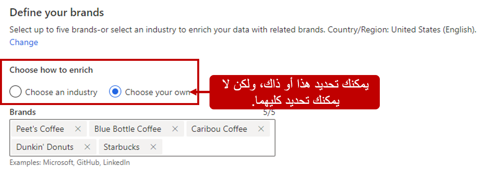
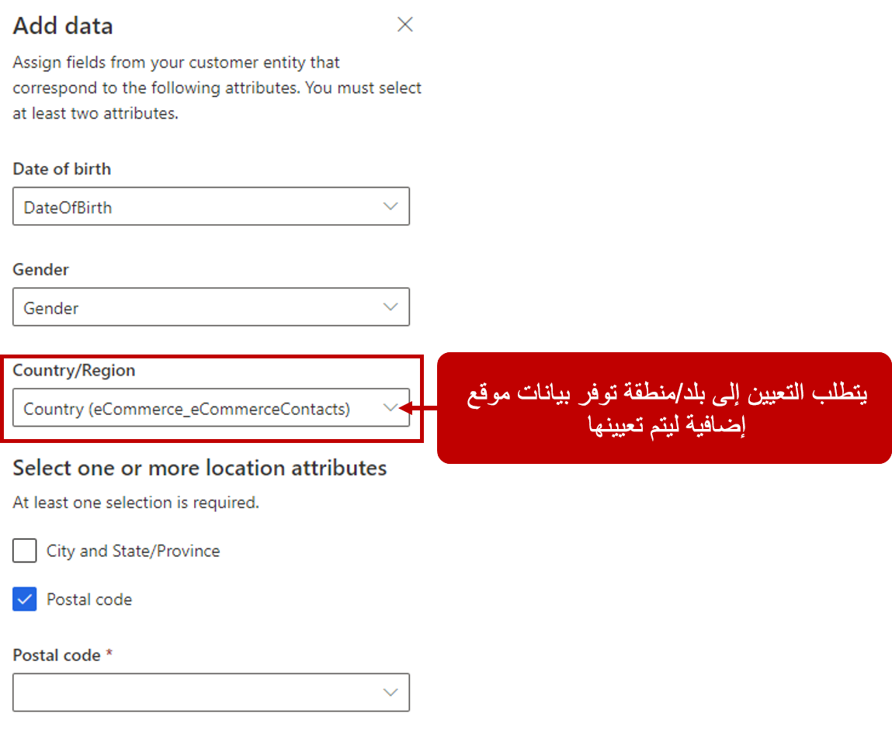
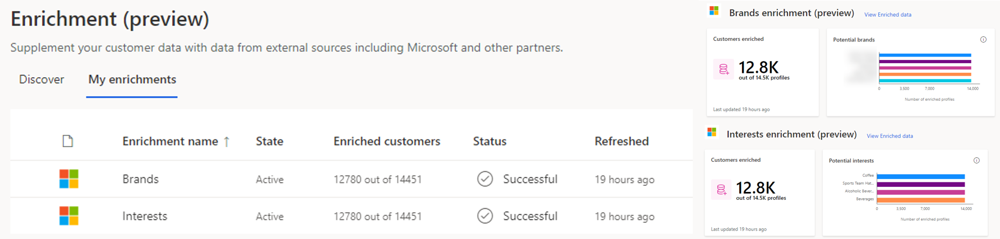
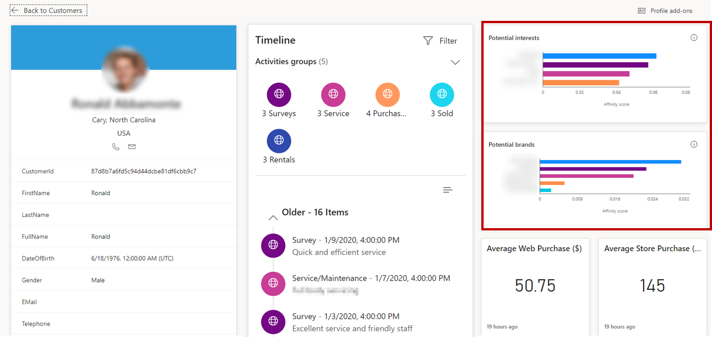

إن معرفة اهتمامات عملائك وتقاربهم مع العلامات التجارية من شأنه أن يساعد المؤسسات على تطوير استراتيجيات الرعاية والتسويق بالاستناد إلى هوية عملائك. تساعدك إمكانات إثراء العلامة التجارية والاهتمامات في Customer Insights على إثراء بياناتك من خلال عرض علامات تجارية واهتمامات مختلفة لعملائك بالاستناد إلى خصائصهم السكانية.

يستخدم إثراء العلامات التجارية والاهتمامات في Customer Insights بيانات البحث عبر الإنترنت من Microsoft Graph لإثراء بيانات العملاء بواسطة التقارب مع العلامات التجارية والاهتمامات.
يتم تحديد هذه التقاربات استناداً إلى بيانات من أشخاص ذوي الخصائص السكانية المماثلة استناداً إلى عمرهم وجنسهم وموقعهم. يحدد حجم البحث عبر الإنترنت لعلامة تجارية أو اهتمام مدى التقارب الذي يرتبط به مقطع ديموغرافي بعلامة تجارية أو اهتمام مقارنة بالمقاطع الأخرى. يمكنك معرفة المزيد حول كيفية حساب الدرجات في وثائق [نقاط التقارب والدقة](/dynamics365/customer-insights/audience-insights/enrichment-microsoft-graph#affinity-score-and-confidence).

عند الوصول إلى علامة التبويب **اكتشاف**، لاحظ أن خيارات إثراء العلامات التجارية والاهتمامات مدرجة بشكل منفصل. على الرغم من أنها تم تكوينها بشكل منفصل، إلا أن عملية تكوينها هي نفسها. استناداً إلى كيفية عمل مؤسستك وتفاصيل العلامة التجارية أو الاهتمامات التي تبحث عنها، يمكنك تحديد أحد الخيارين المتاحين لك:

-   **اختيار صناعة** - يحدد النظام أفضل العلامات التجارية أو الاهتمامات ذات الصلة بصناعتك ثم يثري بيانات العملاء الخاصة بك معهم.

-   **اختيار العناصر الخاصة بك** - حدد ما يصل إلى خمسة عناصر من قائمة العلامات التجارية أو الاهتمامات الأكثر ملاءمة لمؤسستك.

    > [!div class="mx-imgBorder"] 
    > 

> [!NOTE] 
> تستند العلامات التجارية المتاحة إلى البلد و/أو المنطقة المحددة في التطبيق. حالياً، يمكنك تعيين **حقل البلد/المنطقة** إلى **الولايات المتحدة** أو **المملكة المتحدة** أو **ألمانيا** أو **فرنسا** أو **كندا (الإنجليزية)** أو **أستراليا**.

بعد تحديد كيفية إثراء البيانات استناداً إلى الصناعة أو العلامات التجارية، ستحتاج إلى تعيين الحقول التي تحتوي على معلومات ديموغرافية في ملف تعريف العميل إلى الخصائص السكانية التي يستخدمها Microsoft Graph.

هناك ثلاثة بنود رئيسية مطلوبة لرسم خرائط البيانات الديموغرافية:

-   **تاريخ الميلاد** - حقل التاريخ الذي يحتوي على تاريخ الميلاد.

-   **النوع** - يحتوي الحقل على جنس العميل (ذكر، أنثى، مجهول).

> [!IMPORTANT] 
> يجب تعيين سمة واحدة على الأقل من سمتي الخصائص السكانية أعلاه.

-   **الموقع** - الحقل الذي يحتوي على بلد العميل أو منطقته.

يتضمن الموقع أربعة حقول أخرى يمكن تعيينها للمساعدة على الحصول على المعلومات الديموغرافية.

-   **البلد/المنطقة** - الحقل الذي يحتوي على البلد. *(مطلوب)*

-   **الرمز البريدي** - الحقل الذي يحتوي على الرمز البريدي.

-   **المدينة** - الحقل الذي يحتوي على اسم المدينة باللغة الإنجليزية.

-   **الولاية/المقاطعة** - الحقل الذي يوفر اختصار الحرفين للولايات المتحدة وكندا.

> [!IMPORTANT] 
> يجب تعيين البلد/المنطقة. بالإضافة إلى ذلك، يجب تعيين رمز مدينة (وولاية/إقليم) أو رمز بريدي واحد على الأقل.

> [!div class="mx-imgBorder"] 
> 

بعد تشغيل عملية الإثراء، انتقل إلى **عمليات الإثراء الخاصة بي** لمراجعة العدد الإجمالي للعملاء الذين تم إثراؤهم بالإضافة إلى تصنيف للعلامات التجارية أو الاهتمامات في ملفات تعريف العملاء الذين تم إثراؤهم.

> [!div class="mx-imgBorder"]
> 

> [!VIDEO https://www.microsoft.com/videoplayer/embed/RWG13l]

## عرض بيانات الإثراء على بطاقة العميل

في كثير من الأحيان، يمكن أن تكون العناوين في بيانات المؤسسات غير منظمة أو غير كاملة أو غير صحيحة. استخدم نماذج Microsoft لتطبيع عناوينك وإثراءها بتنسيق Common Data Model للحصول على دقة ورؤى أفضل.
يمر النموذج بعملية من خطوتين لتحسين عنوان. أولاً، فإنه يوزع العنوان لتعريف مكوناته ويضعها في تنسيق منظم. ثم نستخدم الذكاء الاصطناعي لتصحيح وإكمال وتوحيد القيم الموجودة في العنوان.

على سبيل المثال: إدخال 4567 w main stret californa missouri 54321 us

الإخراج

-   الشارع 1: 4567 W Main St

-   المدينة: California

-   الولاية/الإقليم: MO

-   الرمز البريدي: 54321

-   البلد/المنطقة: United States of America

-   العنوان: 4567‎ W Main St, California, MO, 54321, United States of America

نحن ندعم حالياً إثراء العناوين في هذه البلدان أو المناطق:

-   أستراليا

-   كندا

-   المملكة المتحدة

-   الولايات المتحدة

يجب أن تحتوي العناوين على قيمة بلد/منطقة. لا نعالج عناوين البلدان أو المناطق غير المدعومة والعناوين التي لم يتم توفيرها في أي بلد أو منطقة.

تعمل العناوين المحسنة فقط مع القيم الموجودة بالفعل في بيانات العنوان التي تم تناولها. النموذج لا:

-   يتحقق مما إذا كان العنوان عنوان صالح.

-   يتحقق مما إذا كانت أي من القيم، مثل الرموز البريدية أو أسماء الشوارع، صالحة.

-   يغير القيم التي لا يتعرف عليها.

يستخدم النموذج تقنيات التعلم الآلي لتعزيز العناوين. في حين أننا نقوم بتقديم طلب للحصول على عتبة دقة عالية عندما يغير النموذج قيمة الإدخال، كما هو الحال مع أي نموذج قائم على التعلم الآلي، فإن الدقة بنسبة 100 في المائة غير مضمونة.
عند تحديد استخدام عناوين محسنة، ستحتاج إلى تحديد الكيان الذي يحتوي على العناوين التي تريد إثراء. إذا قمت بتحديد كيان العميل، فسوف تثري العنوان في جميع ملفات تعريف العملاء أو يمكنك تحديد كيان مقاطع لإثراء العنوان فقط في ملفات تعريف العملاء المضمنة في هذا المقطع.

ستحتاج أيضاً إلى تحديد كيفية تنسيق العناوين في مجموعة البيانات.
لديك خياران للاختيار من بينها.

-   عنوان أحادي السمة: يستخدم في سيناريوهات حيث تستخدم العناوين في بياناتك حقلاً واحداً.

-   عنوان متعدد السمات: يستخدم في سيناريوهات حيث تستخدم العناوين في بياناتك أكثر من حقل بيانات واحد.

## عرض بيانات الإثراء على بطاقة العميل

بعد تكوين علامتك التجارية واهتماماتك وتشغيلها لأول مرة لجمع البيانات، ستصبح تقاربات يمكن عرضها أيضاً على بطاقات العملاء الفردية. انتقل إلى **العملاء**، ثم حدد ملف تعريف العميل. تحتوي بطاقة العميل على مخططات للعلامات التجارية أو الاهتمامات التي يوجد تقارب معها لدى الأشخاص في الملف الشخصي الديموغرافي لذلك العميل.

> [!div class="mx-imgBorder"] 
> 

لمزيد من المعلومات، راجع [تقارب العلامات التجارية والاهتمامات](/dynamics365/customer-insights/audience-insights/enrichment-microsoft-graph).
