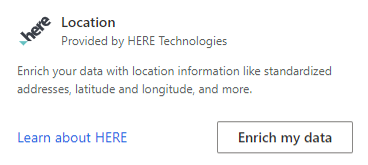
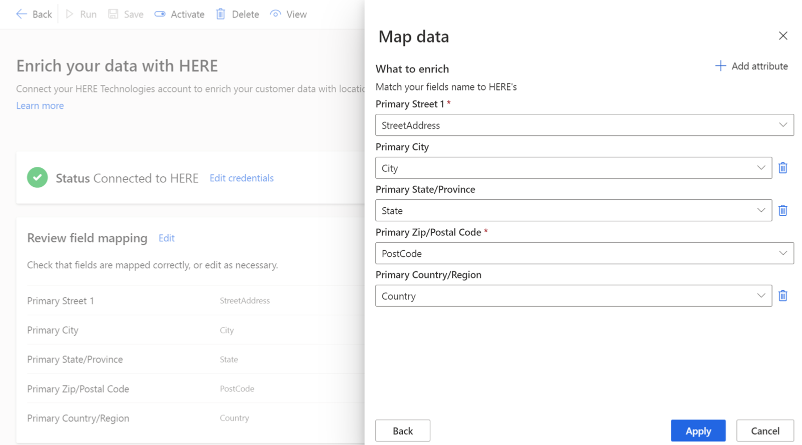
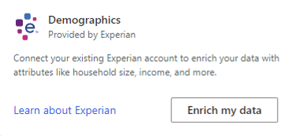
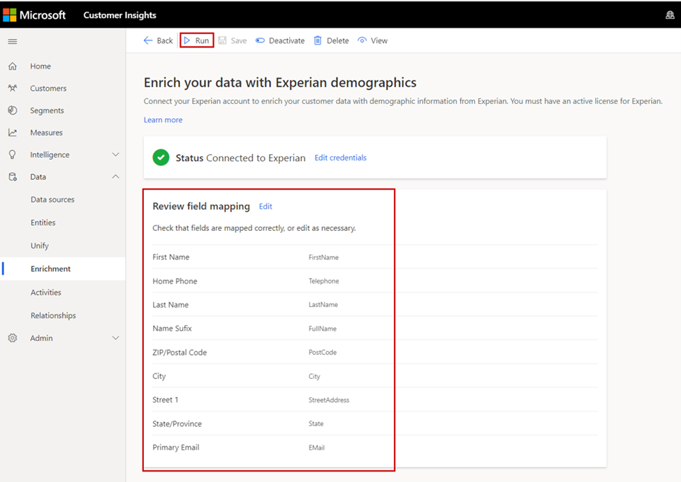
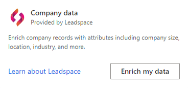
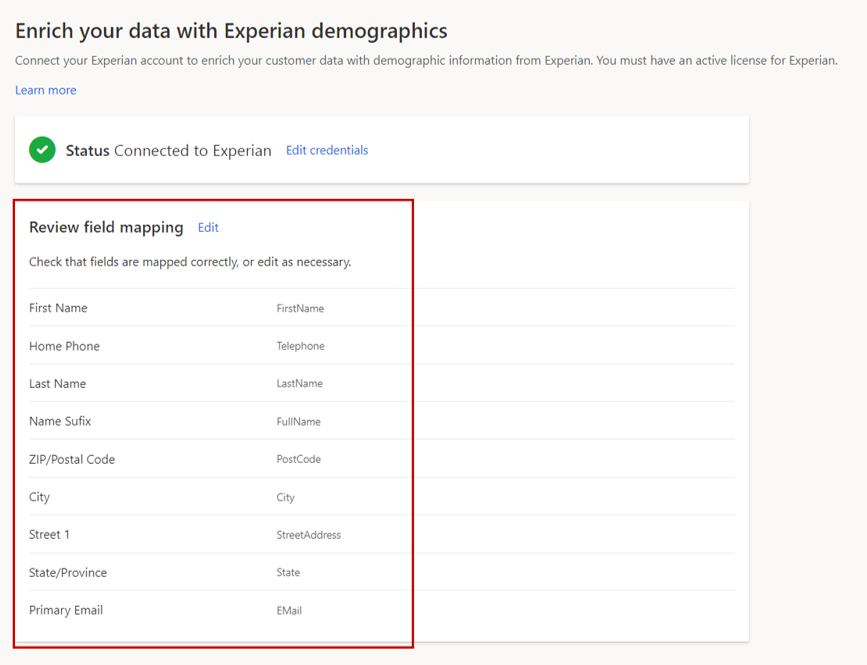

نستخدم Microsoft Graph لتقديم العلامة التجارية وزيادة الاهتمام بها، ويمكن إضافتها إلى أي مثيل من مثيلات رؤى الجمهور. قد تجد مؤسستك أن زيادة الاهتمام بها ضروري لفهم العملاء واستهدافهم على نحوٍ أفضل. مثال، قد تريد تحديد الأسر ذات الدخل المرتفع أو العملاء الموجودين في أحياء أو مناطق معينة.

توفر لك رؤى الجمهور القدرة على استخدام عمليات التكامل مع خدمات الشركاء المختلفة لتوفير خيارات تحسين إضافية تستند إلى تفاصيل ديموغرافية وتفاصيل خاصة بالموقع والشركة.

- **الخصائص السكانية** - تقدمها شركة Experian

- **الموقع** - تقدمه شركة HERE Technologies

- **بيانات الشركة** - تقدمها شركة Leadspace

> [!IMPORTANT]
> لاستخدام خدمات الشركاء، يجب امتلاك اشتراكات وترخيص.

## الموقع: HERE Technologies

توفر HERE Technologies بيانات وخدمات عن الموقع. مع خدمات إثراء البيانات التي تقدمها HERE Technologies، يُمكنك بناء فهم أكثر دقة لموقع عملائك مع معرفة طبيعة العنوان واستخراج خطوط العرض والطول وأكثر من ذلك.

> [!div class="mx-imgBorder"]
> 

لاستخدام عمليات إثراء HERE Technologies، ستحتاج إلى اشتراك فعّال في HERE Technologies ومفتاح واجهة برمجة تطبيقات (API)‏ HERE Technologies وأذونات المسؤول في بيئة رؤى الجمهور.

عند تكوين الحل، ستحتاج إلى تحديد ما إذا كنت تريد تعيين الحقول إلى العنوان الأساسي أو الثانوي. يُمكنك تحديد تعيين حقل لكلا العنوانين (مثل، عنوان المنزل وعنوان العمل) وإثراء ملفات التعريف لكلا العنوانين على نحوٍ منفصل. لكل عنوان حددته الأساسي أو الثانوي، يجب ملء حقلي  **الشارع 1** و **الرمز البريدي** . للحصول على أعلى دقة في التطابق، حدد المزيد من الحقول.

> [!div class="mx-imgBorder"]
> 

لمزيد من المعلومات، راجع [إثراء البيانات مع HERE Technologies](/dynamics365/customer-insights/audience-insights/enrichment-here).

## الخصائص السكانية: Experian

Experian هي شركة عالمية رائدة في مجال إعداد التقارير الائتمانية للمستهلكين والأعمال وخدمات التسويق. مع خدمات إثراء البيانات من Experian، يُمكنك بناء فهم أعمق لعملائك من خلال إثراء ملفات تعريف العملاء مع بيانات الخصائص السكانية مثل حجم المنزل، ودخل الأسرة وغير ذلك.

لتكوين Experian، يجب أن يكون لديك اشتراك Experian نشط (Experian تحتاج إلى الاتصال به مباشرة من أجل الإعداد) وأذونات المسؤول في Audience. إضافة إلى ذلك، ستحتاج إلى معرف المستخدم، ومعرف الطرف ورقم طراز حساب النقل الآمن (ST) الذي مكنته SSH وأنشأته Experian لك.

> [!div class="mx-imgBorder"]
> 

لضمان الحصول على إثراء جيد للبيانات من خدمة Experian، ستحتاج إلى تحديد معرفات المفاتيح مثل الاسم والعنوان أو عنوان البريد الإلكتروني أو رقم الهاتف لإرسالها إلى Experian من أجل دقة الهوية. وقد تؤدي سمات معرف المفتاح التي ترسلها إلى ارتفاع معدل المطابقة.

> [!div class="mx-imgBorder"]
> 

لمزيد من المعلومات، راجع [إثراء البيانات مع Experian](/dynamics365/customer-insights/audience-insights/enrichment-experian).

## بيانات الشركة: Leadspace

Leadspace هي شركة علوم بيانات توفر نظام أساسي لبيانات العملاء في شكل B2B. إذ يمكّن العملاء، الذين لديهم ملفات تعريف موحدة للشركات، من إثراء بياناتهم. تشمل عمليات إثراء البيانات السمات الإضافية مثل حجم الشركة والموقع والصناعة وغيره.

لتكوين Leadspace، ستحتاج إلى أذونات المسؤول في بيئة رؤى الجمهور، وستحتاج إلى الحصول على ترخيص Leadspace نشط *والمفتاح الدائم* (يُشار إليه باسم *رمز Leadspace المميز*). اتصل بـ [Leadspace](https://www.leadspace.com/products/leadspace-on-demand/) مباشرة للحصول على تفاصيل عن منتجاتها.

> [!IMPORTANT]
> لاستخدام حل Leadspace، تحتاج مؤسستك إلى نشر رؤى الجمهور وتكوينها لاستخدام ملفات تعريف العملاء الموحدة للشركات. ليس من الممكن تكوين رؤى الجمهور للشركات والأفراد في البيئة ذاتها.

> [!div class="mx-imgBorder"]
> 

في أثناء التكوين، ستحتاج إلى توفير رمز Leadspace نشط (مفتاح دائم) وتحديد الحقول التي يجب استخدامها من ملفات التعريف الموحدة للبحث عن بيانات الشركة المطابقة من Leadspace. حقل **اسم الشركة** مطلوب. لتوفير أعلى دقة في التطابق، يُمكنك إضافة المزيد من الحقول.

> [!div class="mx-imgBorder"]
> 

لمزيد من المعلومات، راجع [إثراء البيانات مع Leadspace](/dynamics365/customer-insights/audience-insights/enrichment-leadspace).

## عرض نتائج إثراء البيانات

بغض النظر عن خدمة إثراء البيانات التي قمت بتكوينها، يجب تشغيل عملية الإثراء قبل ظهور البيانات محل الإثراء. يُمكن تشغيل العمليات يدوياً من شريط الأوامر أو على أنها جزء من تحديث مجدول. قد يختلف وقت المعالجة استناداً إلى حجم بيانات العميل وأوقات استجابة واجهة برمجة تطبيقات (API)‏ من HERE Technologies. بعد اكتمال عملية إثراء البيانات، ستتمكن من العمل مع البيانات ضمن **عمليات إثراء البيانات**.

والآن بعد أن تعرفت على خيارات إثراء البيانات المتاحة، يُمكنك استكشاف كيفية الاستفادة من رؤى الجمهور في معرفة بياناتك.
