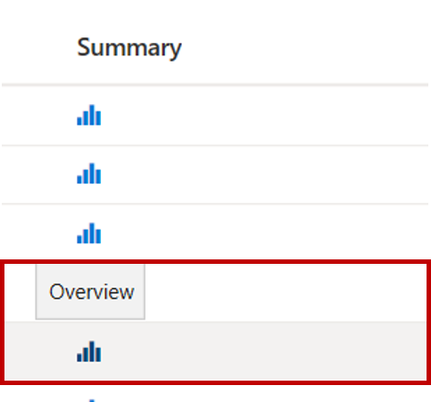
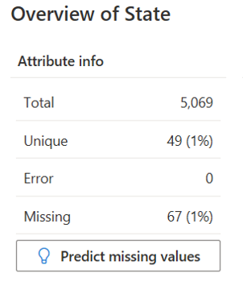
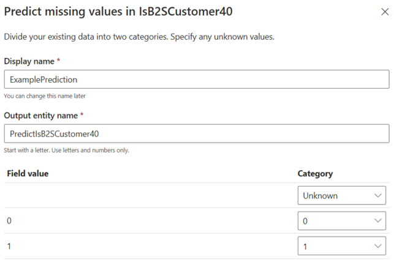
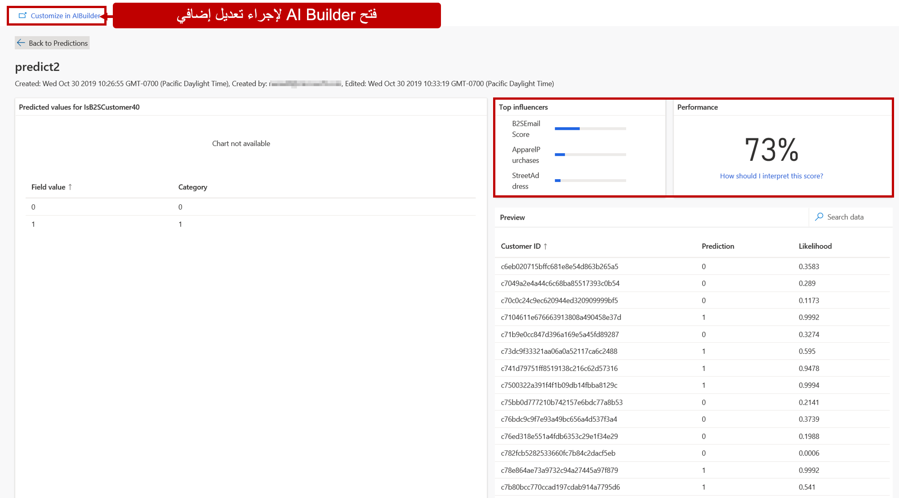

توفر رؤى الجمهور خيارات متعددة لإجراء تنبؤات مرتبطة ببيانات العملاء. تتراوح خيارات التنبؤ من إنشاء تنبؤات بسيطة بقيمة نعم/لا أو صواب/خطأ باستخدام AI Builder، إلى استخدام نماذج مُنشأة مسبقاً مثل خسارة العميل، إلى السيناريوهات المعقدة باستخدام نماذج التعلّم الآلي المخصصة المضمنة في Microsoft Azure. يمكن استخدام خيارات الذكاء التي تقوم بإنشائها في أجزاء أخرى من التطبيق. على سبيل المثال، يمكنك استيراد نموذج مخصص للتنبؤ باحتمالية قيام عميل ما بإلغاء اشتراكه. بعد إحضار الوضع إلى رؤى الجمهور، يمكنك إنشاء مقطع عميل بناءً على هذا النموذج. بعد تصدير المقطع إلى تطبيق ما مثل Dynamics 365 Marketing، يمكنك استخدامه في رحلات العميل التي تهدف إلى تقليل هذا العدد والاحتفاظ بالعميل.

يمكن الوصول إلى التنبؤات والنماذج المخصصة التي تم تحديدها لمؤسستك من منطقة **الذكاء** بالتطبيق. ستعرض منطقة **الذكاء** خيارين:

- **التنبؤات** - تعرض أي تنبؤات تم تكوينها وتوفر القدرة على إنشاء تنبؤات جديدة.

- **النماذج المخصصة** - تعرض أي نماذج مخصصة تم تكوينها وتوفر القدرة على استيراد نماذج جديدة.

## التنبؤات

تتيح لك ميزة التنبؤات في رؤى الجمهور إنشاء قيم متوقعة يمكن أن تعزز فهمك للعميل. يمكنك إنشاء تنبؤات بسيطة بنمط تشغيل/إيقاف أو صواب/خطأ في التطبيق باستخدام AI Builder. AI Builder هو حل متكامل من Microsoft Power Platform يوفر قوة الذكاء الاصطناعي من خلال تجربة التأشير والنقر. فهو يتيح لك إنشاء نماذج مخصصة مصممة خصيصاً لاحتياجاتك أو استخدام نموذج تم إنشاؤه مسبقاً وجاهز للاستخدام في العديد من سيناريوهات الأعمال الشائعة. يمكنك معرفة المزيد حول AI Builder في [ما هو AI Builder؟](/ai-builder/overview).

تستخدم رؤى الجمهور نموذج تنبؤ AI Builder. يُجري النموذج تنبؤات بنمط نعم/لا أو صواب/خطأ بناءً على البيانات المخزنة في Microsoft Dataverse. لاستخدام ميزة التنبؤ، ستحتاج مؤسستك إلى أن يكون لديها مثيل Dataverse وبيئة رؤى الجمهور على حد سواء في نفس المستأجر. بالإضافة إلى ذلك، يتعين أن تكون رؤى الجمهور بمثابة مثيل Dataverse الخاص بك باستخدام موصل Dataverse. لا يمكنك استخدام خيارات التنبؤ إذا قمت باستيراد مصدر بيانات Dataverse باستخدام Microsoft Power Query. بعد إنشاء نموذج تنبؤ، يمكنك تحرير النموذج في AI Builder لضبط النتائج، إذا لزم الأمر.

> [!IMPORTANT]
> ستحتاج إلى ترخيص AI Builder لتعديل نموذج التنبؤ الذي تم إنشاؤه في رؤى الجمهور.

## تحديد التنبؤات

تتيح لك رؤى الجمهور إنشاء تنبؤات بطريقتين مختلفتين:

- من كيان العميل

- من إنشاء سريع للشرائح

بغض النظر عن الطريقة التي تستخدمها لإنشاء التنبؤ، فإنها تستند دائماً إلى الحقل الذي تريد إجراء التنبؤ عليه. على سبيل المثال، ربما تم تضمين جنس العميل فقط في أحد مصادر البيانات الخاصة بك. لهذا السبب، قد يكون لديك العديد من العملاء ممن تكون معلومات الجنس في ملفهم التعريفي مفقودة. وبالتالي، يمكنك إنشاء تنبؤ لتحديد ما إذا كان العميل ذكراً أم أنثى.

يمكنك إنشاء تنبؤ في ملف تعريف العميل بالانتقال إلى **البيانات** واختيار **الكيانات**. افتح كيان **العميل** تحت **ملفات التعريف**. تحت عمود **الملخص**، حدد موقع اسم السمة التي ترغب في التنبؤ بقيم لها ثم حدد أيقونة **نظرة عامة**.

> [!div class="mx-imgBorder"]
> 

ستعرض رؤى الجمهور نافذة النظرة العامة للحقل الذي حددته. ستوفر هذه النافذة معلومات إضافية تتعلق بالحقل، مثل عدد السجلات الفريدة والإجمالية وما إذا كانت هناك أي سجلات تفتقد إلى هذه البيانات. إذا تم عرض معدل مرتفع للقيم المفقودة للسمة الخاصة بك، فيمكنك تحديد **التنبؤ بالقيم المفقودة** لإجراء تنبؤ.

> [!div class="mx-imgBorder"]
> 

أحد الأسباب التي تجعل Dataverse مطلوباً لإجراء تنبؤ هو أن نتائج التنبؤ مخزنة في كيان Dataverse مخصص يتم إنشاؤه تلقائياً. يحتوي على نتائج التنبؤ ومعرّف السجل الذي تعود النتيجة له. ستحتاج إلى توفير اسم تنبؤ (معروض في Customer Insights) واسم كيان إخراج (اسم كيان Dataverse المراد إنشاؤه) لنتائج التنبؤ.

ستظهر قائمة منشورة مسبقاً بالخيارات بناءً على الحقل الذي حددته. بناءً على ما تحاول تعيينه، ستختلف خيارات الحقول. تُظهر الصورة التالية أن خيارات الفئة الوحيدة هي 0 أو 1 لأنه يتم تعيينها إلى الطبيعة الصحيحة/الخاطئة أو الثنائية للتنبؤ.

في عمود **الفئة**، قُم بتعيين قيم الحقل التي ترغب في تصنيفها كـ "0" في التنبؤ النهائي إلى **0**، والعناصر التي ترغب في تصنيفها كـ "1" في التنبؤ النهائي إلى **1**.

> [!div class="mx-imgBorder"]
> 

بعد إنشاء نموذجك، سيبدأ في المعالجة، الأمر الذي قد يستغرق بعض الوقت حسب حجم البيانات وتعقيدها. ستتوافر النتائج في الكيان الجديد الذي تم إنشاؤه بناءً على اسم كيان الإخراج للتنبؤ الذي أنشأته.

يمكن تعديل التنبؤات التي تم إنشاؤها في رؤى الجمهور لضبط فعالية النموذج. على سبيل المثال، قد يبحث النموذج في الحقول التي لا تعتبر أفضل الحقول لإجراء تنبؤ بناءً على الحقل الذي تستخدمه. قد تؤدي إزالة هذه الحقول من النموذج إلى توفير نتائج أكثر دقة. يمكن فتح نماذج التنبؤ التي تم إنشاؤها في رؤى الجمهور وتحريرها في AI Builder من خلال عرض التنبؤ وتحديد **تخصيص** في AI Builder.

> [!NOTE]
> ولن تُعرض سوى النماذج التي تم إنشاؤها باستخدام الخيار **تنبؤ** في Customer Insights في واجهة مستخدم رؤى الجمهور. ولا يتم عرض أي نماذج جديدة تم إنشاؤها مباشرةً في AI Builder.

## إنشاء تنبؤ أثناء إنشاء مقطع

تتوفر طريقة أخرى يمكنك من خلالها إنشاء تنبؤات بالقيم المفقودة في سمة معينة وهي إنشاء مقطع سريع يستند إما إلى كيان Customer الموحد أو كيان Customer_Measure. يمكنك إكمال هذه العملية بالذهاب إلى **مقاطع**، وإنشاء مقطع جديد، ثم تحديد **إنشاء من ملف التعريف**.

ستُنشئ المقطع كما تفعل مع أي مقطع سريع آخر. ستحتاج إلى تحديد حقل لإنشاء مقطع عليه ثم تحديد العامل الذي تريد استخدامه. إذا كان المقطع الذي قمت بإنشائه يحتوي على بيانات غير كاملة في حقل المصدر، فسيسألك النظام عما إذا كنت ترغب في التنبؤ بالقيم المفقودة.

## عرض التنبؤات

بغض النظر عن الطريقة التي استخدمتها لإنشاء تنبؤ، بعد إنشائه ومعالجته، يمكنك عرض النتائج بالانتقال إلى **التنبؤات** تحت عنوان **الذكاء**. ستتوفر أي تنبؤات تم تكوينها ضمن علامة التبويب **التنبؤات الخاصة بي**. عند فتح تنبؤ، ستتوفر العديد من العناصر المرئية لمساعدتك في فهمه بشكل أفضل.

- **القيم المتوقعة** - تُظهر التعيين الذي قمت بإنشائه أثناء مرحلة تعيين قيمة الحقل إلى الفئة.

- **أهم المؤثرين** - العوامل الموجودة في مجموعة البيانات التي كانت تؤثر على الأرجح في ثقة التنبؤ بقيمة الحقل الخاص بك والتي يتم تعيينها إلى فئة معينة.

- **الأداء** - يشير إلى الطريقة التي يتم بها القيام بالتنبؤات.

- **المعاينة** - تُظهر نماذج مجموعة بيانات المخرجات من التنبؤ والاحتمال الخاصين بك، أو من ثقتك، بالقيمة المتوقعة حيث يكون 0 قيمة غير محددة و1 قيمة محددة.

> [!div class="mx-imgBorder"]
> 

يتم تحديث التنبؤات مثل العناصر الأخرى، مثل المقاطع والقياسات، عند حدوث عمليات التحديث المجدولة. ويمكن تحديثها بين عمليات التحديث المجدولة عن طريق تحديد أيقونة التحديث.

لمزيد من المعلومات، راجع [أكمل البيانات الجزئية باستخدام التنبؤات](/dynamics365/customer-insights/audience-insights/predictions).
