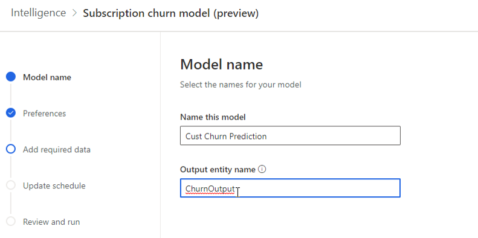
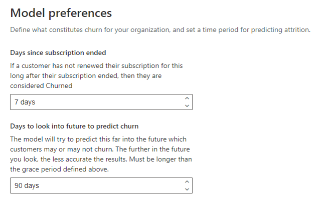
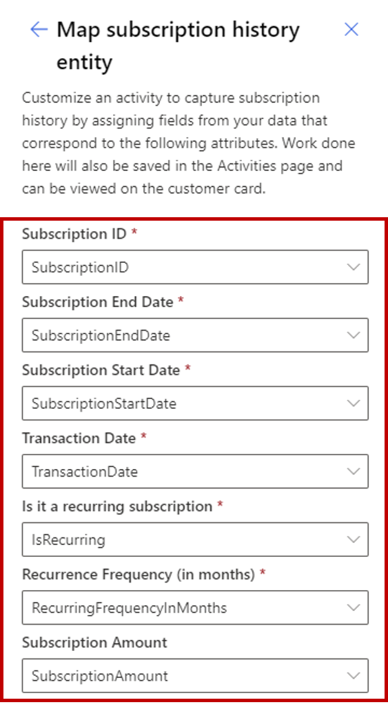
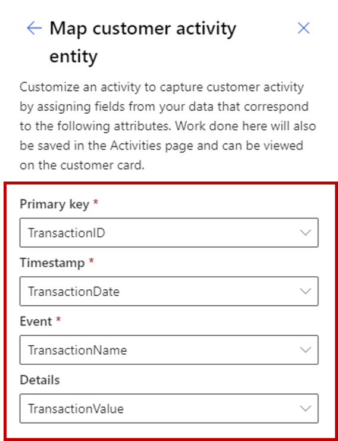
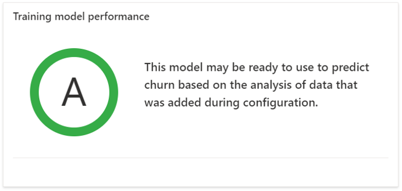
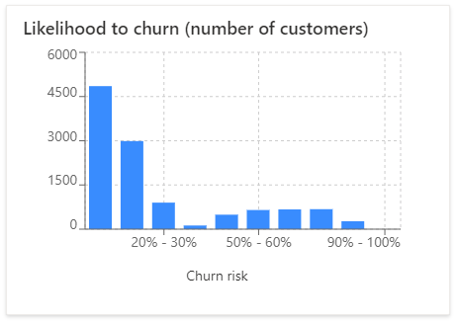
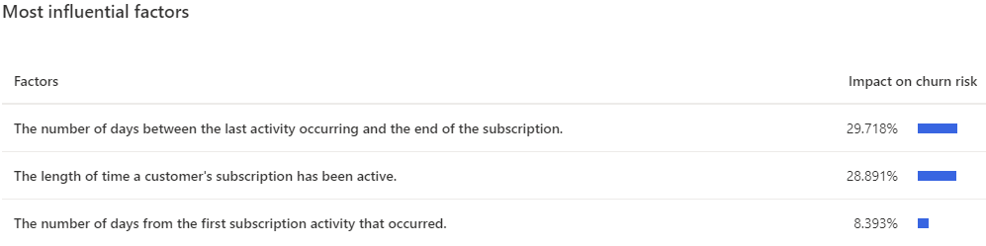

يمكنك إنشاء تنبؤات للمساعدة في التنبؤ بالقيم المفقودة في ملف تعريف العميل. هذه العملية مفيدة لأنه، مع وجود بيانات ملف تعريف أكثر اكتمالاً، يمكنك استهداف عملائك بشكل أفضل للمضي قدماً. ومع ذلك، فإن إجراء التنبؤات في رؤى الجمهور هو أكثر بكثير من مجرد التنبؤ بالمعلومات المفقودة؛ فغالباً ما يدور الأمر حول إجراء تنبؤات تتعلق بسلوك العميل، مثل ما إذا كان عميل ما قد يتوقف عن استخدام خدماتك.

تتضمن رؤى الجمهور نموذجاً تم إنشاؤه مسبقاً للتنبؤ بخسارة العميل والذي يمكن أن يساعد في التنبؤ بما إذا كان العميل معرضاً للخطر بسبب عدم استخدام منتجات أو خدمات الاشتراك الخاصة بشركتك. يتوفر نموذج التنبؤ بخسارة العميل ليتم تكوينه من صفحة التنبؤات.

سيحتاج أي شخص يقوم بتكوين النموذج إلى [أذونات المساهم](/dynamics365/customer-insights/audience-insights/permissions) في بيئة رؤى الجمهور. بالإضافة إلى ذلك، يجب أن يكون لديهم معرفة عميقة بمجال الأعمال بما تعنيه الخسارة بالنسبة لعملك.

عملية تكوين نموذج خسارة العميل تكون على النحو التالي:

- **تسمية النموذج** - يحدد اسم نموذج التنبؤ الذي سيتم عرضه في رؤى الجمهور واسم كيان الإخراج الذي سيتم إنشاؤه لتخزين البيانات ذات الصلة بالتنبؤ الخاص بك.

- **التفضيلات** - تحدد ما يُشكّل خسارةً لمؤسستك، مثل عدد الأيام التي يجب انتظارها بعد تاريخ انتهاء الاشتراك قبل أن يُعتبر تمت خسارته، والفترة الزمنية للتنبؤ بالاستنزاف قبل تاريخ انتهاء الاشتراك.

- **إضافة البيانات المطلوبة** - يحدد الحقول ذات الصلة التي سيستخدمها النموذج للتنبؤ بالعملاء المعرضين لخطر أكبر للخسارة، بما في ذلك تحديد تفاصيل الاشتراك والأنشطة المستخدمة لدعم الاشتراك.

- **تحديث الجدول** - يحدد عدد مرات الاحتفاظ بالنموذج لتنبؤاتك.

- **مراجعة وتشغيل** - يسمح لك بمراجعة تفاصيل التنبؤ قبل تشغيل التنبؤ للمرة الأولى.

## تسمية نموذجك

تتمثل الخطوة الأولى في العملية في توفير أسماء للنموذج الخاص بك وكيان الإخراج. بالمقارنة مع عملية إنشاء القيم المفقودة لنماذج التنبؤ، ستحتاج إلى توفير اسم للنموذج واسم لكيان الإخراج. هذه المعلومات مهمة لأن الاسم هو الذي سيحدد النموذج في التطبيق. سيتم إنشاء كيان الإخراج تلقائياً عند تشغيل النموذج لأول مرة. وسيتم ملء أي بيانات ذات صلة، مثل تفاصيل تسجيل النقاط، للكيان.

> [!div class="mx-imgBorder"]
> 

## تحديد التفضيلات

يجب تحديد عنصرين رئيسيين عند إنشاء النموذج لضمان إمكانية التنبؤ بالخسارة والاستنزاف بشكل دقيق. العنصر الأول هو تحديد عدد الأيام التي تلي انتهاء الاشتراك والذي يجب على العميل تجديده قبل اعتباره تمت خسارته. على سبيل المثال، قد لا تقوم مؤسستك بمعالجة التجديد إلا بعد انتهاء صلاحية الاشتراك الحالي. إذا استغرق الأمر سبعة أيام حتى اكتمال هذه العملية، فقد ترغب في توفير مخزن مؤقت لمدة سبعة أيام. يمكك تقديم هذه القيمة في حقل **عدد الأيام منذ انتهاء الاشتراك**.

> [!div class="mx-imgBorder"]
> 

العامل الثاني الذي يجب مراعاته هو الوقت الذي يجب أن يبدأ فيه النظام في تحديد مخاطر خسارة العميل. على سبيل المثال، يمكنك تعيين هذه القيمة على 90 يوماً لتتماشى مع جهود الاحتفاظ بالتسويق لمؤسستك. يعتمد تحديد ما يجب أن تكون عليه هذه القيمة بشكل كبير على متطلبات العمل المحددة لمؤسستك. قد يؤدي التنبؤ بمخاطر الخسارة لفترات زمنية أطول أو أقصر إلى زيادة صعوبة معالجة العوامل في ملف تعريف مخاطر الخسارة.

## إضافة البيانات المطلوبة

للتأكد من إمكانية إجراء نموذجك تنبؤات دقيقة، تحتاج إلى تحديد الاشتراك وبيانات نشاط العميل التي سيأخذها النموذج في الاعتبار عند إجراء التنبؤ. قبل بدء هذه العملية، تأكد من أن مصادر البيانات التي تحتوي على اشتراك العميل ومعلومات النشاط قد تم إدخالها في التطبيق.

العنصر الأول الذي ستقوم بتكوينه هو معلومات سجل الاشتراك. يجب أن تتضمن البيانات المستخدمة معرّفات الاشتراك التي تميز الاشتراكات الفردية، بالإضافة إلى معرّفات العملاء، بحيث يمكن مطابقة الاشتراكات مع عملائك. يجب أن تتضمن البيانات تواريخ الأحداث، التي تحدد تواريخ البدء وتواريخ الانتهاء والتواريخ التي حدثت فيها أحداث الاشتراك والتفاصيل المتعلقة بالاشتراكات المتكررة وعدد مرات تجديدها.

عند تكوين بيانات سجل الاشتراك لأول مرة، يجب مطابقتها مع كيان العميل الذي يمثل كيان العميل الأساسي الخاص بك. ستُطالبك رؤى الجمهور بتحديد العلاقة بين العنصرين إذا لم يكن أحدهما موجوداً بالفعل.

بعد تحديد الكيان الذي تريد استخدامه وتحديد العلاقة، تحتاج إلى تعيين الحقول الدلالية للسمات الموجودة ضمن كيان محفوظات الاشتراك الخاص بك. سيُساعد هذا النهج التطبيق على تحديد المعلومات بشكل أفضل، مثل وقت انتهاء الاشتراك، عند تحديد الخسارة.

عند قيامك بتعيين بيانات المحفوظات، تأكد من احتواء بيانات محفوظات الاشتراك على حقول تتضمن المعلومات التالية:

- **معرّف الاشتراك** - وهو معرّف فريد للاشتراك.

- **تاريخ انتهاء الاشتراك** - تاريخ انتهاء صلاحية الاشتراك للعميل.

- **تاريخ بداية الاشتراك** - تاريخ بداية الاشتراك للعميل.

- **تاريخ الحركة** - تاريخ حدوث تغيير في الاشتراك، على سبيل المثال، قيام أحد العملاء بشراء اشتراك أو إلغائه.

- **هل هذا اشتراك متكرر** - حقل بقيمة صواب/خطأ يحدد ما إذا كان الاشتراك سيتجدد باستخدام نفس معرّف الاشتراك دون تدخل العميل أم لا.

- **تكرار الحدوث (بالشهور)** - فترة تجديد الاشتراك الممثلة بالأشهر.

- **مبلغ الاشتراك (اختياري)** - مبلغ العملة التي يدفعها العميل لتجديد الاشتراك. ويمكن أن يساعد في تحديد أنماط للمستويات المختلفة من الاشتراكات.

> [!div class="mx-imgBorder"]
> 

بعد تحديد بيانات الاشتراك، أكمل نفس العملية لإضافة بيانات نشاط العميل. أثناء العملية، ستحدد نوع النشاط الذي يتطابق مع نوع نشاط العميل الذي تقوم بتكوينه.

عند تعيين بيانات نشاطك، تأكد من أن مصدر البيانات يتضمن المعلومات التالية:

- **المفتاح الأساسي** - معرّف فريد لنشاط ما، مثل زيارة موقع ويب أو سجل استخدام يُظهر أن العميل شاهد إحدى الحلقات التلفزيونية.

- **الطابع الزمني** - تاريخ ووقت الحدث المعرف من قبل المفتاح الأساسي.

- **الحدث** - اسم الحدث الذي تريد استخدامه. على سبيل المثال، قد يكون حقل مُسمى **UserAction** في خدمة بث الفيديو بالقيمة **تمت مشاهدته**.

- **التفاصيل** - معلومات مفصّلة حول الحدث. على سبيل المثال، قد يكون حقل مُسمى **ShowTitle** في خدمة بث الفيديو بالقيمة "فيديو شاهده العميل".

> [!div class="mx-imgBorder"]
> 

> [!Note]
> ستحتاج إلى وجود سجلي نشاط على الأقل لـ 50 بالمائة من العملاء ممن تريد حساب خسارتهم. إذا كانت أنشطة العميل موجودة في كيانات متعددة، فستحتاج إلى تكرار هذه العملية لكل كيان يحتوي على أنشطة العميل.

## تعيين الجدول الزمني ومراجعة التكوين

قبل أن تتمكن من البدء في استخدام نموذج التنبؤ الخاص بك، قُم بتعيين تكرار لإعادة تدريب نموذجك. هذا الإعداد مهم لضمان دقة التنبؤات حيث يتم استيعاب البيانات الجديدة في رؤى الجمهور. في حين أن كل مؤسسة ستكون مختلفة، إلا أن معظم الشركات يمكنها إعادة التدريب مرة كل شهر والحصول على دقة جيدة لتنبؤاتهم.

قبل إكمال نموذج التنبؤ الخاص بك، راجع التكوين للتأكد من أنه قد تم تكوينه بشكل صحيح بناءً على احتياجاتك ثم قم بإجراء التغييرات، حسب الضرورة. بعد تكوين جميع القيم بشكل صحيح، يمكنك الحفظ والتشغيل لبدء عملية التنبؤ.

> [!NOTE]
> اعتماداً على كمية البيانات المستخدمة في التنبؤ، يمكن أن تستغرق عملية التنبؤ عدة ساعات حتى تكتمل.

## مراجعة حالة التنبؤ والنتائج

بعد تكوين التنبؤ وتشغيله، يمكنك عرض التنبؤ من **التنبؤات** ضمن منطقة **الذكاء** بتحديد علامة التبويب **التنبؤات الخاصة بي**.

سيعرض كل نموذج تنبؤ محدد المعلومات التالية:

- **اسم التنبؤ** - اسم التنبؤ الذي تم توفيره عند قيامك بإنشائه.

- **نوع التنبؤ** - نوع النموذج المستخدم للتنبؤ.

- **كيان الإخراج** - اسم الكيان لتخزين إخراج التنبؤ.

- **الحقل المتوقع** - يتم ملء هذا الحقل فقط لبعض أنواع التنبؤات ولا يتم استخدامه في تنبؤ خسارة الاشتراك.

- **الحالة** - الحالة الحالية لتشغيل التنبؤ.

  - **في قائمة الانتظار** - التنبؤ ينتظر حالياً تشغيل عمليات أخرى.

  - **تحديث** - يجري حالياً تشغيل التنبؤ في مرحلة *النتيجة* من المعالجة لإخراج النتائج التي ستتدفق إلى كيان الإخراج.

  - **فشل** - فشل التنبؤ.

  - **نجح** - نجح التنبؤ.

- **تم التحرير** - التاريخ الذي تم فيه تغيير تكوين التنبؤ.

- **التحديث الأخير** - التاريخ الذي نتج عنه تحديث التنبؤ في كيان الإخراج.

يمكنك تنفيذ إجراءات مثل تحرير نموذج التنبؤ أو تحديث البيانات أو عرض التفاصيل أو حذف التنبؤ عن طريق تحديد علامة الحذف الرأسية.

عند فتح تنبؤ لعرض النتائج، سيتم عرض ثلاثة أقسام أساسية من البيانات داخل صفحة النتائج: **أداء نموذج التدريب**، و **احتمالية الخسارة (عدد العملاء)**، و **العوامل الأكثر تأثيراً**.

### أداء نموذج التدريب

يوضح قسم **أداء نموذج التدريب** النتيجة التي تشير إلى أداء التنبؤ. يمكن أن تساعدك هذه النتيجة في اتخاذ قرار بشأن استخدام النتائج المخزنة في كيان الإخراج.

الخيارات الثلاثة المتاحة للنتيجة هي: **أ** أو **ب** أو **ج**.

يتم تحديد نقاط الدرجات استناداً إلى القواعد التالية:

- **أ** - تنبأ النموذج بدقة بنسبة 50% على الأقل من إجمالي التنبؤات، وعندما تكون النسبة المئوية للتنبؤات الدقيقة للعملاء الذين تم خسارتهم أكبر من متوسط معدل الخسارة التاريخي بنسبة 10% على الأقل من متوسط معدل الخسارة التاريخي.

- **ب** - تنبأ النموذج بدقة بنسبة 50% على الأقل من إجمالي التنبؤات، وعندما تكون النسبة المئوية للتنبؤات الدقيقة للعملاء الذين تم خسارتهم أكبر من متوسط معدل الخسارة التاريخي بنسبة تصل إلى 10% من متوسط معدل الخسارة التاريخي.

- **ج** - تنبأ النموذج بدقة بأقل من 50 في المائة من إجمالي التنبؤات أو عندما تكون النسبة المئوية للتنبؤات الدقيقة للعملاء الذين تم خسارتهم أقل من متوسط معدل الخسارة التاريخي.

> [!div class="mx-imgBorder"]
> 

### احتمالية الخسارة (عدد العملاء)

يعرض قسم **احتمالية الخسارة (عدد العملاء)** مجموعات من العملاء بناءً على مخاطر الخسارة المتوقعة. يمكن أن تكون هذه البيانات مفيدة إذا كنت تريد لاحقاً إنشاء شريحة من العملاء أصحاب مخاطر خسارة عالية. تساعدك هذه الشرائح في فهم المكان الذي ينبغي فيه عمل فصل لعضوية الشريحة.

> [!div class="mx-imgBorder"]
> 

### العوامل الأكثر تأثيراً

ثمة العديد من العوامل التي يتم أخذها في الاعتبار عند إنشاء التنبؤ الخاص بك. ويتم حساب أهمية كل واحد من هذه العوامل للتنبؤات المجمعة التي ينشئها النموذج. يمكنك استخدام هذه العوامل للمساعدة في التحقق من صحة نتائج التنبؤ. يمكنك أيضاً استخدام هذه المعلومات لاحقاً [لإنشاء شرائح](/dynamics365/customer-insights/audience-insights/segments) يمكن أن تساعد في التأثير على مخاطر الخسارة للعملاء.

> [!div class="mx-imgBorder"]
> 

لمزيد من المعلومات، راجع [التنبؤ بخسارة الاشتراك](/dynamics365/customer-insights/audience-insights/predict-subscription-churn).
