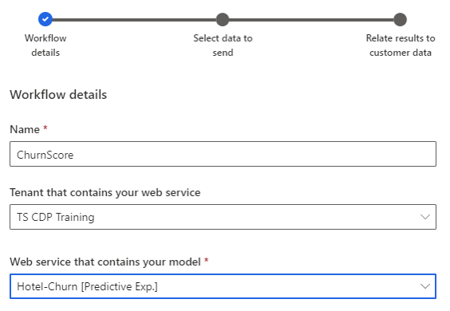
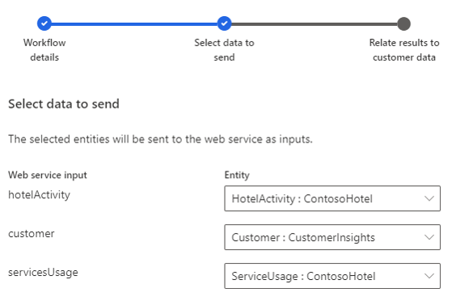
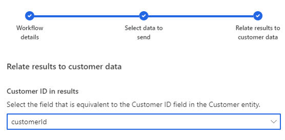

تساعد قدرات التنبؤ المضمّنة في رؤى الجمهور في تزويد المؤسسات بنقطة بداية لإنشاء تنبؤات استناداً إلى بياناتها. ولكن شأنها شأن العديد من الخيارات المحدَّدة مسبقاً، قد لا تمثل كيفية إجراء مؤسستك للتنبؤات. فمثلاً، قد ترغب مؤسستك في التنبؤ بشيء آخر غير خسارة العملاء. حتى في السيناريوهات التي تريد التنبؤ فيها بخسارة العملاء المحتملة، قد تنظّم مؤسستك اشتراكاتهم على نحو يختلف عما هو مقدَّم في نموذج الخسارة الجاهز للاستخدام، أو قد تراعي أنت عوامل مختلفة عند تحديد ما إذا كان عميل ما سيلغي الاشتراك أم لا.

ربما سبق أن أنشأت العديد من المؤسسات نماذج تعلم آلي تُجري تنبؤات، أو قد يرغب بعضها في إنشاء نموذج يمكن استخدامه في رؤى الجمهور. تدعم رؤى الجمهور استخدام النماذج المخصَّصة وإدارة عمليات سير العمل استناداً إلى نماذج التعلم الآلي من Azure في التطبيق. وتساعدك عمليات سير العمل في تحديد البيانات التي تريد إنشاءها وتعيين النتائج إلى بيانات رؤى الجمهور الخاصة بك.

> [!IMPORTANT]
> لجلب نماذج مخصَّصة إلى رؤى الجمهور، عليك أولاً إنشاء تلك النماذج باستخدام التعلم الآلي من Azure. رغم أن إنشاء النماذج يُعتبر خارج نطاق هذه الوحدة، فإن بإمكانك العثور على معلومات أكثر عن إنشاء [النماذج المستندة إلى التعلّم الآلي من Azure](/dynamics365/customer-insights/audience-insights/azure-machine-learning-experiments).

للاطلاع على مزيد من المعلومات، راجِع [نماذج التعلم الآلي المخصّصة](/dynamics365/customer-insights/audience-insights/custom-models).

## إضافة سير عمل لنموذج مخصّص

بعد إنشاء نموذج مخصَّص، يُضاف كسير عمل في رؤى الجمهور. سيرسل سير العمل بيانات من رؤى الجمهور إلى نموذج التعلم الآلي من Azure الخاص بك، ثم يعيد النتائج إلى رؤى الجمهور. وبعد تكوين سير العمل واستخدام النموذج، يمكنك استخدام النموذج لإنشاء عناصر، مثل شرائح العملاء، والتي يمكن أن تستخدمها تطبيقات أخرى.

يمكن إنشاء نماذج مخصّصة بالانتقال إلى **الذكاء**، وتحديد **نماذج العملاء**، ثم تحديد الزر **سير عمل جديد**.

تتألف عملية تكوين سير عمل من ثلاث خطوات هي:

- توفير تفاصيل سير العمل.

- تحديد البيانات المراد إرسالها.

- ربط النتائج ببيانات العميل.

تتمثل الخطوة الأولى في تحديد التفاصيل الضرورية لسير العمل. وتتمثل العناصر الثلاثة التي تحتاج إلى تحديدها فيما يلي:

- **الاسم** - يحدِّد اسم الكائن في رؤى الجمهور.

- **المستأجر** - يحدّد مستأجر التعلم الآلي من Azure الذي يُوزَّع فيه خدمة الويب التي تحتوي على نموذجك.

- **خدمة الويب** - يحدّد خدمة الويب التي يُوزَّع إليها نموذجك.

> [!div class="mx-imgBorder"]
> 

تحتاج رؤى الجمهور إلى معرفة البيانات المراد إرسالها إلى النموذج كإدخالات كي يوفر لك نموذج التعلم الآلي نتائج. سيختلف عدد الإدخالات حسب النموذج الذي تعمل من خلاله. لكل إدخال مُدرج لخدمة ويب، ستحتاج إلى تزويد كيان مطابق. يوضح المثال التالي أن خدمة ويب تحتاج إلى ثلاثة إدخالات.

> [!div class="mx-imgBorder"]
> 

> [!IMPORTANT]
> لن يكون كيان ما موجوداً في رؤى الجمهور إلا إذا تم استيعابه في التطبيق. قبل إنشاء سير العمل، تأكَّد من أن أي مجموعات بيانات ستُستخدَم كإدخالات قد تم استيعابها في التطبيق.

الخطوة الأخيرة في العملية هي تحديد الحقل في كيان العميل الخاص بك الذي يمثل معرّف العميل. سيُستخدم هذا الحقل لمطابقة النتائج مرة أخرى مع العميل المناسب في التطبيق.

> [!div class="mx-imgBorder"]
> 
