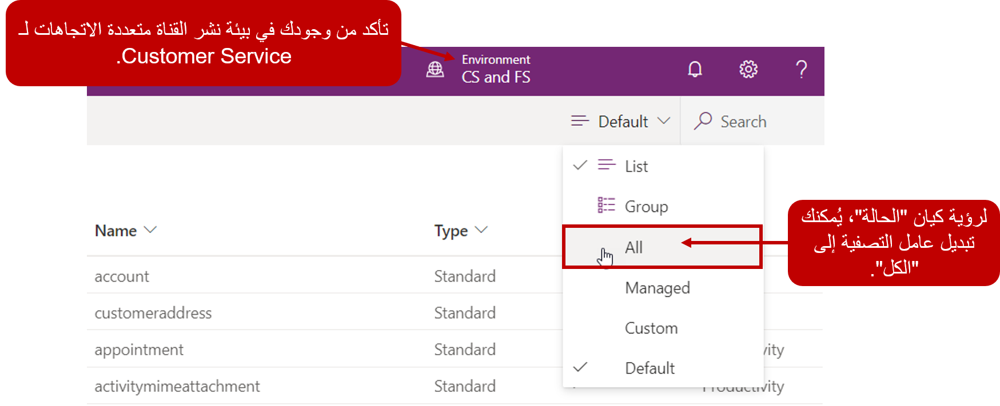
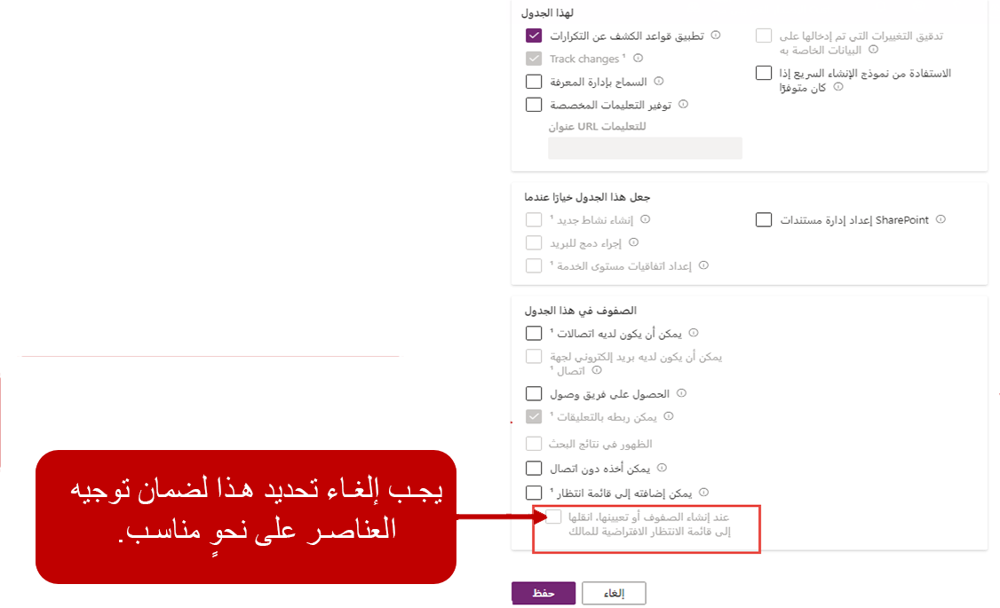
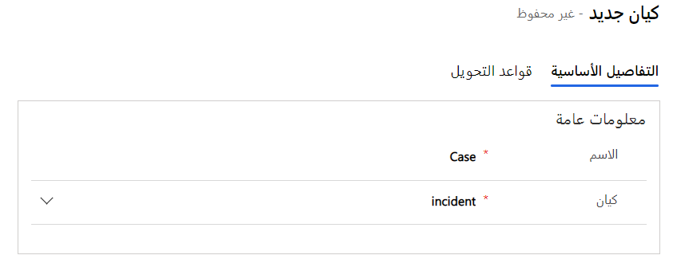
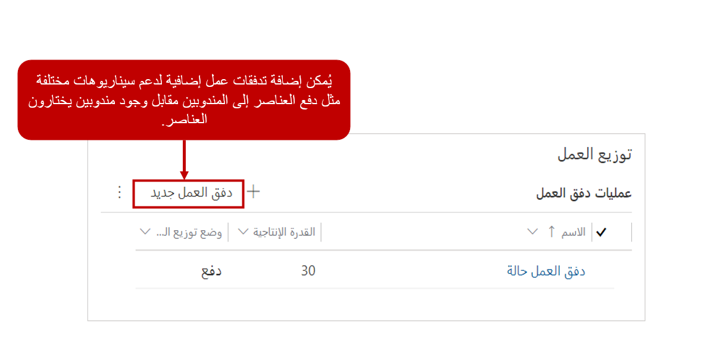

لتوجيه الحالات و/أو الكيانات الأخرى التي تريد المؤسسة استخدامها في حل القناة متعددة الاتجاهات، ستحتاج إلى إنشاء سجلات الجدول. توفر لك سجلات الجدول القدرة على توجيه سجلات Dataverse إلى المندوبين استناداً إلى عمليات دفق العمل المستندة إلى الجدول ومجموعات قواعد التحويل.

الخطوات الأربع لإعداد قنوات سجل الكيان وتوجيه السجل هي:

1.  **إنشاء قوائم الانتظار وإضافة المندوبين** - كما هو الحال مع عناصر العمل الأخرى مثل المحادثات، يجب تحديد أي قوائم انتظار سيتم استخدامها للتوجيه أولاً. سيحتاج المندوبون إلى إضافتهم إلى قوائم الانتظار المناسبة التي سوف يدعموها.

1.  **تمكين الجدول للأنشطة وقوائم الانتظار** - يتم إنشاء توجيه الجدول على وظيفة قائمة انتظار Dynamics 365؛ وبالتالي، ستحتاج أي جداول تتطلب التوجيه إلى تمكين الأنشطة وقوائم الانتظار.

1.  **تمكين توجيه الجدول** - لكي يستخدم الجدول التوجيه، يجب إضافة سجل تكوين جدول من شأنه تمكين جدول للتوجيه وإنشاء تدفق العمل الداعم.

1.  **إنشاء قواعد التوجيه** - بعد تمكين قواعد التوجيه، ستوفر قاعدة التوجيه التي تم تعيينها على سجل توجيه الجدول المنطق لتوجيه السجلات، مثل الحالات، إلى قوائم الانتظار المناسبة.

## تمكين جدول للأنشطة وقوائم الانتظار

بينما الحالات هي الجدول الأكثر شيوعا التي يتم توجيهها إلى قوائم الانتظار، توجد العديد من وحدات سيناريو مختلفة حيث يمكن تمكين جداول أخرى لقائمة الانتظار. على سبيل المثال، قد تفكر المؤسسات التي تستخدم Connected Field Service لتوفير الدعم الاستباقي والإرسال في تمكين جدول "تنبيه IoT" للتوجيه. ونتيجة لذلك، عندما يتم إنشاء التنبيهات بواسطة الأجهزة، يمكن توزيع هذه التنبيهات على المندوبين المناسبين أكثر لاستكشاف الأخطاء وإصلاحها عن بعد. بعد توزيع التنبيهات، يمكن تحويلها إلى حالات، إذا لزم الأمر، ولكن قد يكون المندوب قادراً على حل المشكلة دون الحاجة إلى إنشاء حالة رسمية.

يمكن تمكين الجداول لقائمة انتظار من خلال منشئ PowerApps، والتي يمكنك الوصول إليها عن طريق الانتقال إلى [https://make.powerapps.com](https://make.powerapps.com/?azure-portal=true).

> [!IMPORTANT]
> كل مستأجر لديه بيئة افتراضية. من المحتمل ألا تكون هذه البيئة تلك التي قمت بنشر حل القناة متعددة الاتجاهات فيها.
تأكد من أنك في البيئة التي تم نشر Omnichannel for Customer Service فيها.

عندما تكون في البيئة الصحيحة، قم بتوسيع **البيانات** وحدد **الجداول**. حدد موقع جدول الحالة أو أي جدول تريد تمكينه للتوجيه. عند الانتقال أولاً إلى منطقة **الجداول**، ستتم التصفية على الجداول الافتراضية فقط. لم يتم سرد جدول الحالة كجدول افتراضي؛ فربما لن تظهر في القائمة أو تكون متاحة عند البحث عنه. قم بتعيين عامل تصفية الجداول إلى **الكل**. بعد ذلك، سيتم عرض جدول الكيان في قائمة الكيان وسوف تكون متوفرة عند إجراء بحث.

بعد تحديد موقع جدول الحالة، افتحه ثم حدد رمز الإعدادات لفتح إعدادات الكيان. يمكنك تمكين قوائم الانتظار من خلال الانتقال إلى **مزيد من الإعدادات > التعاون**. افتراضياً، يتم تمكين كيان الحالة؛ ومع ذلك، سوف تحتاج إلى مسح خانة اختيار **نقل السجلات تلقائياً إلى قائمة الانتظار الافتراضية للمالك عند** 
**إنشاء سجل أو تعيينه**. بعد تعديل جدول الحالة، حدد **تم** في القائمة ثم حدد الزر **حفظ الجدول**.

> [!IMPORTANT]
> إذا لم يتم مسح الخيار **نقل الصفوف تلقائياً إلى قائمة الانتظار الافتراضية للمالك عند إنشاء صف أو تعيينه**، فلن يتم توزيع سجل الجدول على المندوبين تلقائياً.

## تمكين جدول للتوجيه

بعد تمكين الجدول لقوائم الانتظار، وبعد تكوينه بشكل صحيح، سيكون جاهزاً لتمكينه للتوجيه. بعكس قنوات الاتصال الأخرى حيث يجب تعريف تدفق العمل أولاً، عند تكوين توجيه الجدول، يجب تمكين الجدول أولاً. يمكنك تمكين الجدول من خلال تطبيق إدارة القناة متعددة الاتجاهات عن طريق تحديد **سجلات الكيان** أسفل عنوان **القنوات**.

عند إنشاء سجل توجيه، تأكد من تحديد المعلومات التالية:

-   **الاسم** - الاسم الذي سيتم استخدامه لتعريف قاعدة الكيان.

-   **الكيان** - سيحتاج هذا الحقل إلى تعيينه إلى الجدول الذي يتم تمكينه.

على سبيل المثال، لتمكين جدول الحالة للتوجيه، قد يتم تعيين حقل الاسم إلى **الحالة** وسيتم تعيين حقل **الكيان** إلى **الحالة (الحادث)**.

بعد حفظ سجل الكيان، سيتم إنشاء تدفق عمل افتراضي لتوزيع هذه السجلات. يمكن تحرير تدفق العمل الافتراضي لاحقاً إذا لزم الأمر، أو يمكن إنشاء تدفقات عمل إضافية استناداً إلى احتياجات المؤسسة.

> [!IMPORTANT]
> أحياناً، قد تتلقى خطأ "عملية العمل" عند محاولة حفظ صف الجدول. يمكن أن يحدث هذا الخطأ عندما لا يتم تحديث التدفق الذي تم تضمينه في حل القناة متعددة الاتجاهات بشكل صحيح ليعكس البيئة التي تم تثبيته فيها. يساعد موصل Microsoft Dataverse الجديد الذي يسمى Microsoft Dataverse (البيئة الحالية) على تسهيل نقل تدفقات في الحلول. يتضمن الموصل العديد من الإجراءات الجديدة التي تعزز قدرات معينة يمكن القيام به مع تدفق مثل القدرة على استدعاء إجراءات Dynamics 365.

لمزيد من المعلومات، راجع [استكشاف الأخطاء وإصلاحها في القناة متعددة الاتجاهات](/dynamics365/omnichannel/troubleshoot-omnichannel-customer-service/?azure-portal=true).
