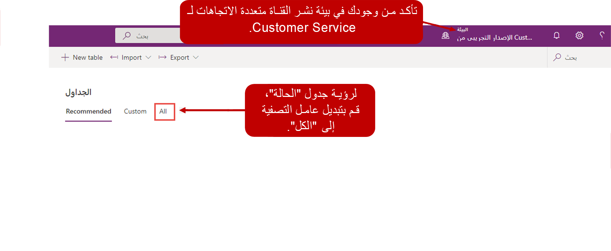

لتوجيه الحالات و/أو الجداول الأخرى التي تريد المؤسسة استخدامها في حل القناة متعددة الاتجاهات، ستحتاج إلى إنشاء صفوف الجدول.
توفر لك صفوف الجدول القدرة على توجيه صفوف Common Data Service إلى المندوبين استناداً إلى تدفقات العمل المستندة إلى الجدول ومجموعات قواعد التوجيه.

الخطوات الأربع لإعداد قنوات صف الجدول وتوجيه الصف هي:

1.  **إنشاء قوائم الانتظار وإضافة المندوبين** - كما هو الحال مع عناصر العمل الأخرى مثل المحادثات، يجب تحديد أي قوائم انتظار سيتم استخدامها للتوجيه أولاً. سيحتاج المندوبون إلى إضافة إلى قوائم الانتظار المناسبة التي سوف تدعمها.

1.  **تمكين الجدول للأنشطة وقوائم الانتظار** - يتم إنشاء توجيه الجدول على وظيفة قائمة انتظار Dynamics 365؛ وبالتالي، ستحتاج أي جداول تتطلب التوجيه إلى تمكين الأنشطة وقوائم الانتظار.

1.  **تمكين توجيه الجدول** - لكي يستخدم الجدول التوجيه، يجب إضافة صف تكوين جدول من شأنه تمكين جدول للتوجيه وإنشاء تدفق العمل الداعم.

1.  **إنشاء قواعد التوجيه** - بعد تمكين قواعد التوجيه، ستوفر قاعدة التوجيه التي تم تعيينها على صف توجيه الجدول المنطق لتوجيه صفوف الجدول، مثل الحالات، إلى قوائم الانتظار المناسبة.

## تمكين جدول للأنشطة وقوائم الانتظار

بينما الحالات هي الجدول الأكثر شيوعا التي يتم توجيهها إلى قوائم الانتظار، توجد العديد من وحدات سيناريو مختلفة حيث يمكن تمكين جداول أخرى لقائمة الانتظار. على سبيل المثال، قد تفكر المؤسسات التي تستخدم "خدمة الحقل المتصل" لتوفير الدعم الاستباقي والإرسال في تمكين جدول "تنبيه IoT" لتوجيه الجدول. ونتيجة لذلك، عندما يتم إنشاء التنبيهات بواسطة الأجهزة، يمكن توزيع هذه التنبيهات على المندوبين الأكثر ملاءمة لاستكشاف الأخطاء وإصلاحها عن بعد. بعد توزيع التنبيهات، يمكن تحويلها إلى حالات، إذا لزم الأمر، ولكن قد يكون المندوب قادرا على حل المشكلة دون الحاجة إلى إنشاء حالة رسمية.

يمكن تمكين الجداول لقائمة انتظار من خلال منشئ PowerApps، والتي يمكنك الوصول إليها عن طريق الانتقال إلى: [https://make.powerapps.com](https://make.powerapps.com/?azure-portal=true).

> [!IMPORTANT]
> كل مستأجر لديه بيئة افتراضية. من المحتمل أن هذه البيئة لن تكون تلك التي قمت بنشر حل القناة متعددة الاتجاهات لها.
تأكد من أنك في البيئة التي تم نشر القناة متعددة الاتجاهات لـ Customer Service لها.

عندما تكون في البيئة الصحيحة، قم بتوسيع **البيانات** وحدد **الجداول**. حدد موقع جدول الحالة أو أي جدول تريد تمكينه. عند الانتقال أولاً إلى منطقة **الجداول**، ستتم التصفية على الجداول الافتراضية فقط. لم يتم سرد جدول الحالة كجدول افتراضي؛ لن تظهر في القائمة أو تكون متاحة عند البحث عنه. قم بتعيين عامل تصفية الجداول إلى **الكل**. بعد ذلك، سيتم عرض جدول الحالة في قائمة الجدول وسوف تكون متوفرة عند إجراء بحث.

بعد تحديد موقع جدول الحالة، افتحه ثم حدد رمز الإعدادات لفتح إعدادات الجدول. يمكنك تمكين قوائم الانتظار من خلال الانتقال إلى **مزيد من الإعدادات > التعاون**. افتراضياً، يتم تمكين جدول الحالة؛ ومع ذلك، سوف تحتاج إلى مسح خانة الاختيار **نقل الصفوف تلقائياً إلى قائمة الانتظار الافتراضية للمالك عند إنشاء صف أو تعيينه**. بعد تعديل جدول الحالة، حدد **تم** في القائمة ثم حدد الزر **حفظ الجدول**.

> [!IMPORTANT]
> إذا لم يتم مسح الخيار **نقل الصفوف تلقائياً إلى قائمة الانتظار الافتراضية للمالك عند إنشاء صف أو تعيينه**، فلن يتم توزيع صف الجدول على المندوبين تلقائياً.

## تمكين جدول للتوجيه

بعد تمكين الجدول لقوائم الانتظار، وبعد تكوينه بشكل صحيح، يكون الجدول جاهزاً لتمكينه من التوجيه. بعكس قنوات الاتصال الأخرى حيث يجب تعريف دفق العمل أولاً، عند تكوين توجيه الجدول، يجب تمكين الجدول أولاً. يمكنك تمكين الجدول من خلال تطبيق إدارة القناة متعددة الاتجاهات عن طريق تحديد **صفوف الجدول** أسفل عنوان **القنوات**.

عند إنشاء صف توجيه جدول، تأكد من تحديد المعلومات التالية:

-   **الاسم** - الاسم الذي سيتم استخدامه لتعريف قاعدة الجدول.

-   **الجدول** - سيحتاج هذا العمود إلى تعيين إلى الجدول الذي يتم تمكينه.

على سبيل المثال، لتمكين جدول الحالة للتوجيه، قد يتم تعيين عمود **الاسم** إلى **الحالة** وسيتم تعيين عمود **الجدول** إلى **الحالة (الحادث)**.

بعد حفظ صف الجدول، سيتم إنشاء تدفق عمل افتراضي لتوزيع صفوف الجدول هذه. يمكن تحرير تدفق العمل الافتراضي لاحقاً إذا لزم الأمر، أو يمكن إنشاء تدفقات عمل إضافية استناداً إلى احتياجات المؤسسة.

> [!IMPORTANT]
> أحياناً، قد تتلقى خطأ "عملية العمل" عند محاولة حفظ صف الجدول. يمكن أن يحدث هذا الخطأ عندما لا يتم تحديث التدفق الذي تم تضمينه في حل القناة متعددة الاتجاهات بشكل صحيح ليعكس البيئة التي تم تثبيته فيها. يساعد موصل Microsoft Dataverse الجديد الذي يسمى Microsoft Dataverse (البيئة الحالية) على تسهيل نقل تدفقات في الحلول. يتضمن الموصل العديد من الإجراءات الجديدة التي تعزز قدرات معينة يمكن القيام به مع تدفق مثل القدرة على استدعاء إجراءات Dynamics 365.

لمزيد من المعلومات، راجع [استكشاف الأخطاء وإصلاحها في القناة متعددة الاتجاهات](/dynamics365/omnichannel/troubleshoot-omnichannel-customer-service/?azure-portal=true).
