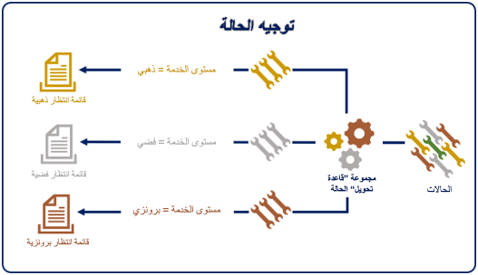
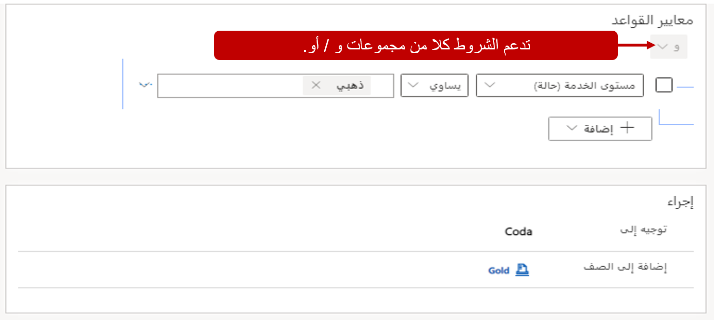
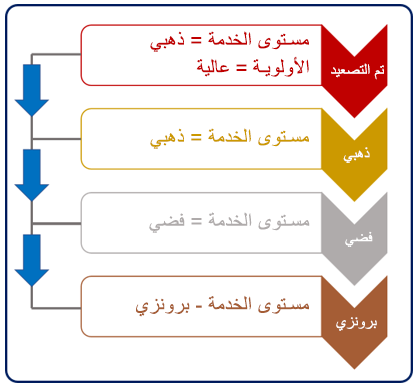

يتم إنشاء مجموعات قواعد التوجيه لجدول فردي. فكر في مجموعات القواعد هذه كخرائط طريق تحدد كيفية توجيه صفوف من نوع الجدول إلى صفوف انتظار مختلفة. عند إنشاء صفوف أو تحديثها، تحدد قواعد التوجيه ما إذا كان الصف يستوفي شروطاً معينة أم لا. اعتمادا على الشروط التي (إن وجدت) التي يتم استيفاء الصف سيتم توجيه إلى صف الانتظار التي تم تعريفها في القاعدة. بينما من الممكن أن يكون لديك عدة مجموعات قواعد التوجيه المعرفة لجدول، يمكن أن يكون لكل جدول قاعدة توجيه واحدة فقط تعيين كقاعدة نشطة تعيين في وقت واحد. 

> [!IMPORTANT]
> تستخدم القناة متعددة الاتجاهات لـ Customer Service نفس مجموعات قاعدة توجيه الجدول مثل مركز خدمة العملاء. إذا تم إنشاء مجموعة قاعدة توجيه حالة وتنشيطها في مركز خدمة العملاء، فسوف تظهر ضمن قواعد التوجيه. إذا كانت حالة مجموعة القواعد نشطة، فسيلزم إلغاء تنشيطها لأنه لا يمكنك تحرير مجموعة قواعد توجيه نشطة.

## إنشاء عناصر القواعد

يجب أن تكون كل مجموعة قواعد توجيه مقترنة بجدول مثل جدول الحالة. ستحتاج كل مجموعة قواعد توجيه إلى إنشاء عناصر قاعدة. تحدد أصناف القاعدة "ماذا" و"أين" لمجموعة القواعد. تحتوي مجموعة قواعد التوجيه عادة على أصناف قاعدة متعددة تقوم بتقييم صف الحالات وتوجيهه في النظام.

على سبيل المثال، قد تحتوي مجموعة قواعد التوجيه المسماة **توجيه الحالة** على أصناف من القاعدة التالية:

-   **المسار الذهبي** - قم بتوجيه أي حالة بمستوى خدمة من الذهب إلى صف الانتظار الذهبية.

-   **المسار الفضي** - قم بتوجيه أي حالة بمستوى خدمة من الفضة إلى صف الانتظار الفضية.

-   **المسار البرونزي** - قم بتوجيه أي حالة بمستوى خدمة من البرونز إلى صف الانتظار البرونزية.

يحتوي كل عنصر قاعدة على جزأين: **شروط الحالة** و **الحالات التالية**.

-   **شروط الحالة** - تحديد حالة (حالات) معينة تستخدم لتحديد ما إذا كان صنف القاعدة ينطبق أم لا.

    يمكن للشروط تقييم الأعمدة من صف الحالة أو الصفوف المرتبطة مثل الحساب المرتبط.

    يمكن استخدام حالات **و/أو** متعددة في صنف قاعدة واحد. وشرط **و** هو الإعداد الافتراضي.

-   **الحالات التالية** - حدد المكان الذي يجب توجيه العنصر إليه.

    **صف الانتظار** - تقوم بتوجيه العنصر إلى صف انتظار معينة (عامة أو خاصة).

    **المستخدم/الفريق** - يقوم بتوجيه العنصر إلى مستخدم أو فرق معينة.

يتم تطبيق أصناف القاعدة بالترتيب المحدد في مجموعة القواعد.
عند العثور على عنصر قاعدة مطابقة، يتم تطبيقه على الحالة. لن تقوم مجموعة القواعد بتقييم مجموعات القواعد المتبقية لتحديد ما إذا كان هناك قاعدة أخرى ستطابق بشكل أفضل. نوصيك بوضع أصناف قاعدة أكثر تحديداً بمستوى أعلى ضمن مجموعة القواعد بحيث يتم التحقق منها أولاً.

على سبيل المثال، في الصورة التالية، تشير عناصر قاعدة "التصعيد" و"الذهبية" إلى عمود **مستوى الخدمة** الذي تم تعيينه إلى **الذهب**. نظراً لأن عنصر القاعدة المصعد يتضمن أيضاً الأولوية، يجب تقييمه قبل قاعدة الذهب؛ بخلاف ذلك، لن يتم التحقق من العنصر الذي تم تصعيده.

يمكنك التحكم في الترتيب الذي يتم فيه إيداع أصناف القاعدة باستخدام السهمين لأعلى ولأسفل ضمن الشبكة الفرعية لعنصر القاعدة. بعد تحديد جميع أصناف القاعدة لمجموعة قواعد معينة، يمكنك تنشيط القاعدة. عند تنشيط القاعدة، لن تتمكن من إجراء تغييرات عليها إلا إذا قمت بإلغاء تنشيطها أولاً.
