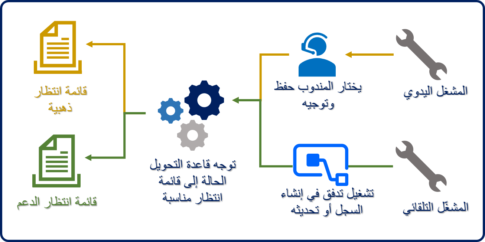
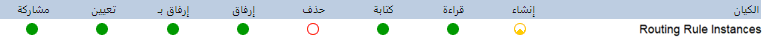
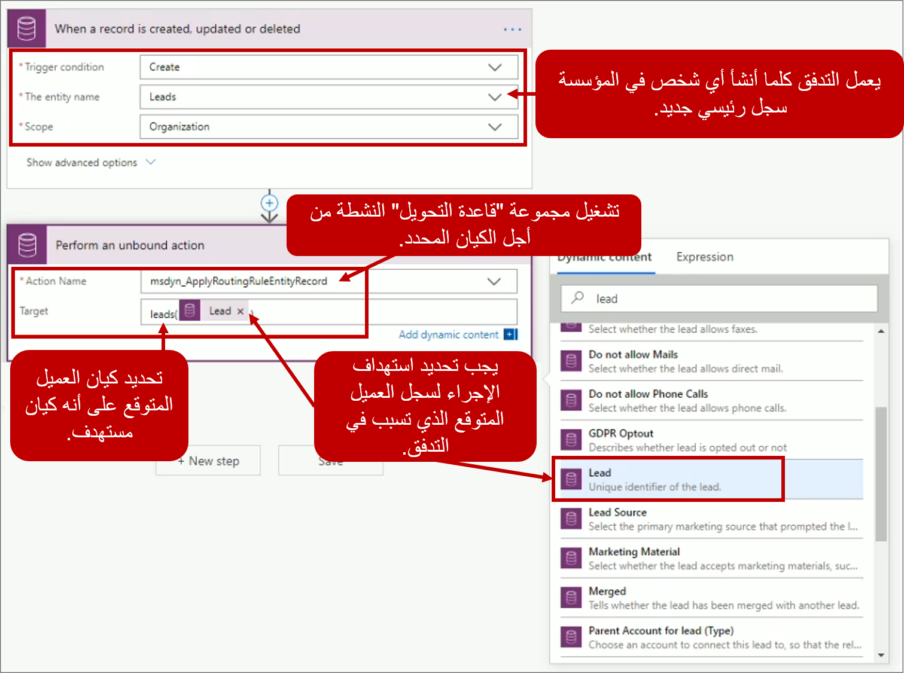

بعد تكوين الجدول للتوجيه وتنشيطه، يمكن تشغيله بإحدى طريقتين:

-   **المشغل اليدوي** - يحدد المندوب زر **حفظ وتوجيه**.

-   **المشغل التلقائي** - باستخدام Power Automate، يمكن استخدام تدفق مخصص لتشغيل قواعد التحويل.

## المشغل اليدوي

بعد تمكين الجدول للتوجيه، تتم إضافة الزر **حفظ وتوجيه** إلى شريط أوامر نموذج الجدول. عندما يحدد المندوبون **حفظ وتوجيه**، سوف يتلقون مربع حوار مسار. يمكنهم تأكيد توجيه العنصر عن طريق تحديد الزر **التوجيه** في مربع حوار المسار.

يمكنك إجراء التوجيه اليدوي أثناء عرض الجدول مثل **حافظاتي المفتوحة**. عند تحديد صف واحد أو أكثر، يظهر الزر **تطبيق قواعد التحويل** . سيؤدي تحديد هذا الزر إلى تطبيق قاعدة التحويل على جميع الصفوف المحددة.

> [!IMPORTANT]
> للتأكد من أن المندوبين يمكنهم تشغيل قواعد التحويل باستخدام أزرار **حفظ وتوجيه** أو **تطبيق قواعد التحويل** فإن واحدًا على الأقل من أدوار الأمان المعينة لهم تحتاج إلى الحصول على الأذونات المحددة في الجدول **مثيلات قواعد التحويل**.

## المشغّل التلقائي

في كثير من الأحيان، يكون من الأفضل تطبيق قاعدة التحويل تلقائياً. في هذه السيناريوهات، يمكن استخدام Microsoft Flow لتشغيل التوجيه للصفوف بناءً على شروط مثل وقت إنشاء الصف وتحديثه وما إلى ذلك.

على سبيل المثال، قد يكون لدى المؤسسة مدخل يواجه العملاء، حيث يمكن للعملاء إرسال الحالات. في هذه الحالات، من المنطقي تطبيق قواعد التحويل تلقائياً لضمان تسليمها إلى قائمة الانتظار الصحيحة على الفور. قد يتم تطبيق هذه الطريقة أيضًا في السيناريوهات حيث يتم تحديث أعمدة معينة في صف الحالة مما قد يؤثر على قائمة الانتظار الموجودة في العنصر.

عندما يتم إنشاء Microsoft Flow من حل Microsoft Dataverse يمكن استخدام موصل Dataverse (البيئة الحالية) لتشغيل إجراءات غير منضمة في Microsoft Flow. الإجراء غير المنضم هو إجراء غير مرتبط بجدول معين، مثل حالة أو عميل متوقع. نظراً لأنه غير مرتبط بجدول معين، يمكن تشغيله على أي جدول في التطبيق. يوفر هذا النهج للمؤسسات مرونة إضافية لأنه يمكن استخدام إجراء واحد لدعم سيناريوهات متعددة. عند نشر القناة متعددة الاتجاهات، فإنه يحتوي على إجراء غير منضم يسمى msdyn\_ApplyRoutingRuletablerow. سيقوم هذا الإجراء بتنفيذ قاعدة التحويل النشط المحددة للجدول المحدد.

على سبيل المثال، إذا أردت تطبيق مجموعة قواعد توجيه العميل المتوقع تلقائياً كلما تم إنشاء عميل متوقع جديد، يمكنك إنشاء Microsoft Flow على غرار الصورة التالية.

لمزيد من المعلومات، راجع [مُشغّل التوجيه](/dynamics365/omnichannel/administrator/routing-trigger?azure-portal=true).

## كيف يعمل توجيه الحالة خارج الصندوق

نظراً لأن صف الحالة هو بشكل عام الجدول الأساسي الذي تريد المؤسسات استخدامه مع التوجيه، يتم تضمين مشغل خارج الصندوق مع الحل لتوجيه الحالات تلقائياً. يعتمد التوجيه على قيمة العمود **حالة التوجيه** في صف جدول الحالة. يتم تقييم المشغل فقط عند إنشاء صفوف الحالة.

**عند إنشاء حالة:**

-   إذا تم تعيين **حالة التوجيه** على **نعم**، فسيتم توجيه الصف.

-   إذا تم تعيين  **حالة التوجيه** على **لا**، فلن يتم توجيه الصف.

بشكل افتراضي، عندما يتم إنشاء حالة يدوياً، يتم تعيين عمود **حالة التوجيه** على **لا**. لذلك، لا يتم تشغيل التوجيه عند إنشاء حالة يدوياً. يمكن للمؤسسة إنشاء تدفق مخصص لتشغيل التوجيه تلقائياً للحالات باستخدام أي عمود آخر وفقاً لسيناريو العمل، كما هو موضح في القسم السابق. بالإضافة إلى ذلك، يمكن تشغيل تدفق مخصص لتعيين العمود **حالة التوجيه** إلى **نعم** استناداً إلى سيناريو العمل. في تلك الحالات، سيتم توجيه الحالة.

