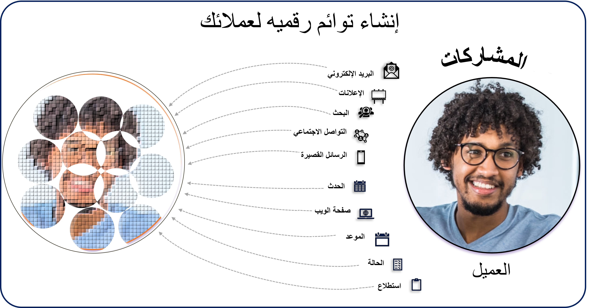
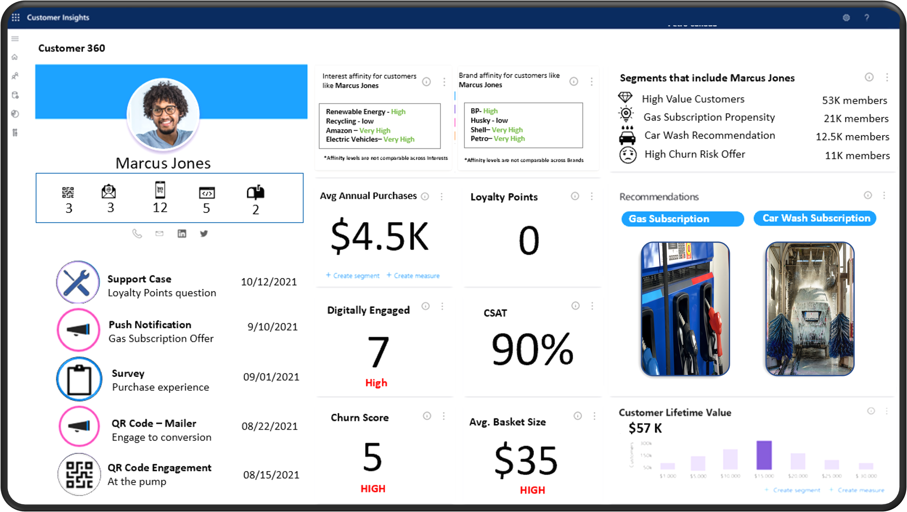

في عالمنا المعاصر، تنتشر البيانات في كل مكان. يكون لدى المؤسسات النموذجية بيانات موزعة على مستودعات بيانات مختلفة. وهذا يعني أن كل تطبيق، مثل إدارة علاقات العملاء (CRM)، ونقطة البيع (POS)، وتخطيط موارد المؤسسات (ERP)، لديه مصدر البيانات الخاص به. إن امتلاك مصادر البيانات المختلفة وغير المتصلة هذه سيعرضك لخطر عدم الحصول على صورة واضحة عن عميلك. وبالتالي، من المحتمل أن تواجه صعوبة في ضمان قدرتك على تلبية احتياجاته طوال مسيرة تعامله مع شركتك. تستعين العديد من المؤسسات بمنصة بيانات العميل بهدف تحقيق فهم أفضل لعملائها وإنشاء رحلات أفضل لهم.

تعمل منصة بيانات العملاء على مَركَزة بيانات عملائك من جميع مستودعات البيانات المختلفة الخاصة بك، وتوفر لك معلومات أعمق عن تلك البيانات. بالإضافة إلى أنها تساعد في إتاحة تلك البيانات للمؤسسات الأخرى. وفقاً لذلك، يمكنك إضفاء طابع شخصي على رحلات عملائك، من اليوم الأول، بناءً على هويتهم الحقيقية، وكيفية تفاعلهم معك، ونمط حياتهم. تُعد التجارب ذات الطابع الشخصي أمراً جوهرياً في نهاية المطاف، حيث إن الناس هم السبب الرئيسي لامتلاك منصة بيانات العملاء.

يهدف الجزء الأول من أي حل لمنصة بيانات العملاء إلى تقديم رؤية موحدة عن عملائك. يمكنك تحقيق هذا الهدف من خلال جمع أكبر قدر ممكن من البيانات وتوحيدها في عرض واحد عن العميل.
اعتبر هذا النهج مشابهاً لإنشاء توأم رقمي لعملائك. يتشكل هذا التوأم الرقمي من فهم نقاط الاتصال الرقمية للعميل مع مؤسستك. يتوجب عليك تسجيل وفهم والتفاعل مع أكبر قدر ممكن من الأنشطة الرقمية لعملائك. وكلما زادت الأنشطة الرقمية التي يمكنك تسجيلها وفهمها، زاد وضوح الصورة لديك.

> [!div class="mx-imgBorder"]
> 

يُنشئ كل نشاط رقمي، مثل البريد الإلكتروني الذي يرسله العميل أو يستقبله، نقطة بيانات تفاعلية تساعدك على إنشاء توأم رقمي أكثر اكتمالاً لعميلك. وكلما اكتسبت المزيد من نقاط الاتصال، ستقوم هذه النقاط بشكل جماعي بإنشاء ركيزة لبيانات العميل والبدء في تقديم صورة أوضح عن التوأم الرقمي للعميل.

تتضمن بعض نقاط الاتصال هذه ما يلي:

- عمليات البحث على الويب

- المنشورات على منصات التواصل الاجتماعية

- الرسائل النصية

- الأحداث التي تم حضورها

- صفحات الويب التي تمت زيارتها

- طلبات الشراء التي تم إجراؤها

- الحالات التي تم إنشاؤها

- المنتجات التي تم إرجاعها

- ردود العميل في الاستبيان

يوفر تسجيل تفاعلات العميل جزءاً من القصة فقط. وللحصول على عرض حقيقي متكامل الزوايا للعميل، يتعين عليك فهم سياق هويته. علي سبيل المثال، من خلال تضمين بيانات مثل مكان إقامة الشخص، أو دخل الأسرة، أو عدد الأطفال، ستحظى بصورة أكثر وضوحاً عن هوية هذا الشخص. غالباً ما يتم تحقيق هذا المستوى من الفهم بمساعدة بيانات الإثراء التي تملأ الفراغات التي تتركها مصادر البيانات الداخلية لديك. قد تتضمن بيانات الإثراء تفاصيل مثل الصلات بالعلامة التجارية والهوايات والتفاصيل المالية والمعلومات الديموغرافية الأخرى.

> [!div class="mx-imgBorder"]
> 

باستخدام التوأم الرقمي الواضح والكامل الذي يمثل هوية عملائك، يمكنك استخدام هذه المعلومات لاكتساب رؤى أعمق حولهم ولمساعدتك على تقديم تجارب ذا طابع شخصي أعمق.

> [!div class="mx-imgBorder"]
> 

من خلال فحص المبلغ الذي ينفقه العميل والأصناف التي يشتريها، يمكنك تقديم توصيات بشأن الأصناف، مثل التوصية بخدمات الاشتراك التي ستقلل تكاليفهم بالمقارنة مع وضعهم الحالي. يمكنك مراقبة مدى تفاعل العميل مع شركتك، ويمكنك اتباع نهج استباقي عندما يقل التفاعل عن المستويات المعتادة. ستساعدك هذه الأنشطة على البقاء على اتصال مع العملاء عبر جميع نقاط الاتصال المختلفة حيث تتفاعل معهم.
