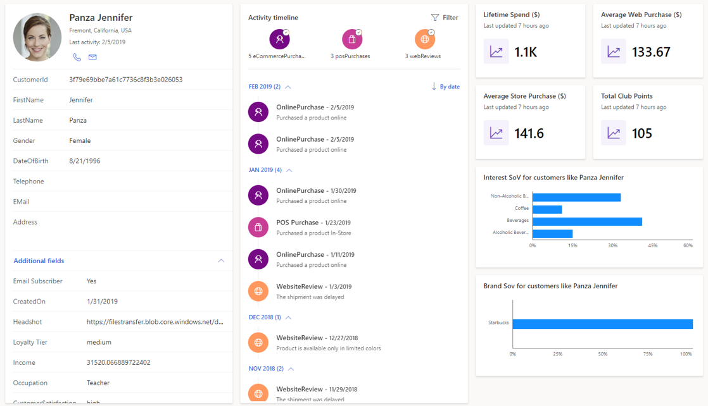

يساعدك Dynamics 365 Customer Insights على بناء فهم أعمق لعملائك، لمساعدتك على قيادة رحلات عملاء على درجة عالية من التخصيص. من خلال الاتصال بالبيانات من مصادر مختلفة تتعلق بالحركات والسلوكيات والمراقبة، يمكنك إنشاء عرض شامل لعملائك.

> [!div class="mx-imgBorder"]
> 

باستخدام Customer insights بإمكان مؤسستك:

- **إزالة مستودعات البيانات وتوحيد بيانات العملاء** - يمكنك توصيل البيانات وتوحيدها من خلال موصلات تم إنشاؤها مسبقاً بمصادر البيانات الشائعة التي تجلب بيانات الحركات والمراقبة والسلوكيان الأكثر أهمية بالنسبة لك.

    باستخدام توصيات الذكاء الاصطناعي والتعلم الآلي، يمكنك حل هويات العملاء عبر هذه المصادر. ونتيجة لذلك، سيكون لديك ملف تعريف عميل واحد وموحد يوفر رؤى متعمقة حول العميل.

- **الإثراء من معلومات الجمهور** - باستخدام الوظائف المضمنة التي تستخدم Microsoft Graph، يمكنك إنشاء ملف تعريف عميل أكثر ثراءً يقوم بدمج معلومات الجمهور.

- **تقديم تجارب عملاء شخصية** - من خلال الرؤى السياقية المبتكرة وبطاقات ملفات تعريف العملاء المخصصة، يمكنك إدخال هذه البيانات بسرعة في تطبيقات الأعمال التي تستخدمها كل يوم لزيادة التسويق والمبيعات والخدمة بشكل أفضل.

  - تتيح لك ملفات تعريف العملاء المخصصة ومقاييس الأعمال وشرائح العملاء تحديد العناصر الأكثر أهمية لمؤسستك وأتمتة المزيد من التجارب التي تركز على العملاء.

  - يتم تضمين الرؤى في تطبيقات خط الأعمال المخصصة التي تم إنشاؤها على [Microsoft Power Platform](https://cloudblogs.microsoft.com/dynamics365/2019/01/29/the-microsoft-power-platform-empowering-millions-of-people-to-achieve-more/?azure-portal=true).
        تضمن هذه الميزة تزويد موظفيك بالبيانات الصحيحة في سياق كيفية عملهم مع العملاء في تلك اللحظة.

في الجزء المتبقي من هذه الوحدة النمطية، سنقدم لك مختلف الإمكانات وسنوضح لك كيفية الشروع في العمل مع التطبيق.
