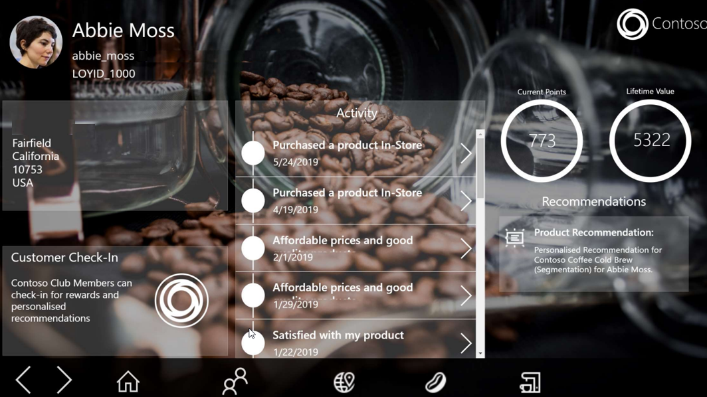

تساعدك رؤى الجمهور، وهي إحدى إمكانيات Dynamics 365 Customer Insights، على بناء فهم أعمق لعملائك. من خلال الاتصال بالبيانات من مختلف المصادر المتعلقة بالحركات والمصادر السلوكية والمصادر المتعلقة بالملاحظة، يمكنك إنشاء عرض شامل 360 درجة لعملائك.

> [!div class="mx-imgBorder"]
> 

باستخدام رؤى الجمهور، يمكن لمؤسستك:

- **إزالة مستودعات البيانات وتوحيد بيانات العملاء** - يمكنك توصيل البيانات وتوحيدها من خلال موصلات تم إنشاؤها مسبقاً بمصادر البيانات الشائعة التي تجلب بيانات المعاملات والمراقبة والسلوك الأكثر أهمية بالنسبة لك.

  باستخدام توصيات الذكاء الاصطناعي والتعلم الآلي، يمكنك حل هويات العملاء عبر هذه المصادر. ونتيجة لذلك، سيكون لديك ملف تعريف عميل واحد وموحد يوفر رؤى متعمقة حول العميل.

- **الإثراء من معلومات الجمهور** - باستخدام الوظائف المضمنة التي تستخدم Microsoft Graph، يمكنك إنشاء ملف تعريف لعميل أكثر ثراءً يقوم بدمج معلومات الجمهور.

- **تقديم تجارب العملاء الشخصية** - من خلال الرؤى السياقية المبتكرة وبطاقات ملفات تعريف العملاء المخصصة، يمكنك إدخال هذه البيانات بسرعة في تطبيقات الأعمال التي تستخدمها كل يوم لزيادة التسويق والمبيعات والخدمة بشكل أفضل.

  - تتيح لك ملفات تعريف العملاء المخصصة ومقاييس الأعمال وشرائح العملاء إمكانية تحديد ما هو أكثر أهمية لمؤسستك وأتمتة المزيد من التجارب التي تركز على العملاء.

  - يتم تضمين الرؤى في تطبيقات خط الأعمال المخصصة التي تم إنشاؤها على [Microsoft Power Platform](https://cloudblogs.microsoft.com/dynamics365/2019/01/29/the-microsoft-power-platform-empowering-millions-of-people-to-achieve-more/?azure-portal=true). تضمن هذه الميزة تزويد موظفيك بالبيانات الصحيحة في سياق كيفية عملهم مع العملاء في تلك اللحظة.

## تحديد الجمهور

ستختلف كل مؤسسة في أنواع العملاء الذين يتعاملون معها. تركز بعض المؤسسات بشكل أساسي على استهداف الشركات، بينما يستهدف البعض الآخر العملاء الأفراد.

ويمكن أن يتضمن مثيل رؤى الجمهور الفردي ما يلي:

- **حسابات الأعمال متاجرة عمل-عمل (B2B)** - الجماهير المستهدفة الأساسية هي حسابات المؤسسات أو جهات اتصال الشركات.

- **العملاء الفرديون متاجرة عمل-مستهلك (B2C)** - الجمهور المستهدف الأساسي هو الأفراد.

عندما تقوم بتعريف بيئة ما، ستحتاج أولاً إلى تحديد نوع الجمهور الذي تريد استهدافه. بعد إنشاء بيئة تستهدف نوعاً واحداً من الجمهور، ستحتاج البيئة التالية التي تقوم بإنشائها إلى استهداف النوع الآخر من الجمهور. على سبيل المثال، إذا كنت قد أضفت بالفعل بيئة متاجرة عمل-مستهلك (B2C) إلى المثيل الخاص بك، فستحتاج البيئة التالية التي تقوم بإنشائها في المثيل إلى استهداف عملاء متاجرة عمل-عمل (B2B).

إذا تم إعداد كلا النوعين من البيئات في عملية التوزيع الخاص بك، يمكنك التبديل بينهما حسب الحاجة.

> [!div class="mx-imgBorder"]
> 

## طرق عمل "رؤى الجمهور"

تقوم "رؤى الجمهور" باستيعاب البيانات من كافة مصادر البيانات المختلفة وتوحدها في ملف تعريف عميل واحد. بعد أن يكون لديك ملف تعريف موحد، يمكنك استخدام عناصر مثل المقاييس وإثراء البيانات. ومن ملف تعريف العميل، يمكنك تعقب البيانات عبر مختلف المجموعات السكانية وتحديد الاتجاهات بالاستناد إلى البيانات التي تريد تعقبها.

> [!div class="mx-imgBorder"]
> 

وعلى مستوى أعلى، تتضمن هذه العملية الإجراءات التالية:

- **استيعاب البيانات** - تحديد مصادر البيانات التي تأتي منها بياناتك. يمكن استيعاب البيانات من مجموعة كبيرة من مصادر البيانات من خلال الموصلات المضمنة التي تتصل بالعديد من موفري البيانات المختلفين.

- **إنشاء ملفات تعريف العملاء** - يتم إنشاء ملفات تعريف العملاء من خلال توحيد البيانات التي يتم استيعابها من مصادر بياناتك المختلفة في ملف تعريف واحد.

  تتكون عملية التوحيد من ثلاث خطوات:

  - **الخريطة** - تحديد الكيانات والحقول من بياناتك التي سيتم استخدامها لتحديد سجل العميل كرقم العميل.

  - **المطابقة:** تحديد كيفية دمج مجموعات البيانات الخاصة بك في ملف تعريف موحد من خلال مجموعة من القواعد التي تشير إلى الحقول التي سيتم استخدامها أثناء عملية المطابقة.

  - **الدمج** - إكمال العملية وتسوية أي تعارضات قد تكون موجودة.

- **تعريف الأنشطة‬** - تساعد الأنشطة في دمج أنشطة العملاء عبر مصادر البيانات ووضعها في طريقة عرض المخطط الزمني. قد تمثل هذه الأنشطة تفاعلات أو عمليات شراء.

- **تحديد العلاقات** - العلاقات تربط كياناتك ببعضها وتقوم بإنشاء رسم بياني لبياناتك.

- **تعريف المقاييس** - تمثل المقاييس التحليلات التي تعكس أداء أعمالك وسلامتها على أفضل وجه. قد تمثل هذه المقاييس مستويات الرضا أو أهداف الإيرادات أو مستويات الأداء.

- **إثراء البيانات** - تساعدك عمليات الإثراء على فهم طبيعة عملائك بشكل أفضل باستخدام البيانات التكميلية التي توفرها Microsoft والمصادر الخارجية لتوفير مزيد من التفاصيل، مثل التقارب التجاري والولاءات أو التفاصيل المالية.

- **بناء التوقعات** - تتيح لك نماذج التوقع استخدام قوة الذكاء الاصطناعي لعمل توقعات عن البيانات الخاصة بك، مثل ما إذا كان العميل مستعداً لشراء شيء ما أو إذا كان في خطر عدم تجديد الاشتراك. يمكنك استخدام نماذج التوقعات الجاهزة أو استخدام النماذج الخاصة بك التي قمت بإنشائها باستخدام أدوات مثل Microsoft Azure.

- **إنشاء شرائح** - باستخدام الشرائح، يمكنك تجميع عملائك بسهولة بالاستناد إلى سمات العملاء السكانية أو السمات المتعلقة بالحركات أو السلوك.

- **تنشيط البيانات** - بعد إنشاء مثيل رؤى الجمهور، يمكنك استخدام المعلومات الموجودة في رؤى الجمهور (المقاييس والأنشطة والرؤى) في التطبيقات، مثل تطبيقات Microsoft Dynamics 365 الأخرى وMicrosoft Power Apps وإعلانات LinkedIn وGoogle Ads والمزيد.

## مثال

يعمل Mark كمرحب في أحد متاجر Contoso Coffees للبيع بالتجزئة. وأثناء دخول العملاء إلى المتجر، يقوم Mark بتسجيل أسمائهم وأرقام هواتفهم في تطبيق الترحيب الذي تستخدمه شركة Contoso. وبعد ذلك، يقوم Mark بإرسال العملاء إلى أحد ممثلي المتجر الذين يمكنهم مساعدتهم. بعد التقاط معلومات العميل في تطبيق الترحيب، الذي تدعمه البيانات في Customer Insights، سيقوم Mark بتزويد ممثل المتجر بصورة كاملة عن هوية العميل.

سيتضمن وصف العميل هذا ما يلي:

- جميع الأنشطة الحديثة عبر نقاط اللمس المختلفة لشركة Contoso.

- رصيد نقاط المكافأة الحالية للعميل.

- المبلغ الذي أنفقه العميل طوال حياته مع شركة Contoso.

- توصيات المنتج استناداً إلى أنماط الشراء السابقة.

> [!div class="mx-imgBorder"]
> 

والآن بعد أن تعرفت على رؤى الجمهور على مستوى عالٍ، يمكنك استكشاف خيار قدرة آخر لـ Customer Insights.
