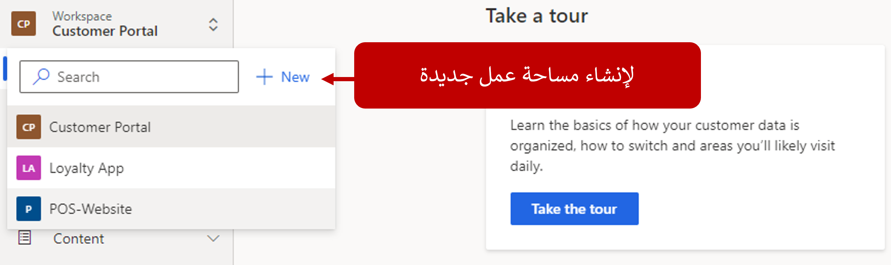
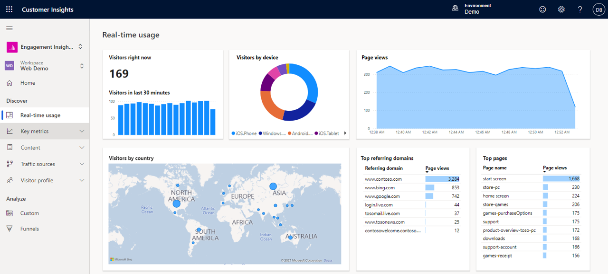
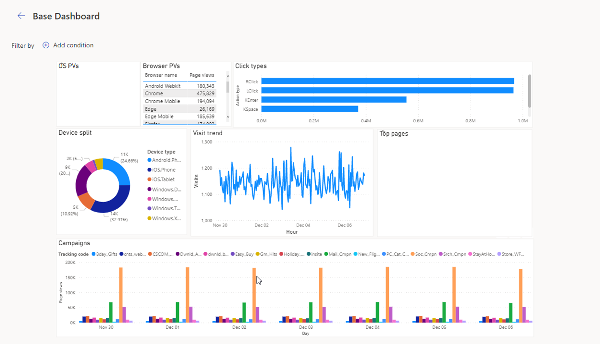
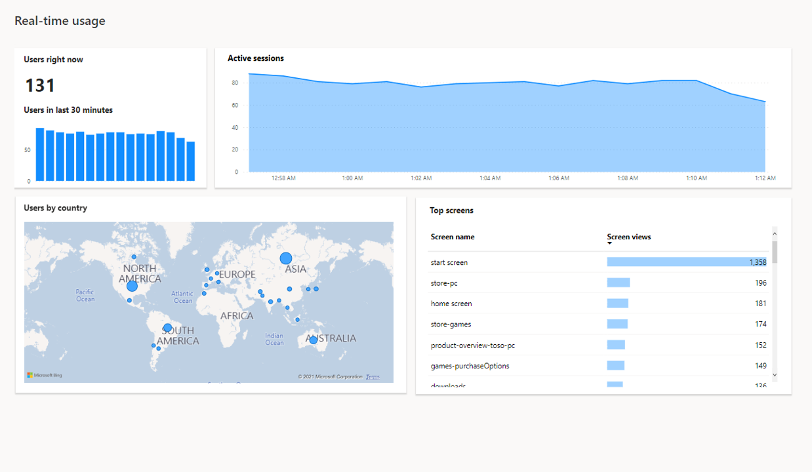

لفهم من هم العملاء والأمور الهامة لهم، تحتاج إلى الحصول على عرض موحد لعملائك ومعرفة كيف يستخدم العملاء المنتجات والخدمات الخاصة بك. على سبيل المثال، توفر العديد من المؤسسات تطبيقات ولاء لعملائها. عند وصول المستخدمين إلى هذه التطبيقات، يتم عرضها غالباً مع العروض والخصومات وغيرها من المعلومات لتحسين تجربتها مع مؤسستك. إذا كان بإمكانك تحليل نشاط المستخدم في التطبيق، يمكنك تحديد المناطق التي تكون في حاجة إلى التحسين وبناء خبرات أفضل.

[رؤى المشاركة](https://dynamics.microsoft.com/ai/customer-insights/engagement-insights-capability/?azure-portal=true)، هي إحدى إمكانيات Dynamics 365 Customer Insights، والتي تمكنك أنت ومؤسستك من عرض كيفية استخدام العملاء لخدماتك ومنتجاتك من خلال المقاييس التفاعلية. يمكنك إنجاز هذا الهدف، بشكل فردي وكلي، عبر مواقع ويب وتطبيقات الأجهزة المحمولة والمنتجات المتصلة. عند جمع المعلومات في رؤى المشاركة التي تتضمن تفاصيل رؤى الجمهور، سيكون لديك حلاً قوياً يمكن أن يساعدك على الحصول على المزيد من الفهم لعملائك.

> [!div class="mx-imgBorder"]
> 

بفضل إمكانية رؤى المشاركة، يمكنك:

- **تعقب تفاعلات الويب**

  - تجميع سلوك العملاء وقياسه وفهمه على موقع الويب الخاص بك.

  - استخدام التقارير الجاهزة للوصول التفاعلي إلى مقاييس الموقع لإظهار عدد الزائرين الصحيح لموقع الويب الخاص بك.

  - البحث عن تفاصيل حول الزيارات وطرق عرض الصفحات وحركة المرور المرجعية والتعرّف على الصفحات بأفضل أداء.

- **ادمجها مع رؤى الجمهور**

  - قم بربط بيئات من كلا الإمكانيات بحيث يمكنك مشاركة البيانات بشكل ثنائي الاتجاه بين رؤى المشاركة ورؤى الجمهور.

  - استخدم ملفات التعريف الموحدة والشرائح التي تقوم بإنشائها في رؤى الجمهور لتوفير مزيد من خيارات التحليل في رؤى المشاركة.

  - قم بتصدير واستخدام الأحداث ذات القيمة التجارية العالية من رؤى المشاركة لإضافة البيانات إلى ملفات التعريف الموحدة في رؤى الجمهور.

- **تحليل البيانات السلوكية** - قم بإنشاء أبعاد ديموغرافية لتقسيم البيانات السلوكية. بعد ذلك، استخدم خصائص ملف التعريف هذا في تحليل تفاعلي للبيانات السلوكية، بما في ذلك البيانات التي يتم التقاطها بواسطة رؤى المشاركة على موقع الويب الخاص بك أو تطبيق الاجهزة المحمولة.

- **إنشاء معلومات** - توفر رؤى المسار البيانات والتقارير لإعلام القرارات وتحديد المناطق لتحسين الأداء وتحسينات المعالجة. تساعد هذه الميزة في التعرف على المسارات التي يتخذها العملاء قبل قيامهم بالشراء.

- **إنشاء تقارير مخصصة** - يسمح لك منشئ التقرير المخصص بإنشاء المرئيات الخاصة بك استناداً إلى [القياسات](/dynamics365/customer-insights/engagement-insights/glossary/?azure-portal=true#metric) و [الأبعاد المحددة](/dynamics365/customer-insights/engagement-insights/glossary/?azure-portal=true#dimensions). تقوم هذه المرئيات بإنشاء طرق العرض التي تحتاجها للإجابة على أسئلة العمل.

قبل اكتشاف تفاصيل رؤى المشاركة، ضع في اعتبارك المفاهيم والمصطلحات الشائعة التالية التي يتم استخدامها في التطبيق.

| المفهوم | الوصف‏‎ |
|---------|-------------|
| **الحدث الأساسي** | مجموعة من البيانات التي تمثل نشاطاً على موقع ويب، مثل طريقة عرض الصفحة أو انقر فوق. |
| **الأبعاد** | سمات الأحداث التي يمكنها وصف البيانات أو تصفيتها أو تجميعها. على سبيل المثال، يمكنك تحديد نظام التشغيل، أو المتصفح، أو اسم الصفحة كبعد في التقرير. |
| **الحدث** | يمثل سلوك المستخدم. سيتم تسجيل حدث عند قيام المستخدم بعرض صفحة (عرض الحدث) أو تفاعل مع المحتوى (إجراء الحدث). |
| **البيئة** | مساحة يمكن أن تحتوي على مساحة عمل واحدة أو أكثر. يمكنك استخدام بيئة لإدارة مساحات العمل والاتصالات بإمكانية الرؤى الخاصة بالجمهور في Customer Insights. |
| **عضو** | المستخدمون الذين يمكنهم الوصول إلى مساحة العمل. يمكن أن يكون للأعضاء أدوار، والتي ستسمح للمستخدم بإدارة مساحة العمل والبيانات الخاصة بها وعرض التقارير. |
| **مقياس** | المقياس الكمي للبيانات المستخدمة لتتبع عملية أو تقييمها، مثل طرق عرض الصفحة ومتوسط الوقت المستغرق. |
| **الأحداث المنقحة** | يستخدم لتبسيط الأحداث الأساسية للتصدير أو لإزالة الخصائص من حدث غير ضروري للعرض أو التصدير. |
| **الإبلاغ** | مجموعة من مجموعات مرئيات البيانات التي تساعدك على قياس سلوك المستخدم وفهمه. |
| **مساحة عمل** | تخزن الأحداث والتقارير وتقوم بإدارتها. تسمح لك بعرض نشاط المستخدم في الوقت الحقيقي. عند تقوم بإنشاء مساحة عمل، حدد نوع البيانات التي ستقوم بإرسالها إلى مساحة العمل. |

## الشروع في العمل برؤى المشاركة

عندما تقوم بفتح رؤى المشاركة لأول مرة، سيتم توجيهك إلى مساحة العمل الافتراضية الخاصة بالبيئة. تخزن مساحة العمل الأحداث والتقارير وتقوم بإدارتها.

توفر رؤى المشاركة نوعين من مساحات العمل:

- **الويب** - يستخدم لتحليل تفاصيل حركة المرور لموقع ويب، مثل الشخص الذي يزور موقعك والمدة التي يظل بها في الموقع والمكان الذي يأتي منه والمزيد.

- **الهاتف المحمول** - لتحليل حركة المرور والمعلومات الخاصة بالمستخدمين لتطبيقات محددة، مثل الأشخاص الذين يستخدمون التطبيق والشاشات التي تستخدمها والمدة التي يقومون بها بالعمل علي تلك الشاشات.

يمكن أن تحتوي بيئة رؤى المشاركة على مساحات عمل متعددة، اعتماداً على ما تقوم بتحليله. على سبيل المثال، قد يكون لدى مؤسستك موقعين مختلفين وتطبيقات العميل المستخدمة في التفاعل مع العملاء. في رؤى المشاركة، يتم تمثيل هذه البيئة بثلاث مساحات عمل.

> [!div class="mx-imgBorder"]
> 

تتكون مساحة العمل من ناحيتين مختلفتين للتقارير:

- **اكتشاف** - تعرض التقارير التي توفر تفاصيل حول استهلاك المحتوى ونشاط المستخدم.

- **تحليل** - يوفر أدوات لتحليل البيانات للتحليل التفصيلي للتفاصيل التي يمكنك استخدامها لإملاء إجراءات الأعمال التي ترغب في استخدامها للمضي قدماً.

استناداً إلى نوع مساحة العمل، ستواجه غالباً مقاييس وبيانات مختلفة تحت كل عنوان.

توضح الأقسام التالية ما سيواجهك عادةً لمساحات عمل الويب.

### اكتشاف

تتضمن منطقة تقارير **اكتشاف** المكونات التالية:

- **استخدام الوقت الحقيقي** - يوفر نظرة عامة عالية المستوى لتفاصيل الوقت الحقيقي المرتبطة بموقع الويب الذي يتم تعقبه في رؤى المشاركة، مثل عدد الزائرين وطرق عرض الصفحة وغير ذلك من التفاصيل.

- **المقاييس الأساسية** - تعرض القياسات الهامة المتعلقة بموقعك، بما في ذلك التفاصيل الخاصة بزيارة موقعك.

- **المحتوى** - يساعدك على فهم المحتوى الذي يتم استهلاكه، مثل الروابط التي يتم تحديدها والصفحات التي يترك الأشخاص موقعك منها.

- **مصادر حركة المرور** - تساعدك على تعقب المصادر المختلفة التي توجه حركة مرور إلى الموقع الخاص بك، بما في ذلك المواقع التي تشير إلى الأشخاص.

- **ملف تعريف الزائر** - يوفر التفاصيل المتعلقة بالأشخاص الذين يقومون بزيارة الموقع الخاص بك. تتضمن هذه التفاصيل الأجهزة التي يستخدمها الأشخاص وأنظمة التشغيل وتفاصيل الموقع.

> [!div class="mx-imgBorder"]
> 

### التحليل

تتضمن منطقة تقارير **التحليل** المكونات التالية:

- **مخصص** - يوفر الوصول إلى التقارير المخصصة التي قمت بإنشائها والمرتبطة بهذا المثيل.

- **المسارات** - توفر الوصول إلى تقارير المسارات المختلفة التي تم إنشاؤها في التطبيق.

> [!div class="mx-imgBorder"]
> 

### اكتشاف (الهاتف المحمول)

توفر مساحات عمل الهواتف المحمولة نفس الخيارات المتوفرة ضمن منطقة **التحليل**، ولكن ستكون خيارات منطقة **اكتشاف** ستكون خيارات مختلفة:

- **استخدام الوقت الحقيقي** - يوفر نظرة عامة عالية المستوى لتفاصيل الوقت الحقيقي المرتبطة بموقع الويب الذي يتم تعقبه في رؤى المشاركة، مثل عدد الزائرين وطرق عرض الصفحة وغير ذلك من التفاصيل.

- **التطبيق** - يوفر تفاصيل مهمة تتعلق باستهلاك التطبيق. قد تتضمن التفاصيل أي من شاشات التطبيق يتم الوصول إليها، وتفاصيل جلسة العمل، والأحداث التي تحدث في التطبيق.

- **المستخدم** - يوفر التفاصيل المتعلقة بالمستخدمين الذين يستهلكون التطبيق، مثل الإصدار الخاص بالتطبيق الذي يستخدمونه وتفاصيل الجهاز وتفاصيل الموقع.

> [!div class="mx-imgBorder"]
> 
