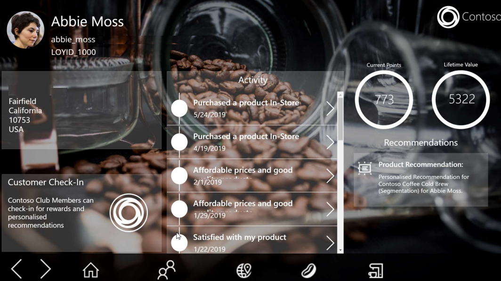

عادةً، لن يصل معظم المستخدمين النهائيين إلى بيانات Customer Insights مباشرةً من تطبيق Customer Insights. وسوف يستخدمون بيانات Customer Insights في التطبيقات التي يستخدمونها كل يوم. على سبيل المثال، قد يستخدم أحد المسوقين المقاطع التي تم إنشاؤها في Customer Insights في تطبيق تسويق مثل Dynamics 365 Marketing. قد تقوم مؤسسة مبيعات بإظهار بيانات Customer Insights في نظام CRM الخاص بها لمساعدة موظف المبيعات على توفير أفضل تجارب عملاء بوجه عام.

للوصول إلى هذه النقطة، ستحتاج إلى إنشاء بيئة Customer Insights الخاصة بك لدعم احتياجات المؤسسة. وعلى مستوى عالٍ، تتضمن العملية:

- **استيعاب البيانات** - تحديد مصادر البيانات التي تأتي منها بياناتك.
    يمكن استيعاب البيانات من مجموعة كبيرة من مصادر البيانات من خلال الموصلات المضمنة التي تتصل بالعديد من موفري البيانات المختلفين.

- **إنشاء ملفات تعريف العملاء** - يتم إنشاء ملفات تعريف العملاء من خلال توحيد البيانات التي يتم استيعابها من مصادر بياناتك المختلفة في ملف تعريف واحد.

    تتكون عملية التوحيد من ثلاث خطوات:

  - **الخريطة** - تحديد الكيانات والحقول من بياناتك التي سيتم استخدامها لتحديد سجل العميل كرقم سجل.

  - **المطابقة:** تحديد كيفية دمج مجموعات البيانات الخاصة بك في ملف تعريف موحد من خلال مجموعة من القواعد التي تشير إلى الحقول التي سيتم استخدامها أثناء عملية المطابقة.

  - **الدمج** - إكمال العملية وتسوية أي تعارضات قد تكون موجودة.

- **تعريف الأنشطة‬** - تساعد الأنشطة في دمج أنشطة العملاء عبر مصادر البيانات ووضعها في طريقة عرض المخطط الزمني. قد تمثل هذه الأنشطة تفاعلات أو عمليات شراء.

- **تحديد العلاقات** - العلاقات تربط كياناتك ببعضها وتقوم بإنشاء رسم بياني لبياناتك.

- **تعريف المقاييس** - تمثل المقاييس التحليلات التي تعكس أداء أعمالك وسلامتها على أفضل وجه. قد تمثل هذه المقاييس مستويات الرضا أو أهداف الإيرادات أو مستويات الأداء.

- **إثراء البيانات** - تساعدك عمليات الإثراء على فهم طبيعة عملائك بشكل أفضل باستخدام البيانات التكميلية التي توفرها Microsoft والمصادر الخارجية لتوفير مزيد من التفاصيل، مثل التقارب التجاري والولاءات أو التفاصيل المالية.

- **بناء التوقعات** - تتيح لك نماذج التوقع استخدام قوة الذكاء الاصطناعي لعمل توقعات عن البيانات الخاصة بك، مثل ما إذا كان العميل مستعداً لشراء شيء ما أو إذا كان في خطر عدم تجديد الاشتراك.
    يمكنك استخدام نماذج التوقعات الجاهزة أو استخدام النماذج الخاصة بك التي قمت بإنشائها باستخدام أدوات مثل Microsoft Azure.

- **إنشاء شرائح** - باستخدام الشرائح، يمكنك تجميع عملائك بسهولة بالاستناد إلى سمات العملاء السكانية أو السمات المتعلقة بالحركات أو السلوك.

- **تنشيط البيانات** - بعد إنشاء المثيل الخاص بك، يمكنك استخدام المعلومات (المقاييس والأنشطة والرؤى) في التطبيقات، مثل تطبيقات Microsoft Dynamics 365 الأخرى وMicrosoft Power Apps وLinkedIn Ads وGoogle Ads والمزيد.

## تنشيط البيانات

هيا لنلقِ نظرة على مثال لتنشيط البيانات:

يعمل Mark كمرحب في أحد متاجر Contoso Coffees للبيع بالتجزئة. وأثناء دخول العملاء إلى المتجر، يقوم Mark بتسجيل أسمائهم وأرقام هواتفهم في تطبيق الترحيب الذي تستخدمه شركة Contoso. وبعد ذلك، يقوم Mark بإرسال العملاء إلى أحد ممثلي المتجر الذين يمكنهم مساعدتهم. بعد التقاط معلومات العميل في تطبيق الترحيب، الذي تدعمه البيانات في Customer Insights، سيقوم Mark بتزويد ممثل المتجر بصورة كاملة عن هوية العميل.

سيتضمن وصف العميل هذا ما يلي:

- جميع الأنشطة الحديثة عبر نقاط اللمس المختلفة لشركة Contoso.

- رصيد نقاط المكافأة الحالية للعميل.

- المبلغ الذي أنفقه العميل طوال حياته مع شركة Contoso.

- توصيات المنتج استناداً إلى أنماط الشراء السابقة.

> [!div class="mx-imgBorder"]
> 
