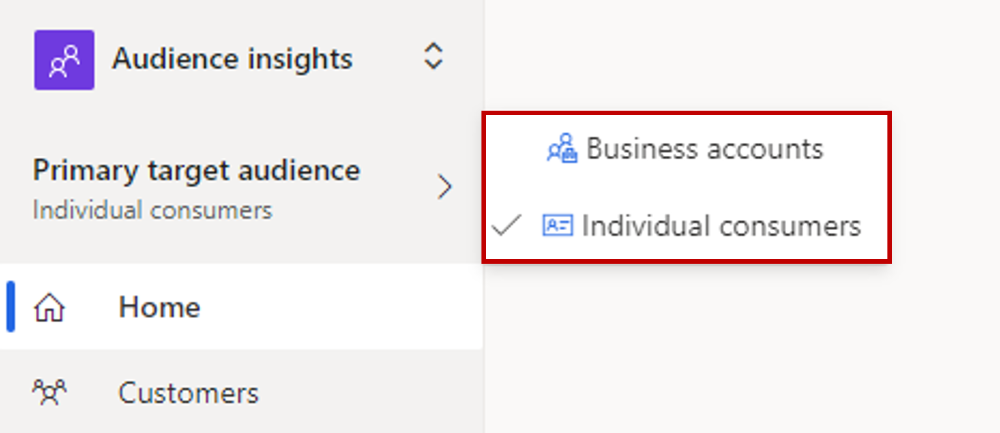

ستختلف كل مؤسسة في أنواع العملاء الذين يتعاملون معها.
تركز بعض المؤسسات بشكل أساسي على استهداف الشركات، بينما يستهدف البعض الآخر العملاء الأفراد.

ويمكن أن يتضمن مثيل فردي ما يلي:

- **حسابات الأعمال متاجرة عمل-عمل (B2B)** - الجماهير المستهدفة الأساسية هي حسابات المؤسسات أو جهات اتصال الشركات.

- **العملاء الفرديون متاجرة عمل-مستهلك (B2C)** - الجمهور المستهدف الأساسي هو الأفراد.

عندما تقوم بتعريف بيئة ما، ستحتاج أولاً إلى تحديد نوع الجمهور الذي تريد استهدافه. بعد إنشاء بيئة تستهدف نوعاً واحداً من الجمهور، ستحتاج البيئة التالية التي تقوم بإنشائها إلى استهداف النوع الآخر من الجمهور. على سبيل المثال، إذا كنت قد أضفت بالفعل بيئة متاجرة عمل-مستهلك (B2C) إلى المثيل الخاص بك، فستحتاج البيئة التالية التي تقوم بإنشائها في المثيل إلى استهداف عملاء متاجرة عمل-عمل (B2B).

إذا تم إعداد كلا النوعين من البيئات في عملية التوزيع الخاص بك، فيمكنك التبديل بينهما حسب الحاجة.

> [!div class="mx-imgBorder"]
> 

## الشروع في العمل

تقوم Customer Insights باستيعاب البيانات من مصادر بياناتك المختلفة وتوحدها في ملف تعريف عميل واحد. بعد أن يكون لديك ملف تعريف موحد، يمكنك استخدام عناصر مثل المقاييس وإثراء البيانات. ومن ملف تعريف العميل، يمكنك تعقب البيانات عبر مختلف المجموعات السكانية وتحديد الاتجاهات بالاستناد إلى البيانات الأساسية التي تريد تعقبها.

تظهر أنواع الرؤى التي يمكنك أن تتوقع رؤيتها على الصفحة الرئيسية في الصورة التالية.

> [!div class="mx-imgBorder"]
> 

من القائمة الرئيسية، سيتوفر لديك حق الوصول إلى كافة ميزات التطبيق المختلفة، وفقًا لاحتياجاتك.

توفر لك القائمة الرئيسية حق الوصول إلى الإمكانات التالية:

- **الصفحة الرئيسية** - توفر نظرة عامة مركزية حول بيانات الرؤى والتقسيم المتوفرة التي تم تعريفها لمؤسستك.

- **العملاء** - توفر حق الوصول إلى بطاقات عملاء فريدة بالاستناد إلى ملفات التعريف الموحّدة للعملاء.

- **الشرائح** - تسمح لك بتعريف كيفية تجميع العملاء وتصنيفهم بالاستناد إلى سمات سكانية أو سمات حركات أو سلوك مماثلة.

- **القياسات** - تعرّف الأعمال الرئيسية مؤشرات الأداء الأساسية (KPI) الخاصة بالعميل مثل القيمة العمرية للعميل، ومتوسط قيمة الشراء وتكرار الشراء، ومستوى رضا العميل (CSAT)، وتعرّف العملاء ذوي القيمة العالية.

- **البيانات** - تُستخدم لاستيعاب البيانات من مصادر بيانات مختلفة لإنشاء ملف تعريف عميل موحد. ويسمح لك أيضاً قسم البيانات بتعريف المعلمات التالية:

  - **الأنشطة** - تسمح لك بأخذ أنشطة من مصادر مختلفة وجعها متاحة معًا بترتيب زمني.

  - **العلاقات** - تربط الكيانات ببعضها للمساعدة في تعريف القياسات والشرائح من جميع مصادر البيانات المضمنة بشكل أفضل.

  - **الإثراء** - يكشف عن بيانات حول التجاذب للمئات من العلامات التجارية والعشرات من فئات الاهتمامات. مع العلم بأن هذه الصلات تُستخرج لملفات التعريف التي قد تكون مشابهة لعملائك.

- **المسؤول** - إدارة الأدوار والأذونات ووجهات التصدير لشرائح العملاء.

## العمل مع العملاء

بعد تعريف جميع الأنشطة والعلاقات والقياسات والشرائح المستخدمة لتعقب البيانات واستخدامها، ستتمكن من استخدام هذه البيانات لاكتساب رؤية أعمق لعملائك من خلال صفحة **العملاء**. تمثل صفحة **العملاء** طريقة عرض مدمجة لكل عميل بالاستناد إلى بيانات ملف التعريف التي قمت بجمعها من جميع مصادر بياناتك. بإمكان العملاء أن يكونوا أفراداً أو مؤسسات. من داخل صفحة **العملاء**، يمكنك البحث عن العملاء وتحديد موقعهم.

> [!div class="mx-imgBorder"]
> 

يتم تمثيل كل ملف تعريف عميل بواسطة إطار متجانب لبطاقة العميل. وستعرض بطاقة العميل معلومات مختلفة بعض الشيء، وهذا يتوقف على ما إذا كان العميل فرداً أم مؤسسة. يمكنك استخدام الأزرار الموجودة في الجانب الأيسر السفلي من صفحة **العملاء** للتنقل عبر صفحات جميع ملفات تعريف العملاء المتوفرة.

> [!IMPORTANT]
> لن تتمكن من الوصول إلى صفحة **العملاء** إلا عندما يقوم مسؤول مؤسستك بتعريف سمة واحدة على الأقل قابلة للبحث على شاشة **فهرس البحث والتصفية**. إذا لم يتم تنفيذ هذه الخطوة، فسينقلك التطبيق إلى شاشة **فهرس البحث والتصفية**‬. عند تعريف سمة واحدة على الأقل كقابلة للبحث، ستتمكن من رؤية صفحة **العملاء‏‎**.
