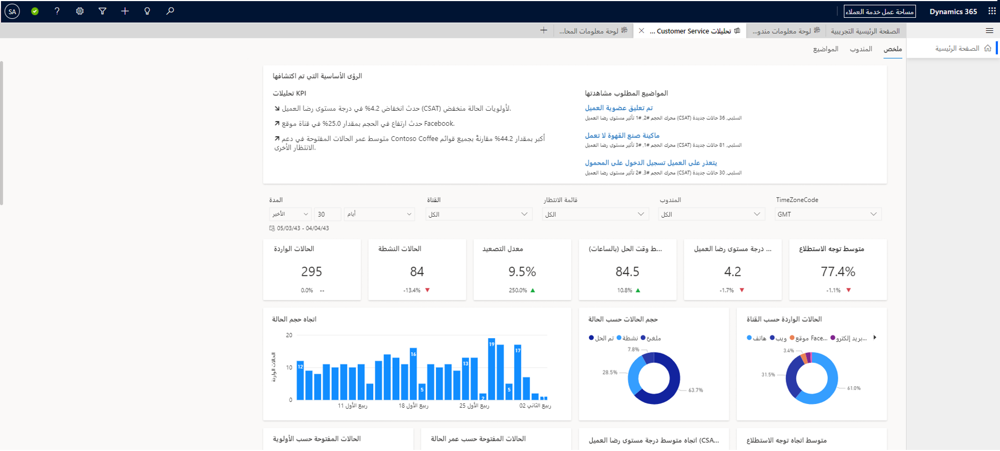
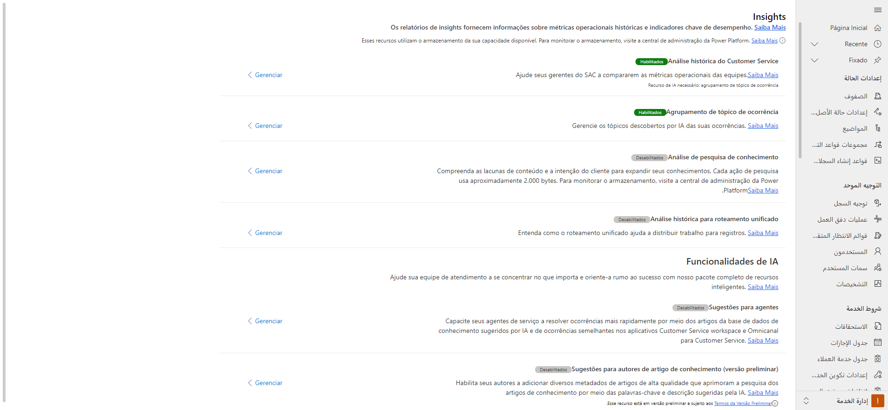

يساعد Dynamics 365 Customer Service Insights كلاً من المندوبين ومديري خدمة العملاء على اتخاذ قرارات أفضل وتحسين رضا العملاء. يمكن للمندوبين والعملاء استخدام إمكانات الذكاء الاصطناعي والتحليلات لـ Customer Service Insights و"القناة متعددة الاتجاهات لـ Customer Service". يمكنك تمكين فِرقك برؤى حول رضا العملاء - تعزيز التحليلات والميزات المدعومة بالذكاء الاصطناعي لقضاء وقت أقل في البحث والمزيد من الوقت في التعامل مع العملاء.

> [!IMPORTANT]
> لم يعد تطبيق الويب Customer Service Insights المستقل متاحاً بعد 8 ديسمبر 2021. لا يمكنك استخدام الخدمة المستقلة بعد هذا التاريخ. ستستمر ميزات Customer Service Insights المضمّنة في التطبيقات الأساسية في التوافر والدعم.

لمساعدة فريق الخدمة لديك على التركيز على الأمور المهمة وتوجيههم نحو النجاح، تستخدم إمكانات الذكاء الاصطناعي المتميزة في Customer Service Insights تقنية الذكاء الاصطناعي المتقدمة في فهم اللغة الطبيعية وإنشاء اللغة الطبيعية. بصفتك مندوباً، يمكنك استخدام حالات مماثلة في الوقت الفعلي واقتراحات مقالة معرفية مخصصة للسياق الحالي. تسمح التكنولوجيا التي تعتمد على الذكاء الاصطناعي للمندوبين بالمساعدة في حل مشكلات العملاء بسرعة أكبر، وتحسين معدلات الدقة، ورضا العملاء.

في Customer Service و"القناة متعددة الاتجاهات لـ Customer Service"، يتم تضمين هذه الإمكانات بعمق في تجارب المندوب والمدير الأساسية.

> [!div class="mx-imgBorder"]
> 

يتصل Customer Service Insights ببيانات Dynamics 365 Customer Service و"القناة متعددة الاتجاهات لـ Customer Service" لتزويد مؤسسة الدعم بإمكانيات الذكاء الاصطناعي وBI الجاهزة، مثل تحليلات خدمة العملاء، واقتراحات الحالة المماثلة والمزيد. ستُظهر التطبيقات المختلفة مجموعات ميزات مختلفة قليلاً، كما هو مفصل أدناه.

## مقدمة حول Customer Service Insights

تم تضمين Customer Service Insights في مركز Dynamics 365 Customer Service وتطبيقات "Customer Service workspace".

تتيح لك هذه التجربة البدء في رؤية التحليلات التاريخية مباشرة داخل بيئة Customer Service، بعد تمكين Customer Service Insights. يمكن لفريق الإدارة الخاص بك عرض العديد من التقارير ولوحات المعلومات.

يمكن للمستخدمين عرض تقارير Customer Service Insights مع مجموعة من تحليلات BI وAI Insights لمؤسستهم. تستخدم التقارير فهم اللغة الطبيعية لاكتشاف اللغة المستخدمة في حالات الدعم تلقائياً وتجميع حالات الدعم ذات الصلة في موضوعات.

تتضمن إمكانيات Customer Service Insights المضمّنة في Customer Service ما يلي:

- التحليلات التاريخية

- تجميع الموضوعات للحالات

- تحليلات البحث عن المعرفة

- اقتراحات الذكاء الاصطناعي (AI) للمقالات المعرفية والحالات المماثلة

- Customer Service Analytics في Power BI

## الرؤى في القناة متعددة الاتجاهات لـ Customer Service

توفر Customer Service Insights لـ "القناة متعددة الاتجاهات لـ Customer Service" لخدمة العملاء العديد من نفس المقاييس والميزات التشغيلية الرئيسية في عمليات مركز الاتصال اليومية. يساعد تحليل آراء العملاء في الوقت الفعلي، جنباً إلى جنب مع اقتراحات الذكاء الاصطناعي السياقية للحالات ذات الصلة والمقالات المعرفية، المندوبون على تقليل إحباط العملاء وأوقات حل الحالة. يمكنك استخدام بيانات المشاعر في الوقت الفعلي لاكتساب فهم أفضل لكيفية قيام تفاعلات العملاء بتحفيز مؤشرات KPI ودرجات الرضا، باستخدام لوحة معلومات تحليل المشاعر.

تتضمن إمكانات Customer Service Insights المضمنة في "القناة متعددة الاتجاهات لـ Customer Service" ما يلي:

- رصد المحادثات والاتجاهات

- تحليل آراء العملاء في الوقت الفعلي

## تمكين Customer Service Insights

Customer Service Insights معطلة بشكل افتراضي. يمكنك تمكين وتكوين ميزات Customer Service Insights والخدمات لـ Dynamics 365 Customer Service ومشاركتها مع مديري الخدمة، الذين يمكنهم بعد ذلك عرض الأنشطة المختلفة التي تم تنفيذها وتحليلها. يتم الإعداد في مركز خدمة العملاء، ولكنه ينطبق على كل من مركز خدمة العملاء و"Customer Service workspace".

> [!div class="mx-imgBorder"]
> 

يتم تكوين كل تقرير من تقارير Customer Service Insights بشكل منفصل.
