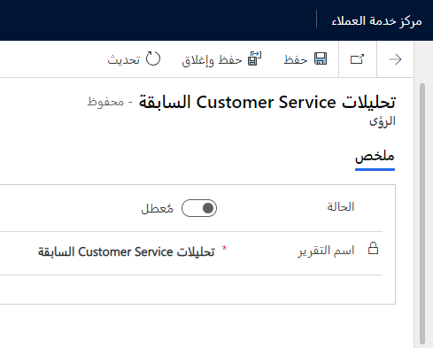

تتكون Customer Service Insights من تقارير مختلفة وإمكانيات الذكاء الاصطناعي. يتطلب كل مكوّن من هذه المكونات تمكيناً وتكويناً منفصلين.

## تكوين التحليلات التاريخية لخدمة العملاء

لتمكين تقرير التحليلات التاريخية لخدمة العملاء، انتقل إلى **إدارة الخدمة** > **Insights** > **الإعدادات**. على يمين التحليلات التاريخية لخدمة العملاء، انقر فوق **إدارة**.

> [!div class="mx-imgBorder"]
> 

قم بتبديل **الحالة** إلى **ممكّن** وحدد **حفظ وإغلاق**، في صفحة التحليلات التاريخية لخدمة العملاء.

> [!NOTE]
> يؤدي تمكين التحليلات التاريخية لخدمة العملاء أيضاً إلى تمكين تجميع الموضوعات لميزة الحالة.

يمكن أن يستغرق توفير التقرير ما يصل إلى 24 ساعة. بعد هذا الوقت، يمكنك عرض التقرير بالانتقال إلى **الخدمة** > **Insights** > 
**تحليلات Customer Service السابقة**.

### الأمان للتحليلات التاريخية

سيتمكن المستخدمون ممن لديهم دور أمان "مسؤول النظام" من عرض التقارير. للسماح للمستخدمين الآخرين بإمكانية الوصول إلى تقارير الإحصاءات ولوحات المعلومات، تحتاج إلى تعديل دور الأمان الخاص بهم وإضافة امتيازات إلى جدول التحليلات التاريخية لخدمة العملاء كما هو موضح في لقطة الشاشة التالية.

> [!div class="mx-imgBorder"]
> 

## تكوين مجموعات الموضوع

يعتمد تجميع الموضوع للحالة على تقرير التحليلات التاريخية لخدمة العملاء ويجب تمكين هذه الميزة أولاً.

يوفر "الملخص" و"النموذج" تشغيل الملخص في صفحة "مجموعات الموضوع" معلومات أساسية حول كيفية نمذجة الموضوع ونتائجه.

- سمات البيانات المستخدمة.

- العدد الإجمالي للموضوعات التي تم إنشاؤها.

- النسبة المئوية للحالات التي تم تصنيفها بحسب الموضوع.

- التردد وآخر تشغيل للنموذج.

> [!div class="mx-imgBorder"]
> 

### تعيين البيانات

يتم استخدام عنوان الحالة لتجميع الموضوع بشكل افتراضي. يمكنك التغيير إلى عمود نص آخر في جدول الحالة يوفر أفضل وصف لمشكلات العميل، ضمن "تعيين البيانات".

### تنظيف البيانات

إذا كان عنوان الحالة يتضمن معلومات غريبة مثل اسم المنتج أو حالة الحالة أو العلامات المرجعية، فيمكن أن تكون الموضوعات التي تم إنشاؤها بواسطة نموذج تجميع الموضوع مضللة.

عن طريق تحديد إعدادات تنظيف البيانات لتجاهل العلامات في العناوين وتجاهل عبارات معينة، يمكنك تحسين جودة النتائج المعروضة في مخططات AI Insights.

> [!div class="mx-imgBorder"]
> 

### أتمتة الموضوع

غالباً ما تكون الموضوعات التي تحددها التحليلات التاريخية لـ Customer Service من المرشحين الرئيسيين كموضوعات في روبوتات دردشة Power Virtual Agents.

يمكنك إتاحة هذه الموضوعات لإضافة روبوتات دردشة Power Virtual Agents الخاصة بك عن طريق ضبط زر التبديل على **ممكّن** وتحديد **حفظ**.

> [!div class="mx-imgBorder"]
> 

## تكوين تحليلات البحث عن المعرفة

لتمكين تحليلات البحث في معرفة Customer Service، انتقل إلى **إدارة الخدمة** > **Insights** > **الإعدادات**. انقر فوق **إدارة** على يمين تحليلات البحث في المعرفة.

> [!div class="mx-imgBorder"]
> 

في صفحة تحليلات البحث في "المعرفة"، قم بتبديل **الحالة** إلى **ممكّن** وحدد **حفظ وإغلاق**.

يمكن أن يستغرق توفير التقرير ما يصل إلى 24 ساعة. بعد هذا الوقت، يمكنك عرض التقرير بالانتقال إلى **الخدمة** > **Insights** > 
**تحليلات البحث في المعرفة**.

### الأمان لتحليلات البحث عن المعرفة

سيتمكن المستخدمون ممن لديهم دور أمان "مسؤول النظام" من عرض التقارير. للسماح للمستخدمين الآخرين بالقدرة على الوصول إلى لوحات المعلومات وتقارير تحليلات البحث عن "المعرفة"، تحتاج إلى تحرير دور الأمان الخاص بهم وإضافة امتيازات إلى جدول تحليلات البحث في المعرفة.

## تكوين اقتراحات الذكاء الاصطناعي

لتمكين تحليلات البحث في معرفة Customer Service، انتقل إلى **إدارة الخدمة** -> **Insights** > **الإعدادات**. انقر فوق **إدارة** على يسار "الاقتراحات".

> [!div class="mx-imgBorder"]
> 

في صفحة "الاقتراحات"، قم بتبديل **الحالة** إلى **ممكّن** للحالات المماثلة واقتراحات المقالة المعرفية وحدد **حفظ**.

### تعيين البيانات للاقتراحات

يتم استخدام عنوان الحالة هو وصف الحالة لحالات مماثلة، بشكل افتراضي. يمكنك تحديد أعمدة نصية أخرى في جدول الحالة الذي يوفر أفضل الخيارات لتحديد الحالات المماثلة، ضمن "تعيين البيانات". يمكنك أيضاً تغيير الأعمدة المستخدمة في اقتراحات المقالة المعرفية.
