توفر Microsoft تطبيق Power BI الذي يمكنك تثبيته وتكوينه للحصول على مزيد من الأفكار حول بيانات خدمة العملاء.

يوفر تطبيق Power BI هذا رؤى حول أداء خدمة العملاء من خلال مجموعة من لوحات معلومات المشرف التي تساعد على تعقب المقاييس التشغيلية الرئيسية لضمان أن المندوبين يقدمون دعماً عالي الجودة للعملاء.

تساعد هذه المقاييس المشرفين على فهم تجربة الدعم الشاملة جنباً إلى جنب مع كيفية أداء كل مندوب وكل قائمة انتظار بمرور الوقت.

يمكن للمشرفين استخدام لوحات المعلومات هذه لأداء المهام التالية:

- مراقبة المقاييس التشغيلية لخدمة العملاء عبر قوائم الانتظار والمندوبين.

- التنقل في كل حالة/نشاط على تطبيق مركز خدمة العملاء من طريقة عرض القائمة.

يجب عليك تنفيذ الخطوات التالية لتكوين تطبيق Power BI وإضافة لوحات المعلومات إلى تطبيق ‏‫مركز خدمة العملاء‬.

## المتطلبات الأساسية

لاستخدام لوحات المعلومات، يجب أن يكون لديك امتيازات إدارية لكل من Dynamics 365 وMicrosoft Power BI. جميع المستخدمين الذين يرغبون في الوصول إلى لوحة المعلومات يحتاجون أيضاً إلى ترخيص Power BI Pro أو Power BI premium.

## تثبيت تطبيق Dynamics 365 Customer Service Analytics

يتوفر تطبيق Dynamics 365 Customer Service Analytics من AppSource. قم بالوصول إلى تطبيق [Customer Service Analytics for Dynamics 365](https://aka.ms/cs-analytics?azure-portal=true) لتثبيته.

> [!div class="mx-imgBorder"]
> [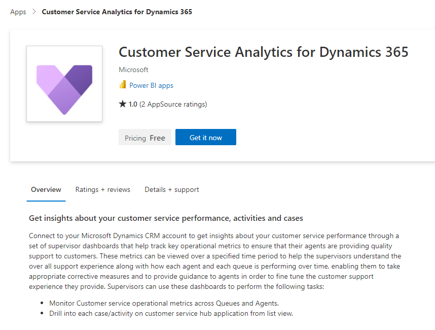](../media/3-power-bi-app.png#lightbox)

انقر فوق **احصل عليه الآن** ثم حدد **تثبيت**.

> [!div class="mx-imgBorder"]
> [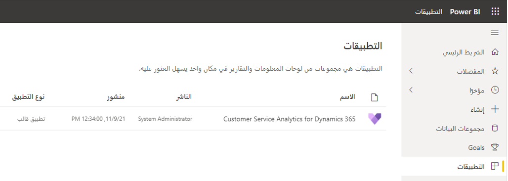](../media/3-app-in-power-bi.png#lightbox)

بمجرد تثبيت التطبيق، انقر فوق التطبيق لفتحه. سترى لوحة المعلومات بدون بيانات.

> [!div class="mx-imgBorder"]
> [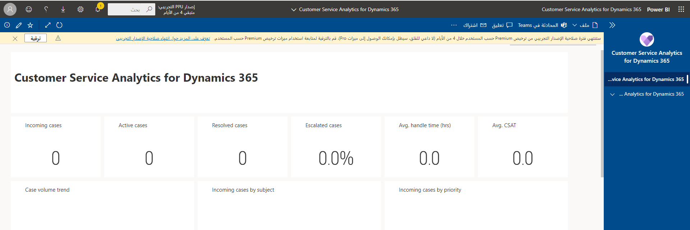](../media/3-power-bi-sample-data.png#lightbox)

## توصيل بيئة Dynamics 365 بتطبيق Customer Service Analytics

في التطبيق في Power BI، انقر فوق **توصيل بياناتك**.

أدخل عنوان URL لجذر الخدمة الخاص ببيئة Dynamics 365. يجب أن يشتمل عنوان URL هذا على المسار إلى API ويب‬ لبيئتك ويجب أن يبدو كما يلي: `https://{your environment}.api.crm11.dynamics.com/api/data/v9.2/`.

> [!NOTE]
> للعثور على عنوان URL الخاص ببيانات جذر الخدمة لـ Microsoft Dynamics 365، انتقل إلى **إعدادات متقدمة** > **تخصيصات** > **موارد المطور** في مركز Dynamics 365 Customer Service.

حدد **التالي**، وحدد **OAuth2** لطريقة المصادقة و **تنظيمي** لإعداد الخصوصية.

> [!div class="mx-imgBorder"]
> [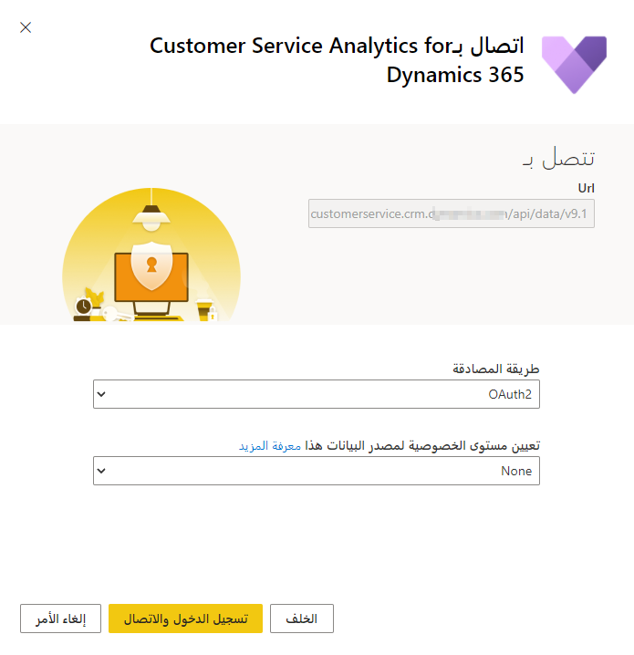](../media/3-connect.png#lightbox)

انقر فوق **تسجيل الدخول والاتصال**. سجّل الدخول باستخدام بيانات اعتماد Dynamics 365. سيتم تحديث تقارير ولوحات معلومات Power BI ببياناتك.

## تكوين معدل تكرار التحديث على مجموعة بيانات Power BI

من المقرر أن يتم تحديث مجموعة البيانات في Power BI كل 24 ساعة بشكل افتراضي. يمكنك تعديل الجدول في إعدادات مجموعة البيانات بناءً على ترخيص Power BI.

## نشر التطبيق داخل مؤسستك

يجب عليك مشاركة تطبيق Power BI الذي تم تكوينه مع مؤسستك بالكامل للمشرفين لعرض لوحات معلومات وتقارير Customer Service Analytics باستخدام حسابات Power BI Proالخاصة بهم.

افتح مساحة العمل للتطبيق وانقر على **تحديث التطبيق**.

> [!div class="mx-imgBorder"]
> [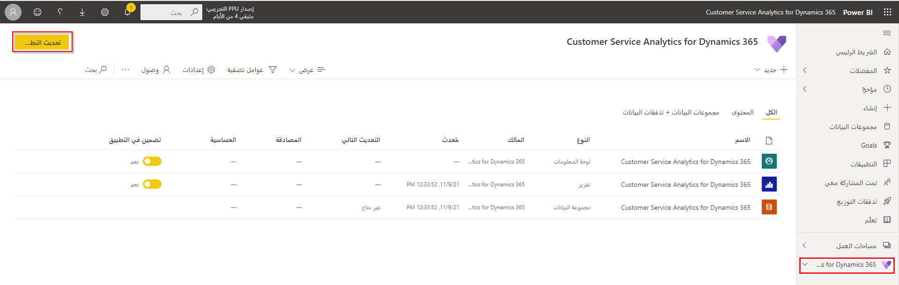](../media/3-update-app-in-workspace.png#lightbox)

افتح علامة تبويب الأذونات وحدد **المؤسسة بالكامل** وانقر على **تحديث التطبيق**. التطبيق متاح الآن للتثبيت لجميع الأفراد في مؤسستك.

## تمكين تقارير Power BI

تحتاج إلى تمكين إعداد تقارير Power BI في Dynamics 365 للمشرفين لعرض لوحات معلومات Power BI.

في مركز إدارة [Power Platform](https://admin.powerplatform.microsoft.com/?azure-portal=true)، حدد **إعدادات** لبيئة Dynamics 365 الخاصة بك.

انتقل إلى **المنتج** > **الميزات** وقم بتبديل تضمين مرئيات **Power BI** إلى **تشغيل** وانقر على **حفظ**.

> [!div class="mx-imgBorder"]
> [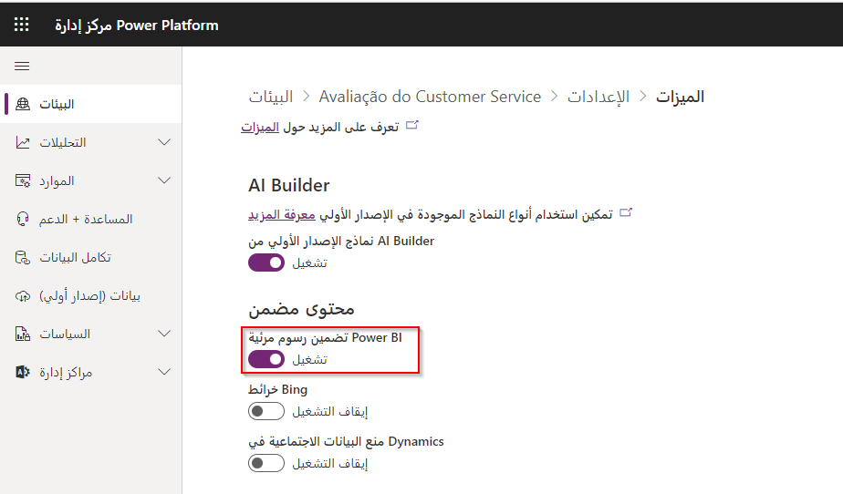](../media/3-toggle-features.png#lightbox)

## إضافة لوحة معلومات Power BI مضمنة إلى مركز خدمه العملاء

يمكنك تضمين لوحة معلومات Power BI في مركز خدمة العملاء للمستخدمين.

انتقل إلى [مدخل منشئ Power Apps](https://make.powerapps.com?azure-portal=true) وحدد **الحلول**. ابحث عن **الحل الافتراضي لـ Common Data Services** وحرره.

> [!div class="mx-imgBorder"]
> [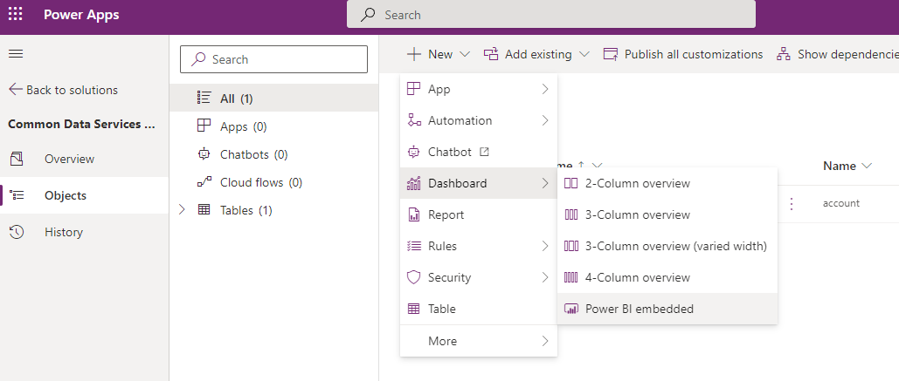](../media/3-create-dashboard.png#lightbox)

انقر فوق **+ جديد** وحدد **لوحة المعلومات** ثم حدد **Power BI Embedded**.

> [!div class="mx-imgBorder"]
> [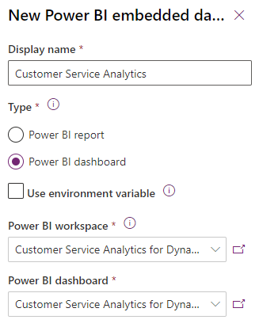](../media/3-new-power-bi-embedded.png#lightbox)

أدخل اسماً للوحة المعلومات وحدد مفتاح تبديل **لوحة المعلومات Power BI**. بالنسبة إلى مساحة العمل، حدد **Customer Service Analytics for Dynamics 365**. للوحة المعلومات، حدد **Customer Service Analytics for Dynamics 365** ثم انقر فوق **حفظ**. انقر فوق **نشر كل التخصيصات**.

في [مدخل منشئ Power Apps](https://make.powerapps.com) انتقل إلى التطبيقات وقم بتحرير تطبيق مركز خدمة العملاء.

> [!div class="mx-imgBorder"]
> [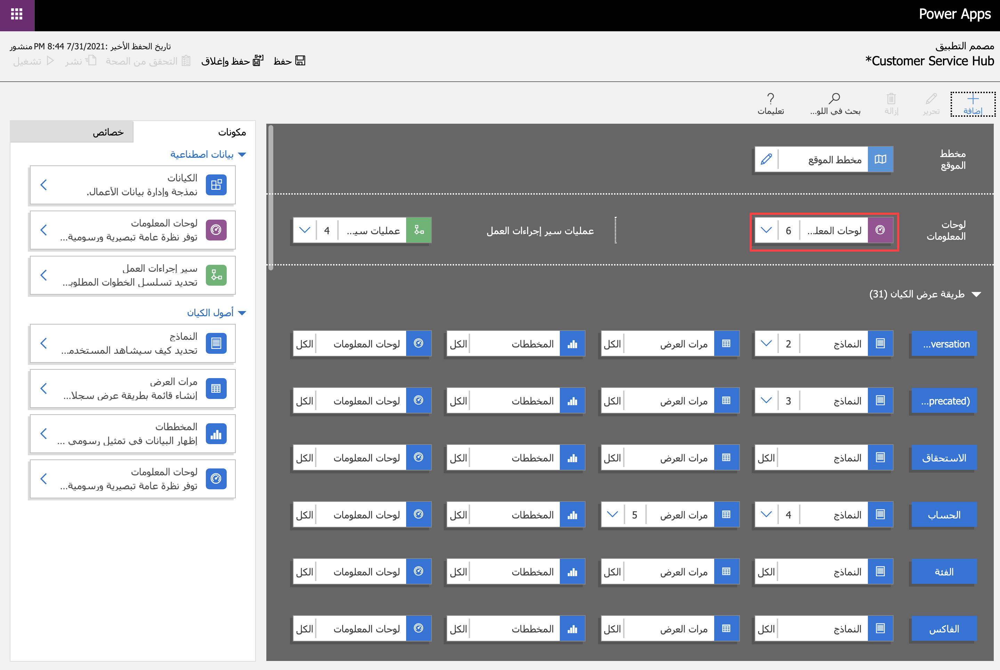](../media/3-app-designer.png#lightbox)

في مصمم التطبيق، حدد **لوحات المعلومات** وتحقق من لوحة معلومات Customer Service Analytics Power BI التي أنشأتها وانقر على **حفظ** وانقر فوق **نشر**.

ستكون لوحة معلومات Customer Service Analytics for Dynamics 365 Power BI متاحة الآن في مركز خدمة العملاء.

## إضافة لوحة المعلومات الشخصية Power BI إلى مركز خدمه العملاء

يمكن للمستخدمين أيضاً إضافة لوحات معلومات Power BI إلى مركز Dynamics 365 Customer Service كلوحات معلومات شخصية عن طريق الانتقال إلى **‬‏‫العمل الخاص بي** > **لوحات المعلومات** ثم تحديد **+ جديد** > **لوحة معلومات Power BI**.

> [!div class="mx-imgBorder"]
> [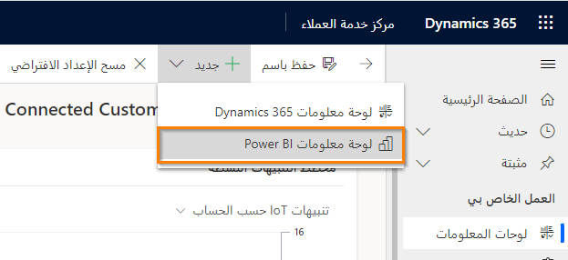](../media/3-dashboard-menu.png#lightbox)

بالنسبة إلى مساحة العمل، حدد **Customer Service Analytics for Dynamics 365**. للوحة المعلومات، حدد **Customer Service Analytics for Dynamics 365** ثم انقر فوق **حفظ**.

> [!div class="mx-imgBorder"]
> [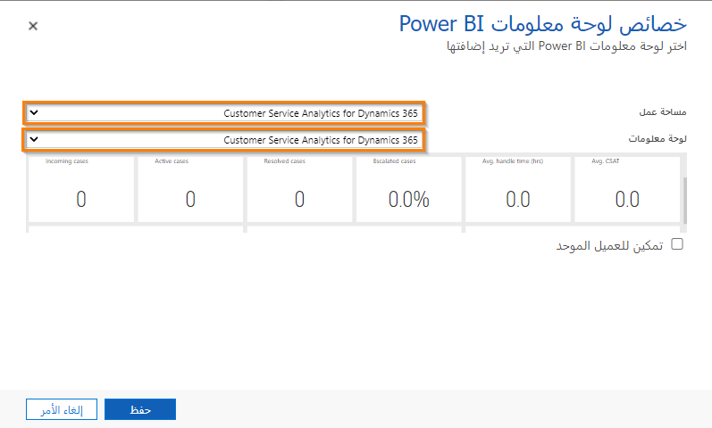](../media/3-dashboard-properties.png#lightbox)

ستكون لوحة معلومات Customer Service Analytics for Dynamics 365 Power BI متاحة الآن في مركز خدمة العملاء.

> [!div class="mx-imgBorder"]
> [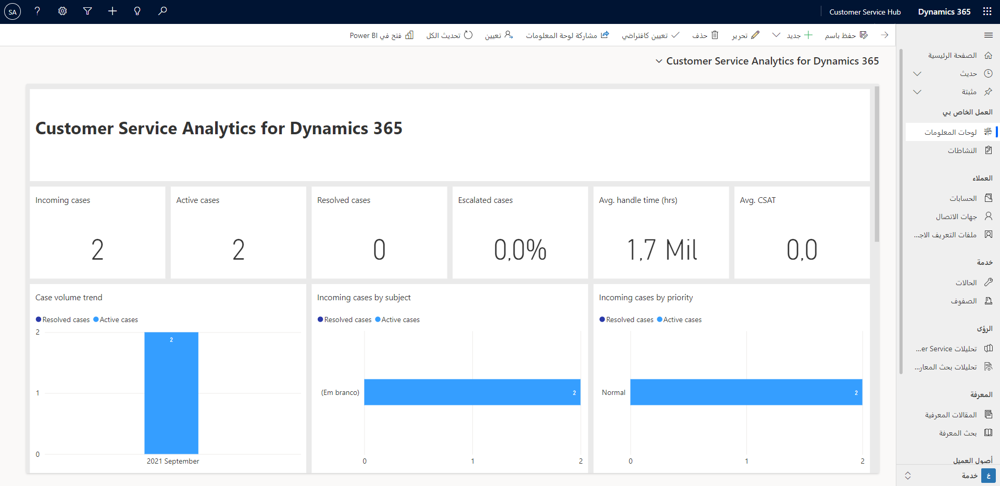](../media/3-power-bi-dashboard-in-dynamics-365.png#lightbox)

## لوحات المعلومات والتقارير وفي تطبيق Customer Service Analytics Power BI

يحتوي تطبيق Customer Service Analytics Power BI على ما يلي:

- **لوحة معلومات Customer Service Analytics**: توفر معلومات موجزة حول مقاييس التشغيل التاريخية ومؤشرات الأداء الأساسية (KPI) لإدارة مراكز الاتصال بشكل فعال.

- **تقرير الملخص**: يوفر مؤشرات الأداء الأساسية (KPI) والمقاييس عبر الحالات ويمنح المشرفين القدرة على تصفية طريقة العرض.

- **تقرير المندوب**: يوفر مؤشرات الأداء الأساسية (KPI) والمقاييس عبر قوائم الانتظار والمندوبين ويمنح المشرفين القدرة على تصفية طريقة العرض.

- **تفاصيل التقرير**: يوفر عرضاً تفصيلياً للحالات والأنشطة التي يمكنك استخدامها للتعمق في كل حالة أو نشاط للمساعدة في حل مشكلات العملاء. يوجهك الرابط الموجود في هذا التقرير إلى تطبيق مركز خدمة العملاء أو تطبيق خدمة العملاء.
