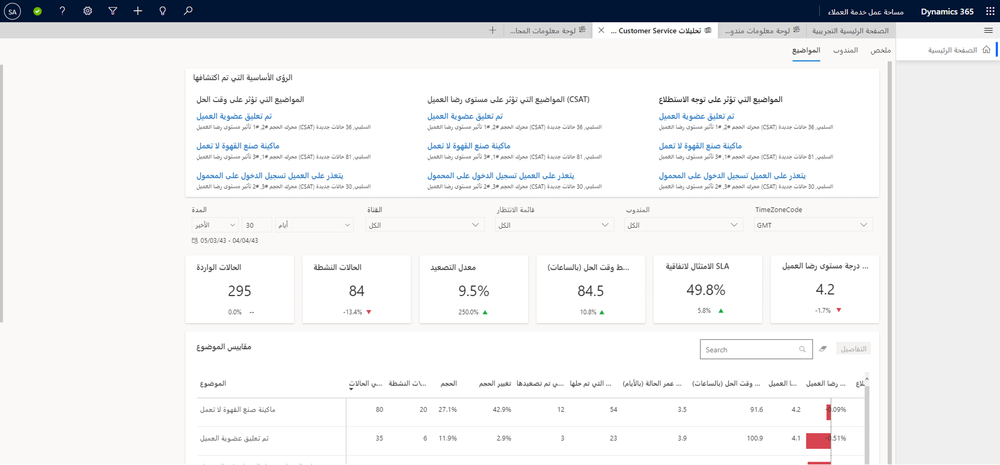

تحتوي لوحات معلومات Customer Service Insights على مجموعة مخططات متنوعة التي تعرض لك مؤشرات الأداء الرئيسية (KPI) لنظام خدمة العملاء. وتوفر هذه المخططات طريقة عرض رسومية لاتجاهات وتصنيفات حالات الدعم وتستخدم تكنولوجيا الذكاء الاصطناعي لتمييز حالات الدعم التي تؤثر بشكل أكبر على النظام. لوحات المعلومات هي المكونات الأساسية التي يمكن أن تساعدك في الحصول على مجموعة متنوعة من الرؤى التحليلية لمساعدتك على تحسين أداء النظام.

تغطي لوحات معلومات Customer Service والقناة متعددة الاتجاهات لـ Customer Service وإدارة المعرفة. تمنحك لوحات معلومات خدمة العملاء ملخص الأداء بالإضافة إلى التقارير التفصيلية الخاصة بالمندوبين والموضوعات. وبالمثل، تقدم لوحات المعلومات للقناة متعددة الاتجاهات لـ Customer Service عرضاً لعملية الدعم عبر القنوات. بالنسبة لمديري المعرفة، توفر تحليلات بحث المعرفة نتيجة تحليلات في شروط البحث التي يتم استخدامها من قبل المندوبين لكشف المحتوى المطلوب لحل مشاكل المندوبين.

## لوحة معلومات تحليلات خدمة المندوبين السابقة

تتوفر تقارير لوحة المعلومات التالية لتحليلات خدمة المندوبين السابقة:

- **ملخص**: إظهار نظرة عامة على مؤشرات KPI لخدمة العملاء لقوائم الانتظار والقنوات والمندوبين.

- **المندوب**: إظهار المخططات ومؤشرات KPI لمندوبين فرديين والأداء العام للمندوب.

- **الموضوعات**: إظهار تصنيف تفصيلي للحالات والمواضيع المخصصة لها.

## تقرير ملخص

توفر لك لوحة معلومات الملخص نظرة عامة شاملة لتجربة خدمة العملاء في مؤسستك. حيث تستخدم الذكاء الاصطناعي لتوفر تحليلات المواضيع الناشئة حديثاً ذات الحجم الأكبر والتي تتضمن أعلى معدل تغيير في الحجم.

> [!div class="mx-imgBorder"]
> 

لعرض لوحة معلومات الملخص، انتقل إلى **الخدمات** > **الرؤى** > 
**التحليلات السابقة لخدمه المندوبين** وحدد علامة التبويب **الملخص**.

تشتمل لوحة معلومات ملخص مؤشر الأداء الأساسي على مجموعة مخططات متنوعة تتضمن طرق عرض رسومية لمؤشرات KPI للنظام.

تستخدم برامج تشغيل وحدات التخزين الخاصة بالحالات ووحدة تخزين الحالات الناشئة بواسطة المخططات الموضوعة لغة فهم طبيعية لتجميع حالات الدعم كموضوعات مجموعة من الحالات ذات الصلة. تظهر هذه المخططات موضوعات دعم العملاء التي تقوم بإنشاء معظم وحدات التخزين والمواضيع الناشئة باستخدام أعلى معدل للتغيير في وحدة التخزين، مما يساعدك على تحديد مناطق التحسين التي يمكن أن يكون لها التأثير الأكبر على أداء النظام.

### تقرير ملخص بطاقة الرؤى الرئيسية

تستخدم الرؤى الرئيسية الذكاء الاصطناعي لتمييز العناصر التي قد تتطلب الانتباه. تحتوي بطاقة الرؤى الرئيسية علي منطقتين.

- **رؤى KPI**: الموضوعات الهامة التي تؤثر على الأداء، مثل رضا العميل (CSAT) المتعلق بالأولوية، ووحدة التخزين المتعلقة بالقناة وفتح الحالات المتعلقة بقوائم الانتظار.

- **موضوعات للمعاينة**: الموضوعات التي تحتل مرتبة عالية في المناطق الثلاثة الرئيسية لتسهيل عملية اكتشاف مديري خدمة العملاء للمشاكل الأساسية.

### مؤشرات KPI لتقرير ملخص

تلخص مخططات ملخص مؤشر الأداء الأساسي - تعمل على تلخيص مؤشرات KPI للفترة الزمنية المحددة والنسبة المئوية للتغيير خلال الفترة.

تعرض لك لوحة المعلومات بشكل افتراضي مؤشرات KPI للـ 30 يوماً الماضية ولجميع القنوات وقوائم الانتظار والمندوبين في النظام. تسمح لك خيارات تصفية البيانات بتحديد بيانات لفترات زمنية معينة وقنوات وقوائم انتظار والمندوبين. لتصفية البيانات حسب المدة، أو القناة، أو قائمه الانتظار، أو المندوب، حدد قيمة من القائمة المنسدلة الخاصة بالقائمة.

> [!NOTE]
> إذا قمت بالتبديل إلى لوحة معلومات مختلفة، فسيستمر عامل التصفية الذي تحدده في العمل وسيتم تطبيقه على البيانات الموجودة في كافة لوحات المعلومات.

يعرض هذا الجدول مؤشرات KPI التي يتم عرضها في التقرير.

|مؤشر الأداء الأساسي (KPI)|الوصف‏‎|
|----|----|
|الحالات الواردة|عدد الحالات التي تم إنشاؤها لدعم العملاء.|
|الحالات النشطة|عدد الحالات المفتوحة حالياً.|
|الحالات التي تم تصعيدها|النسبة المئوية للحالات التي تم تصعيدها.|
|متوسط وقت الحل|متوسط المدة الزمنية بالساعات التي يحتاج إليها المندوب دقة الحالة.|
|متوسط درجة مستوى رضا العميل (CSAT)‬|متوسط درجة مستوى رضا العميل، استناداً إلى استطلاع Customer Voice الذي أرسله العميل.|
|متوسط درجة توجه الاستطلاع|متوسط درجة التوجه، استناداً إلى التعليقات المكتوبة لاستطلاع Customer Voice التي أرسلها العميل.|

يتم عرض المقاييس التالية كمخططات.

|المخطط|الوصف‏‎|
|----|----|
|اتجاه حجم الحالة|اتجاه يومي لحجم الحالات.|
|حجم الحالات حسب الحالة|تصنيف تفصيلي لحجم الحالات حسب الحالة.|
|الحالات الواردة حسب القناة|تصنيف تفصيلي للحالات حسب القناة.|
|الحالات المفتوحة حسب الأولوية|تصنيف تفصيلي للحالات حسب مستوى الأولوية.|
|الحالات المفتوحة حسب العمر|تصنيف تفصيلي للحالات حسب المدة الزمنية بالحالة المفتوحة.|
|متوسط اتجاه مستوى رضا العميل (CSAT)|اتجاه سنوي لحجم الحالة.|
|متوسط اتجاه درجة توجه الاستطلاع|اتجاه سنوي لدرجة مستوى رضا العميل (CSAT)‬‬ من الردود على استطلاع Customer Voice.|
|أفضل 10 مواضيع استناداً إلى الحجم|أفضل 10 مواضيع اكتشفها الذكاء الاصطناعي حسب حجم الحالات.|
|حجم الحالات الناشئة حسب الموضوع|أفضل المواضيع الناشئة التي اكتشفها الذكاء الاصطناعي استناداً إلى زيادة في حجم الحالات.|
|مقاييس الحالة حسب القناة|نظرة عامة على مقاييس المندوب الأساسية‬ حسب القناة.|
|مقاييس الحالة|نظرة عامة على مقاييس الحالة الأساسية فيما يتعلق بالقياسات والتواريخ الأخرى.|

يشير المؤشر الأزرق لأعلى ولأسفل الموجود بجوار مؤشر القيمة إلى تغيير النسبة المئوية في اتجاه موجب. يشير المؤشر الأحمر إلى تغيير النسبة في الاتجاه السالب.

## تقرير المندوب

تعرض لوحة معلومات المندوب المخططات ومؤشرات KPI التي يمكنك استخدامها لإرشاد المندوبين وفهم إجمالي لأداء المندوب.

> [!div class="mx-imgBorder"]
> 

لعرض لوحة معلومات المندوب، انتقل إلى **الخدمات** > **الرؤى** > 
**التحليلات السابقة لخدمه العملاء** وحدد علامة التبويب **مندوب**.

تظهر لوحة المعلومات المخططات ومؤشرات KPI للمندوبين الفرديين والأداء العام للمندوب.

### بطاقة الرؤى الرئيسية لتقرير المندوب

تستخدم الرؤى الرئيسية الذكاء الاصطناعي لتمييز العناصر التي قد تتطلب الانتباه. تظهر بطاقة الرؤى الرئيسية لتقرير المندوب ما يلي.

- **المندوبون**: المندوبون الذين لديهم مشكلات حول وحدات تخزين الحالة أو أوقات الدقة.

- **مستوى رضا العميل**: رؤى مهمة من نتائج تعليقات مستوى رضا العميل (CSAT).

- **التوجه**: رؤى مهمة من تعليقات مستوى رضا العميل CSAT المكتوبة.

> [!div class="mx-imgBorder"]
> 

### مؤشرات KPI لتقرير المندوب

يلخص التقرير مؤشرات KPI للفترة الزمنية المحددة والنسبة المئوية للتغيير خلال الفترة.

تعرض لك لوحة المعلومات بشكل افتراضي مؤشرات KPI للـ 30 يوماً الماضية ولجميع القنوات وقوائم الانتظار والمندوبين في النظام. تسمح لك خيارات تصفية البيانات بتحديد بيانات لفترات زمنية معينة وقنوات وقوائم انتظار والمندوبين.

يعرض هذا الجدول مؤشرات KPI في تقرير المندوب.

|مؤشر الأداء الأساسي (KPI)|الوصف‏‎|
|---|---|
|الحالات النشطة|عدد الحالات المفتوحة حالياً.|
|الحالات التي تم حلها|عدد الحالات التي تم إغلاقها بواسطة مندوب.|
|الحالات التي تم تصعيدها|النسبة المئوية للحالات التي تم تصعيدها.|
|متوسط وقت الحل|متوسط المدة الزمنية التي يحتاج إليها المندوب لحل الحالة.|
|متوسط درجة مستوى رضا العميل (CSAT)‬|متوسط درجة مستوى رضا العميل، استناداً إلى التعليقات المكتوبة التي أرسلها العميل في استطلاع Customer Voice.|
|متوسط درجة توجه الاستطلاع|متوسط درجة التوجه، استناداً إلى التعليقات المكتوبة التي أرسلها العميل في استطلاع Customer Voice.|

تشمل لوحة معلومات المندوب على مخططات تحتوي على المقاييس التالية.

|مؤشر الأداء الأساسي (KPI)|الوصف‏‎|
|---|---|
|الحالات الواردة حسب الحالة|تصنيف تفصيلي لحجم الحالات حسب الحالة.|
|متوسط وقت الحل|اتجاه شهري لوقت دقة الحالة بالساعات.|
|متوسط اتجاه مستوى رضا العميل (CSAT)|متوسط درجة مستوى رضا العميل، استناداً إلى التعليقات المكتوبة التي أرسلها العميل في استطلاع Customer Voice.|
|مقاييس المندوب|نظرة عامة على مقاييس المندوب فيما يتعلق بالقياسات والتواريخ الأخرى.|

### عرض التنقل لأسفل للمندوب

يقدم "عرض التنقل لأسفل للمندوب" للمشرفين بالتحقق بنظرة شاملة من أداء المندوب الفردي علي المقاييس ويمكن أن يكون مهم في سيناريوهات التدريب للمندوبين.

للوصول إلى تقرير التنقل لأسفل للمندوب، حدد أي قيمة قياس في المخطط الخاص بمقاييس المندوب للمندوب المطلوب، ثم حدد **التفاصيل**.

> [!div class="mx-imgBorder"]
> 

## تقرير الموضوعات

تظهر لوحة معلومات الموضوعات تصنيف تفصيلي للحالات والمواضيع المخصصة لها. تستخدم Customer Service Insights المواضيع التي تم إنشاؤها بالذكاء الاصطناعي وفهم اللغة الطبيعية لتجميع الحالات الخاصة بك تلقائياً لمساعدتك علي فهم كيفية تأثير أنواع الحالات المختلفة ومناطق الموضوع على أداء الدعم لمؤسستك بشكل أفضل.

> [!div class="mx-imgBorder"]
> 

لعرض لوحة معلومات المندوب، انتقل إلى **الخدمات** > **تحليلات** > 
**التحليلات السابقة لخدمة العملاء** وحدد علامة التبويب **موضوعات**.

### مفتاح تقرير الموضوعات بطاقة المعلومات

تستخدم الرؤى الرئيسية الذكاء الاصطناعي لتمييز العناصر التي قد تتطلب الانتباه. تحتوي بطاقة الرؤى الرئيسية علي ثلاث مناطق:

- المواضيع المطلوب مشاهدتها

- المواضيع التي تؤثر على رضا العميل (CSAT)

- المواضيع التي تؤثر على وقت الحل

### تقرير الموضوع لمؤشرات KPI

تلخص مخططات ملخص مؤشر الأداء الأساسي - تعمل على تلخيص مؤشرات KPI للفترة الزمنية المحددة والنسبة المئوية للتغيير خلال الفترة. يمكنك تصفية هذه المناطق حسب المدة والقناة وقائمة الانتظار والمندوب.

يحتوي تقرير لوحة معلومات الموضوعات على مؤشرات KPI التالية.

|مؤشر الأداء الأساسي (KPI)|الوصف‏‎|
|---|---|
|إجمالي الحالات|عدد الحالات التي تم إنشاؤها لدعم العملاء.|
|الحالات النشطة|عدد الحالات المفتوحة حالياً.|
|الحالات التي تم تصعيدها|النسبة المئوية للحالات التي تم تصعيدها.|
|متوسط وقت المعالجة|متوسط المدة الزمنية التي يحتاج إليها المندوب لحل الحالة.|
|متوسط درجة مستوى رضا العميل (CSAT)‬|متوسط درجة مستوى رضا العميل، استناداً إلى التعليقات المكتوبة التي أرسلها العميل في استطلاع Customer Voice.|
|متوسط التوجه|متوسط درجة التوجه، استناداً إلى التعليقات المكتوبة التي أرسلها العميل في استطلاع Customer Voice.|

يحتوي مخطط مقاييس الموضوع علي المقاييس التالية المعروضة:

|المخطط|الوصف‏‎|
|---|---|
|إجمالي الحالات|عدد الحالات التي تم إنشاؤها لدعم العملاء.|
|الحدوث حسب الموضوع|النسبة المئوية للحالات المصنفة لكل موضوع محدد.|
|متوسط وقت الحل|اتجاه شهري لوقت دقة الحالة بالدقائق.|
|متوسط درجة مستوى رضا العميل (CSAT)‬|متوسط درجة مستوى رضا العميل، استناداً إلى استطلاع Customer Voice الذي أرسله العميل.|
|تأثير رضا العميل (CSAT)‬‬‬‬|الحد الذي يقوم الموضوع المحدد بتوجيه اتجاه رضا العميل (CSAT) الإجمالي للمؤسسة.|
|متوسط التوجه|متوسط درجة التوجه، استناداً إلى التعليقات المكتوبة لاستطلاع Customer Voice التي أرسلها العميل.|
|تأثير التوجه|المبلغ الذي يقوم الموضوع المحدد بتوجيه اتجاه التوجه الإجمالي للمؤسسة.|

### طريقة عرض التنقل لأسفل للموضوعات

توفر طريقة عرض التنقل لأسفل للموضوعات للمشرفين نظرة شاملة في موضوعات فردية بالإشارة إلى مقاييس الأعمال الرئيسية ويمكن أن تكون ذات قيمة في فهم سبب اتصال العملاء النهائيين بالدعم.

للوصول إلى تقرير التنقل لأسفل للموضوعات، حدد أي قيمة قياس للموضوع المطلوب، ثم حدد **التفاصيل**.

> [!div class="mx-imgBorder"]
> 
