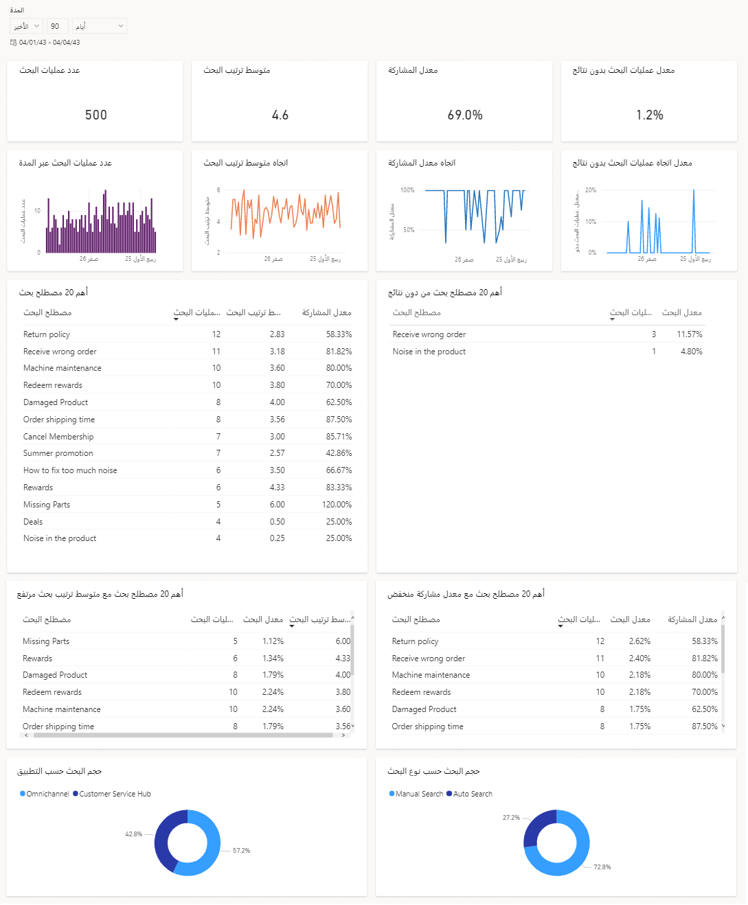

تم تصميم لوحة معلومات تحليلات بحث المعارف لتزويد مشرفي خدمة العملاء في مؤسستك والموظفين المعرفيين برؤى قيمة لمعرفة كيفية قيام مندوب الدعم بالعثور على المقالات المعرفية واستخدامها.

> [!IMPORTANT]
> لا توفر تحليلات بحث المعارف معلومات حول سلوك البحث الخاص بالعميل. تكون البيانات فقط من عمليات بحث المعارف الداخلية.

> [!div class="mx-imgBorder"]
> 

وبصفتك مدير المعرفة، تقع على عاتقك مسؤولية الحفاظ على عروض مقالة قاعدة المعارف الشاملة لمؤسستك وتحسينها. ومن خلال تحديد عمليات البحث التي حققت نجاحاً منخفضاً أو لا تُرجع أي نتائج، يمكن أن تساعدك لوحة معلومات تحليلات بحث المعارف في تحديد الثغرات المعلوماتية وتحسين نتائج البحث وعرض المقالات ذات الصلة.

للوصول إلى لوحة المعلومات هذه، يجب على مسؤول مؤسستك تمكينها أولاً. لمزيد من المعلومات، راجع تكوين رؤى بحث المعارف.

## مقاييس لوحة معلومات تحليلات بحث المعارف‬

فيما يلي مقاييس معينة يتم تمثيلها في لوحة المعلومات هذه:

|مؤشرات KPI أو المخطط|التعريف|
|---|---|
|عدد عمليات البحث|إجمالي عدد عمليات البحث التي تم إكمالها خلال فترة معينة.|
|متوسط ترتيب البحث|متوسط موضع الارتباط الذي حدده المستخدم عند تقديمه ضمن نتائج البحث.|
|معدل المشاركة|النسبة المئوية للأحداث التي تفاعل فيها المستخدم مع نتائج البحث مقارنة بأحداث البحث المقدمة مع النتائج.|
|معدل عمليات البحث بدون نتائج|النسبة المئوية للمثيلات التي لا توجد فيها نتائج خاصة بالمصطلح الذي تم البحث عنه.|
|عدد عمليات البحث عبر المدة‬‬|عدد عمليات البحث المكتملة خلال فترة زمنية معينة.|
|اتجاه متوسط معدل البحث|الاتجاه اليومي لموضع متوسط القائمة الذي حدده المستخدم عند تقديمه مع نتائج البحث.|
|اتجاه معدل المشاركة|الاتجاه اليومي للنسبة المئوية للأحداث التي تفاعل فيها المستخدم مع نتائج البحث مقارنة بأحداث البحث المعروضة مع النتائج.|
|معدل اتجاه عمليات البحث بدون نتائج|الاتجاه اليومي للنسبة المئوية للمثيلات التي لا توجد فيها نتائج لمصطلح البحث الذي يستخدمه المندوب.|
|أهم 20 مصطلح بحث|أهم 20 مصطلحاً يتم البحث عنها، توضح عدد مرات البحث ومتوسط معدل البحث ومعدل المشاركة.|
أهم 20 مصطلح بحث بدون نتائج|أهم 20 مصطلح بحث لم ينتج عنها نتائج عند البحث عنها.|
أهم 20 مصطلح بحث مع متوسط ترتيب بحث مرتفع|أهم 20 موضوعاً للبحث من حيث الحجم بمتوسط ​​موضع نقر أكبر من خمسة.|
أهم 20 مصطلح بحث مع معدل مشاركة منخفض|أهم 20 موضوع بحث من حيث الحجم بمعدل مشاركة أقل من 40 بالمائة.|
حجم البحث حسب التطبيق|النسبة المئوية لعمليات البحث في التطبيقات المتعددة.|
حجم البحث حسب نوع البحث|النسبة المئوية لعمليات البحث استناداً إلى ما إذا كانت عمليات بحث يدوية أو تلقائية.|
