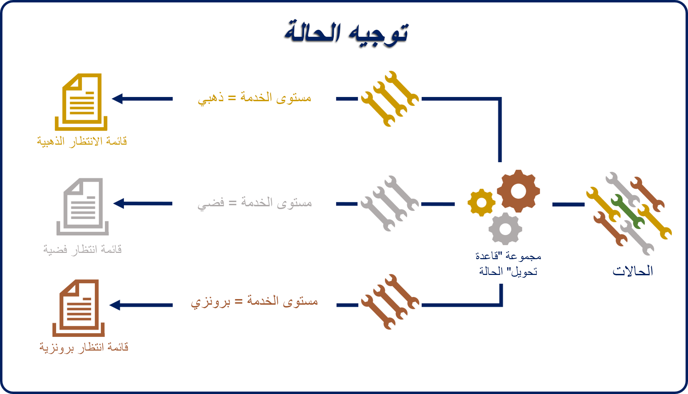
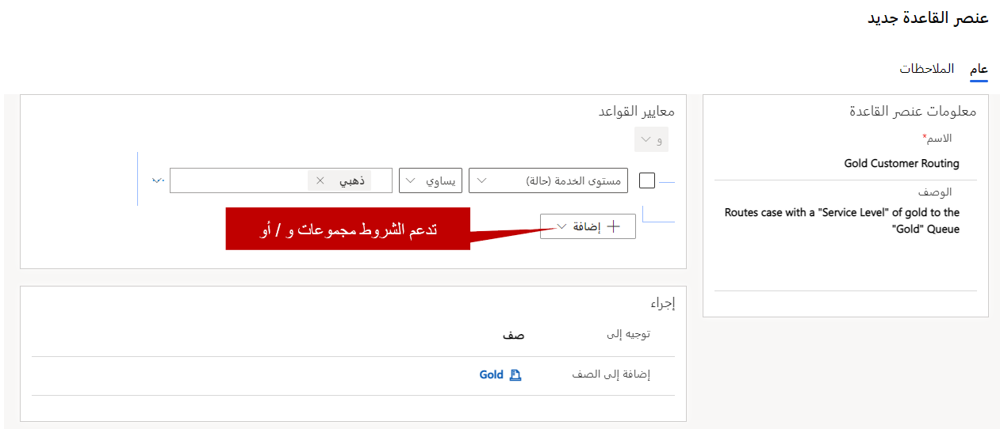
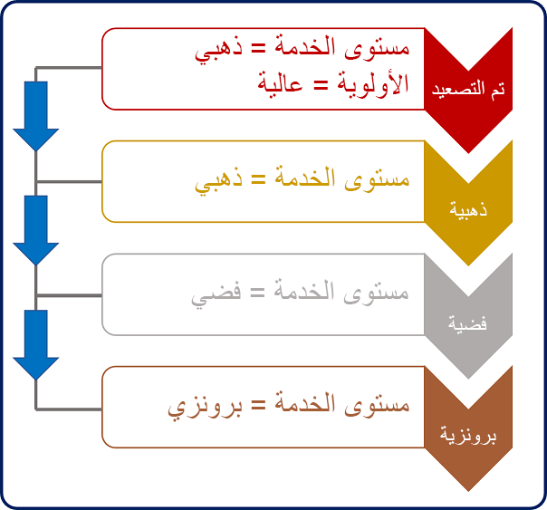
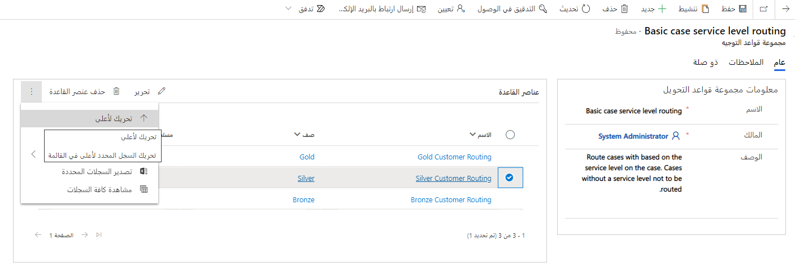
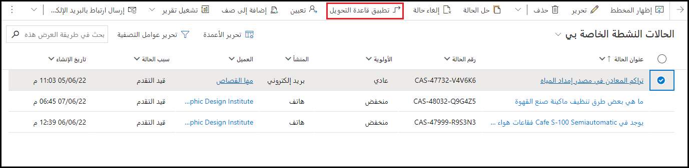
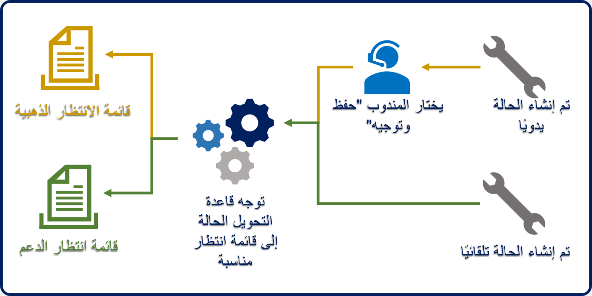

قبل فحص قدرات التوجيه الموحد، ستحتاج إلى التعرف علي التوجيه الأساسي المتوفر دون الحاجة إلى تمكين التوجيه الموحد. يمكنك تطبيق التوجيه الأساسي عندما تريد تعيين السجلات، مثل الحالات للأفراد أو الفرق أو قوائم الانتظار. سيقوم التوجيه الأساسي بتعيين العناصر استناداً إلى منطق محدد مسبقاً يستند إلى خصائص السجل لتحديد قائمة الانتظار التي سيتم توجيه الحالة إليها.

يمكنك إنشاء مجموعات قواعد التوجيه في مركز مسؤولي Dynamics 365 Customer Service لتوجيه الحالات تلقائياً. ضمن مجموعة **دعم العملاء**، حدد **التوجيه > مجموعات قاعدة التحويل (أساسي)**.

> [!NOTE]
> ترتبط مجموعات قواعد التحويل الجاهزة بسجلات الحالات. ومع ذلك، يمكنك إعداد نفس النوع من السلوك لأنواع السجلات الأخرى التي تستخدم قوائم الانتظار. في هذه الحالات، يمكنك استخدام خيارات أخرى مثل Microsoft Power Automate.

عند إنشاء قاعدة لأول مرة، ستحتاج إلى تحديد اسم قاعدة. بعد تحديد الاسم وحفظ القاعدة، يمكنك إضافة عناصر القاعدة إلى القاعدة. ضع في اعتبارك عناصر القواعد على أنها مشابهة لتوفير *ما* و 
*أين* لمجموعة القواعد. يحدد عنصر القاعدة الشروط التي سيتم تقييمها لتوجيه الحالات إلى قائمة انتظار أو وكيل أو فريق.

على سبيل المثال، عند إنشاء الحالات، يمكن تعيين الحقل **مستوى الخدمة** يدوياً أو تلقائياً استناداً إلى احتياجات المؤسسة. لضمان توجيه الحالات إلى قائمة الانتظار الصحيحة استناداً إلى مستوى الخدمة الخاص بها، قد تحتوي مجموعة قواعد التحويل المسماة **توجيه الحالة** على عناصر القواعد الثلاثة التالية:

-   **لمسار الذهبي** - يمكنك توجيه أي حالة تتميز بمستوى خدمة **ذهبي** إلى قائمة الانتظار الذهبية.

-   **‎المسار الفضي** - يمكنك توجيه أي حالة تتميز بمستوى خدمة **فضي** إلى قائمة الانتظار الذهبية.

-   **المسار البرونزي** - يمكنك توجيه أي حالة تتميز بمستوى خدمة **البرونزية** إلى قائمة الانتظار البرونزية.

> [!div class="mx-imgBorder"]
> 

## تحديد عنصر قاعدة

يتكون كل عنصر من عناصر القاعدة من قسمين:

-   **معايير القاعدة** - تحديد الحالات معينة تستخدم لتحديد ما إذا كان صنف القاعدة ينطبق أم لا.

    -   يمكن أن تقيم الشروط الحقول من سجل الحالة أو من السجلات المرتبطة في علاقات متعدد بواحد، مثل حساب العميل.

    -   يمكنك استخدام شروط **و/أو** متعددة في عنصر قاعدة واحد.

-   **الإجراء‏‎** - يحدد المكان الذي يجب توجيه الحالة إليه. يمكنك تحديد أحد الخيارات التالية:

    -   **قائمة الانتظار** - يمكنك توجيه الحالة إلى قائمة انتظار معينة (عامة أو خاصة).

    -   **المستخدم/الفريق** - يمكنك توجيه الحالة إلى مستخدم معين أو فريق.

في الصورة التالية، تحدد معايير القاعدة ما إذا كان قد تم تعيين حقل **مستوى الخدمة** على **ذهبي**. إذا كان الأمر كذلك، سيقوم مقطع **الإجراء** بتوجيه الحالة إلى قائمة الانتظار **الذهبية**.

> [!div class="mx-imgBorder"]
> 

يمكن أن تحتوي القاعدة الواحدة على عدة عناصر للقاعدة. يتم تطبيق أصناف القاعدة بالترتيب المدرج في مجموعة القواعد. يتم تطبيق عنصر قاعدة المطابقة الأول الذي يتم استيفاء شروطه على الحالة. لا تقوم مجموعة القواعد بتقييم أصناف القاعدة المتبقية لمحاولة إيجاد تطابق أفضل. نوصي بشدة بوضع عناصر قاعدة أكثر تحديداً بمستوى أعلى ضمن مجموعة القواعد، بحيث يتم التحقق منها أولاً. ضع في اعتبارك إضافة عنصر قاعدة جامع في أسفل القائمة لتوجيه الحالات التي لا تتطابق مع عناصر القاعدة الأخرى.

على سبيل المثال، في الصورة التالية، تشير أصناف قاعدة **التصعيد** و **الذهبية** إلى مستوى الخدمة **الذهبية**. نظراً لأن أصناف قاعدة **التصعيد** ذات أولوية **عالية**، يجب تقييمها قبل القاعدة **الذهبية**. وإلا، لن يتم التحقق من صنف قاعدة **التصعيد**.

> [!div class="mx-imgBorder"]
> 

يمكنك التحكم في ترتيب تحديد عناصر القاعدة باستخدام الخيارين **لأعلى** أو **لأسفل** ضمن الشبكة الفرعية لعنصر القاعدة.

> [!div class="mx-imgBorder"]
> 

بعد تعريف كافة عناصر القاعدة لمجموعة قواعد، ستحتاج إلى تنشيط مجموعة القواعد الأساسية بواسطة تحديد الزر **تنشيط** في شريط الأوامر. بعد تنشيط مجموعة القواعد الأساسية، لا يمكنك تعديلها. إذا كنت ترغب في إجراء تغييرات، فستحتاج إلى إلغاء تنشيطها أولاً.

> [!IMPORTANT]
> في حين أنه يمكنك تحديد مجموعات قواعد متعددة في Dynamics 365، إلا أن مجموعة قواعد أساسية واحدة فقط يمكن أن تكون نشطة في كل مرة. سيتم إلغاء تنشيط مجموعة القواعد النشطة حالياً، إذا حاولت تنشيط مجموعة قواعد أساسية عندما تكون مجموعة قواعد أساسية أخرى نشطة. تأكد من تحديد أصناف كافية للقاعدة في مجموعة القواعد لتغطية جميع سيناريوهات التحويل المحتملة التي تحتاج إلى دعم.

بعد تنشيط مجموعة قواعد توجيه أساسية، يمكنك تطبيقها على حالة بإحدى طريقتين: التطبيق اليدوي والتطبيق التلقائي.

> [!div class="mx-imgBorder"]
> 

-   **التطبيق اليدوي** - يمكنك تطبيق الحالة يدوياً في النموذج حالة باستخدام الزر **حفظ وتحويل.**  وبدلاً من ذلك، يمكنك إكمال الإجراء من طريقة عرض حالة باستخدام الزر **تطبيق قاعدة التحويل.**  عندما يحدد المندوب الزر على شريط الأوامر، سيتم تطبيق مجموعة قواعد التحويل، ثم سيتم توجيه الحالة إلى قائمة الانتظار الأكثر ملاءمة.

-   **التطبيق التلقائي، عند إنشاء السجلات تلقائياً** - عندما يتم إنشاء حالة تلقائياً (على سبيل المثال، من خلال سير العمل أو قاعدة إنشاء سجل أو دفق سحابة Power Automate)، سيقوم Dynamics 365 بتطبيق مجموعة قاعدة التحويل، ثم يتم توجيه الحالة إلى قائمة الانتظار الأكثر ملاءمة.

> [!div class="mx-imgBorder"]
> 

## توجيه الحالات تلقائياً

لن يتم توجيه الحالات التي تم إنشاؤها يدوياً تلقائياً. في هذه الحالات، يمكنك استخدام دفق Power Automate السحابي لبدء توجيه حالة لسيناريو عملك المحدد، مثل عندما يتم تغيير مستوى الخدمة.

> [!div class="mx-imgBorder"]
> 

بينما توفر إمكانيات التوجيه الأساسية المتوفرة في Dynamics 365 أساساً متواصلاً لعناصر التوجيه، فهي تعمل فقط للسجلات، مثل الحالات. ترغب العديد من المؤسسات في توجيه السجلات وكذلك توجيه السجلات من القنوات الأخرى. بالإضافة إلى ذلك، قد تتطلب الشركة القدرة علي تطبيق منطق أكثر تقدماً في التوجيه. في هذه الحالات، من المحتمل أن تستخدم التوجيه الموحد، والذي ستتعرف على كيفية إعداده في الوحدة التالية.
