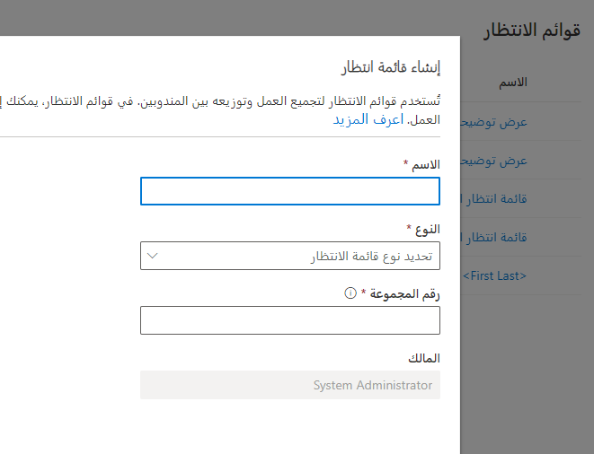
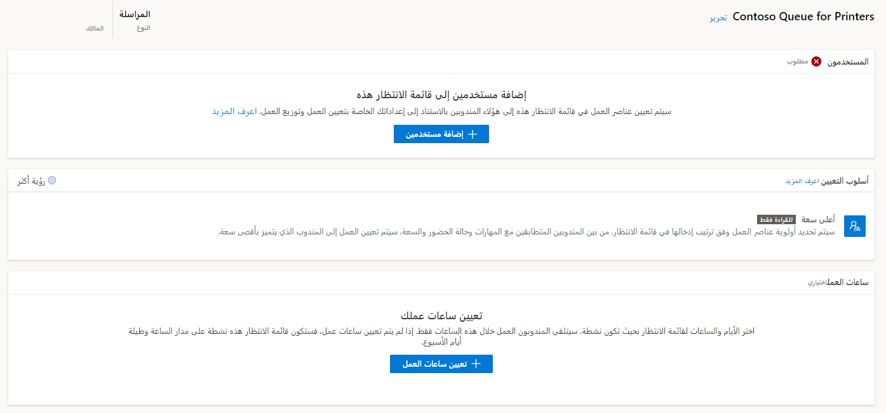

يمكنك استخدام قوائم الانتظار لجمع وتوزيع حمل العمل بين العملاء، بما في ذلك السجلات مثل الحالات أو المحادثات مثل التحادث أو النصوص أو المكالمات الصوتية، وغيرها. عندما يتم توجيه العناصر إلى قوائم الانتظار، يتم توزيعها على المندوبين الأعضاء في قوائم الانتظار هذه من خلال *طرق التعيين*.

## كيفية توجيه عناصر العمل إلى قوائم الانتظار

عندما تتوفر عناصر العمل، يستخدم النظام قواعد التصنيف والتوجيه لتوجيه العنصر إلى قائمة الانتظار الصحيحة. ووفقاً لاحتياجات الأعمال الخاصة بهم، فقد تقوم المؤسسة بإنشاء قوائم انتظار منفصلة لكل خط عمل تدعمه. على سبيل المثال، قد تقوم بإنشاء قائمة انتظار الفوترة لمعالجة أسئلة الفوترة أو قائمة انتظار المنتجات لمعالجة مشكلات الخدمة المرتبطة بالمنتجات.

تم تصنيف قوائم الانتظار استناداً إلى أنواع القنوات للمساعدة في جعل تجربة التوجيه أسهل:

-   **المراسلة** - لتوجيه جميع محادثات الرسائل المتعلقة بالدردشة الحية والنصوص والقنوات الاجتماعية.

-   **السجلات** - لتوجيه عناصر العمل المتعلقة بالسجلات، مثل الحالات ورسائل البريد الإلكتروني.

-   **الصوت** - لتوجيه الاتصالات التي يتم اجراؤها لأرقام الدعم التي تم إدراجها في مدخل العميل.

وتضمن أنواع قوائم الانتظار توجيه العناصر بشكل صحيح والمساعدة على تجنب التعيينات عبر قائمة الانتظار. على سبيل المثال، عند إنشاء تدفق عمل المحادثة المباشرة، سيتم عرض قوائم انتظار أنواع المراسلة للتحديد فقط. وبالمثل في سيناريو نقل المحادثة، يمكنك نقل محادثة دردشة إلى قائمة انتظار المراسلة فقط ونقل حالة إلى قائمة انتظار السجلات فقط.

## إنشاء قوائم انتظار جديدة للتوجيه الموحد

يمكنك إنشاء وإدارة قوائم الانتظار في مركز مسؤولي Customer Service من خلال الانتقال إلى **دعم العملاء > قوائم الانتظار**.

يتوفر لديك خياران للاختيار من بينهما:

-   **قوائم الانتظار الأساسية** - تدعم إمكانات التوجيه البسيطة في Dynamics 365، مثل توجيه العناصر الأساسية مثل الحالات إلى قوائم انتظار معينة. لا تقوم القوائم الأساسية بتوزيع العناصر تلقائياً إلى المندوبين.

-   **قوائم الانتظار المتقدمة (توجيه موحد)** - يمكن توجيه العناصر إليها، وتدعم أيضا توزيع العناصر إلى المندوبين استناداً إلى أساليب التعيين المختلفة التي تم إعدادها.

بغض النظر عما إذا كنت قد حددت "أساسي" أو "متقدم"، ستتمكن من إنشاء قائمة انتظار جديدة بتحديد الزر **قائمة انتظار جديدة**.

> [!div class="mx-imgBorder"]
> 

في مربع الحوار **إنشاء قائمة انتظار** ، أدخل المعلومات التالية:

-   **الاسم** - اسم قائمة الانتظار.

-   **النوع** - حدد نوع قائمة الانتظار التي ستقوم بإنشائها. 
    يمكنك تحديد **المراسلة** أو  **السجل** أو **الصوت**.

-   **رقم المجموعة** - رقم لتنظيم قائمة الانتظار.

> [!div class="mx-imgBorder"]
> 

بعد تحديد المعلومات الأساسية المطلوبة لقائمة الانتظار الخاصة بك، حدد الزر **إنشاء**. يجب أن يتم عرض قائمة الانتظار التي قمت بإنشائها.

> [!NOTE]
> والعناصر السابقة لتطبيق مركز مسؤولي Dynamics 365 Customer Service. إذا كنت ترغب في إنشاء قائمة انتظار في مركز خدمة العملاء أو مركز إدارة القناة متعددة الاتجاهات، راجع [مركز مسؤولي Customer Service](/dynamics365/customer-service/queues-omnichannel?tabs=customerserviceadmincenter/?azure-portal=true)أو [مركز إدارة القناة متعددة الاتجاهات](/dynamics365/customer-service/queues-omnichannel?tabs=omnichanneladmincenter/?azure-portal=true)أو [مركز خدمة العملاء](/dynamics365/customer-service/queues-omnichannel?tabs=customerservicehub/?azure-portal=true). (للوصول إلى كل منها، حدد علامة التبويب المناسبة في الخطوة 1.)

بعد إنشاء قائمة الانتظار الخاصة بك، ولضمان توزيع العناصر في قائمة الانتظار بشكل صحيح على المندوبين، ستحتاج إلى تحديد المستخدمين الذين سينتمون إلى قائمة الانتظار. على سبيل المثال، قد يكون للمؤسسة فقط أشخاص محددين مؤهلين للعمل في عناصر الفوترة. لضمان توجيه عناصر الفوترة فقط إلى هؤلاء الأفراد، يجب التأكد من إضافتهم إلى قائمة انتظار الفوترة. يمكنك إكمال هذه المهمة من خلال تحديد **إضافة مستخدمين**. بعد تحديد المستخدمين الذين تريدهم، ستتم إضافتهم إلى قائمة الانتظار.

## تعيين عمل إلى المندوبين

تساعدك قواعد التعيين في توزيع العناصر على الأفراد. عند إنشاء قائمة انتظار، ستحتاج إلى تحديد طريقة التعيين التي ترغب في استخدامها لتوزيع العناصر على المستخدمين.

تتوفر الخيارات التالية:

-   **أعلى قدرة إنتاجية** - تعيين عناصر العمل إلى المندوب الذي يتمتع بأعلى قدرة إنتاجية، من بين أولئك الذين لديهم المهارات التي تم تحديدها خلال مرحلة التصنيف. ويقوم أيضاً بالتعيين إلى المندوب الذي له التواجد المحدد في خيار التواجد المسموح به لتدفق العمل، والذي يتم تحديده افتراضياً.

-   **ترتيب دوري** - تعيين عناصر العمل إلى المندوب في ترتيب القائمة الذي يطابق المعايير الخاصة بالمهارات والحضور.

-   **مخصص** - يتيح لك إنشاء طريقة تعيين مخصصة. يمكنك تحديد مجموعات القواعد والقواعد الخاصة بك لإعداد الأولوية والخطورة والقدرة الإنتاجية على اختيار قوائم الانتظار التي يجب توجيه عناصر العمل إليها عن طريق إعداد مجموعات القواعد لتحديد الأولويات والتعيين.

لمزيد من المعلومات، راجع [إنشاء طريقة تعيين مخصصة](/dynamics365/customer-service/assignment-methods/?azure-portal=true).

## ساعات العمل

في كثير من الأحيان، يتم تزويد أقسام أو مناطق معينة بالموظفين فقط خلال أطر زمنية محددة. على سبيل المثال، بينما قد تقدم مؤسستك دعماً للمنتج طوال اليوم، كل يوم، قد يعمل قسم الفوترة فقط من الساعة 8:00 صباحاً إلى 5:00 مساءً، من الاثنين إلى الجمعة. للتأكد من أنه يتم توجيه العناصر فقط إلى قائمة انتظار أثناء ساعات العمل، ستحتاج إلى تحديد ساعات العمل لقائمة الانتظار. إذا لم تقم بتعيين ساعات العمل، فسيتم اعتبار قائمة الانتظار دائمة، وسيتم توجيه العناصر إلى قائمة الانتظار طوال اليوم، كل يوم. في منطقة **ساعات العمل** حدد **تعيين ساعات العمل**.

> [!IMPORTANT]
> تأكد من إعداد سجل ساعة العمل قبل تعيينه لقائمة الانتظار. لمزيد من المعلومات، راجع [إنشاء وإدارة ساعات العمل](/dynamics365/customer-service/create-operating-hours/?azure-portal=true).

## تمكين قوائم الانتظار الموجودة للتوجيه الموحد

قد تقوم بعض المؤسسات أولاً باستخدام إمكانات التوجيه الأساسية المتوفرة في Dynamics 365 Customer Service. وقد يرغبون فقط في توجيه سجلات الحالة إلى قوائم انتظار معينة للسماح للمندوبين بتحديد العناصر التي سيتم العمل عليها يدوياً. وقد يختارون عدم تطبيق التعيين التلقائي للعناصر. مع تطور الاحتياجات، قد تكتشف الشركة أنها تريد استخدام الميزات المتقدمة المتوفرة في التوجيه الموحد.

في هذه الحالات، يمكنك إعداد قوائم انتظار موجودة للتوجيه الموحد. في مركز مسؤولي Customer Service، ضمن مجموعة **دعم العملاء**، حدد **قوائم الانتظار > قوائم الانتظار الأساسية**. افتح قائمة الانتظار التي تريد استخدامها ثم حدد حقل **توزيع العمل التلقائي.**  بعد تحديد مربع الاختيار **توزيع العمل التلقائي** ، سيتم عرض نموذج مختلف، مما سيسمح لك بإضافة مستخدمين إلى قائمة الانتظار وطرق التعيين المحددة.

## قائمة الانتظار الافتراضية

يجب إرسال كافة عناصر العمل الواردة إلى قائمة انتظار قبل أن يتم توزيعها على المندوبين. للتأكد من أنه تم توجيه كافة العناصر وتوزيعها، يتضمن التوجيه الموحد عدة قوائم افتراضية. يمكنك اعتبار قوائم الانتظار الافتراضية هذه على أنها إجراءات وقائية والتي يمكنك استخدامها في السيناريوهات التالية:

-   يواجه عنصر العمل خطأ أثناء التصنيف

-   يواجه عنصر العمل خطأ عند تشغيل قاعدة التوجيه إلى قائمة الانتظار

-   عنصر العمل لا يتطابق مع أي من قواعد التوجيه إلى قائمة الانتظار

قوائم الانتظار الافتراضية التالية متوفرة:

-   **قائمة انتظار الكيان الافتراضية** - تستخدم لتوجيه سجلات الكيان.

-   **قائمة انتظار المراسلة الافتراضية** - تستخدم لتوجيه جميع محادثات المراسلة المتعلقة بالدردشة الحية والنصوص وMicrosoft Teams والقنوات الاجتماعية.

-   **قائمة انتظار الصوت الافتراضية** - تستخدم لتوجيه كافة المكالمات الصوتية.

لا يمكن تحرير قوائم الانتظار الافتراضية أو حذفها. جميع مستخدمي القناة متعددة الاتجاهات لـ Customer Service هم أعضاء في قوائم الانتظار الافتراضية، لذلك لا يمكن تغيير العضوية في قوائم الانتظار الافتراضية هذه.

الآن بعد أن تعلمت كيفية إعداد المستخدمين وقوائم الانتظار، يمكنك استكشاف عملية الإعداد. 
