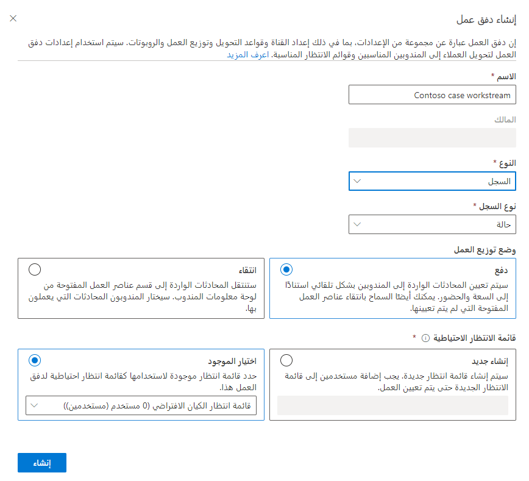
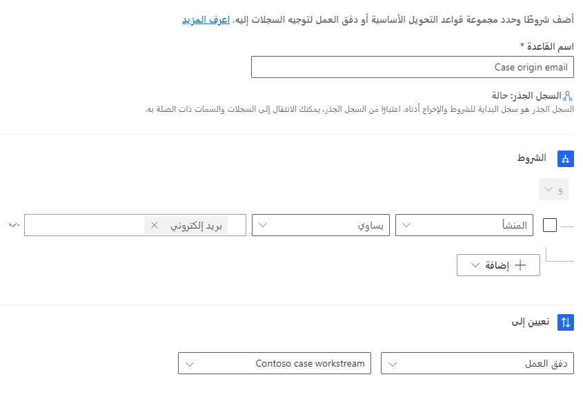
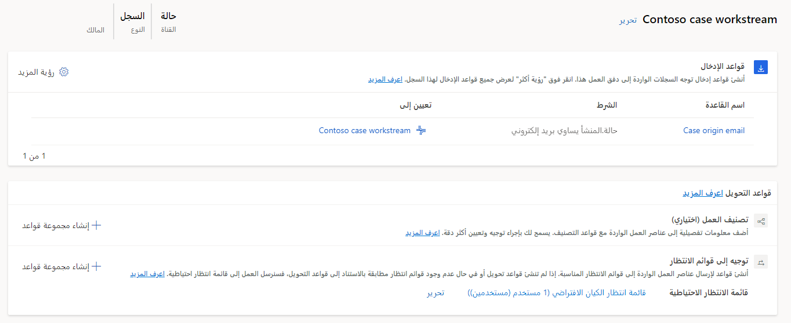
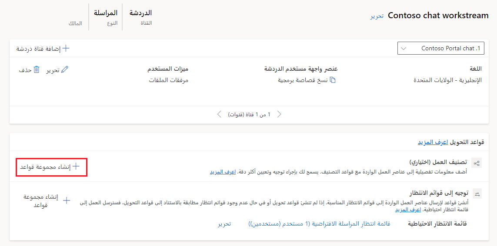
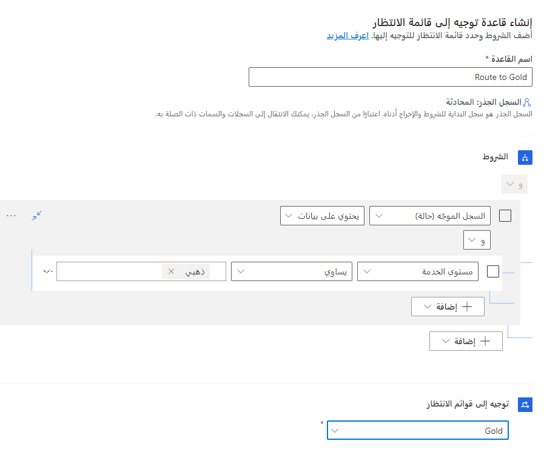

تدفقات العمل عبارة عن حاوية لإثراء وتوجيه وتعيين عناصر العمل إلى قوائم الانتظار والمندوبين الصحيحين. يمكن أن تكون تدفقات العمل أحد الأنواع التالية:

-   **المراسلة** - لتوجيه المحادثات من المحادثة المباشرة والنص والقنوات الاجتماعية.

-   **السجل** - لتوجيه السجلات، مثل الحالة أو البريد الإلكتروني أو النشاط.

-   **الصوت** - لتوجيه المكالمات التي يتم إجراؤها لأرقام الدعم المدرجة. 

تعد تدفقات العمل مجموعة من قواعد التوجيه بشكل أساسي. تحدد إعدادات التوجيه كيفية توجيه السجلات إلى قوائم الانتظار. تحدد إعدادات توزيع العمل الطريقة التي يجب أن يتم من خلالها توزيع المحادثات على المندوبين في قائمة انتظار.

في مركز مسؤولي Customer Service، يمكنك إنشاء تدفق عمل عن طريق تحديد **تدفقات العمل** في قسم **دعم العميل**. عند إنشاء تدفق عمل، ستحتاج أولاً إلى تحديد المكونات التالية:

-   **الاسم** - الاسم البسيط الذي سيتم استخدامه لتحديد تدفق العمل.

-   **النوع** - تحديد نوع السجلات التي سيقوم تدفق العمل بمعالجتها. يمكن ضبطه على **المراسلة** أو **السجل** أو **الصوت**.

    استناداً إلى الخيار الذي تحدده، قد يتم عرض مزيد من الحقول. على سبيل المثال، يؤدي تحديد خيار **المراسلة** إلى عرض قائمة منسدلة حيث يمكنك تحديد نوع القناة التي سيتم استخدام تدفق العمل معها.

-   **وضع توزيع العمل** - يحدد كيفية توزيع العناصر في تدفق العمل على المندوبين. يتوفر خياران:

    -   **إرسال** - سيتم إرسال المحادثات إلى المندوبين تلقائياً عن طريق نافذة منبثقة على الشاشة.

    -   **الانتقاء** - سيتم إرسال المحادثات إلى المندوبين عند تحديد محادثة من عناصر العمل المفتوحة في لوحة معلومات المندوب.

تعرض لقطة الشاشة التالية مثالاً لتدفق العمل الذي سيتم استخدامه لتوزيع سجلات الحالة تلقائياً إلى المندوبين. في هذا المثال، نظراً لأنه قد تم تحديد **السجل** للنوع، سيتم عرض القائمة المنسدلة لنوع سجل، حيث يمكنك تحديد نوع السجل الذي ترغب في العمل به.

> [!div class="mx-imgBorder"]
> 

## إعداد قواعد الإدخال (سجلات تدفقات العمل فقط)

علي عكس تدفق العمل للمراسلة أو قنوات الصوت، والتي عادةً ما يتم إعداد قناة مخصصة لها، فإن تدفقات العمل المستندة إلى السجلات تتضمن أيضاً خيار قاعدة الإدخال. والسبب في ذلك أنه يمكن إنشاء السجلات بطرق متعددة، كما يحتاج النظام إلى معرفة تدفق العمل الذي سيتم توجيه السجل إليه. تساعد قواعد الإدخال لسجل في تحديد تدفق العمل الذي سيتم اختياره لتعيين عنصر عمل وارد. على سبيل المثال، قد يتم إرسال الحالات التي تم إنشاؤها للعملاء الذين لديهم عقد دعم إلى تدفق عمل العقد، حيث سيتم توجيههم إلى قائمة الانتظار الصحيحة قبل أن يتم توجيههم إلى مندوب. يمكنك إنشاء قواعد الإدخال بشكل مستقل، ويمكنك أيضاً تعيينها إلى مجموعات قواعد التوجيه الأساسية. ومع ذلك، في أي صفحة خاصة بتفاصيل تدفقات العمل، سيتم عرض قواعد الإدخال التي تم تعيينها إلى تدفق العمل فقط.

يمكن إنشاء قواعد الإدخال بتحديد الزر **+ إنشاء قاعدة** ضمن قسم **قواعد الإدخال** الخاص بتدفق العمل.

في مربع الحوار **إنشاء قاعدة إدخال** ، أدخل المعلومات التالية:

-   **اسم القاعدة** - الاسم البسيط الذي سيتم استخدامه لتحديد القاعدة.

-   **الشروط** - حدد الشروط المعينة التي تستخدم لتحديد ما إذا كانت قاعدة الإدخال تنطبق أم لا.

    -   يمكن أن تقيم الشروط الحقول من سجل الحالة أو من السجلات المرتبطة في علاقات متعدد بواحد وعلاقة واحد بمتعدد وعلاقة متعدد بمتعدد، مثل حساب العميل.

    -   يمكنك استخدام شروط **و/أو** متعددة في عنصر قاعدة واحد.

-   **تعيين** - يحدد تدفق العمل أو مجموعة قواعد التوجيه الأساسية التي تريد إرسال السجل إليها.

توضح لقطة الشاشة التالية أن قاعدة الإدخال ستقوم بتوجيه أي حالات يتم فيها تعيين الحقل **الأصل** على **البريد الإلكتروني** إلى تدفق عمل حالة Contoso.

> [!div class="mx-imgBorder"]
> 

## إعداد قواعد التوجيه

بعد معالجة عناصر العمل بواسطة تدفق العمل، تكون الخطوة التالية هي توجيه العناصر الواردة إلى قائمة الانتظار المناسبة بحيث يمكن تعيينها إلى مندوب. يمكنك إكمال هذه العملية عن طريق إنشاء تصنيف العمل والتوجيه إلى قواعد قائمة الانتظار.

> [!div class="mx-imgBorder"]
> 

## تصنيف العمل

في التوجيه الموحد، يتيح لك تصنيف العمل تحديد القواعد لإضافة معلومات تفصيلية إلى عناصر العمل الواردة التي يمكن استخدامها لتوجيه وتعيين عناصر العمل بشكل أمثل. يمكنك إنشاء قواعد تصنيف العمل باستخدام قائمة القرارات التعريفية اليدوية أو باستخدام نماذج التعلم الآلي.

يمكنك إنشاء مجموعه قواعد تصنيف العمل من داخل تدفقات العمل. حدد **+ إنشاء مجموعة قواعد** من تدفق العمل لفتح مربع الحوار، كما هو موضح في لقطة الشاشة التالية.

> [!div class="mx-imgBorder"]
> 

عند إنشاء مجموعة قواعد، يمكنك تحديد أحد الخيارات التالية لنوع القاعدة:

-   **منطقي** - القواعد التي تستخدم ملفات تعريف السعة أو المهارات أو السمات الخاصة بالسجل الموجه.

-   **نموذج التعلم الآلي** - استخدم نماذج التعلم الآلي للمساعدة في تصنيف عناصر العمل. يمكنك الاختيار من بين الخيارات التالية: **تعريف المهارة** أو **التنبؤ بالتوجه** أو 
    **تقدير الجهد**.

لمزيد من المعلومات، راجع [تكوين مجموعة قواعد تصنيفات العمل للتوجيه الموحد](/dynamics365/customer-service/configure-work-classification/?azure-portal=true).

## التوجيه إلى قوائم الانتظار

سترسل قواعد توجيه قائمة الانتظار عنصر العمل إلى قائمة الانتظار المناسبة. على سبيل المثال، يمكنك إنشاء قاعدة توجيه تقوم بتوجيه أي حالة يتم فيها تعيين مستوي الخدمة على الحالة **الذهبية** إلى قائمة الانتظار **الذهبية**.

> [!IMPORTANT]
> على الرغم من أنها موصى بها بشدة، إلا أن قواعد توجيه قائمة الانتظار اختيارية. إذا لم يتم تحديد أي قواعد أو إذا لم تتطابق أي قواعد، فسيتم توجيه عنصر العمل الوارد إلى قائمة الانتظار الافتراضية لنوع القناة المعني.

بالنسبة لتدفق العمل، يتم تشغيل مجموعة قواعد التوجيه إلى قوائم الانتظار بعد تشغيل كافة مجموعات قواعد تصنيف العمل. يمكن لتدفقات العمل أن تحتوي على  مجموعة قواعد واحدة فقط من التوجيه إلى قوائم الانتظار.

يمكنك إنشاء مجموعة قواعد التوجيه إلى قوائم الانتظار من داخل تدفق العمل وذلك بتحديد الزر **+ إنشاء مجموعة قواعد.**  إعداد مجموعات القواعد يشبه إعداد قواعد الإدخال.

وسوف تحتوي مجموعة القواعد على العناصر التالية:

في مربع الحوار **إنشاء قاعدة إدخال**، أدخل المعلومات التالية:

-   **اسم القاعدة** - الاسم البسيط الذي سيتم استخدامه لتحديد القاعدة.

-   **الشروط** - حدد الشروط المعينة التي تستخدم لتحديد ما إذا كانت قاعدة الإدخال تنطبق أم لا.

    -   يمكن أن تقيم الشروط الحقول من سجل الحالة أو من السجلات المرتبطة في علاقات متعدد بواحد وعلاقة واحد بمتعدد وعلاقة متعدد بمتعدد، مثل حساب العميل.

    -   يمكنك استخدام شروط **و/أو** متعددة في عنصر قاعدة واحد.

-   **التوجيه إلى قوائم الانتظار** - يحدد قائمة الانتظار التي سيتم تعيين العنصر لها.

تعرض الصورة التالية مثالاً لقاعدة التوجيه التي ترسل الحالات **الذهبية** إلى قائمة الانتظار **الذهبية**.

> [!div class="mx-imgBorder"]
> 

لمزيد من المعلومات، راجع [تكوين التوجيه إلى قوائم الانتظار ومجموعات القواعد والقواعد](/dynamics365/customer-service/configure-work-classificationmd?azure-portal=true#configure-route-to-queues-rulesets-and-rules).
