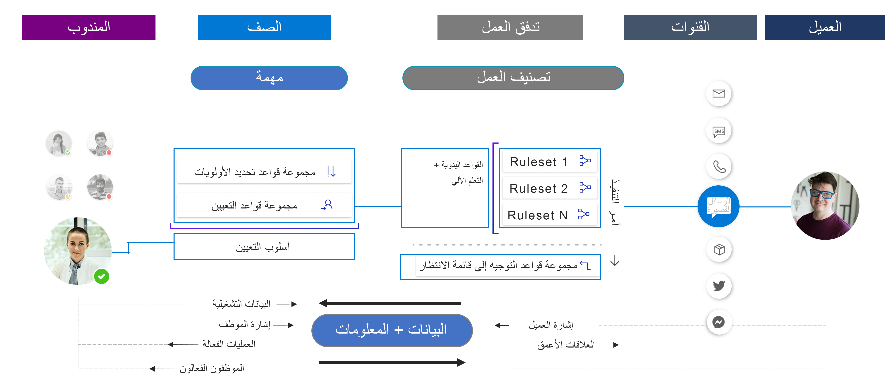

لضمان رضا العملاء عن الخدمة التي يتم تقديمها لهم، ستقوم العديد من المؤسسات بربط عناصر العمل الواردة، مثل الحالات أو المكالمات الهاتفية أو طلبات الدردشة، بالمندوب الأكثر تأهيلاً للمساعدة في كل حاجة محددة. على سبيل المثال، عندما يكون لدى العميل سؤال متعلق بالفوترة، يجب توجيهه إلى شخص لديه معرفة بالمعلومات المتعلقة بالفوترة. يجب توجيه العميل الذي يحتاج إلى خدمة في منتج معين إلى شخص لديه معرفة بهذا المنتج.

يتضمن Microsoft Dynamics ‏365 Customer Service العديد من الميزات التي تعمل معاً لتزويد المؤسسات بحل شامل لإدارة الحالات. تتمثل إحدى الميزات في القدرة على توجيه عناصر العمل الواردة إلى المندوب أو الفريق أو قائمة الانتظار الأنسب.

## خيارات التوجيه في Dynamics 365

اعتماداً على مؤسستك، يمكن أن تختلف طريقة معالجتك لتوجيه عناصر العمل وتوزيعها على المندوبين. قد تقوم مؤسسة أصغر بنقل حالة جديدة مرتبطة بسؤال الفوترة إلى قائمة انتظار الفوترة حتى يقوم المندوب يدوياً بتحديد الحالة أو انتقائها وبدء العمل عليها. على العكس من ذلك، قد يرغب مركز الاتصال في توجيه العناصر المتعلقة بالفوترة إلى قائمة انتظار الفوترة، وقد يرغب أيضاً في تعيين العنصر أو دفعه تلقائياً لعضو في قائمة الانتظار هذه لديه إمكانية للعمل عليه. سيضمن هذا النهج أن يتم تخصيص جميع العناصر، وتجنب احتمال فقدان شيء ما.

يوفر Dynamics 365 Customer Service للمؤسسات خيارين مختلفين للتوجيه يمكن للمؤسسات تطبيقهما لتلبية احتياجات التوجيه الخاصة بها، بغض النظر عما إذا كانت مؤسسة صغيرة أو مؤسسة كبيرة.

## التوجيه الموحد

التوجيه الموحد هو قدرة توجيه وتعيين ذكية وقابلة للتطوير وذات مستوى مؤسسي. يمكنه توجيه عنصر العمل الوارد إلى قائمة الانتظار والمندوب الأنسب من خلال الالتزام بمتطلبات عنصر العمل ومطابقتها مع قدرات المندوب.

بخلاف التوجيه الأساسي، حيث تعمل عادةً مع السجلات مثل الحالات أو رسائل البريد الإلكتروني، يمكنك استخدام البنية التحتية الموحدة للتوجيه لتوجيه طلبات الخدمة عبر جميع القنوات التي تستخدمها مؤسستك، مثل الدردشة، والصوت، والنص، والمزيد. تنشئ هذه الميزة طريقة عرض موحدة لاستخدام القوى العاملة عبر قنوات متعددة، مما يساعد على تحسين توزيع العمل عبر القوى العاملة. إنها تعمل بطريقة قناة شاملة من خلال ضمان توجيه عناصر العمل على جميع القنوات بطريقة متسقة ومماثلة. يأخذ التوجيه الموحد في الاعتبار إدارة المندوب على قنوات مختلفة قبل تعيين عمل جديد إليه.

يحتوي التوجيه الموحد على مرحلتين رئيسيتين:

-   **التصنيف** - في هذه المرحلة، سيستخدم التوجيه الموحد القواعد ونماذج التعلم الآلي لإضافة معلومات حول عنصر العمل، التي ستستخدمها الميزة للعثور على المندوب الأنسب.

-   **التعيين** - خلال هذه المرحلة، يعطي التوجيه الموحد الأولوية لطلبات الخدمة ثم يعينها للمندوبين بناءً على طبيعة العمل والكيانات ذات الصلة ومهارات المندوبين والحالة الحالية للقوى العاملة للمندوب من حيث التوافر وعبء العمل.

توضح الصورة التالية هذه العملية قيد التنفيذ:

1.  عندما تأتي محادثة واردة، ستمر بمرحلة تصنيف العمل.

    -   خلال هذه المرحلة، يمكن إضافة معلومات مثل المهارات المطلوبة من قبل المندوب ومستوى الإلحاح للعنصر وفئة العميل ومستوى الأهمية إلى العنصر.

    -   بعد تصنيف العمل، يتم استخدام قواعد التوجيه إلى قائمة الانتظار لإرسال العنصر إلى قائمة الانتظار الأنسب.

1.  بعد إضافة العنصر إلى قائمة الانتظار الصحيحة، سيدخل في مرحلة التعيين.

    -   قد ترغب المؤسسة في إعطاء الأولوية للدردشة بناءً على أعلى مستوى من الإلحاح والأهمية.

    -   بعد تحديد أولوية الدردشة، سيقوم التوجيه الموحد بتعيين الدردشة إلى مندوب عن طريق مطابقة المهارات المطلوبة وحالة عبء العمل الحالية والتوافر.

> [!div class="mx-imgBorder"]
> 

ستدرس بقية هذه الوحدة ما يلزمك لبدء استخدام التوجيه الموحد في مؤسستك.
