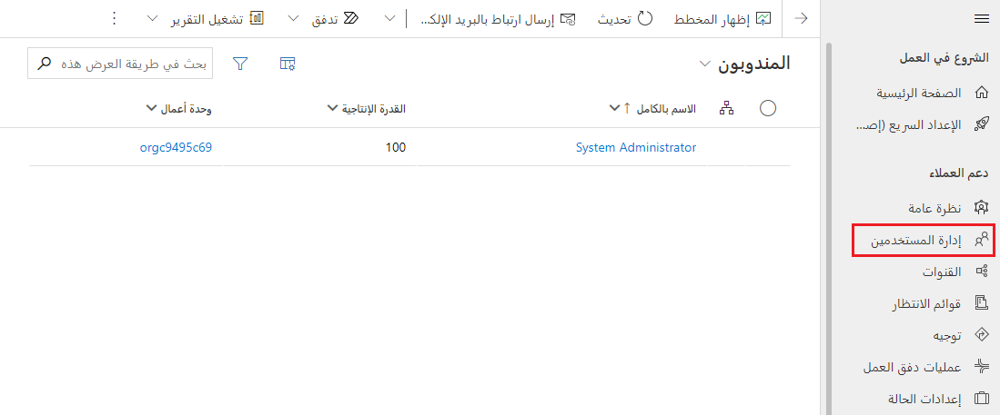
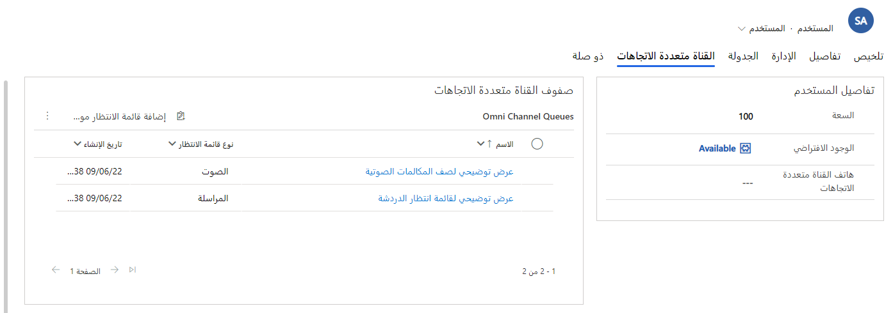
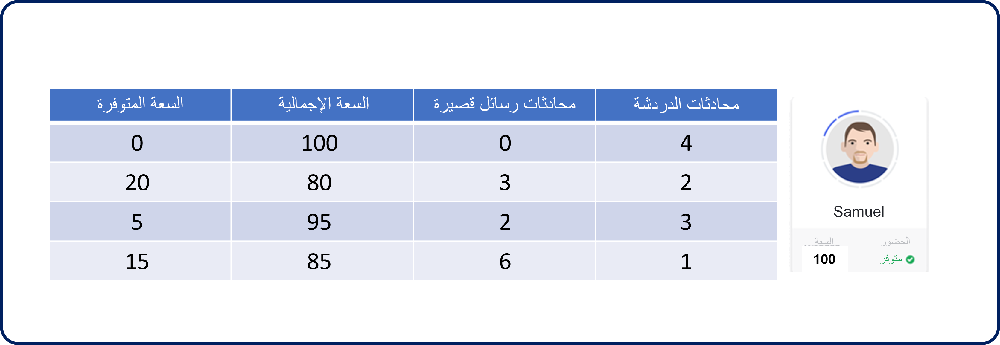
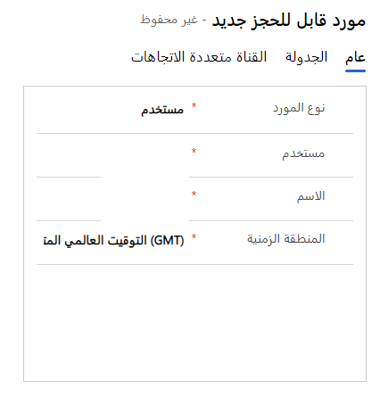

يتم تعيين عناصر العمل إلى المندوبين بالاستناد إلى عوامل متعددة، مثل مجموعة مهارات المندوب وحمل العمل الحالي والتوافر. وللتأكد من تعيين العناصر للمستخدمين بشكل مناسب، يمكنك إعداد إعدادات مختلفة داخل سجل المستخدم الخاص بهم.

في مركز مسؤولي Customer Service، يمكنك عرض المستخدمين المتاحين للتوجيه الموحد من خلال تحديد **إدارة المستخدمين > المستخدمون**. ستسرد طريقة العرض **المندوبون** جميع المستخدمين الذين تم تعريفهم كمندوب في التطبيق.

> [!div class="mx-imgBorder"]
> 

> [!IMPORTANT]
> يحتاج المستخدمون إلى أحد أدوار الأمان التالية حتى يمكن إضافتهم إلى قائمة انتظار تم تمكينها للتوجيه الموحد:
> 
> -   ممثل خدمة العملاء
> 
> -   مدير CSR
> 
> -   مندوب القناة متعددة الاتجاهات‬
> 
> -   مشرف القناة متعددة الاتجاهات‬
> 
> -   مسؤول القناة متعددة الاتجاهات

عندما تفتح سجلاً، ستحتوي علامة التبويب **قناة متعددة الاتجاهات** على إعدادات متعددة يستخدمها التوجيه الموحد لتوزيع العمل على المندوبين. بشكل مبدئي، يتم تعيين عناصر العمل بالاستناد إلى عاملين أساسيين:

-   **حالة الحضور** - يحدد هذا العامل حالة المندوب، مثل متوفر أو مشغول أو عدم الإزعاج.

-   **القدرة الإنتاجية** - يحدد هذا العامل مقدار العمل الذي يمكن للمندوب التعامل معه في وقت واحد.

> [!div class="mx-imgBorder"]
> 

عندما يتم تمكين أحد المستخدمين كمستخدم قناة متعددة الاتجاهات، يتم تعيين قدرة إنتاجية قصوى له تبلغ 100 وحدة بشكل افتراضي. بإمكان المؤسسات تعديل القدرة الإنتاجية القصوى بالاستناد إلى ما يناسبها بشكل أفضل. يتم أيضاً تعيين عدد محدد من الوحدات لكل قناة تم تحديدها في الحل. مع توجيه المحادثات إلى المندوبين، يتم تقليل قدرتهم الإنتاجية بعدد الوحدات التي تم تعيينها لهذا النوع من القنوات.

ضع في الاعتبار السيناريو التالي. تم إعداد قناة دردشة لتعيين قدرة إنتاجية من 25 وحدة لكل محادثة، وقناة نصية ذات قدرة إنتاجية من 10 وحدات لكل محادثة. توجد لدى أحد المندوبين، Samuel، سعة من 100 وحدة ويمكنه التعامل مع أي مجموعة مختلفة من الدردشات والمحادثات النصية إذا لم تتجاوز القدرة الإنتاجية من 100 وحدة.

يوضح الجدول التالي بعض هذه الأمثلة.

> [!div class="mx-imgBorder"]
> 

عندما ينهي Samuel المحادثة، تُضاف من جديد القدرة الإنتاجية من هذه المحادثة إلى القدرة الإنتاجية المتوفرة.

يجب أن تتأكد من أن جميع المندوبين لديهم قدرة إنتاجية وحالة حضور افتراضية محددة لهم.

## الموارد القابلة للحجز

بالنسبة لبعض ميزات التوجيه الموحد، مثل التوجيه المستند إلى المهارات، قد تكون هناك حاجة إلى معلومات إضافية لضمان توجيه العناصر بشكل مناسب. على سبيل المثال، عند ورود محادثة، سيقارن النظام مهارات المندوب بالمهارات المطلوبة في عنصر العمل. وسيقوم النظام بتعيين عنصر العمل إلى مندوب يطابق تلك المهارات.

لإعداد المهارات لأحد المندوبين، ستحتاج إلى إنشاء ما يُطلق عليه اسم *سجل مورد قابل للحجز* للمندوب. سيخزّن سجل المورد القابل للحجز المهارات المقترنة بالمندوب. تتضمن علامة التبويب **قناة متعددة الاتجاهات**  القسم **تكوين المهارات** على سجل المستخدم. حدد **+ مورد جديد قابل للحجز** ثم أدخل اسم المندوب، كما هو موضح في لقطة الشاشة التالية. حدد **حفظ وإغلاق**.

> [!div class="mx-imgBorder"]
> 

بعد إنشاء المورد القابل للحجز، يمكنك تعيين المهارات إلى المندوب باستخدام علامة التبويب **قناة متعددة الاتجاهات** على المورد القابل للحجز. 

لمزيد من المعلومات، راجع [نظرة عامة على التوجيه المستند إلى المهارة](/dynamics365/customer-service/overview-skill-work-distribution/?azure-portal=true). 
