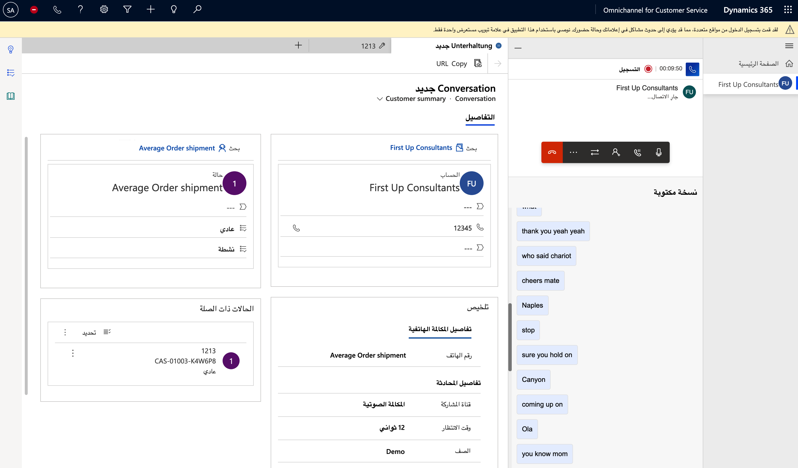

على الرغم من التزايد الذي يشهده عدد العملاء الذين يستخدمون قنوات الاتصال مثل الدردشة والرسائل النصية ووسائل التواصل الاجتماعي للتفاعل مع المؤسسات، إلا أن المكالمات الهاتفية تبقى قناة اتصال مهمة. يفضل العديد من العملاء الدعم عبر الهاتف، وتحديداً عندما يتعاملون مع سيناريوهات أكثر تفصيلاً أو تعقيداً.

عادةً، يجب على المؤسسات التي ترغب في استخدام المكالمات الصوتية مع تطبيقات إدارة علاقات العملاء (CRM) أن تدمج يدوياً أنظمة الهاتف المستقلة الخاصة بها مع الحل. نظراً لعدم تصميم هذه التطبيقات في الأصل كي تتكامل، فقد يؤدي ذلك إلى تجربة مجزأة لكل من المندوبين والعملاء أثناء تفاعلهم عبر قنوات تفاعل مختلفة. يُعد هذا النهج الذي يستخدم عدة موفرين معقداً بالنسبة لموفري خدمات متعددين من ناحية الإنشاء والصيانة، وهو ينشئ مستودعات بيانات ذات رؤى غير متصلة تتعلق بتفاعلات العملاء وأداء المندوبين عبر القنوات.

باستخدام القناة الصوتية في Microsoft Dynamics 365 Customer Service، بإمكان المندوبين الذين يعملون في القناة متعددة الاتجاهات لـ Customer Service إجراء واستقبال مكالمات الشبكة العامة للهاتفية المحولة (PSTN) من خلال تجربة الاتصال الأصلية في Dynamics 365. بالإضافة إلى إمكانات الاتصال، فإنه يتضمن أيضاً ميزات يدعمها الذكاء الاصطناعي (AI) في الوقت الفعلي، مثل كتابة المكالمات بشكل مباشر وتحليل التوجه والاقتراحات المستندة إلى الذكاء الاصطناعي التي تساعد على تعزيز إنتاجية المندوب.

توفر القناة الصوتية طريقة أخرى لإشراك العملاء بسلاسة بالإضافة إلى توفير قنوات شائعة أخرى مثل الدردشة والرسائل النصية ووسائل التواصل الاجتماعي. تضمن هذه الميزة حصول العملاء على تجربة دعم متسقة وشخصية ومتصلة عبر جميع قنوات المشاركة.
على سبيل المثال، عندما يتفاعل المندوب مع أحد العملاء من خلال دردشة ويب، قد يصبح من الضروري تصعيد المحادثة إلى مكالمة صوتية و/أو مكالمة فيديو لإجراء عملية أكثر تقدماً لاستكشاف الأخطاء وإصلاحها. باستخدام القناة الصوتية، يمكنك إعداد الأرقام للسماح بالمكالمات الواردة والصادرة لدعم أي سيناريو قد يواجهه المندوبون.

تتضمن القناة الصوتية في Dynamics 365 Customer Service العديد من الميزات والوظائف المختلفة التي يمكن استخدامها من قبل مشرفي ومندوبي مركز الاتصال. بالإضافة إلى ذلك، يمكن أن يساعد في تحسين التجربة الإجمالية لعملائك عندما يشاركون عبر القنوات الصوتية.

> [!div class="mx-imgBorder"]
> 

تتوفر إمكانيات متعددة لمساعدة المندوبين على تبسيط تجارهم عند العمل مع العملاء، بما في ذلك:

-   عناصر التحكم في المكالمات مثل كتم الصوت ووضع المكالمة قيد الانتظار وإنهاء المكالمة.

-   موسيقى الانتظار ووضع المكالمة قيد الانتظار.

-   بحث متكامل عن سجل الحالة والعميل.

-   الملاحظات والبحث المعرفي.

-   القدرة على تمييز رقم على أنه بريد عشوائي.

تتضمن ميزات الاتصال والتوجيه القدرة على التعامل مع المكالمات الواردة وتوزيعها، واستخدام التوزيع التلقائي للمكالمات (التوجيه)، وإجراء مكالمات صادرة، وتحويل المكالمات إلى أرقام هواتف خارجية، وتعيين المكالمات بالاستناد إلى المهارات.

يتضمن الصوت إمكانات ذكاء اصطناعي متعددة تبسّط كيفية تفاعل المندوبين مع العملاء، كما تبسّط المهام التي يحتاجون إلى إنجازها أثناء العمل مع العملاء. تتضمن هذه الإمكانات أيضاً:

-   تحليل التوجه في الوقت الحقيقي

-   الكتابة والتسجيل في الوقت الحقيقي

-   ترجمة فورية لنصوص المكالمات

-   اقتراحات المساعدة الذكية في الوقت الفعلي

-   Virtual Agent بدون تعليمات برمجية كاستجابة صوتية تفاعلية (IVR)

توفر هذه الوحدة النمطية فحصاً معمقاً للإمكانات المتوفرة مع القناة الصوتية في Dynamics 365 Customer Service.
