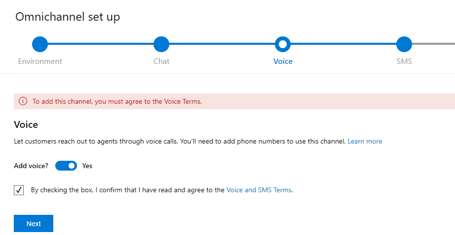
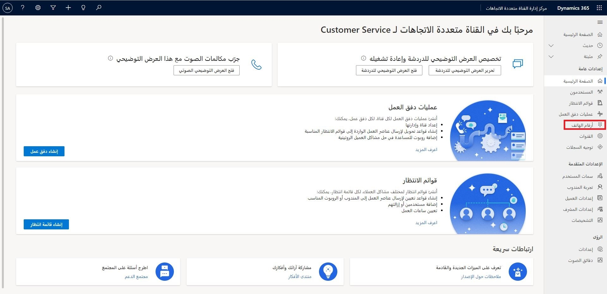
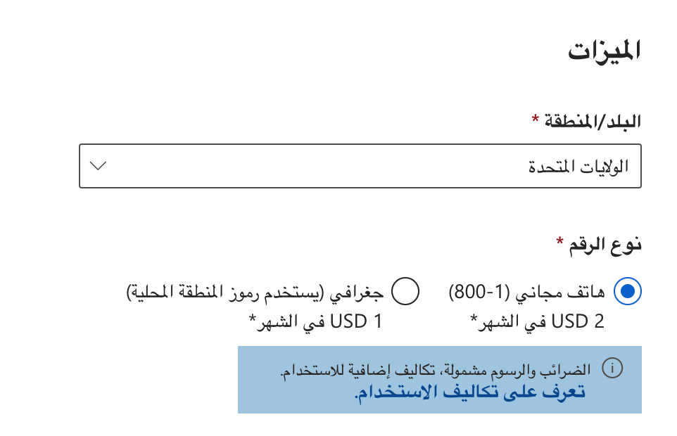
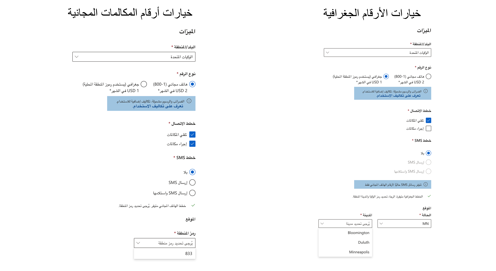
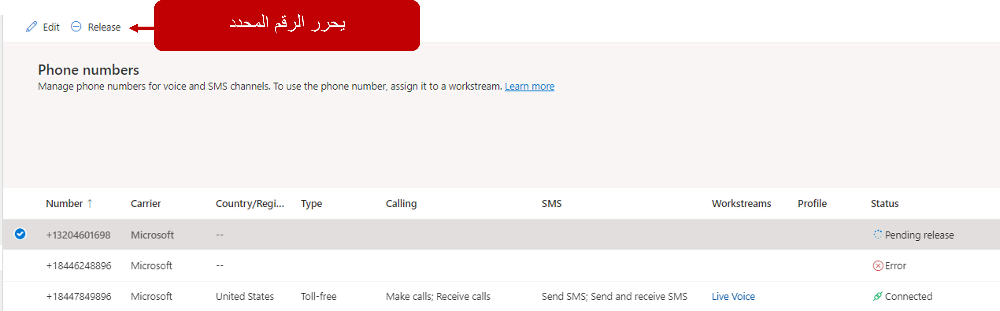

قبل بدء تطبيق قناة "الصوت" في البيئة الخاصة بك، ستحتاج أولاً إلى التأكد من أنه تم توفيرها. بمجرد الحصول على الترخيص الضروري، يمكنك تقديم قناة الصوت مثل بقية القنوات: باستخدام المنطقة **القناة متعددة الاتجاهات** في مركز إدارة Dynamics 365. يمكنك الوصول إلى مركز إدارة Dynamics 365 من خلال توسيع **الموارد** ثم تحديد **تطبيقات Dynamics 365** في مركز إدارة [Microsoft Power Platform](https://admin.powerplatform.microsoft.com/?azure-portal=true). حدد موقع **تكوين القناة متعددة الاتجاهات لـ Customer Service** وحدد علامة الحذف (**...**) ثم حدد **إدارة**. 

عندما تكون في منطقة الإدارة، حدد البيئة التي ترغب في توفير قناة "الصوت" فيها. إذا كانت قناة "الصوت" متاحة لإعدادها في البيئة، فإنها سوف تظهر في معالج إعداد القناة متعددة الاتجاهات. تأكد من تعيين تبديل **الصوت** إلى **نعم**، ثم تحديد خانة الاختيار لقبول البنود.

> [!div class="mx-imgBorder"]
> 

## إدارة أرقام الهواتف

تستخدم قناة Customer Service متعددة الاتجاهات "خدمات اتصالات Microsoft Azure" خدمات الاتصالات الخاصة بـ Azure لتوفير إمكانات اتصال والرسائل النصية. لضمان أنه يمكنك تطبيق ميزة "الصوت"، ستحتاج إلى شراء أرقام الهواتف وخطط الاتصال الضرورية للتأكد من أنه يمكن استخدامها بشكل مناسب.
يمكن للمسؤولين في مؤسستك شراء أرقام الهواتف وخطط الاتصال، ثم يمكنك تحديد ما إذا كنت ترغب في إضافة خدمات اتصال و/أو الخدمات النصية، أو ما إذا كنت ترغب في إعداد خيارات المكالمات الواردة أو الصادرة لأعمالك.

بعد قيامك بتزويد قناة "الصوت" (التي قد تستغرق عدة ساعات)، ستحتاج إلى إنشاء أرقام هواتف وتعيينها إلى مسارات عمل مختلفة لضمان إمكانية إجراء المكالمات واستلامها وتوجيهها وما إلى ذلك. يمكنك إنشاء وتعريف أرقام الهواتف باستخدام تطبيق مركز إدارة القناة متعددة الاتجاهات.

> [!div class="mx-imgBorder"]
> 

## الشروع في العمل 

ستتضمن رقم هاتف تجريبي يحتوي على 60 دقيقة من الاتصال المجاني عندما تقوم بتوفير قناة "الصوت" لأول مرة. لن تحتاج إلى الاتصال بـ Azure Communication Services لاستخدام هذا الرقم.
لأنك لن تتمكن من إعادة استخدام الرقم التجريبي أو شراءه، بعد 60 دقيقة مدة المكالمات المجانية، ستحتاج إلى شراء رقم جديد استناداً إلى اشتراك Microsoft Azure.

## إضافة أرقام هواتف جديدة

قبل أن يتمكن العملاء من البدء في التعامل مع مؤسستك من خلال الصوت، ستحتاج إلى التأكد أن لديك أرقام هواتف للاتصال بها. يمكن لمؤسستك شراء أرقام مختلفة استناداً إلى احتياجاتك. يمكنك إضافة أرقام الهواتف عن طريق تحديد **أرقام الهواتف** ضمن المنطقة **الإعدادات العامة** لتطبيق مركز إدارة القناة متعددة الاتجاهات.

عند إضافة رقم لأول مرة، ستحتاج إلى الاتصال باشتراك Azure حيث يمكنك توفير رقم (أرقام) هاتفك الجديد في "خدمات اتصالات Azure". يمكنك تحديد إنشاء مورد جديد أو استخدام الموارد الموجودة.

إذا قمت بتحديد الخيار لإنشاء مورد جديد، أدخل التفاصيل التالية:

-   **اشتراك Azure** - يحدد أي اشتراك Azure لاستخدامه.

-   **مجموعة موارد Azure** - تحدد اسم مجموعة الموارد حيث تريد تخزين موارد "خدمات اتصالات Azure".
    يجب أن تكون أسماء مجموعات الموارد فريدة داخل اشتراك معين.

-   **اسم المورد** - يقوم بتعريف اسم مورد "خدمات اتصالات Azure".

هذه المرة الأولى هي المرة الوحيدة التي ستحتاج فيها إلى إدخال هذه التفاصيل. سينقلك تحديد **رقم جديد** إلى شاشة رقم الهاتف الجديد مباشرةً بعد تحديد معلومات Azure.

ستحتاج إلى تحديد بلد/منطقة من القائمة المنسدلة عندما تقوم بإضافة الرقم الجديد لأول مرة. استناداً إلى ما حددته؛ سيتم توفير قائمة بالخطط المتاحة لهذا البلد/المنطقة. على سبيل المثال، سيتم تقديم نوعين من أنواع الأرقام للاختيار من بينهما إذا قمت بتحديد الولايات المتحدة.

-   **الرقم المجاني (1-800)** - يتوفر خياران (844 و833).

-   **جغرافي (يستخدم رموز المنطقة المحلية)** - ستحتاج إلى تحديد ولاية ومدينة ترغب في استخدامها كأساس للرقم. ويختلف عدد المدن المتاحة استناداً إلى المنطقة التي قمت بتحديدها.

> [!div class="mx-imgBorder"]
> 

بعد تحديد نوع الرقم الذي تريد استخدامه، تأكد من تحديد خيارات الاتصال والرسائل النصية التي تريدها على الرقم.

-   **خطط الاتصال** - يمكنك اختيار استقبال المكالمات أو إجراء المكالمات أو كليهما. (حدد خيار خطة اتصال واحداً على الأقل).

-   **خطط SMS** - يمكنك بشكل اختياري تحديد ما إذا كان من الممكن أن يكون الرقم قادراً على إرسال رسائل نصية وتلقيها.

> [!IMPORTANT]
> في وقت نشر الدورة التدريبية، تتوفر خطط اتصال SMS (النصية) فقط على الأرقام المجانية.

> [!div class="mx-imgBorder"]
> 

بعد تحديد الخيارات، سيقوم النظام بالبحث عن رقم متوفر يتضمن تلك الميزات. عند تخصيصك لرقم جديد، سيكون لديك فقط 15 دقيقة لشراء الرقم.
إذا انقضى الوقت، فيجب عليك محاولة الشراء مرة أخرى.

## تحرير أرقام الهواتف وإصدارهم

قد ترغب من وقت لآخر في تغيير خطة الاتصال، أو ترقية الاتصال أو الخطط النصية (SMS) المقترنة برقم. يمكنك تحرير أي أرقام غير متصلة بتدفق عمل. إذا كان الرقم مرتبطاً بتدفق عمل، سيحتاج إلى إزالته من تدفق العمل قبل إجراء التغييرات. يمكن إضافة ميزات إضافية إلى رقم موجود، كما يمكنك ترقية الميزات الموجودة التي تمت إضافتها بحسب الحاجة.
لا يمكنك إزالة ميزة بمجرد منحها لرقم الهاتف، لكن يمكنك ترقيه ميزات رقم الهاتف.

إذا لم تعد بحاجة إلى رقم هاتف، يمكن إصداره من قائمة الأرقام من خلال تحديد رقم الهاتف ثم تحديد **الإصدار**. عند إصدار رقم، يتم حذفه من Dynamics 365. لذا، قبل إصدار رقم ما، تأكد أنك لم تعد بحاجة إليه.

> [!div class="mx-imgBorder"]
> 

شاهد الفيديو التالي للحصول على معلومات إضافية حول إعداد قناة "الصوت" وتوفيرها.

> [!VIDEO https://www.microsoft.com/videoplayer/embed/RWOPAg]

الآن بعد أن قمت بتمكين قناة "الصوت" ولديك رقم لاستخدامه، يمكنك المضي قدماً في عملية إنشاء قائمة انتظار صوتية لتوجيه المحادثات الصوتية.
