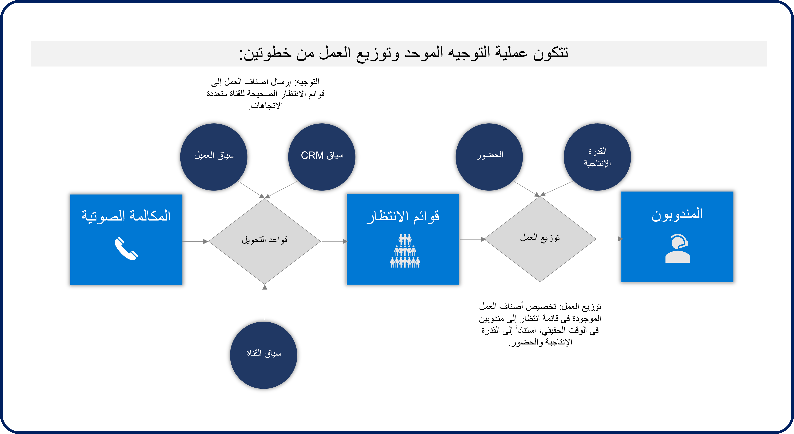
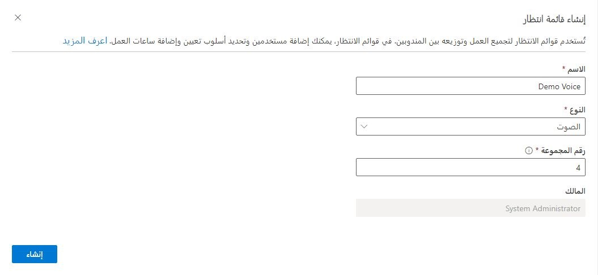
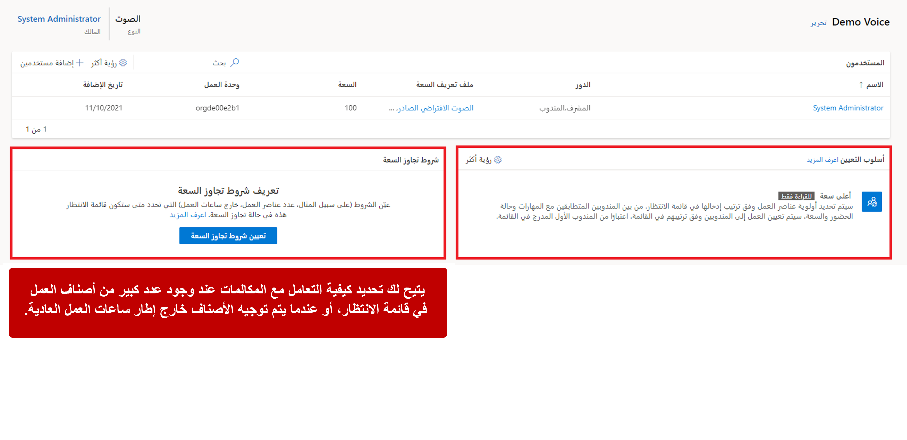

تمثل بنود العمل العناصر التي يعمل عليها المندوب والمتعلقة بالعميل. قد يكون عنصر العمل عبارة عن رسالة نصية أو محادثة دردشة يجريها المندوب مع أحد العملاء. قد تكون حالة جديدة تم إرسالها عبر بوابة الخدمة الذاتية، أو قد تكون مكالمة صوتية واردة وتحتاج إلى توجيهها إلى مندوب وتعيينها إليه. في Dynamics 365 Customer Service، يتم أولاً تعيين عناصر العمل إلى صف وتوزيعها على المندوبين بمساعدة التوجيه الموحّد. 

يعد التوجيه الموحد بمثابة توجيه ذكي على مستوى المؤسسة وإمكانية التعيين التي يمكنها توجيه عناصر العمل الواردة إلى المندوب الأنسب بناءً على عوامل قابلة للتكوين. على سبيل المثال، قد تشير مكالمة واردة إلى رقم موجود في ألمانيا إلى أن العميل يتحدث الألمانية. يساعدنا التوجيه الموحّد على ضمان توجيه المكالمة إلى مندوب يتحدث الألمانية، ويمكنه حالياً قبول المكالمة. 

يطبق التوجيه الموحد عملية من خطوتين لتوجيه العمل وتوزيعه: 

1.  **التوجيه إلى الصف** - يتم تصنيف عنصر العمل الوارد ثم تعيينه إلى صف الانتظار المناسبة، مثل توجيهه إلى صف انتظار ألمانية أو إلى صف انتظار مرتبطة بخط منتج معين. 
    
1.  **التوزيع على المندوب** - يتم تعيين عنصر العمل إلى مندوب في الوقت الفعلي. يبحث التوجيه الموحّد في التواجد الحالي للمندوب (متاح، مشغول، وما إلى ذلك) والقدرة المتاحة لتحديد الشخص الذي سيتم تعيين المكالمة إليه. 
    
> [!div class="mx-imgBorder"]
> 

تأكد من إعداد صفوف الصوت اللازمة في بيئتك للتأكد من إمكانية توجيه المكالمات الواردة بشكل مناسب، قبل أن تتمكن من توجيه المكالمات الصوتية الواردة إلى المندوبين. على سبيل المثال، إذا كنت ستوجه المحادثات إلى الصفوف المختلفة بناءً على اللغة (الإنجليزية، والألمانية، والإسبانية، وغيرها)، فمن الضروري وجود الصفوف اللازمة لدعم هذه الخطة. بعد إنشاء صف، قم بتحديد المندوبين الذين سيكونون متاحين لتخصيص عناصر من الصف، مثل إضافة المستخدمين الناطقين باللغة الألمانية إلى صف الصفوف. تشرح هذه الوحدة لاحقاً كيفية تكوين القواعد لتحديد كيفية توجيه العناصر إلى صف الانتظار. 

## قم بإنشاء صف للقناة الصوتية

قبل إنشاء صف انتظار، تأكد من مراعاة كيفية توجيه المكالمات وتخصيصها للمندوبين. على سبيل المثال، إذا كنت تخطط لتوجيه المكالمات وتعيينها بناءً على عناصر مثل اللغات، فتأكد من توفر صفوف الانتظار المناسبة بناءً على اللغات التي تخطط لدعمها. تأكد أن الصفوف المتاحة لديك تدعم هذه الخيارات، إذا كنت ستقوم بتوجيه المكالمات بناءً على عوامل أخرى مثل نوع المكالمة، أو بناءً على عروض المنتجات. 

يمكنك إنشاء صفوف انتظار في مركز إدارة القناة الشاملة عن طريق تحديد **الصفوف** ضمن المجموعة **الإعدادات العامة**. حدد المعلومات التالية عند إنشاء صف انتظار جديدة:

-   **الاسم** - يحدد ما تريد استدعاء صف مثل صف "الإنجليزية" أو صف "الألمانية".

-   **النوع** - يحدد نوع عناصر العمل التي يمكن توجيهها إلى هذا الصف. *للمحادثات الصوتية، حدد **الصوت**.*

-   **رقم المجموعة** - استخدم رقم المجموعة لمساعدتك على تنظيم صفوف بشكل أفضل. لا يؤثر على الأولوية أو التوجيه. على سبيل المثال، يمكنك تعيين جميع صفوف اللغة الخاصة بك إلى رقم مجموعة معين. 

> [!div class="mx-imgBorder"]
> 

قم بتحديد المستخدمين الذين يجب إضافتهم إلى الصف، بعد إنشاء الصف الخاصة بك. سيتم تعيين المكالمات الصوتية الواردة التي تم توجيهها إلى صف الانتظار فقط للمندوبين الذين تمت إضافتهم كأعضاء في صف الانتظار. تأكد من إضافة مستخدم واحد على الأقل. يمكنك فقط إضافة المستخدمين الذين تم إعدادهم للتوجيه الموحّد.

> [!div class="mx-imgBorder"]
> 

يتمثل أحد التحديات الفريدة فيما يتعلق بالمكالمات الصوتية في أنه، في بعض الأحيان، يمكن أن تتلقى صف الانتظار عدداً كبيراً جداً من المكالمات الواردة في وقت واحد.
على سبيل المثال، قد تجد أن المزيد من العملاء سيتصلون خلال ساعات المساء أو وقع حدث معين أدى إلى زيادة مؤقتة في المكالمات الواردة. عند حدوث هذه المواقف، يمكن للعملاء تجربة أوقات انتظار أطول من المتوسط. للمساعدة في هذه الحالات، يمكن للمؤسسات تحديد وقت وكيفية التعامل مع هذه السيناريوهات من خلال تحديد قواعد تعيين تجاوز سعة الاتصال. 

لمزيد من المعلومات، راجع [مهمة تجاوز السعة](/dynamics365/customer-service/voice-channel-call-overflow?azure-portal=true#configure-call-overflow).

شاهد الفيديو الآتي لرؤية عرض توضيحي حول تحديد صفوف الانتظار.

> [!VIDEO https://www.microsoft.com/videoplayer/embed/RWOZwT]

الآن بعد أن تعرّفت على كيفية إنشاء صفوف لتوجيه المكالمات الصوتية وتحديدها، يمكنك تعلّم كيفية استخدام مسارات العمل وإدارة المحادثات الصوتية الواردة والتوجيه إلى صف الصوت المناسب. 
