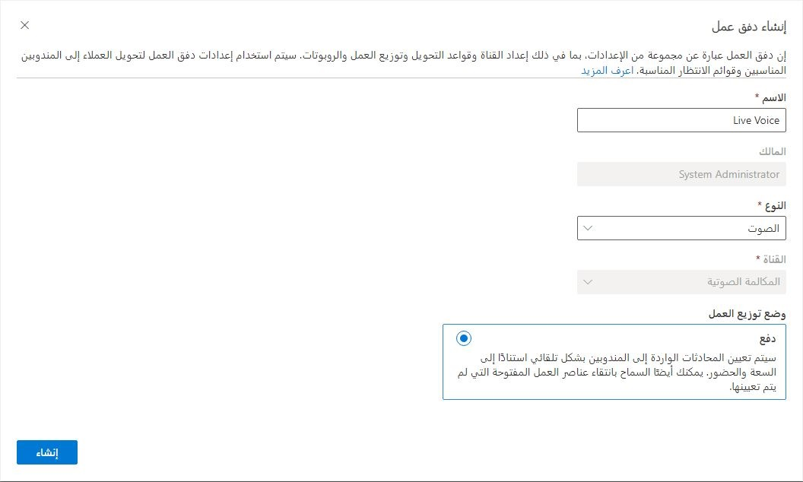
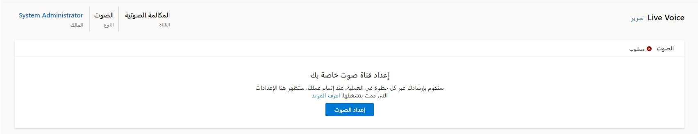
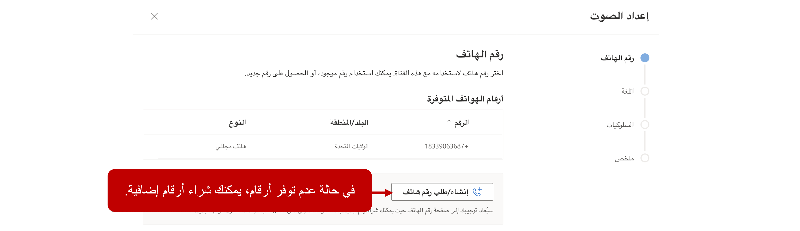
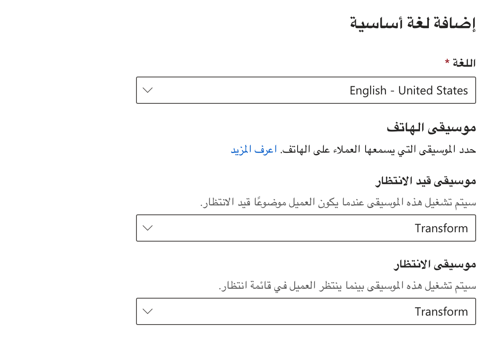
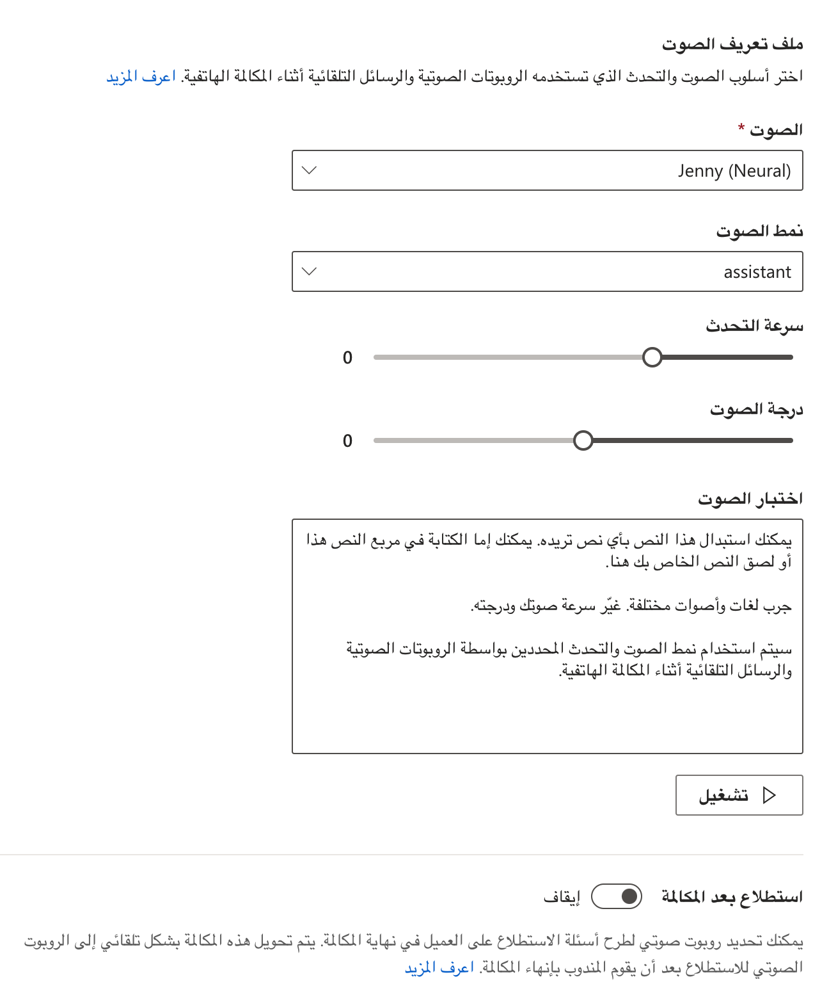
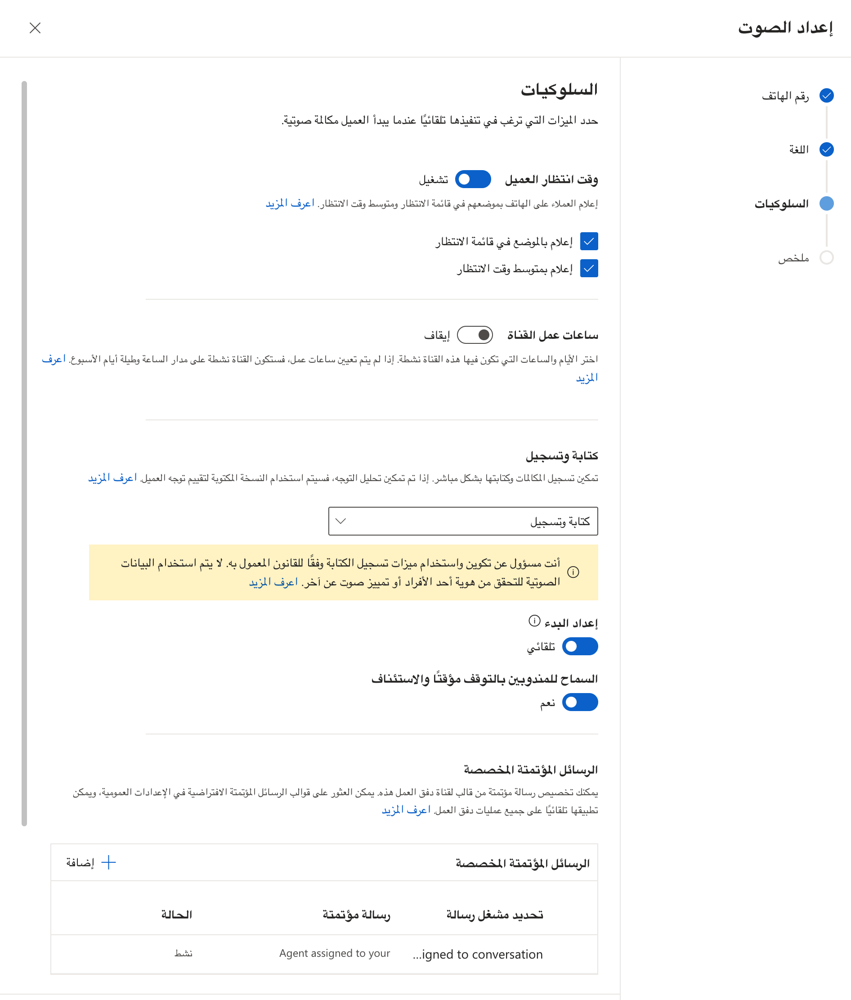
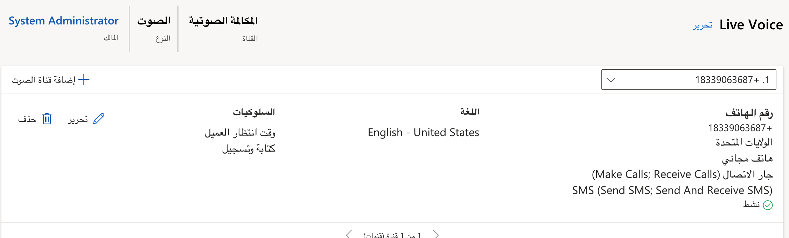

عند ورود مكالمة صوتية، يحتاج النظام إلى تقييمها بحيث يمكن تسليمها إلى المندوب الأنسب. أولاً، سيتم توجيه المكالمة الصوتية إلى صف الانتظار المناسبة. بعد ذلك، سيتم توزيعها على أحد أعضاء صف الانتظار هذه للعمل عليها. تكتمل هذه العملية من خلال تدفق عمل، وهو في الأساس مجموعة من الإرشادات التي تحدد كيفية توجيه وتوزيع المحادثات من قنوات مختلفة، بما في ذلك الصوت. 

يمكنك إنشاء تدفقات عمل في مركز إدارة القناة متعددة الاتجاهات.
عند تحديد تدفق عمل، قم بتقديم التفاصيل التالية:

-   **الاسم‏‎** - حدد اسماً بديهياً مثل **تدفق عمل صوت Contoso**.

-   **النوع** - حدد نوع تدفق العمل. بالنسبة لسيناريوهات الصوت، يجب تعيين هذا إلى **صوت**. 

> [!div class="mx-imgBorder"]
> 

عند تحديد تدفق العمل الصوتي، سيتم تعيينه تلقائياً على **وضع توزيع العمل** الخاص **بالدفع**. سيضمن هذا الإعداد أن المحادثات الصوتية يتم تخصيصها تلقائياً للمندوبين للعمل عليها. 

## إعداد قناة صوتية

بعد إنشاء تدفق عمل الصوت، يمكنك إقران رقم هاتف به. سيضمن هذا الاقتران إمكانية توجيه المكالمات التي يتم إجراؤها على هذا الرقم وتوزيعها بشكل مناسب. يمكن للمؤسسات شراء أرقام الهواتف كما هو مطلوب. تتوفر الأرقام المشتراة لإضافتها إلى تدفقات العمل كقنوات. 

> [!div class="mx-imgBorder"]
> 

في تدفق العمل الصوتي، حدد الزر **إعداد الصوت** لإضافة رقم الهاتف. على شاشة **رقم الهاتف** ستتوفر لك الأرقام التي تم تمكين الاتصال الداخلي بها وغير مرتبطة بالفعل بتدفق عمل آخر للاختيار من القائمة. بالإضافة إلى ذلك، يمكنك أيضاً استخدام الزر "الحصول على [رقم الهاتف](/dynamics365/customer-service/voice-channel-route-queues?azure-portal=true#acquire-a-phone-number)" لشراء رقم هاتف آخر إذا لم يكن لديك واحد متاح. 

> [!div class="mx-imgBorder"]
> 

## تحديد لغة

في صفحة **اللغة** ، يمكنك تحديد لغة أساسية للرقم. هذا التعريف مهم لأنه يساعد المؤسسات على توجيه المكالمات الواردة من بلدان أو مناطق معينة إلى ممثلين يتحدثون اللغة. على سبيل المثال، يمكنك إنشاء تدفق عمل للمكالمات الواردة لرقم هاتف ألماني. من خلال تعيين اللغة الأساسية إلى اللغة الألمانية، سيتم تسليم الرسائل الصوتية الآلية باللغة الألمانية. بعد تحديد اللغة الأساسية، سيوفر لك النظام خيارات متعددة مرتبطة بالتجربة التي سيختبرها العملاء عند الانخراط في هذه القناة، بما في ذلك:

-   **موسيقى الهاتف** - يسمح لك بتحديد الموسيقى التي سيسمعها العملاء عندما يكونون في انتظار أو ينتظرون في صف انتظار. 
    
    > [!div class="mx-imgBorder"]
    > 

-   **ملف تعريف الصوت** - يسمح لك بتحديد نمط الصوت والتحدث الذي سيتم استخدامه بواسطة الروبوتات الصوتية والرسائل الآلية أثناء المكالمة. يسمح لك ملف الصوت بتحديد المكونات التالية:
    
    -   **الصوت** - حدد صوتاً من أصوات مختلفة.

    -   **نمط الصوت** - يسمح لك بتحديد نوع الانعكاس الذي يستخدمه الصوت. 

    -   **سرعة التحدث** - يتحكم في معدل الكلام المستخدم. 

    -   **الملعب** - زيادة أو تقليل الملعب بناءً على تفضيلاتك.

أثناء قيامك بتحديد مجموعات صوتية مختلفة، يمكنك اختبار الصوت للتحقق من أنه يبدو بالطريقة التي تريدها. 

> [!div class="mx-imgBorder"]
> 

توفر العديد من المؤسسات للعملاء استبيانات قصيرة بعد اكتمال المكالمات. إذا تم تمكين خيار الاستطلاع، فعند إنهاء المندوب، يتم نقل العميل تلقائياً إلى روبوت الاستطلاع الذي حددته. 

## تحديد سلوكيات القناة

في علامة التبويب **السلوكيات**، يمكنك تحديد أنواع معينة من السلوكيات التي تريد أن يتخذها الروبوت. على سبيل المثال، أثناء انتظار العملاء، قد ترغب في أن تقوم القناة بإعلامهم بمركزهم في صف الانتظار أو للإشارة إلى متوسط ​​وقت الانتظار. يمكن أن يؤدي تقديم هذه المعلومات إلى وضع توقعات واضحة لعملائك أثناء انتظارهم. 

تتضمن علامة التبويب **السلوكيات** الخيارات التالية: 

-   **وقت انتظار العميل** - حدد ما إذا كنت تريد إخطار العميل بموقعه في صف الانتظار ومتوسط ​​وقت الانتظار. 

-   **ساعات تشغيل القناة الواحدة** - حدد الساعات التي يجب أن تكون فيها القناة الصوتية متاحة لتلقي المكالمات من العملاء. لمزيد من المعلومات، راجع [إنشاء وإدارة ساعات التشغيل](/dynamics365/customer-service/create-operating-hours/?azure-portal=true).

-   **النسخ والتسجيل** - قم بتمكين القدرة على نسخ المكالمات و/أو التسجيل. لمزيد من المعلومات، راجع [تكوين تسجيلات ونصوص المكالمات](/dynamics365/customer-service/voice-channel-configure-transcripts/?azure-portal=true).

-   **رسائل آلية مخصصة** - حدد الرسائل الآلية التي يمكن تشغيلها عند وقوع أحداث مختلفة، مثل تعيين مندوب للمكالمة. لمزيد من المعلومات، راجع [تكوين الرسائل المؤتمتة](/dynamics365/customer-service/configure-automated-message/?azure-portal=true).

-   **تحويل المكالمة إلى رقم هاتف خارجي** - يمكن للمندوبين تحويل المكالمة إلى رقم خارجي.

-   **استشر مستخدم Microsoft Teams** - يمكن للمندوبين التشاور مع مندوبين آخرين في Microsoft Teams. 

> [!div class="mx-imgBorder"]
> 

بعد الانتهاء من الخطوات السابقة لإنشاء القناة الصوتية، ستظهر في قسم القناة بتدفق العمل. الآن، لديك تدفق عمل صوتي مخصص وقناة مخصصة متاحة للتعامل مع المكالمات الواردة. 

> [!div class="mx-imgBorder"]
> 

شاهد الفيديو التالي لمزيد من المعلومات حول إعداد تدفقات العمل. 

> [!VIDEO https://www.microsoft.com/videoplayer/embed/RWONd0]

يمكنك إكمال تجربة توجيه المكالمات من خلال إعداد قواعد التوجيه التي ستستقبل المكالمات الواردة في تدفق العمل وتوجهها إلى صف الانتظار الصحيحة. 
