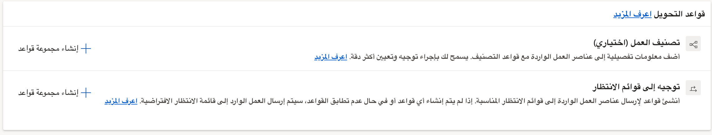
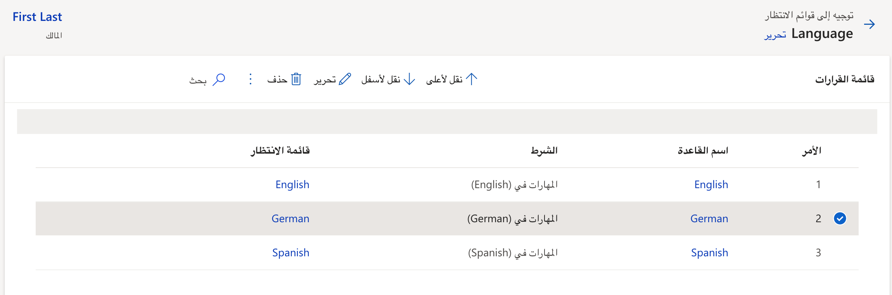

يعد توجيه المكالمات جزءاً مهماً من ضمان تحقيق العملاء لمستوى الخدمة التي يتوقعونها. بدون توجيه المكالمات، تتعرض المكالمات الواردة لخطر التعيين لمندوبين غير مؤهلين للعمل عليها، أو قد تضيع في المراوغة عند ورودها وقد لا يتم توجيهها إلى أي شخص. 

من خارج الصندوق، تم تكوين النظام لتوجيه المكالمات الصوتية بشكل بسيط وسريع. سيتم توجيه جميع المكالمات الصوتية الواردة إلى *صف الصوت الافتراضي* وسيتم تخصيصها للمندوبين باستخدام منهجية التخصيص رواند روبن. هذه الوظيفة ليست الخيار الأفضل في معظم سيناريوهات العالم الحقيقي حيث تحتاج إلى التأكد من توجيه المكالمات إلى أقسام معينة. في هذه السيناريوهات، يمكنك استخدام إمكانيات قاعدة التوجيه للتوجيه الموحد لضمان إرسال المكالمات إلى الصفوف الصحيحة حتى يمكن توزيعها بشكل مناسب. 

## تكوين قواعد التوجيه لتدفق عمل الصوت

يتم تحديد قواعد التوجيه مباشرة في تدفق العمل الصوتي. بمجرد دخولك إلى تدفق العمل، سترى قسم قواعد التوجيه. 

يحتوي هذا القسم على جزأين:

-   **تصنيف العمل**: يتيح لك تحديد قواعد التصنيف التي ستضيف معلومات مفصلة إلى عناصر العمل الواردة التي يمكن استخدامها في التوجيه والتعيين. على سبيل المثال، يمكنك استخدام تصنيف العمل لتحديد لغة المكالمة بناءً على المنطقة أو رمز المنطقة لرقم الهاتف. يمكنك معرفة المزيد عن تصنيف العمل هنا: [تصنيف العمل](/dynamics365/customer-service/configure-work-classification?azure-portal=true#create-work-classification-rulesets).

-   **الطريق إلى الصفوف:**: يُستخدم لضمان إرسال العناصر الواردة إلى الصفوف الصحيحة. *إذا لم يتم تحديد أي قواعد، فسيتم تعيين العناصر الواردة على الصف الافتراضي*. 
    
> [!div class="mx-imgBorder"]
> 

يتم إنشاء قواعد التوجيه، عن طريق تحديد **إنشاء مجموعة قواعد** في القسم "التوجيه إلى الصفوف". 

يمكن أن تتضمن مجموعات القواعد قواعد متعددة بناءً على احتياجاتك المؤسسية. على سبيل المثال، ستحتاج مجموعة القواعد الخاصة بك إلى قواعد متعددة، وذلك لتسهيل التوجيه بناءً على اللغة. 

-   قاعدة تقوم بتوجيه المكالمات الناطقة باللغة الألمانية إلى صف التحدث باللغة الألمانية.

-   قاعدة تقوم بتوجيه المكالمات الناطقة باللغة الأسبانية إلى صف التحدث باللغة الأسبانية. 

-   قواعد إضافية للتوجيه إلى أي صفوف لغة إضافية قمت بتحديدها. 

عند تحديد قاعدة، ستحتاج إلى تكوين ما يلي:

-   **الشروط**: يحدد الشروط التي يجب أن تتحقق حتى يتم تطبيق القاعدة. 

-   **الطريق إلى الصفوف**: يحدد الصف لتوجيه حركة المرور إليها بمجرد استيفاء الشرط. 

في الصورة أدناه، أي مكالمات واردة تم تخصيص مهارة فيها للغة الإنجليزية سيتم توجيهها إلى صف اللغة الإنجليزية. 

> [!div class="mx-imgBorder"]
> 

عند التعامل مع الصوت، قد تواجه زيادة في حجم المكالمات، كما هو مذكور في الوحدة السابقة. عند تحديد قاعدة، يمكنك تحديد إجراء تجاوز السعة. يمكنك التحديد من ضمن الخيارات التالية. 

-   **الافتراضي**: يظل عنصر العمل في الصف ليتم توجيهه إلى المندوب التالي المتاح.

-   **إنهاء مكالمة**: ينهي المكالمة في حالة عدم توفر أي مندوب لتلقي المكالمة، مثل ورود المكالمة خارج ساعات العمل المحددة. 

-   **التحويل لرقم خارجي**: يحدد الرقم الذي يجب توجيه المكالمة إليه إذا كان يجب التعامل مع عنصر العمل على أساس الأولوية.

يمكنك تحديد العديد من القواعد والقواعد حسب الحاجة، بناءً على احتياجات مؤسستك. يتم تطبيق القواعد بترتيب محدد مسبقاً، ويمكن تغييرها بحسب الحاجة. قم بإنشاء العديد من القواعد التي يتطلبها عملك.

> [!div class="mx-imgBorder"]
> 

سيكون من المفيد التعمق في الموضوعات المختلفة، بينما تغطي هذه الوحدة أساسيات التوجيه والتوزيع. يمكنك معرفة المزيد حول التوجيه والتصنيف باستخدام الارتباطات أدناه. 

-   لمعرفة المزيد عن تصنيف العمل، قم بزيارة [إنشاء مجموعات قواعد تصنيف العمل](/dynamics365/customer-service/configure-work-classification?azure-portal=true#create-work-classification-rulesets).

-   لمعرفة المزيد حول مجموعات قواعد توجيه الصف، تفضل بزيارة [تكوين مجموعات قواعد وقواعد التوجيه إلى الصفوف.](/dynamics365/customer-service/configure-work-classification?azure-portal=true#configure-route-to-queues-rulesets-and-rules)
    
-   لمعرفة المزيد حول التوجيه الموحد، قم بزيارة [نظرة عامة على التوجيه الموحّد.](/dynamics365/customer-service/overview-unified-routing/?azure-portal=true)

شاهد الفيديو التالي للحصول على معلومات إضافية حول توجيه المكالمة.

> [!VIDEO https://www.microsoft.com/videoplayer/embed/RWOIxN]
    
الآن بعد أن رأيت طريقة تكوين قناة صوتية، دعنا نفحص كيف يمكن لوكلائك والمستخدمين النهائيين الاستفادة من القناة الصوتية عند استخدام التطبيق. 
