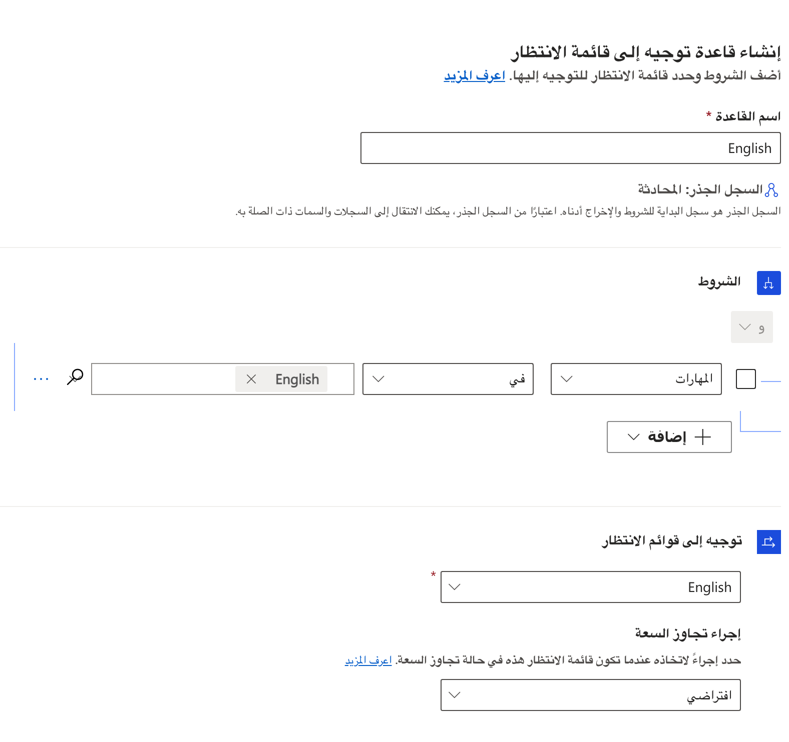

يعد توجيه المكالمات جزءاً مهماً من ضمان تحقيق العملاء لمستوى الخدمة التي يتوقعونها. بدون توجيه المكالمات، تتعرض المكالمات الواردة لخطر التعيين لمندوبين غير مؤهلين للعمل عليها، أو قد يتم تجاهل المكالمة عند ورودها وقد لا يتم توجيهها إلى أي شخص. 

من خارج الصندوق، تم تكوين النظام لتوجيه المكالمات الصوتية بشكل بسيط وسريع. سيتم توجيه جميع المكالمات الصوتية الواردة إلى *صف انتظار الصوت الافتراضية* وسيتم تعيينها للمندوبين باستخدام منهجية التخصيص رواند روبن. هذه الوظيفة ليست الخيار الأفضل في معظم سيناريوهات العالم الحقيقي حيث تحتاج إلى التأكد من توجيه المكالمات إلى أقسام معينة. في هذه السيناريوهات، يمكنك استخدام إمكانيات قاعدة التوجيه للتوجيه الموحد لضمان إرسال المكالمات إلى صفوف الانتظار الصحيحة حتى يمكن توزيعها بشكل مناسب. 

## إعداد قواعد التوجيه لتدفق عمل الصوت

يمكنك تحديد قواعد التوجيه مباشرة في تدفق العمل الصوتي.
يحتوي تدفق العمل على قسم **قواعد توجيه**، والذي يحتوي على جزأين:

-   **تصنيف العمل** - يتيح لك تحديد قواعد التصنيف التي ستضيف معلومات مفصلة إلى عناصر العمل الواردة التي يمكن استخدامها في التوجيه والتعيين. على سبيل المثال، يمكنك استخدام تصنيف العمل لتحديد لغة المكالمة بناءً على المنطقة أو رمز المنطقة لرقم الهاتف. [لمزيد من المعلومات، راجع إنشاء مجموعة قواعد عمل المتابعة](/dynamics365/customer-service/configure-work-classification?azure-portal=true#create-work-classification-rulesets).

-   **التوجيه لصفوف الانتظار** - استخدم هذا الخيار لضمان إرسال العناصر الواردة إلى صفوف الانتظار الصحيحة. إذا لم يتم تحديد أي قواعد، فسيتم تعيين العناصر الواردة على صفوف الانتظار الافتراضية. 
    
> [!div class="mx-imgBorder"]
> 

يمكنك إنشاء قواعد التوجيه عن طريق تحديد **إنشاء مجموعة قواعد** في قسم **التوجيه إلى الصفوف**. 

يمكن أن تتضمن مجموعات القواعد قواعد متعددة بناءً على احتياجاتك المؤسسية. على سبيل المثال، لتسهيل التوجيه بناءً على اللغة، ستحتاج مجموعة القواعد الخاصة بك إلى قواعد متعددة مثل: 

-   قاعدة تقوم بتوجيه المكالمات الناطقة باللغة الألمانية إلى صفوف انتظار التحدث باللغة الألمانية.

-   قاعدة تقوم بتوجيه المكالمات الناطقة باللغة الأسبانية إلى صفوف انتظار التحدث باللغة الأسبانية. 

-   قواعد إضافية للتوجيه إلى أي صفوف انتظار لغة أخرى قمت بتحديدها. 

عند تحديد قاعدة، قم بإعداد العوامل التالية:

-   **الشروط** - يحدد الشروط التي يجب أن تتحقق حتى يتم تطبيق القاعدة. 

-   **التوجيه لصفوف الانتظار** - يحدد صف الانتظار لتوجيه حركة المرور إليها بمجرد استيفاء الشرط. 

تٌظهر الصورة التالية المكالمات الواردة التي تم تعيينها مهارة فيها للغة الإنجليزية سيتم توجيهها إلى صف انتظار اللغة الإنجليزية. 

> [!div class="mx-imgBorder"]
> 

عند العمل مع قناه الصوت، قد تواجهك تجاوز سعة المكالمات. عند تحديد قاعدة، يمكنك تحديد إجراء **تجاوز السعة** ثم التحديد من الخيارات التالية: 

-   **الافتراضي** - يظل عنصر العمل في صف الانتظار ليتم توجيهه إلى المندوب التالي المتاح.

-   **إنهاء مكالمة** - ينهي المكالمة في حالة عدم توفر أي مندوب لتلقي المكالمة، مثل ورود المكالمة خارج ساعات العمل المحددة. 

-   **التحويل لرقم خارجي** - يحدد الرقم الذي يجب توجيه المكالمة إليه إذا كان يجب التعامل مع عنصر العمل على أساس الأولوية.

يمكنك إنشاء وتحديد العديد من القواعد ومجموعات القواعد حسب الحاجة، بناءً على احتياجات مؤسستك. يتم تطبيق القواعد بترتيب محدد مسبقاً، ويمكن تغييرها بحسب الحاجة.

> [!div class="mx-imgBorder"]
> 

سيكون من المفيد التعمق في الموضوعات المختلفة، بينما تغطي هذا النموذج أساسيات التوجيه والتوزيع.
لمعرفة المزيد حول التوجيه والتصنيف باستخدام الروابط التالية. 

-   لمعرفة المزيد عن تصنيف العمل، قم بزيارة [إنشاء مجموعات قواعد تصنيف العمل](/dynamics365/customer-service/configure-work-classification?azure-portal=true#create-work-classification-rulesets).

-   لمعرفة المزيد حول مجموعات قواعد توجيه الصف، قم بزيارة [تكوين مجموعات قواعد التوجيه إلى صفوف الانتظار والقواعد.](/dynamics365/customer-service/configure-work-classification?azure-portal=true#configure-route-to-queues-rulesets-and-rules)
    
-   لمعرفة المزيد حول التوجيه الموحد، قم بزيارة [نظرة عامة على التوجيه الموحد.](/dynamics365/customer-service/overview-unified-routing/?azure-portal=true)

شاهد الفيديو التالي للحصول على معلومات إضافية حول توجيه المكالمة.

> [!VIDEO https://www.microsoft.com/videoplayer/embed/RWOIxN]
    
الآن بعد أن تعرفت على كيفية تكوين قناة صوتية، يمكنك معرفة كيف يمكن للمندوبين والمستخدمين الآخرين الاستفادة من مميزات القناة الصوتية عند استخدام التطبيق. 
