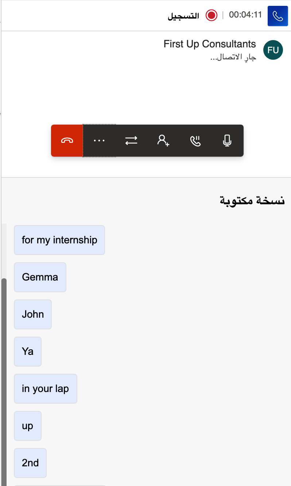
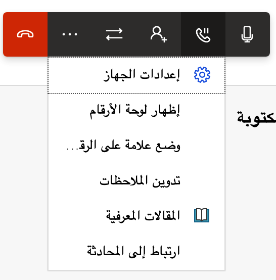
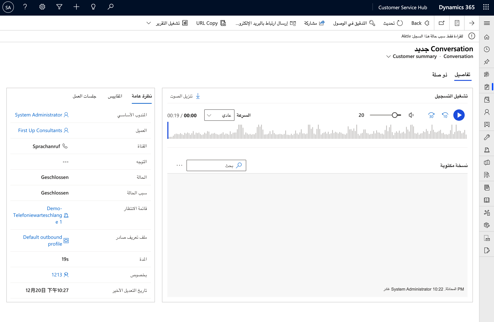

يتمثل أحد العناصر الأساسية لقناة الصوت في القناة متعددة الاتجاهات لخدمة العملاء في أنها متكاملة مباشرةً مع Dynamics 365.
يتم تقديم هذا التكامل من خلال لوحة معلومات المندوب، والتي تزود المندوبون برؤية موحدة لواجهة الاتصال وملخص العميل وسجل الحالة والجدول الزمني. تساعد هذه المعلومات المندوب على توفير حلول سريعة وفعالة واستباقية لمشاكل العملاء. علاوة على ذلك، تضمن لوحة المعلومات أن تجربة المندوب مع القناة الصوتية تشبه الدردشة والنص والقنوات الاجتماعية الأخرى.
نتيجة لذلك، يمكن للمندوبين التحديث بسرعة، وبالتالي تقليل الوقت وتكاليف التدريب.

## إجراء المكالمات مع العملاء والرد عليها

يمكن أن تحدث سيناريوهات متعددة حيث قد يرغب المندوب في الاتصال بالعميل مباشرةً باستخدام قناة الصوت. على سبيل المثال، قد يرغب المندوب في الاتصال بالعميل مباشرة للحصول على معلومات إضافية. قبل أن يتمكن المندوبون من استخدام الاتصال الصادر، سيحتاجون إلى إعداد الميزة. بعد تكوين الاتصال الصادر، يمكن للمندوبين الاتصال بالعملاء بإحدى طريقتين:

-   **تشغيل زر الطالب** - موجود في شريط قائمة القناة متعددة الاتجاهات لخدمة العملاء.

-   **تحديد أيقونة الهاتف الموجودة في سجل:** - والوصول إليها عندما يكون للسجل رقم هاتف مرتبط به. عند تحديد تلك الأيقونة، سيقوم النظام تلقائياً بطلب الرقم.

عندما يجرى عميل اتصالاً، يقوم روبوت ذكي بالرد على المكالمة الواردة. سيقوم الروبوت بجمع التفاصيل الأساسية حول العميل ومشكلته قبل التحويل إلى مندوب لاتخاذ المزيد من الإجراءات المطلوبة. عندما يتم تحديد مندوب مؤهل ويكون لديه إمكانية للعمل على العنصر، فسيتلقى إخطاراً على سطح مكتب المندوب حتى يتمكن من قبول المكالمة الواردة.

يمكن إجراء النسخ الكتابي للمحادثات بين المندوبين والعملاء تلقائياً. بعد تمكين هذه الميزة في مؤسستك، سيتم نسخ المحادثات في الوقت الفعلي، مما يعني أن المندوبين لا يحتاجون إلى تدوين الملاحظات أثناء المكالمة. كما أن عمليات النسخ الكتابي مفيدة في السيناريوهات التي يلزم خلالها تحويل مكالمة إلى مندوب آخر. يستطيع المندوب الجديد استخدام النسخة المكتوبة للحصول على سجل مكالمات كامل مرتبط بالمكالمة. تدعم النسخة المكتوبة تحليلاً *مباشراً* للتوجه، مما يعني أنه يمكنك أنت أو مشرفك على الفور عرض وقياس مزاج العميل وشعوره من خلال أيقونات التوجه.

> [!div class="mx-imgBorder"]
> 

بالإضافة إلى إمكانيات النسخ الكتابي، عندما يفتح المندوب صنف العمل، سيكون بإمكانه الوصول إلى لوحة المحادثة في لوحة معلومات المندوب.

> [!div class="mx-imgBorder"]
> 

 تشتمل لوحه المحادثة علي العديد من عناصر التحكم التي يمكنك استخدامها:

-   **كتم‏‎** - يكتم صوت الميكروفون بحيث لا يسمع العميل صوتك.

-   **انتظار** - يضع العميل قيد الانتظار، وسيسمع موسيقى الانتظار.

-   **استشارة** - يمكن للمندوبين العثور على مندوبين أو مشرفين آخرين والتعامل معهم.

-   **التحويل (إلى مندوب أو صف)** - يسمح للمندوبين بتحويل المكالمة إلى مندوب آخر أو قائمة انتظار.

-   **إنهاء** - ينهي المكالمة.

-   **إظهار لوحة الأرقام** - يفتح لوحة الأرقام بحيث يمكنك طلب رقم داخلي عند الحاجة.

-   **وضع علامة على الرقم كبريد عشوائي** - يستخدم [للإبلاغ عن مكالمة واردة كبريد عشوائي](/dynamics365/customer-service/voice-channel-agent-experience?azure-portal=true#report-a-phone-number-as-spam).

-   **إعدادات الجهاز** - ضوابط لإعداد الميكروفون وإعدادات السماعات.

-   **تدوين ملاحظات** - توفير عنصر تحكم يمكن للمندوبين استخدامه لتدوين ملاحظات خاصة بمحادثتك مع العميل.

-   **إيقاف مؤقت للنسخ الكتابي** - السماح بإيقاف النسخ الكتابي مؤقتاً أثناء الحصول على تفاصيل المحادثة، مثل تفاصيل البنك أو الفوترة أو معلومات الدفع.

-   **مقالات معرفية** - يمكن للمندوبين البحث عن المقالات المعرفية التي يُحتمل أن تكون ذات صلة بالمحادثة.

-   **الربط بالمحادثة** - السماح بربط محادثة أخرى أو حالة أو مقالة معرفية بالمحادثة.

## الإبلاغ عن رقم هاتف كبريد عشوائي

أحياناً، قد يتم توجيه مكالمات من أرقام عشوائية إلى المندوبين. عند حدوث ذلك، يستطيع المندوبون الإبلاغ عن الرقم كبريد عشوائي أثناء الاتصال بتحديد **‏‫وضع علامة على الرقم كبريد عشوائي‬**. عندما يتم وضع علامة على رقم كبريد عشوائي، سيتم إرسال إخطار إلى مسؤول مؤسستك، حيث يمكنهم المراجعة وتقديم مزيد من الإجراءات. يمكنك إضافة ملاحظات لتساعد المسؤول في مراجعة الأرقام وحظرها.

## عرض تسجيلات المكالمات والنُسخ المكتوبة

يساعد توفير تسجيل المكالمات والنُسخ المكتوبة في تسهيل العودة إلى المكالمات بعد إجرائها. ستستخدم العديد من المؤسسات النُسخ المكتوبة لضمان الجودة وأغراض التدريب.
يمكن للمسؤولين تمكين القدرة على عرض تسجيلات المكالمات والنُسخ المكتوبة. وبعد تمكينها، يمكن للمشرفين وكذلك المندوبين عرض تسجيلات المحادثات ونسخها المكتوبة وإعادة تشغيل التسجيلات بالإضافة إلى عرض تحليل التوجه والتحليلات الأخرى المتعلقة بالمحادثات.

لعرض تسجيلات المكالمات ونسخها المكتوبة عن طريق الوصول إلى **نموذج المحادثة** بإحدى الطرق الآتية:

-   **نافذة جلسة العمل** - حدد زر القائمة المنسدلة الموجود بجانب **ملخص العميل** وحدد **نموذج المحادثة**.

-   **نموذج الاتصال ذات الصلة** - حدد اسم جهة الاتصال، ثم في قسم **الجدول الزمني،** مرر المؤشر فوق المحادثة المغلقة التي تريد عرضها ثم حدد أيقونة **فتح سجل**.

تعرض علامة تبويب  **التفاصيل** الخاصة **بنموذج المحادثة** تفاصيل تسجيل المكالمة.

> [!div class="mx-imgBorder"]
> 

تتضمن الخيارات الموجودة في **قسم تشغيل التسجيل** ما يلي:

-   **تشغيل** - تشغيل صوت المحادثة.

-   **إرجاع‏‎** أو **تقديم سريع** - حدد هذين الزرين للإرجاع بمدة قدرها 10 ثوانٍ أو للتقديم السريع بمدة قدرها 30 ثانية.

-   **مستوى الصوت** - حرك شريط التمرير لضبط مستوى الصوت على المستوى المطلوب.

-   **تنزيل ملف صوتي** - تنزيل ملف صوتي بتنسيق .mp4 للمحادثة بأكملها.

-   **السرعة‏‎** - من القائمة المنسدلة، حدد سرعة تشغيل المحادثة، سواء كانت أبطأ أو أسرع. ويمثل. **عادي‏‎** الإعداد الافتراضي، والسرعة التي تم تسجيل المحادثة بها.

-   **شريط تمرير المحادثة** - حرِّك شريط التمرير لأي نقطة من نقاط المحادثة أو استمع إليها من البداية إلى النهاية. عند تحديد موقع في الرسم المرئي للتسجيل، تنتقل النسخة المكتوبة أيضاً إلى الموقع ذاته في المحادثة.

-   **التوجه** - تساعدك الألوان والرموز التعبيرية على تحليل توجه المحادثة بسرعة. اللون الأخضر يعني التوجه الإيجابي، والأحمر يعني التوجه السلبي، والرمادي يعني التوجه المحايد.

يعرض قسم  **نظرة عامة** الخاص **بنموذج المحادثة** التفاصيل الآتية:

-   **المندوب الأساسي** - اسم المندوب الذي أجرى المكالمة.

-   **العميل** - اسم العميل الذي أجريت المكالمة معه.

-   **القناة** - نوع الاتصال الذي تم إجراؤه.

-   **التوجه** - متوسط توجه المكالمة.

-   **الحالة** - حالة الاتصال.

-   **سبب الحالة** - السبب الخاص بحالة المكالمة.

-   **الصف** - الصف الذي تم إجراء المكالمة فيه.

-   **تدفق العمل** - تدفق العمل الذي تم إجراء المكالمة فيه.

-   **المدة** - إجمالي فترة المكالمة، من البداية إلى النهاية.

-   **المهارات** - قائمة مهارات المندوب.

-   **موضوع الارتباط** - الارتباط بسجل العميل.

-   **تاريخ آخر تعديل** - تاريخ ووقت آخر تعديل للمكالمة.

شاهد الفيديو الآتي للحصول على مزيد من المعلومات حول إجراء المكالمات واستلامها.

> [!VIDEO https://www.microsoft.com/videoplayer/embed/RWOIxO]
