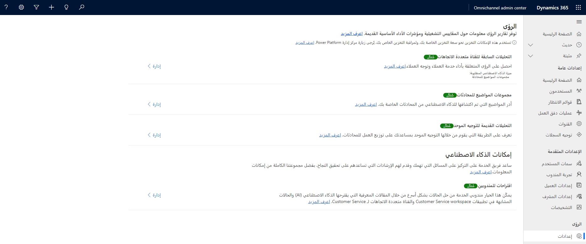
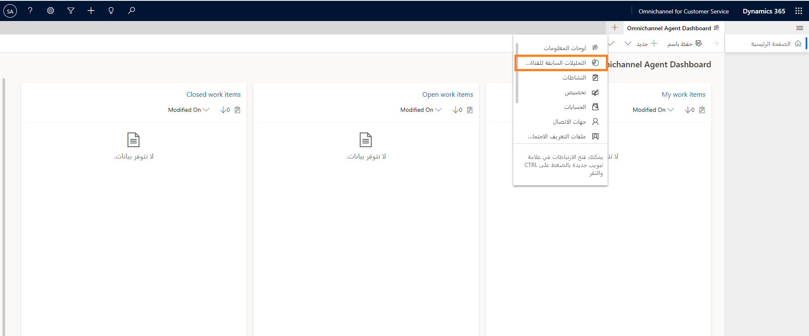
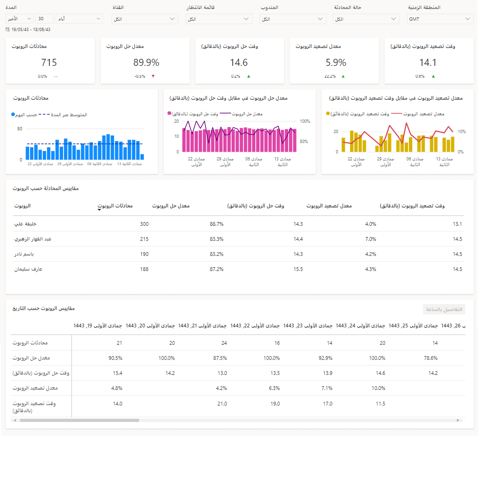
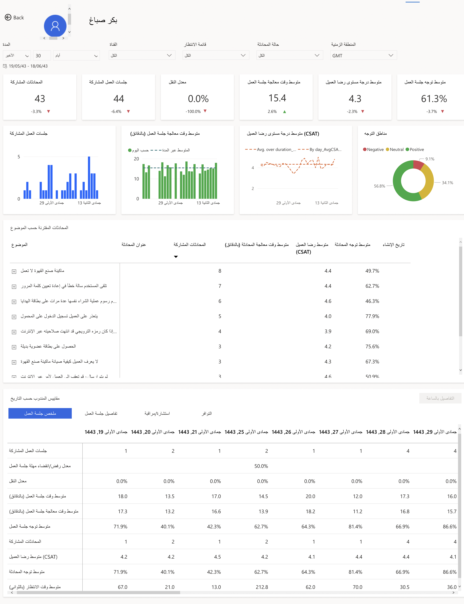
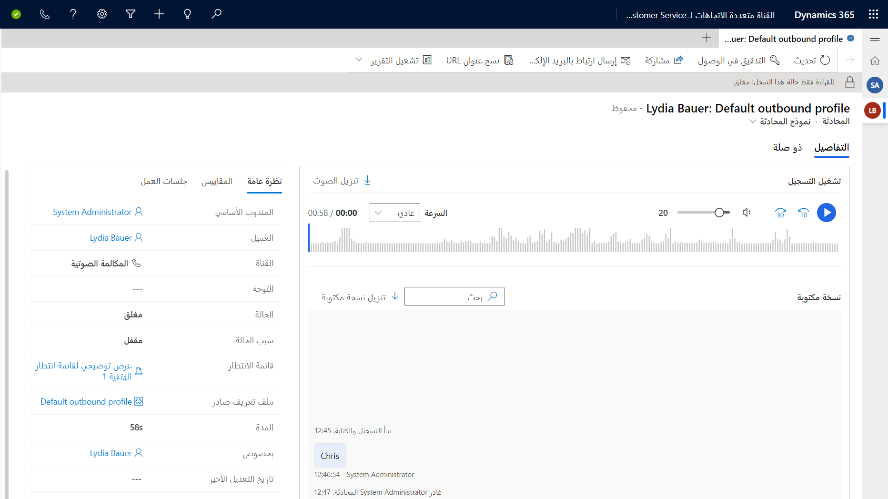

يحتاج المشرفون في مراكز الاتصال إلى أن يكونوا قادرين على فهم ما يجري في مركز الاتصال الخاص بهم بسهولة.  إن هذا صحيح عبر كل القنوات التي يقدمون الدعم لها، ولكنه صحيح بشكل خاص مع الصوت.  من خلال المكالمة الصوتية، يمكن للعديد من العوامل المختلفة مثل أوقات انتظار المكالمات، ومعدل كلام مندوبيك، بالإضافة إلى كيفية إشراكها العملاء تقليل مستوى رضا العملاء عموماً بشكل سريع.  من الضروري أن تتوفر لدى مشرف مركز الاتصال الأداة التحليلية التي يحتاج إليها لدعم مندوبي مركز الاتصال.  

توفر لوحة معلومات التحليلات السابقة للقناة متعددة الاتجاهات للمشرفين مؤشرات الأداء الأساسية (KPIs) والاتجاهات التي تساعدهم على فهم الحالة العامة لتجربة دعم القناة متعددة الاتجاهات لـ Customer Service بسرعة وفي لمح البصر. بالإضافة إلى ذلك، إنها توفر معلومات حول توجهات العملاء والتي يمكن للمشرفين الاعتماد عليها لتحسين تجربة دعم العملاء بشكل عام. تتوفر التحليلات السابقة للقناة متعددة الاتجاهات كتجربة مضمنة داخل تطبيق القناة متعددة الاتجاهات لـ Customer Service الذي يساعد المشرفين على عرض التقارير دون مغادرة التطبيق.

## الشروع في العمل

تتمثل إحدى الميزات التي يوفرها الصوت في القدرة على التقاط التحليلات لقنواتك الصوتية وعرضها. لعرض التحليلات والمعلومات الصوتية لمؤسستك، تحتاج إلى تمكين **التحليلات السابقة للقناة متعددة الاتجاهات للصوت** في تطبيق مركز إدارة القناة متعددة الاتجاهات. يتوفر هذا في مركز إدارة القناة متعددة الاتجاهات في منطقة **الإعدادات**. في التحليلات السابقة للقناة متعددة الاتجاهات لعنوان الصوت، حدد **إدارة**، ثم قم بتعيين الحالة إلى **ممكَّن**.

> [!IMPORTANT]
> بمجرد تمكينها، يستغرق الأمر 24 ساعة حتى يتم توفير التقارير لأول مرة. من تلك النقطة فصاعداً، يتم تحديث التقارير وفقاً لجدول من 24 ساعة.

> [!div class="mx-imgBorder"]
> 

## عرض لوحة التحليلات السابقة للقناة متعددة الاتجاهات للصوت

بمجرد توفيرها، سيتمكن المشرفون من الوصول إلى تقرير **المعلومات - التحليلات السابقة للقناة متعددة الاتجاهات** في تطبيق القناة متعددة الاتجاهات لـ Customer Service. أثناء عملك في جلسة عمل، ستتمكن من الوصول إلى التقرير عن طريق تحديد رمز الجمع (+)، ثم تحديد التحليلات السابقة للقناة متعددة الاتجاهات.

> [!div class="mx-imgBorder"]
> 

توفر تقارير التحليلات السابقة للقناة متعددة الاتجاهات معلومات شاملة عن الأداء العام لدعم العملاء عبر القنوات. توفر التقارير للمسؤولين والمشرفين تصوراً وقدرة على التصفية عبر القنوات وقوائم الانتظار والمندوبين ونطاقات التواريخ للمساعدة في فهم جوانب الأداء واستكشاف الأخطاء وإصلاحها بشكل أفضل.

> [!div class="mx-imgBorder"]
> 

فيما يلي بعض المقاييس الأساسية التي يمكنك الوصول إليها باستخدام هذا التقرير.

-   **المحادثة الواردة** - عدد المحادثات التي بدأها العميل ويمكن تقديمها إلى مندوب بشري.

-   **المحاثات المُشاركة** - المحادثات التي شارك فيها المندوب. يمكن أن يبدأ الاتصال بين العميل والمندوب في هذه المرحلة.

-   **معدل الترك** - النسبة المئوية للمحادثات التي لا يشارك فيها المندوبون.

-   **متوسط وقت الانتظار** - متوسط الوقت الذي انتظره العملاء قبل الاتصال بالمندوبين. يشبه *سرعة الإجابة*، ولكنه يتضمن الوقت المنتظر في كل جلسة عمل داخل محادثة.

-   **متوسط وقت الإجابة** - متوسط الوقت الذي انتظره العملاء في قائمة الانتظار قبل الاتصال بمندوب (وقت القبول).

-   **متوسط مستوى رضا العميل (CSAT)‬‬** - متوسط تصنيفات رضا العملاء المقدَّمة من العملاء. متاح فقط إذا تم تكوين صوت العميل كأداة لاستطلاع ما بعد المحادثة.

-   **متوسط توجه المحادثة‬** - متوسط درجة التوجه بناءً على النص الحرفي المقدَّم في استطلاع Customer Voice‬.

-   **متوسط وقت المعالجة** - متوسط الوقت الذي يقضيه مندوب في محادثة.

-   **معدل النقل** - النسبة المئوية لمرات نقل محادثة من مندوب إلى مندوب آخر.

-   **متوسط جهود العميل** - الوقت الذي يقضيه العميل في محادثة لحل مشكلته.

-   **‏‫متوسط جلسات العمل لكل محادثة‬** - متوسط جلسات العمل التي تم إنشاؤها والمشاركة فيها لكل محادثة.

يتضمن التقرير التالي ذكاء المحادثة، الذي يستخدم التحليلات وعلوم البيانات لجمع البيانات من تسجيلات مكالمات المندوبين والقناة متعددة الاتجاهات لـ Customer Service. يحلل ذكاء المحادثة البيانات لتزويدك بالمعلومات والرؤى لإدارة فريق الدعم الخاص بك بذكاء وتدريب المندوبين بشكل استباقي.

> [!div class="mx-imgBorder"]
> 

فيما يلي بعض المقاييس الأساسية التي يمكنك الوصول إليها باستخدام هذا التقرير.

-   **نسبة التحدث إلى الاستماع‬** - متوسط نسبة الاستماع والتحدث للمندوب في المحادثات مع العملاء.

-   **سرعة التحدث (WPM)‬** - متوسط عدد الكلمات المستخدمة في الدقيقة من قِبل المندوب.

-   **التبديلات لكل محادثة‬** - متوسط التبديلات بين المندوب والعميل في محادثة؛ عدد المرات التي تم فيها تبديل المحادثة من شخص إلى آخر. هذه علامة على المشاركة أثناء المحادثات.

-   **الإيقاف المؤقت قبل التحدث (بالثواني)‬** - عدد المِلّي ثانية الذي توقف فيها المندوب مؤقتاً قبل الرد على استعلامات العملاء؛ يشير هذا إلى مدى صبر المندوب.

-   **أطول حوار فردي للعميل (بالثواني)‬** - أطول حوار فردي من قِبل العميل مع مندوب؛ يشير إلى أن المندوب يطرح أسئلة جيدة ويفهم احتياجات العميل.

## عرض معلومات المكالمات

أثناء مراجعة المشرف للمواضيع المختلفة المعروضة، يمكنه فحص درجات رضا العملاء وتفاصيل التوجه لتحديد فرص التدريب المحتملة. من خلال التنقل في المواضيع، يمكن للمشرفين عرض مزيد من تفاصيل المحادثة ومعرفة ما حدث بالفعل في المحادثة. النسخ المكتوبة للمحادثات الكاملة متاحة. يساعد هذا المشرفين على فهم أسلوب المحادثة والحصول على نص حرفي دقيق يُستخدم حتى يتمكنوا من اتخاذ قرارات صائبة بشأن متطلبات التدريب للمندوب.

> [!div class="mx-imgBorder"]
> 
