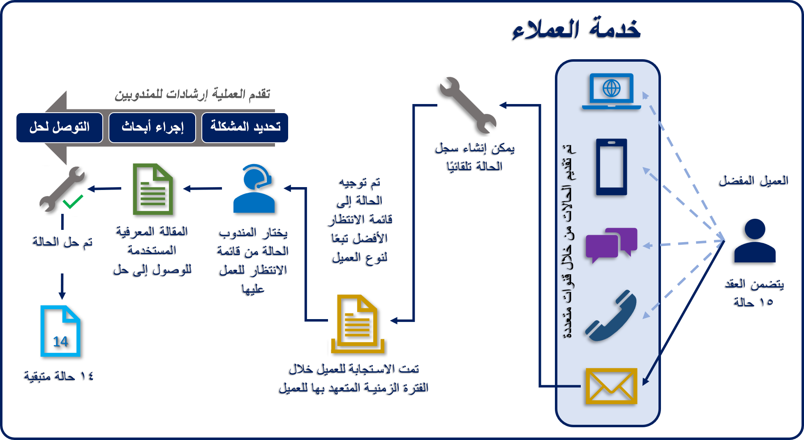

تشكل خدمة العملاء أحد الجوانب الرئيسية في أي استراتيجية لمشاركة العملاء لأي مؤسسة. غالبًا ما يرتبط تصور عملائك عنك ارتباطًا مباشرًا بالخدمة التي تقدمها لهم. كمؤسسة، من المهم أن تعرف توقعات عملائك وأن تفهم أيضًا ما يعتبرونه خدمة عملاء جيدة. وبمجرد أن تفهم بشكل أفضل ما يتوقعه عملاؤك، يمكنك تنفيذ استراتيجية أكثر فاعلية لخدمة عملائك. تحتوي Microsoft Dynamics في 365 Customer Service على العديد من الميزات التي يمكن للمؤسسات استخدامها لإدارة الخدمات التي تقدمها للعملاء.

> [!div class="mx-imgBorder"]
> 

## نظرة عامة على مشهد خدمة العملاء

لمساعدتك على فهم سياق خدمة العملاء بشكل أفضل، دعنا نراجع بعض سيناريوهات العملاء الواقعية.

**‬‏‫معالجة وحل مشكلات العملاء أو المنتجات‬‏‫**: اكتشف عميل في متجر دراجات محلي مؤخرًا أن التعليق على دراجته الجبلية معيب ولا يعمل بشكل صحيح. اتصل بالمتجر لمناقشة المشكلة والحصول على المساعدة بشأن دراجته. تم إنشاء المشكلة وتوجيهها إلى قائمة انتظار طلبات دعم الدراجات الجبلية.‬

يتلقى Rob، متخصص دعم الدراجات الجبلية لدى المتجر، المشكلة من خلال Dynamics 365 Customer Service. بعدما تحدث إلى العميل، يعمل على جدولة نشاط الخدمة لإصلاح أو استبدال التعليق المعيب.

**تلقي أسئلة العملاء والإجابة عنها‬‏‫**: اشترى عميل مؤخرًا طاولة جديدة من موقع ويب لمتاجر الأثاث.  بعد وصول الطاولة، يحاول العميل تجميعها، لكنه غير متأكد ما إذا كان قد جمّعها بطريقة صحيحة. يتصل العميل بشركة الأثاث لطرح الأسئلة والحصول على المساعدة بشأن طاولته.

تتلقى Sidney، أخصائية دعم العملاء، أسئلة العملاء. تستخدم قاعدة المعارف بالشركة في Dynamics 365 Customer Service للعثور على مستند الأسئلة المتداولة (FAQ) المتعلق بالطاولة. بعد ذلك، تستخدم هذا المستند للمساعدة في الإجابة عن أسئلة Jim.

**‬‏‫جمع ملاحظات العملاء وتطبيقها‬‏‫**: تريد Maria، مديرة منتج للطاولات والكراسي في شركة الأثاث، جمع الملاحظات المتعلقة بعملية التجميع في المنزل عندما يتصل العملاء بالدعم. تستخدم وظيفة إدارة الحالة المتوفرة في Dynamics 365 Customer Service لالتقاط هذه الملاحظات. من خلال تحليل بيانات الحالة، يمكنها أيضاً تحديد الطاولات والكراسي التي تسبب معظم المشكلات أثناء التجميع في المنزل وتلك التي يسهل تجميعها. بالإضافة إلى ذلك، تستطيع Maria تحديد التعليمات الخاصة بالتجميع في المنزل للطاولات والكراسي التي يجب منحها الأولوية للتحرير والمراجعة.

**الدعم الاستباقي**: اشترى عميل مؤخرًا نظام مراقبة منزلي كامل من شركة أمن إقليمية. بالإضافة إلى الكاميرات الأمنية، تضمن النظام أجهزة استشعار للأمان والدخان والرطوبة إلى جانب الأجهزة الذكية الأخرى. في المساء، ينفجر أحد مستشعرات الرطوبة الموجودة في قبو العملاء. يؤدي هذا إلى تشغيل تنبيه يقوم تلقائيًا بإنشاء مشكلة دعم وتصعيدها في Dynamics 365 Customer Service.  

تتلقى Jennifer، خبيرة حماية المنازل، المشكلة وتبدأ في إجراء مكالمة للتحقق من العميل. يشير العميل إلى أنه يحصل على الماء في قبو منزله. يمكنهم تحديد أن مضخة البالوعة الخاصة بالعميل لا تعمل. ونظرًا لأن العميل لديه مضخة احتياطية، فإنه يفصل المضخة القديمة ويوصل المضخة الجديدة. تنحسر المياه الموجودة في القبو قبل أن تتسبب في أي ضرر.  

## فهم عميل اليوم

مع توفر جميع المعلومات والمنصات، ‏‫أصبح العملاء اليوم أكثر درايةً من أي وقت مضى.‬ لقد اعتاد العملاء على الحصول على ما يريدون، عندما يريدون، بالطريقة التي يريدونها.
 
فكر في العملية المعتادة لشراء تلفاز:

1.  قبل أن تشرع في العملية، من المحتمل أن تقوم ببعض البحث على الإنترنت لتحديد المعلومات المهمة مثل الميزات والتكنولوجيا الجديدة، ودرجات رضا العملاء، وأفضل العلامات التجارية. 

1.  من المحتمل أن تتحقق من مراجعات العملاء وتحدد التلفزيون الذي تعتقد أنه الأفضل قبل زيارة موقع بائع التجزئة حيث ستشتريه.
    
1.  أثناء تواجدك على الموقع، يمكنك تحديد أجهزة تلفزيون متعددة وإجراء مقارنة جنبًا إلى جنب.  

1.  إذا كانت لديك أسئلة، فيمكنك استخدام خيار الدردشة للتفاعل مع شخص ما. 

1.  إذا كنت لا تزال غير متأكد، يمكنك زيارة المتجر التقليدي حيث يمكنك التعامل مع مندوب مبيعات. أنت تعرف بالفعل ما الذي تبحث عنه، ولكن يمكنك الآن وضع عينيك على التلفزيون ولمسه.  

يمكن تطبيق نفس العملية عبر تجارب مختلفة. يريد العملاء التحكم في التجربة. يفضل كثير من العملاء عدم التدخل من قِبل أي شخص أو الحد الأدنى من التدخل أثناء مباشرتهم عملية الشراء مهما كانت. إنهم يطمئنون لوجود شخص ما يستدعونه عند الحاجة إلى المساعدة، لكنهم يريدون المرونة لقيادة تجربة المشاركة بأنفسهم والتفاعل مع الأفراد الأحياء وفقًا لشروطهم.

## الاتجاهات المؤثرة في خدمة العملاء

توجد العديد من الاتجاهات التي تؤثر في كيفية تقديم خدمة العملاء إلى العملاء في الوقت الحالي. كمؤسسة خدمية، من المهم أن تفهم ماهية هذه الاتجاهات وكيف يمكنك الاستفادة منها لتحسين تجربة العميل ودفعها قُدماً. 

فيما يلي بعض الاتجاهات التي تؤثر في الخدمة اليوم:

- **الأجهزة المحمولة**: مع وجود العديد من الأجهزة المحمولة المتاحة اليوم، لم يعد الأشخاص يتفاعلون مع خدمة العملاء فقط من خلال مكالمة هاتفية أو بريد إلكتروني. يريدون أن يكونوا قادرين على الوصول إلى معلومات المدخل على أجهزتهم المحمولة أو التفاعل مع مندوب من خلال محادثة يبدؤونها على أجهزتهم. 

- **وسائل التواصل الاجتماعي**: لا يشعر الأشخاص بالخجل عادةً عندما يتعلق الأمر بالتعبير عن أفكارهم وآرائهم على وسائل التواصل الاجتماعي. يجب أن تكون قادراً على الاستفادة من هذا النظام الأساسي لضمان معالجة مشكلات العملاء أو شكاواهم بنفس الطريقة التي يتم التعامل بها إذا تفاعل العميل مباشرةً مع الدعم.

- **الخدمة الذاتية**: يمكن أن تعني الخدمة الذاتية أشياء مختلفة:

   - يمكن أن يكون الأمر بسيطاً مثل توفير قاعدة معرفية يمكن للعملاء استخدامها للعثور على إجابات لأسئلة إجرائية بسيطة.
    
   - يمكن أن يتضمن السماح للعملاء بإدارة حساباتهم.

   - في بعض الأحيان، يمكن أن يتضمن منح العملاء طريقة للتفاعل مع العملاء الآخرين الموجودين في الموقف نفسه.

- **إنترنت الأشياء**: مع وجود المزيد والمزيد من الأجهزة المتصلة بالإنترنت والاتصال ذهاباً وإياباً، من المهم الاستفادة من التكنولوجيا المستخدمة على هذه الأجهزة لإجراء مكالمات الخدمة. فيما يلي بعض الطرق التي يمكن من خلالها القيام بذلك:

   - اكتشاف الخارج عن المألوف

   - الصيانة التنبؤية

   - استخدام البيانات التي تم جمعها للمساعدة في دفع عروض الخدمة قُدماً في المستقبل

- **مشاركة العملاء**: المشاركة هي أكثر من مجرد التواصل للحصول على آراء العملاء. يمكن أن تشمل معرفة التفاصيل التالية:

   - متى يكون الوقت المناسب للمشاركة؟

   - ما القنوات التي يجب استخدامها؟

   - ما المعلومات التي يجب عليك جمعها؟
